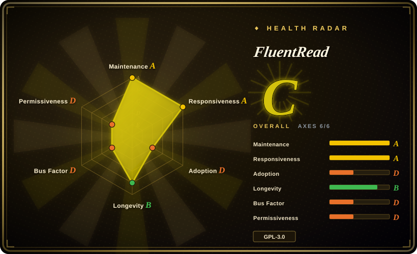
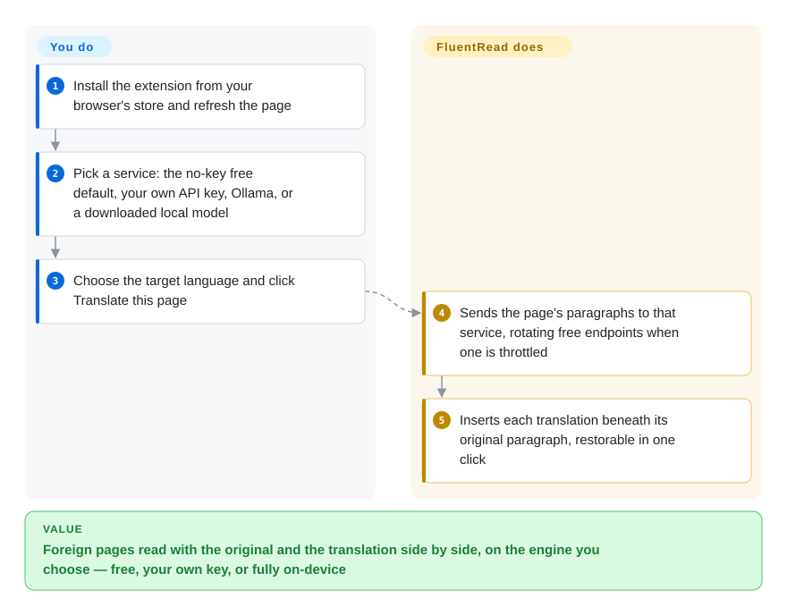

# FluentRead

The browser's built-in translate button swaps the whole page into your language, so the original sentence you wanted to check is gone, and you cannot choose which engine or AI model does the work. FluentRead is a browser extension that writes the translation underneath each original paragraph, using whichever engine you pick: a no-key free service, your own cloud or AI key, or a model downloaded to run inside the browser.

## When to use

You read a lot of English or Japanese — docs, news, X threads, YouTube talks, the occasional PDF paper — and you want the experience of the commercial Immersive Translate extension without its account and quota system. Chrome's built-in translation replaced "the cache is warmed lazily" with a Chinese sentence and you could no longer see what the original said; Immersive Translate wants you to sign in and its best models sit behind a subscription. You want bilingual paragraphs, hover and selection translation, and the freedom to point it at DeepSeek with your own key today, a local Ollama tomorrow, or no key at all.

Pick FluentRead when you want **one open-source extension that covers the whole reading surface** — webpages, PDF/ePub/DOCX documents, images and screen areas (OCR), YouTube/X subtitles, and an AI reading card that explains a selected sentence in context — with Chrome, Edge, and Firefox store builds plus a userscript. Choose it over Read Frog when you want no account system and more engine choice, including free endpoints and fully in-browser local models; choose it over Margin Read or Pair Translate when breadth of features matters more than a small, auditable codebase.

## How it works

FluentRead is a WXT browser extension: a content script runs inside every page you open, and a background worker and options page hold the settings and talk to translation services. When you click **Translate this page**, it collects the page's paragraphs, sends them to the service you selected, and inserts each translation directly below its original; **Restore** puts the page back. The default **free translation service** needs no key — it rotates across public web endpoints (Google, Microsoft, DeepLX and others) and backs off when one is rate-limited, like a caller who redials a different line when one is busy. For better quality you add a cloud vendor key (Google Cloud, Azure, Alibaba, Tencent, Baidu, Volcengine), an AI provider key (OpenAI, Claude, Gemini, DeepSeek and many more), any number of custom OpenAI Chat-Completions endpoints, or Ollama on `127.0.0.1:11434` (started with `OLLAMA_ORIGINS=*` so the browser is allowed to call it). The "local model translation" option goes further: it downloads a pinned OPUS-MT language pack (~214–239 MB) or Tencent's Hy-MT2 1.8B (~1.13 GB) and runs it inside the browser via ONNX/WebAssembly, so the text never leaves the machine. What stays yours: choosing and paying for providers, keeping API keys safe in the browser profile, and deciding which sites auto-translate.

<!-- flow-steps:begin (generated from flows/fluentread.json by tools/flow_card.py — do not edit) -->

Text version of the flow

1. **You**: Install the extension from your browser's store and refresh the page
2. **You**: Pick a service: the no-key free default, your own API key, Ollama, or a downloaded local model
3. **You**: Choose the target language and click Translate this page
4. **FluentRead**: Sends the page's paragraphs to that service, rotating free endpoints when one is throttled
5. **FluentRead**: Inserts each translation beneath its original paragraph, restorable in one click

**Value**: Foreign pages read with the original and the translation side by side, on the engine you choose — free, your own key, or fully on-device

<!-- flow-steps:end -->

## When NOT to use

- **You need permissive-license reuse or closed-source redistribution.** Use [Margin Read](margin-read.md) (MIT) instead; FluentRead is GPL-3.0, so forks and embedded copies must stay GPL.
- **You need to know exactly where every request goes.** Use [Margin Read](margin-read.md) instead, which is BYOK-only and documents its threat model; FluentRead's zero-config default sends text to rotating public web translation endpoints that have their own data policies, and dictionary, read-aloud, and other tools may still use the network even when you pick a local model (the project's privacy page says so).
- **You want a small, reviewable extension.** Use [Pair Translate](pair-translate.md) or [Margin Read](margin-read.md); FluentRead has grown into a large suite (OCR, document parsing, local ONNX/GGUF inference, TTS, Google Drive/WebDAV backup) with `<all_urls>` host access, so a security review has far more surface to cover.
- **You need a multi-maintainer project.** Use [Read Frog](read-frog.md) if contributor spread matters; although the repo moved to a `FluentRead` organization, one person (`Bistutu`) authored ~2.5k commits versus single digits for everyone else.
- **Your custom endpoint speaks only the Responses, Messages, or native Gemini API.** Use [Margin Read](margin-read.md) (which has Anthropic- and Google-native adapters) or put an OpenAI-compatible gateway in front; FluentRead's custom services speak OpenAI Chat Completions only.
- **You plan to rely on local models on a low-memory machine.** Use a cloud or Ollama-backed service instead; the project's own docs warn that even the lightweight pack can add 1–2 GB of memory while loading, and its Japanese→English pack quality is limited.

## Comparison

| Alternative | In index | Our verdict | Tradeoff |
|---|---|---|---|
| [Read Frog](read-frog.md) | ✅ | Choose Read Frog when flashcards, custom AI actions, and a broader contributor base matter; choose FluentRead when you want no account system, free no-key endpoints, and in-browser local models. | Read Frog has an account-backed notebook and default-on analytics in Chrome/Edge builds plus a proprietary layout dependency; FluentRead avoids those but concentrates development in one maintainer. |
| [Margin Read](margin-read.md) | ✅ | Choose Margin Read when MIT licensing, BYOK-only egress, and a documented threat model are decisive; choose FluentRead when document/subtitle/OCR coverage and cross-store availability matter more. | Margin Read is small, permissive, and transparent but early and Chrome-first; FluentRead is feature-complete for readers but GPL and much larger to audit. |
| [Pair Translate](pair-translate.md) | ✅ | Choose Pair Translate for a lighter bilingual overlay with provider templates; choose FluentRead when you also want documents, subtitles, image translation, and an AI reading card in one tool. | Pair Translate keeps the surface small; FluentRead trades simplicity for breadth. |
| Immersive Translate | not a repo | Use the commercial extension when you want a polished hosted product with vendor-managed quotas; choose FluentRead when source availability and self-managed engines are required. | Immersive Translate's public GitHub repo does not contain the extension source, so it is a product benchmark, not an open-source candidate. |
| KISS Translator | not indexed | Choose KISS Translator for a simpler bilingual translator that ships as both an extension and a Greasemonkey userscript; choose FluentRead when AI reading assistance, in-browser local models, and document translation are wanted too. | Both are GPL-3.0; KISS is narrower and has the larger star count (~12.8k), while FluentRead credits it as an influence and trades simplicity for a much larger feature set. |

## Tech stack

- **Extension framework:** WXT 0.20 (Manifest V3 for Chrome/Edge, Firefox build with `data_collection_permissions`), Vue 3, Element Plus, TypeScript, Vite.
- **AI/provider layer:** Vercel AI SDK (`ai`, `@ai-sdk/openai-compatible`, `@ai-sdk/anthropic`, `@ai-sdk/google`) plus dedicated adapters for DeepL/DeepLX, Google, Microsoft, cloud vendors, and Chrome's built-in Translator API.
- **On-device inference:** `@huggingface/transformers` + `onnxruntime-web` (OPUS-MT packs), `@wllama/wllama` (GGUF, Hy-MT2), Kokoro TTS; OCR via `tesseract.js` and `ppu-paddle-ocr`.
- **Documents & storage:** `pdfjs-dist`, `pdf-lib`, `jszip`, `saxes` for PDF/ePub/DOCX; Dexie (IndexedDB) and WXT storage for local data.
- **Tooling:** pnpm 9, Node.js ≥ 20, Vitest, Storybook, VitePress docs site.

## Dependencies

- **Runtime:** Chrome, Edge, or Firefox ≥ 140 (Firefox build), or a userscript manager for the reduced userscript edition; a Thunderbird build exists for email.
- **Translation backend (pick one):** nothing (free web endpoints), a cloud-vendor or AI-provider API key, a custom OpenAI-compatible endpoint, a local Ollama server with `OLLAMA_ORIGINS=*`, or a downloaded local model (≈214 MB–1.13 GB, fetched from Hugging Face or mirrors).
- **Optional:** Google Drive or WebDAV for encrypted settings backup; a local ACP bridge script to route requests through GitHub Copilot CLI or OpenCode.
- **Build:** Node.js ≥ 20 and pnpm 9 (`pnpm install --frozen-lockfile`, `pnpm build`).

## Ops difficulty

**Low for personal use, medium for private-model or team use.** Store install plus the free service works with zero configuration. Effort appears when you control the backend: Ollama needs the CORS origin opened, local models need disk and 1–2 GB of headroom, custom endpoints must speak Chat Completions, and API keys sit in extension storage (included in cloud backups only after explicit consent). Teams should decide which providers are allowed, disable the free public endpoints if data policy requires it, and document key rotation.

## Health & viability

- **Maintenance (2026-10-08):** very active — default branch pushed today, commits in 9 of the last 13 weeks, and three GitHub Releases in September 2026 (v0.0.32–v0.0.34) with Chrome/Firefox ZIPs, a source archive, and SHA-256 checksums; `package.json` on `main` is already 0.0.35.
- **Responsiveness:** issues get a first response quickly (median ~11.5 h on recent issues), with only ~19 open.
- **Governance / bus factor:** the weak axis. The repo now lives under the `FluentRead` organization, but one maintainer accounts for ~98.6% of commits; the project is funded by voluntary WeChat/Ko-fi donations. Treat it as a single-person project.
- **Age & Lindy:** created 2023-12 (~2.8 years) and still accelerating — more history than Read Frog or Margin Read, but young for a tool you use daily.
- **Adoption:** ~8.3k stars, 425 forks, and listings on the Chrome, Edge, and Firefox stores; store install counts were not checked.
- **Risk flags:** GPL-3.0 copyleft; rapid scope growth carried by one person; default reliance on unofficial free web endpoints; broad host permissions; credentials stored in the browser profile.

## Caveats (unverified)

- [未验证] Chrome/Edge/Firefox store versions, install counts, and review status were not checked; the v0.0.34 notes say Edge store acceptance was not yet confirmed.
- [未验证] Encryption-at-rest for API keys inside extension storage was not audited; the privacy page describes encrypted *backups*, not local encryption.
- [未验证] Engines and local models were not runtime-tested; the memory figures come from the project's own single-machine report (Apple M1 Pro).
- [推断] The repo transfer from the `Bistutu` user to the `FluentRead` organization is inferred from the GitHub API redirect; the transfer date and whether more maintainers gained write access were not checked.
- [未验证] Terms of use and data handling of the public "free" web endpoints (Google/Microsoft web translators, public DeepLX) were not reviewed.
- [推断] Absence of built-in analytics is inferred from `package.json` dependencies (no analytics SDK), not a full source audit.
