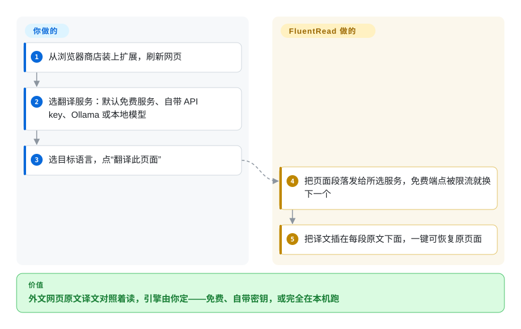

# FluentRead

浏览器自带的翻译按钮会把整页换成中文，你想对照的那句原文就没了，而且用哪个引擎、哪个 AI 模型来翻，你说了不算。FluentRead 是一个浏览器扩展，把译文写在每段原文的下面，引擎由你挑：不用密钥的免费服务、你自己的云厂商或 AI 密钥，或者下载到浏览器里本地运行的模型。

## 何时使用

你每天读大量英文或日文——文档、新闻、X 上的讨论串、YouTube 演讲，偶尔还有 PDF 论文——想要商业版“沉浸式翻译”那种体验，但不想要它的账号和额度体系。Chrome 自带翻译把 “the cache is warmed lazily” 换成一句中文，原文是什么你再也看不到；沉浸式翻译要你登录，好模型又在订阅墙后面。你想要的是双语对照段落、悬停和划词翻译，并且今天能用自己的密钥接 DeepSeek、明天换成本地 Ollama，或者干脆什么密钥都不填。

当你想要**一个开源扩展覆盖整个阅读场景**时选 FluentRead：网页、PDF/ePub/DOCX 文档、图片和屏幕区域（OCR 识别）、YouTube/X 字幕，以及一张能结合上下文解释选中句子的 AI 阅读卡片；Chrome、Edge、Firefox 商店都有，另有油猴脚本版。和 Read Frog 比，选它是因为没有账号体系、引擎选择更多，包括免费端点和完全在浏览器里跑的本地模型；和 Margin Read 或 Pair Translate 比，选它是因为功能广度比小而可审计的代码更重要。

## 怎么用起来

FluentRead 是一个用 WXT 构建的浏览器扩展：内容脚本跑在你打开的每个页面里，后台进程和设置页负责保存配置、和翻译服务通信。你点“翻译此页面”时，它收集页面上的段落，发给你选的服务，再把每段译文插到对应原文的正下方；点“恢复”就还原页面。默认的**免费翻译服务**不需要密钥——它在多个公开网页端点（Google、Microsoft、DeepLX 等）之间轮换，某个端点被限流就先歇一会儿，就像打电话占线时换一条线路重拨。想要更好的质量，你可以填云厂商密钥（Google Cloud、Azure、阿里云、腾讯云、百度、火山引擎）、AI 服务商密钥（OpenAI、Claude、Gemini、DeepSeek 等一大串）、任意多个兼容 OpenAI Chat Completions 的自定义端点，或者 `127.0.0.1:11434` 上的 Ollama（启动时要加 `OLLAMA_ORIGINS=*`，浏览器才被允许调用它）。“本地模型翻译”走得更远：它下载一个固定版本的 OPUS-MT 语言包（约 214–239 MB）或腾讯 Hy-MT2 1.8B（约 1.13 GB），通过 ONNX/WebAssembly 在浏览器里直接运行，文本不出本机。留给你的事：选服务商并为它付费、在浏览器配置里保管好 API 密钥、决定哪些网站自动翻译。

<!-- flow-steps:begin (generated from flows/fluentread.json by tools/flow_card.py — do not edit) -->

流程文字版

1. **你**：从浏览器商店装上扩展，刷新网页
2. **你**：选翻译服务：默认免费服务、自带 API key、Ollama 或本地模型
3. **你**：选目标语言，点“翻译此页面”
4. **FluentRead**：把页面段落发给所选服务，免费端点被限流就换下一个
5. **FluentRead**：把译文插在每段原文下面，一键可恢复原页面

**价值**：外文网页原文译文对照着读，引擎由你定——免费、自带密钥，或完全在本机跑

<!-- flow-steps:end -->

## 何时不用

- **你需要宽松许可证复用或闭源再分发。** 改用 [Margin Read](margin-read.zh.md)（MIT）；FluentRead 是 GPL-3.0，分叉和嵌入的副本都必须保持 GPL。
- **你需要确切知道每个请求发去了哪里。** 改用 [Margin Read](margin-read.zh.md)，它只支持自带密钥并写明了威胁模型；FluentRead 零配置的默认值会把文本发给轮换的公开网页翻译端点，它们各有自己的数据政策，而且即使选了本地模型，词典、朗读等工具仍可能联网（项目的隐私页面自己写明了这一点）。
- **你想要一个小而可审查的扩展。** 改用 [Pair Translate](pair-translate.zh.md) 或 [Margin Read](margin-read.zh.md)；FluentRead 已经长成一个大套件（OCR、文档解析、本地 ONNX/GGUF 推理、朗读、Google Drive/WebDAV 备份），并申请了 `<all_urls>` 主机权限，安全审查要覆盖的面大得多。
- **你需要多维护者项目。** 如果贡献者分布重要，改用 [Read Frog](read-frog.zh.md)；虽然仓库已迁到 `FluentRead` 组织下，但一个人（`Bistutu`）写了约 2.5k 次提交，其他人都是个位数。
- **你的自定义端点只支持 Responses、Messages 或原生 Gemini 接口。** 改用 [Margin Read](margin-read.zh.md)（它有 Anthropic 和 Google 原生适配器），或者在前面加一层兼容 OpenAI 的网关；FluentRead 的自定义服务只讲 OpenAI Chat Completions。
- **你打算在小内存机器上依赖本地模型。** 改用云端或 Ollama 后端的服务；项目自己的文档提醒，即便是轻量语言包，加载时也可能多占 1–2 GB 内存，而且日英包的英译日质量有限。

## 横向对比

| 替代品 | 是否收录 | 我们的评价 | 取舍 |
|---|---|---|---|
| [Read Frog](read-frog.zh.md) | ✅ | 看重单词卡、自定义 AI 动作和更宽的贡献者基础时，选 Read Frog；想要没有账号体系、免密钥的免费端点和浏览器内本地模型时，选 FluentRead。 | Read Frog 有依赖账号的笔记本、Chrome/Edge 版默认开启的统计，以及一个专有排版依赖；FluentRead 没有这些，但开发集中在一个维护者身上。 |
| [Margin Read](margin-read.zh.md) | ✅ | MIT 许可、只走自带密钥的出口和成文的威胁模型起决定作用时，选 Margin Read；文档/字幕/OCR 覆盖和多商店上架更重要时，选 FluentRead。 | Margin Read 小、宽松、透明，但早期且以 Chrome 为主；FluentRead 对读者来说功能齐全，但 GPL 且审计量大得多。 |
| [Pair Translate](pair-translate.zh.md) | ✅ | 只要一个更轻的双语叠加层和服务商模板，选 Pair Translate；还想在一个工具里要文档、字幕、图片翻译和 AI 阅读卡片，选 FluentRead。 | Pair Translate 保持小的攻击面；FluentRead 用简单换广度。 |
| 沉浸式翻译（Immersive Translate） | 非仓库 | 想要打磨好的托管产品、额度由厂商管理时，用商业版扩展；要求源码可得、引擎自管时，选 FluentRead。 | 沉浸式翻译的公开 GitHub 仓库不含扩展源码，它是产品标杆，不是开源候选。 |
| KISS Translator | 未收录 | 想要一个同时有扩展和油猴脚本两种形态、更简单的双语翻译器，选 KISS Translator；还想要 AI 阅读辅助、浏览器内本地模型和文档翻译，选 FluentRead。 | 两者都是 GPL-3.0；KISS 更窄、star 更多（约 1.28 万），FluentRead 在致谢里把它列为参考，并用简单换来大得多的功能面。 |

## 技术栈

- **扩展框架：** WXT 0.20（Chrome/Edge 走 Manifest V3，Firefox 版声明 `data_collection_permissions`）、Vue 3、Element Plus、TypeScript、Vite。
- **AI/服务商层：** Vercel AI SDK（`ai`、`@ai-sdk/openai-compatible`、`@ai-sdk/anthropic`、`@ai-sdk/google`），另有 DeepL/DeepLX、Google、Microsoft、各云厂商和 Chrome 内置 Translator API 的专用适配器。
- **本机推理：** `@huggingface/transformers` + `onnxruntime-web`（OPUS-MT 语言包）、`@wllama/wllama`（GGUF，Hy-MT2）、Kokoro 朗读；OCR 用 `tesseract.js` 和 `ppu-paddle-ocr`。
- **文档与存储：** `pdfjs-dist`、`pdf-lib`、`jszip`、`saxes` 处理 PDF/ePub/DOCX；Dexie（IndexedDB）和 WXT storage 存本地数据。
- **工具链：** pnpm 9、Node.js ≥ 20、Vitest、Storybook、VitePress 文档站。

## 依赖

- **运行环境：** Chrome、Edge，或 Firefox ≥ 140（Firefox 版），也可以用油猴类脚本管理器跑功能缩减的脚本版；另有面向邮件的 Thunderbird 版。
- **翻译后端（任选其一）：** 什么都不配（免费网页端点）、云厂商或 AI 服务商的 API 密钥、兼容 OpenAI 的自定义端点、启动时带 `OLLAMA_ORIGINS=*` 的本地 Ollama，或下载的本地模型（约 214 MB–1.13 GB，从 Hugging Face 或镜像拉取）。
- **可选：** 用 Google Drive 或 WebDAV 做加密的设置备份；一个本地 ACP 桥接脚本，可以把请求转给 GitHub Copilot CLI 或 OpenCode。
- **构建：** Node.js ≥ 20 和 pnpm 9（`pnpm install --frozen-lockfile`、`pnpm build`）。

## 运维难度

**个人使用低，私有模型或团队使用中等。** 商店安装加免费服务，零配置就能用。一旦后端由你掌控，工作量就来了：Ollama 要放开 CORS 来源，本地模型要磁盘空间和 1–2 GB 的内存余量，自定义端点必须讲 Chat Completions，API 密钥放在扩展存储里（只有你明确同意后才会进入云端备份）。团队应当规定允许哪些服务商、在数据政策要求时关掉公开免费端点，并写好密钥轮换办法。

## 健康度与可持续性

- **维护（2026-10-08）：** 非常活跃——默认分支今天还有推送，最近 13 周里有 9 周有提交，2026 年 9 月发了三个 GitHub Release（v0.0.32–v0.0.34），附 Chrome/Firefox ZIP、源码包和 SHA-256 校验；`main` 上的 `package.json` 已经是 0.0.35。
- **响应速度：** issue 首次响应很快（近期中位数约 11.5 小时），未关闭的只有约 19 个。
- **治理与巴士因子：** 这是短板。仓库现在挂在 `FluentRead` 组织下，但一个维护者贡献了约 98.6% 的提交；项目靠微信和 Ko-fi 的自愿捐赠维持。按单人项目看待。
- **年龄与 Lindy：** 2023-12 创建（约 2.8 年），仍在加速——历史比 Read Frog 和 Margin Read 长，但对一个天天要用的工具来说还年轻。
- **采用度：** 约 8.3k star、425 个 fork，Chrome、Edge、Firefox 商店都有上架；商店安装量没有核对。
- **风险信号：** GPL-3.0 传染性许可；功能面快速扩张、却由一个人扛着；默认依赖非官方的免费网页端点；主机权限宽；凭据存在浏览器配置里。

## 存疑（未验证）

- [未验证] Chrome/Edge/Firefox 商店里的版本、安装量和审核状态没有核对；v0.0.34 的发布说明自己写着 Edge 商店是否接受尚未确认。
- [未验证] 扩展存储里 API 密钥的静态加密没有审计；隐私页面描述的是加密的*备份*，不是本地加密。
- [未验证] 各引擎和本地模型没有实际跑过；内存数字来自项目自己在单台机器（Apple M1 Pro）上的测试报告。
- [推断] 仓库从 `Bistutu` 个人账号迁到 `FluentRead` 组织，是从 GitHub API 的重定向推出来的；迁移日期以及是否有更多维护者获得写权限没有核对。
- [未验证] 公开“免费”网页端点（Google/Microsoft 网页翻译、公共 DeepLX）的使用条款和数据处理没有审查。
- [推断] 不内置统计，是从 `package.json` 依赖里没有统计 SDK 推出来的，不是完整的源码审计。
