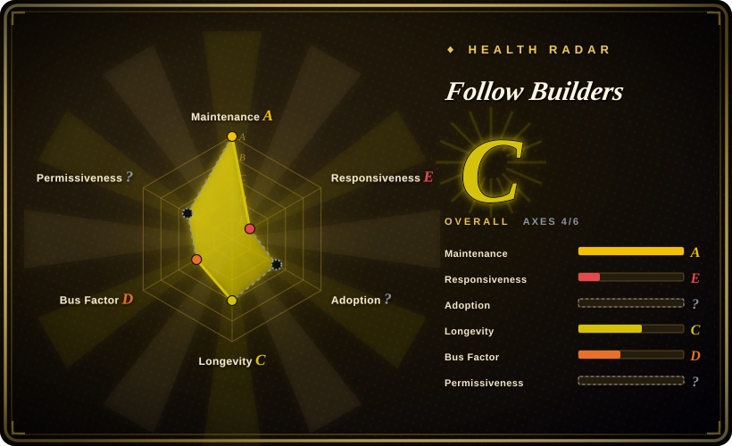
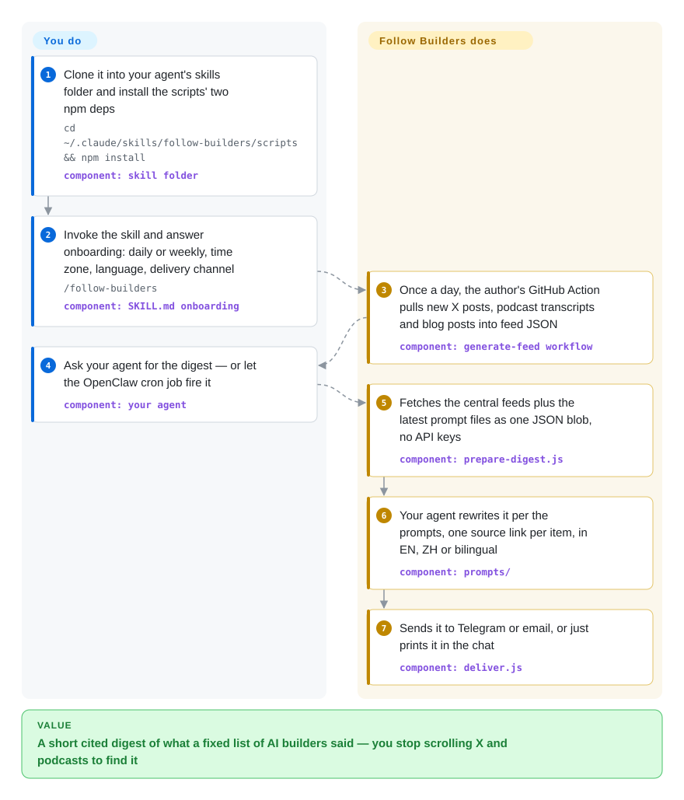

# Follow Builders

Keeping up with what AI practitioners are saying means scrolling X every day and sitting through hour-long podcasts, most of it noise. Follow Builders is an agent skill that pulls a fixed, author-curated list of AI builders' X posts, podcast transcripts and two company blogs from a feed its author refreshes daily, and has your own agent rewrite them into a short digest with a link on every item.

## When to use

You're an engineer or PM who wants to know what Karpathy, swyx, the Claude Code team and a handful of AI founders said this week, and which podcast episode is worth your hour — but you don't want an X account open all day, you don't have an X API key (a paid tier), and you don't want to run a scraping pipeline. Today your "feed" is whatever the algorithm shows you between reply-guy threads, and you learn about the important Latent Space episode from someone else's recap a week later. You clone Follow Builders into Claude Code's or OpenClaw's skills folder, invoke it once, answer four questions (daily or weekly, time, language, Telegram/email/in-chat), and each digest arrives as "Box CEO Aaron Levie argues …" plus the tweet URL, in English, Chinese, or interleaved bilingual.

Why pick this over the substitutes: the deciding tradeoff is **zero setup in exchange for zero control**. The fetching, the X API bill and the transcript service all live on the author's side — you need no keys to read — but the source list (26 X accounts, 6 podcasts, 2 blogs as of 2026-09-28) is curated centrally and the skill itself tells your agent to decline source edits. A self-hosted pipeline such as [Horizon](horizon.md) lets you pick sources and scoring rules but makes you manage model keys and a daily run; an on-demand research skill such as [last30days](../deep-research/last30days.md) answers "what are people saying about X" when you ask, rather than watching a standing list.

## How it works

There are two halves, and only one runs on your machine. **The author's half**: a GitHub Actions workflow in the upstream repo runs daily at 06:17 UTC, calls the X API with the author's token, fetches podcast transcripts through a third-party transcript service (pod2txt), scrapes the Anthropic Engineering and Claude blogs, drops anything already seen in the last seven days, and commits three JSON files — the "central feed" — back to `main`. **Your half**: the skill is a `SKILL.md` playbook (the instructions your agent follows) plus three small Node scripts. `prepare-digest.js` downloads those feed files and the latest prompt files straight from the upstream repo's `main` branch and hands your agent one JSON bundle; your agent does the actual summarizing and translating under those prompts, with a hard rule to use only what is in the bundle and to attach each item's URL; `deliver.js` sends the result via the Telegram Bot API or Resend email, or it is simply printed in the chat. Think of it as a newspaper whose reporters work for someone else, with your agent as the copy editor: you choose the length, tone and language, not the beat. Scheduling depends on the host: OpenClaw schedules the full agent run with `openclaw cron add`; on Claude Code the skill's own crontab recipe pipes the scripts together without the agent, so the scheduled message is the raw JSON, not a digest (SKILL.md says so) — the rewritten digest needs you to invoke the skill.

<!-- flow-steps:begin (generated from flows/follow-builders.json by tools/flow_card.py — do not edit) -->

Text version of the flow

1. **You**: Clone it into your agent's skills folder and install the scripts' two npm deps — `cd ~/.claude/skills/follow-builders/scripts && npm install` — component: `skill folder`
2. **You**: Invoke the skill and answer onboarding: daily or weekly, time zone, language, delivery channel — `/follow-builders` — component: `SKILL.md onboarding`
3. **Follow Builders**: Once a day, the author's GitHub Action pulls new X posts, podcast transcripts and blog posts into feed JSON — component: `generate-feed workflow`
4. **You**: Ask your agent for the digest — or let the OpenClaw cron job fire it — component: `your agent`
5. **Follow Builders**: Fetches the central feeds plus the latest prompt files as one JSON blob, no API keys — component: `prepare-digest.js`
6. **Follow Builders**: Your agent rewrites it per the prompts, one source link per item, in EN, ZH or bilingual — component: `prompts/`
7. **Follow Builders**: Sends it to Telegram or email, or just prints it in the chat — component: `deliver.js`

**Value**: A short cited digest of what a fixed list of AI builders said — you stop scrolling X and podcasts to find it

<!-- flow-steps:end -->

## When NOT to use

- **You want to choose whom you follow.** The source list lives in the upstream `config/default-sources.json`, and the skill tells your agent to answer add/remove requests with "open an issue"; as of 2026-09-28 several source-request issues sit unanswered. Use [Horizon](horizon.md) (your own sources, your own scoring profile) or TrendRadar (sansan0/TrendRadar, not indexed) instead, or fork and run the feed workflow yourself — which brings back the X API key and transcript-service key this project exists to hide.
- **You need the digest to show up reliably.** Every reader depends on one person's X API billing and one GitHub Actions job: the X feed came back empty on 2026-07-11 because every lookup returned HTTP 402 (Payment Required), and an issue filed 2026-09-07 reports the feed down to 5 builders and 5 tweets against the advertised 26. For a feed that only breaks when *you* let it, run [Horizon](horizon.md) with your own keys, or [FreshRSS](freshrss.md) over feeds you control.
- **You want scheduled, rewritten digests from Claude Code without OpenClaw.** The skill's crontab path for non-persistent agents bypasses the model and delivers raw JSON; the fix (PR #86) is open and unmerged as of 2026-09-28. [Horizon](horizon.md) writes the finished briefing inside its own scheduled run.
- **You need the agent's instructions to stay fixed.** Unless you copy a prompt into `~/.follow-builders/prompts/`, every run downloads the current prompt files from upstream `main` and your agent follows them, so upstream edits change your agent's behaviour without an update on your side; the setup flow also has the agent write to your crontab. Pin by copying all prompts locally or by forking, or use a self-hosted tool whose prompts ship in the version you installed ([Horizon](horizon.md)).
- **You need to redistribute or build on the code.** The repository has no LICENSE file (GitHub reports none); only the README's last line says "MIT". If license clarity matters for a fork or a product, prefer [Horizon](horizon.md) (MIT, file present) or ask the author to add the file.
- **You have a specific question, not a standing interest.** For "what did developers say about tool X this month", use [last30days](../deep-research/last30days.md), which searches on demand across Reddit, X, YouTube and HN.
- **You want to read everything yourself.** Use [FreshRSS](freshrss.md) or [NetNewsWire](netnewswire.md) — no model in the loop, nothing summarized away.

## Comparison

| Alternative | In index | Our verdict | Tradeoff |
|---|---|---|---|
| [Horizon](horizon.md) | ✅ | Choose Horizon when you want to decide the sources and the rubric for what counts as worth reading; choose Follow Builders when a fixed list of AI builders is exactly what you want and running a pipeline is not. | Horizon costs a model key, a scheduled run and source upkeep, and gives you control plus scoring and dedup across RSS/HN/Reddit/Telegram/X; Follow Builders costs nothing to read but its sources and uptime are the author's. |
| [last30days](../deep-research/last30days.md) | ✅ | Choose last30days when you have a topic in mind and want this month's community reaction on demand; choose Follow Builders for a standing daily or weekly feed from named people. | last30days searches many platforms per query and ranks by engagement, but you must ask each time; Follow Builders runs on a schedule but only covers its fixed list. |
| [FreshRSS](freshrss.md) | ✅ | Choose FreshRSS when you want to see every item from feeds you own, with no model deciding for you; choose Follow Builders when a pre-written summary matters more than completeness. | FreshRSS is a 12+-year-old self-hosted reader with no summarization and no X coverage without an extra bridge; Follow Builders summarizes but drops whatever the prompts leave out. |
| TrendRadar | 未收录 | Choose TrendRadar when you want broad hot-topic and keyword monitoring across Chinese and global platforms pushed to WeChat/Feishu/DingTalk; choose Follow Builders for a narrow AI-builder list with no infrastructure to run. | Real repository (sansan0/TrendRadar, GPL-3.0), not added in this tab-intake batch; it is a self-hosted Docker/Actions monitor you configure, not a hosted feed with a skill on top. |
| smol.ai AI News (newsletter) | 非仓库 | Choose a hosted AI newsletter when you want broader coverage of AI Twitter, Discord and Reddit written for you, and don't need an agent in the loop. | A hosted newsletter, not a repository — out of scope by shape; no local prompt control, no Chinese output, but also nothing to install. |

## Tech stack

- **Runtime:** Node.js ES modules (`"type": "module"`) using the built-in `fetch`; the feed workflow pins Node 20. No build step, no TypeScript.
- **npm dependencies:** `dotenv` (reads `~/.follow-builders/.env`) and `proper-lockfile`, which no script imports as of 2026-09-28.
- **Agent surface:** `SKILL.md` (onboarding, digest run, config handling) and five plain-Markdown prompts under `prompts/` (podcast, tweets, blogs, digest intro, translation).
- **Central pipeline:** `scripts/generate-feed.js` on GitHub Actions — X API v2 (bearer token), RSS parsing by regex, pod2txt for podcast transcripts, HTML scraping for the two blogs, a `state-feed.json` dedup file pruned after 7 days.
- **Delivery:** Telegram Bot API, Resend email API (sent from `digest@resend.dev`), or stdout.

## Dependencies

- **An agent host:** Claude Code or OpenClaw (the README's two install paths); other skill-reading agents may work but are not documented.
- **Node.js** for the three scripts, and network access to `raw.githubusercontent.com` for the feed and prompts.
- **Upstream services you don't run but depend on:** the author's GitHub repo and Actions job, the author's X API plan, and the pod2txt transcript service (`pod2txt.vercel.app`).
- **Optional, per delivery method:** a Telegram bot token plus chat ID, or a Resend API key plus email address, stored in `~/.follow-builders/.env`; an OpenClaw instance if you want the rewritten digest on a schedule.

## Ops difficulty

**Low for you, all of it on the author.** Install is a `git clone` and an `npm install`; configuration is a conversation that writes `~/.follow-builders/config.json`. Your only ongoing work is keeping a Telegram/Resend key valid and, on Claude Code, invoking the skill yourself if you want the model-written digest rather than raw JSON. What you cannot operate is the part that fails: when the central feed is empty or stale, your digest is empty or stale, and the fix is in someone else's repository. Forking to regain control flips it to medium — you then hold an X API key (paid tier), a pod2txt key, and a GitHub Actions job that commits every day.

## Health & viability

- **Maintenance (as of 2026-09-28):** the feed bot commits every day (latest 2026-09-28), so the service is up; hand-written commits stopped at 2026-07-12, and none of the 40 pull requests has been merged. Service running, codebase coasting.
- **Governance / bus factor:** one individual owner (`User` account) with no org, no releases, no CONTRIBUTING file; the paid X API access and the transcript-service key sit on that person's accounts. Bus factor is one, for both code and uptime.
- **Age / Lindy:** created 2026-03-14, about six and a half months old — too young for the Lindy prior to say anything, and the hand-written activity is already slowing.
- **Adoption:** ~6.8k stars and ~890 forks in that window, but three issues opened 2026-08-14 (#76, #79, #80) accuse the repo of inflated stars from freshly created accounts. We could not audit the stargazer list [未验证: GitHub's stargazers API returned 404 from our client], so treat the star count as reach at best, not proof of use.
- **Risk flags:** no LICENSE file; docs drift from code (the README still credits Supadata for transcripts, replaced by pod2txt on 2026-04-02; the skill's digest steps omit the blog feed, per issue #95); remote prompts from `main` steer your agent on every run; the whole value depends on a third party's X API spend continuing.

## Caveats (unverified)

- [未验证] Star inflation: issues #76/#79/#80 allege stars from accounts created within 14 days; our client got HTTP 404 from GitHub's stargazers endpoint (it also 404'd for an unrelated repo), so the stargazer profile could not be sampled.
- [未验证] Whether the source shrinkage in issue #92 (5 builders on 2026-09-07) is a pipeline regression or an X API cost cut; the author has not answered. The 2026-09-28 feed held 14 builders and 25 tweets, so coverage varies day to day.
- [推断] The SKILL.md description mentions invoking `/ai`; in Claude Code a skill's slash command normally follows its name (`/follow-builders`, which the README uses), so `/ai` may not resolve there — not tested in a live host.
- [未验证] Issue #67 reports that Claude Code desktop's scheduled tasks can run the full skill and deliver a rewritten digest; not reproduced here, and the skill's own instructions still describe the raw-JSON crontab path.
- [未验证] pod2txt's terms, pricing and continuity: it is an external service the pipeline calls with an API key; issue #94 asks how to buy access and has no answer.
- [推断] "Other skill-reading agents" (Cursor and similar, named in SKILL.md) should be able to follow the playbook since it is plain Markdown plus Node scripts; only Claude Code and OpenClaw install paths are documented.
