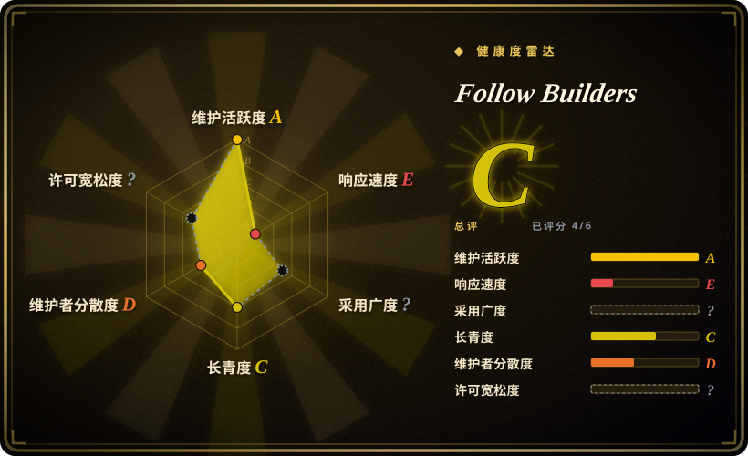
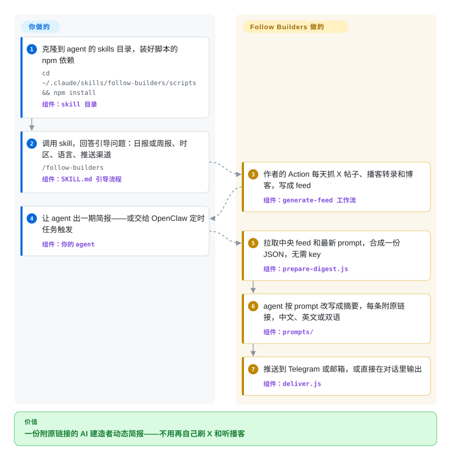

# Follow Builders

想跟上一线 AI 从业者在说什么，就得天天刷 X、听一小时一集的播客，大半是噪音。Follow Builders 是一个 agent skill：作者每天替你把一份固定名单上的 AI 建造者的 X 帖子、播客转录和两个公司博客抓好放进中央 feed，你自己的 agent 再把它改写成每条都带原链接的简短摘要。

## 何时使用

你是工程师或产品经理，想知道 Karpathy、swyx、Claude Code 团队和几位 AI 创始人这周说了什么、哪期播客值得花一小时——但你不想整天开着 X，手里没有 X API key（要付费档），也不想自己跑一套爬虫。现在你的“信息流”是算法在一堆抬杠回复之间塞给你的东西，一期重要的 Latent Space 往往是一周后从别人的转述里才知道。你把 Follow Builders 克隆进 Claude Code 或 OpenClaw 的 skills 目录，调用一次，回答四个问题（日报还是周报、几点、什么语言、Telegram／邮件／对话内），之后每期简报长这样：“Box CEO Aaron Levie 认为……”后面跟着那条推文的链接，可选英文、中文或逐段中英交替。

为什么选它而不是替代品：决定性的取舍是**零配置，换来零控制**。抓取、X API 账单和转录服务都在作者那边，你读不需要任何 key；但信源名单（截至 2026-09-28 为 26 个 X 账号、6 个播客、2 个博客）由作者集中维护，skill 本身会让你的 agent 婉拒增删信源的请求。自托管流水线如 [Horizon](horizon.zh.md) 让你自己挑信源、定打分规则，代价是要管模型 key 和每日任务；按需调研 skill 如 [last30days](../deep-research/last30days.zh.md) 回答的是“大家最近怎么看某件事”，要你每次去问，而不是盯住一份固定名单。

## 怎么用起来

它分两半，只有一半跑在你的机器上。**作者那一半**：上游仓库里的 GitHub Actions 工作流每天 UTC 06:17 运行，用作者的 token 调 X API，通过第三方转录服务 pod2txt 取播客文字稿，抓取 Anthropic Engineering 和 Claude 两个博客，剔除最近七天已经出现过的内容，再把三个 JSON 文件——即“中央 feed”——提交回 `main`。**你这一半**：skill 本体是一份 `SKILL.md` 操作手册（agent 照着执行的指令）加三个小 Node 脚本。`prepare-digest.js` 直接从上游仓库 `main` 分支下载这些 feed 文件和最新的 prompt 文件，打成一个 JSON 交给你的 agent；真正的摘要和翻译由你的 agent 按这些 prompt 完成，硬性规则是只能用 JSON 里的内容、每条必须附 URL；`deliver.js` 再通过 Telegram Bot API 或 Resend 邮件发出去，或者直接在对话里输出。可以把它想成一份报纸：记者是别人雇的，你的 agent 是编辑——篇幅、语气、语言你说了算，跑哪条线你说了不算。定时推送看宿主：OpenClaw 用 `openclaw cron add` 定时跑完整的 agent 流程；在 Claude Code 上，skill 自带的 crontab 做法是绕过 agent 直接把两个脚本串起来，所以定时发出的是原始 JSON，不是简报（`SKILL.md` 自己写明了这一点）——要拿到改写后的简报，得你手动调用 skill。

<!-- flow-steps:begin (generated from flows/follow-builders.json by tools/flow_card.py — do not edit) -->

流程文字版

1. **你**：克隆到 agent 的 skills 目录，装好脚本的 npm 依赖 — `cd ~/.claude/skills/follow-builders/scripts && npm install` — 组件：`skill 目录`
2. **你**：调用 skill，回答引导问题：日报或周报、时区、语言、推送渠道 — `/follow-builders` — 组件：`SKILL.md 引导流程`
3. **Follow Builders**：作者的 Action 每天抓 X 帖子、播客转录和博客，写成 feed — 组件：`generate-feed 工作流`
4. **你**：让 agent 出一期简报——或交给 OpenClaw 定时任务触发 — 组件：`你的 agent`
5. **Follow Builders**：拉取中央 feed 和最新 prompt，合成一份 JSON，无需 key — 组件：`prepare-digest.js`
6. **Follow Builders**：agent 按 prompt 改写成摘要，每条附原链接，中文、英文或双语 — 组件：`prompts/`
7. **Follow Builders**：推送到 Telegram 或邮箱，或直接在对话里输出 — 组件：`deliver.js`

**价值**：一份附原链接的 AI 建造者动态简报——不用再自己刷 X 和听播客

<!-- flow-steps:end -->

## 何时不用

- **你想自己决定关注谁。** 信源名单在上游的 `config/default-sources.json` 里，skill 会让 agent 把增删请求一律回复成“去提 issue”；截至 2026-09-28，好几个申请加信源的 issue 都没有回应。改用 [Horizon](horizon.zh.md)（自选信源、自定打分 profile）或 TrendRadar（sansan0/TrendRadar，未收录），或者 fork 后自己跑 feed 工作流——那样你又得自己持有 X API key 和转录服务 key，而这正是本项目想替你挡掉的。
- **你需要简报稳定送达。** 所有读者都挂在一个人的 X API 账单和一个 GitHub Actions 任务上：2026-07-11 的 X feed 整个是空的，因为所有查询都返回 HTTP 402（需要付费）；2026-09-07 提的 issue 反映 feed 只剩 5 位建造者、5 条推文，而 README 写的是 26 位。想要一条只会因为你自己而断的信息流，就用你自己的 key 跑 [Horizon](horizon.zh.md)，或用 [FreshRSS](freshrss.zh.md) 读你自己掌控的订阅源。
- **你想在 Claude Code 上不借助 OpenClaw 定时收到改写好的简报。** skill 给非常驻 agent 的 crontab 做法绕过了模型，推送的是原始 JSON；修复它的 PR #86 截至 2026-09-28 仍未合并。[Horizon](horizon.zh.md) 在自己的定时任务里就把成稿简报写好。
- **你需要 agent 收到的指令保持不变。** 除非你把 prompt 复制到 `~/.follow-builders/prompts/`，否则每次运行都会从上游 `main` 下载当前的 prompt 文件，你的 agent 照做——上游一改，你的 agent 行为就跟着变，你这边什么都没更新；引导流程还会让 agent 改写你的 crontab。要固定下来，就把全部 prompt 复制到本地或者 fork，或者用 prompt 随安装版本一起固定的自托管工具（[Horizon](horizon.zh.md)）。
- **你要再分发或在代码上二次开发。** 仓库里没有 LICENSE 文件（GitHub 识别不到许可证），只有 README 最后一行写着“MIT”。如果 fork 或做产品需要许可证清楚，优先 [Horizon](horizon.zh.md)（MIT，有许可证文件），或先请作者补上文件。
- **你有一个具体问题，而不是长期关注。** 想知道“这个月开发者怎么评价某工具”，用 [last30days](../deep-research/last30days.zh.md)，它按需在 Reddit、X、YouTube、HN 上搜。
- **你想每一条都自己看。** 用 [FreshRSS](freshrss.zh.md) 或 [NetNewsWire](netnewswire.zh.md)——中间没有模型，不会有东西被摘要掉。

## 横向对比

| 替代品 | 是否收录 | 我们的评价 | 取舍 |
|---|---|---|---|
| [Horizon](horizon.zh.md) | ✅ | 想自己决定信源、自己定义什么值得读，选 Horizon；一份固定的 AI 建造者名单正合你意、又不想运维流水线，选 Follow Builders。 | Horizon 要付出模型 key、定时任务和信源维护，换来控制权，以及跨 RSS／HN／Reddit／Telegram／X 的打分与去重；Follow Builders 读起来零成本，但信源和可用性都归作者。 |
| [last30days](../deep-research/last30days.zh.md) | ✅ | 心里有具体话题、想按需看本月社区反应，选 last30days；想要来自具名人物的长期日报或周报，选 Follow Builders。 | last30days 每次查询覆盖多个平台、按互动量排序，但每次都得你去问；Follow Builders 定时推送，但只覆盖它那份固定名单。 |
| [FreshRSS](freshrss.zh.md) | ✅ | 想看到自己订阅源的每一条、不让模型替你取舍，选 FreshRSS；比起完整更在意有人先写好摘要，选 Follow Builders。 | FreshRSS 是 12 年以上的自托管阅读器，不做摘要，不加桥接就读不到 X；Follow Builders 会摘要，但 prompt 没保留的内容你就看不到。 |
| TrendRadar | 未收录 | 想广泛监控中外平台的热点和关键词、推送到微信／飞书／钉钉，选 TrendRadar；只要一份窄的 AI 建造者名单、又不想跑任何基础设施，选 Follow Builders。 | 真实仓库（sansan0/TrendRadar，GPL-3.0），本轮标签页收录批次未添加；它是要你自己配置的 Docker／Actions 监控，不是套了 skill 的托管 feed。 |
| smol.ai AI News（newsletter） | 非仓库 | 想要别人写好的、覆盖面更广的 AI Twitter／Discord／Reddit 汇总，又不需要 agent 参与，选托管的 AI newsletter。 | 托管的 newsletter，不是仓库——按形态不在收录范围；本地改不了 prompt，也没有中文版，但同样什么都不用装。 |

## 技术栈

- **运行时：** Node.js ES 模块（`"type": "module"`），用内置的 `fetch`；feed 工作流固定 Node 20。无构建步骤，无 TypeScript。
- **npm 依赖：** `dotenv`（读取 `~/.follow-builders/.env`）和 `proper-lockfile`——截至 2026-09-28 没有任何脚本引用后者。
- **agent 侧：** `SKILL.md`（引导、出简报、配置修改）加上 `prompts/` 下五个纯 Markdown prompt（播客、推文、博客、简报开头、翻译）。
- **中央流水线：** 跑在 GitHub Actions 上的 `scripts/generate-feed.js`——X API v2（bearer token）、正则解析 RSS、pod2txt 取播客文字稿、抓取两个博客的 HTML、用 `state-feed.json` 去重（7 天后清理）。
- **推送：** Telegram Bot API、Resend 邮件 API（发件地址 `digest@resend.dev`）或标准输出。

## 依赖

- **一个 agent 宿主：** Claude Code 或 OpenClaw（README 只给了这两条安装路径）；其他会读 skill 的 agent 也许能用，但没有文档。
- **Node.js** 运行三个脚本，并能访问 `raw.githubusercontent.com` 拉 feed 和 prompt。
- **你不运维却依赖的上游服务：** 作者的 GitHub 仓库和 Actions 任务、作者的 X API 套餐、pod2txt 转录服务（`pod2txt.vercel.app`）。
- **按推送方式可选：** Telegram bot token 加 chat ID，或 Resend API key 加邮箱地址，存放在 `~/.follow-builders/.env`；想定时收到改写好的简报，还需要一个 OpenClaw 实例。

## 运维难度

**对你很低，负担全在作者身上。** 安装就是 `git clone` 加 `npm install`；配置是一段对话，结果写进 `~/.follow-builders/config.json`。你持续要做的只有保持 Telegram／Resend 的 key 有效，以及在 Claude Code 上想要模型写好的简报而不是原始 JSON 时，自己去调用 skill。你运维不了的恰恰是会出故障的那部分：中央 feed 空了或旧了，你的简报就空了或旧了，而修复在别人的仓库里。为了拿回控制权去 fork，难度就变成中等——你要持有 X API key（付费档）、pod2txt key，外加一个每天提交的 GitHub Actions 任务。

## 健康度与可持续性

- **维护（截至 2026-09-28）：** feed 机器人每天提交（最近一次 2026-09-28），服务在跑；人工提交停在 2026-07-12，40 个 PR 一个都没合并。服务在运转，代码在滑行。
- **治理／巴士因子：** 单一个人所有者（`User` 账号），没有组织、没有 release、没有 CONTRIBUTING；付费 X API 和转录服务 key 都在这个人的账户上。代码和可用性的巴士因子都是 1。
- **年龄／林迪：** 2026-03-14 创建，约六个半月——太年轻，林迪先验说明不了什么，而人工开发活动已经在放缓。
- **采用度：** 这段时间内约 6.8k 星、约 890 个 fork，但 2026-08-14 开的三个 issue（#76、#79、#80）指控仓库星标来自新注册账号、有刷星嫌疑。我们没能审计 stargazer 列表 [未验证：GitHub stargazers 接口对我们的客户端返回 404]，所以星数最多当作曝光度，不能当作真实使用的证据。
- **风险信号：** 没有 LICENSE 文件；文档与代码脱节（README 仍说转录用 Supadata，2026-04-02 已换成 pod2txt；据 issue #95，skill 的出简报步骤漏掉了博客 feed）；每次运行都由 `main` 上的远程 prompt 指挥你的 agent；整个价值取决于第三方是否继续为 X API 付费。

## 存疑（未验证）

- [未验证] 刷星：issue #76／#79／#80 称星标来自 14 天内新注册的账号；我们的客户端访问 GitHub stargazers 接口得到 HTTP 404（对一个无关仓库也是 404），无法抽样检查 stargazer 画像。
- [未验证] issue #92 里信源缩水（2026-09-07 只剩 5 位建造者）是流水线退化还是为省 X API 费用主动削减，作者未回应。2026-09-28 的 feed 有 14 位建造者、25 条推文，覆盖面逐日波动。
- [推断] `SKILL.md` 的描述提到调用 `/ai`；在 Claude Code 里 skill 的斜杠命令一般跟随 skill 名（README 用的是 `/follow-builders`），所以 `/ai` 在那里可能调不起来——未在真实宿主中测试。
- [未验证] issue #67 称 Claude Code 桌面版的定时任务可以跑完整 skill、推送改写好的简报；本页未复现，skill 自己的说明仍是原始 JSON 的 crontab 路径。
- [未验证] pod2txt 的条款、价格和延续性：流水线带 API key 调用这个外部服务；issue #94 问如何购买使用权，无人回复。
- [推断] `SKILL.md` 提到的“其他会读 skill 的 agent”（Cursor 等）理应能照着这份纯 Markdown 加 Node 脚本的手册执行；有文档的只有 Claude Code 和 OpenClaw 两条安装路径。
