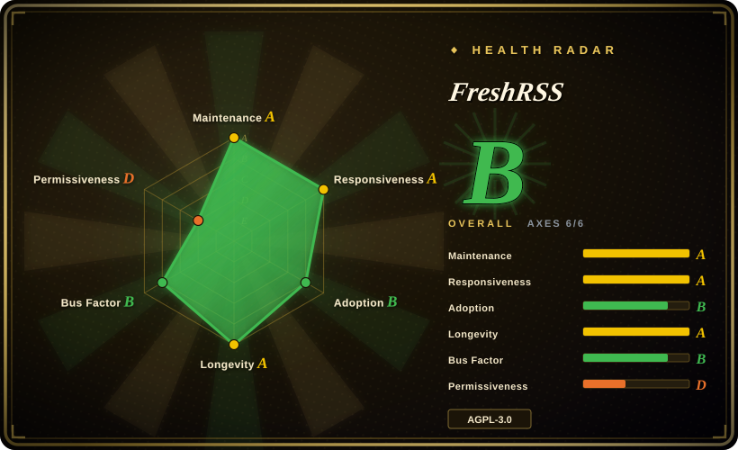
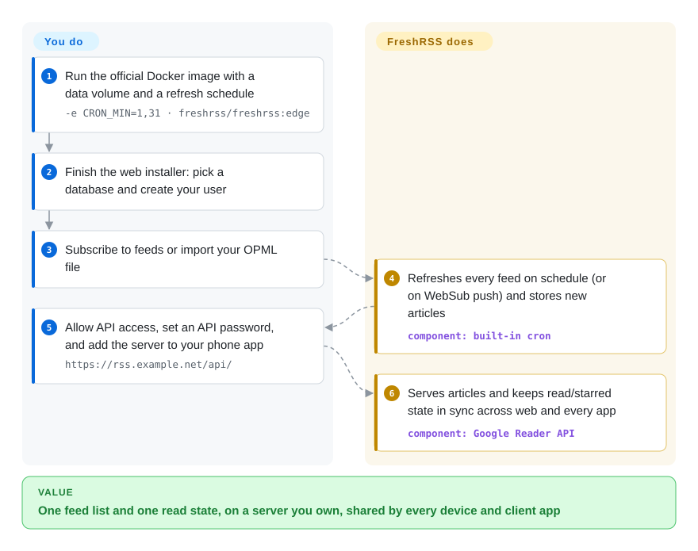

# FreshRSS

Your subscriptions live in a hosted reader that can shut down or change its pricing (Google Reader did), or inside one app on one device, so your phone and laptop disagree about what you've already read. FreshRSS is a feed reader you host yourself: a small PHP web app that fetches your RSS/Atom feeds on a schedule, keeps articles and read/starred state in your own database, and lets phone and desktop apps sync to it through the Google Reader–compatible API.

## When to use

You follow a few hundred blogs, release feeds, and news sites, and you read them on a laptop browser, an Android phone, and sometimes a Linux desktop app. You were on a hosted reader until it capped free feeds; before that, Google Reader shut down and took your setup with it. You want the subscription list, the articles, and the read/unread state on a server you control — a VPS, a NAS, or a Raspberry Pi — and you want any good client app (Capy Reader, Readrops, Reeder Classic, NetNewsWire, Newsboat) to sync to it.

Pick FreshRSS when you want **a mature, multi-user, plugin-extensible feed server with a full web UI** that runs on almost anything with PHP. It speaks the Google Reader and Fever APIs that most third-party readers already support, can subscribe to sites that have no feed by scraping them with XPath, receives instant WebSub pushes, and offers anonymous public reading and OpenID Connect login. Choose it over Miniflux when you value extensions, multi-user features, and a richer web UI over a minimalist single binary; choose it over a hosted reader when owning the data matters more than zero setup.

## How it works

FreshRSS is a PHP web application: you run it behind a web server (Apache, nginx, or the official Docker image that bundles Apache), and it keeps everything in a database — SQLite for one person, PostgreSQL or MySQL/MariaDB for more — plus a `./data/` folder. A scheduled job (the Docker image's built-in cron, set with `CRON_MIN`, or your own cron entry) wakes up, fetches every feed with the SimplePie parser, and stores new articles; sources that support WebSub push updates instantly instead of waiting for the next poll. You read in its web UI, or turn on "Allow API access", set a separate API password, and point a client app at `https://your-host/api/` — FreshRSS then acts like the old Google Reader backend, so read/starred state stays in sync across every device, much as an email server keeps every mail client showing the same inbox. FreshRSS does the fetching, deduplication, storage, filtering, search, and sync API; **you** run and update the server, back up the database and `./data/`, decide who may log in, and choose feeds. Since 1.30.0 it also refuses to fetch from local-network addresses unless you allow-list them.

<!-- flow-steps:begin (generated from flows/freshrss.json by tools/flow_card.py — do not edit) -->

Text version of the flow

1. **You**: Run the official Docker image with a data volume and a refresh schedule — `-e CRON_MIN=1,31 · freshrss/freshrss:edge`
2. **You**: Finish the web installer: pick a database and create your user
3. **You**: Subscribe to feeds or import your OPML file
4. **FreshRSS**: Refreshes every feed on schedule (or on WebSub push) and stores new articles — component: `built-in cron`
5. **You**: Allow API access, set an API password, and add the server to your phone app — `https://rss.example.net/api/`
6. **FreshRSS**: Serves articles and keeps read/starred state in sync across web and every app — component: `Google Reader API`

**Value**: One feed list and one read state, on a server you own, shared by every device and client app

<!-- flow-steps:end -->

## When NOT to use

- **You don't want to run a server at all.** Use [NetNewsWire](netnewswire.md) (local-only or iCloud sync on Apple devices) or a hosted reader instead of FreshRSS, because a self-hosted web app means updates, backups, and TLS are yours forever.
- **You want the smallest possible backend and don't need extensions or a rich UI.** Use Miniflux (not indexed) instead: one Go binary plus PostgreSQL, deliberately minimalist, versus FreshRSS's PHP stack and extension system.
- **You want a model to triage the flood for you.** Use [Horizon](horizon.md) instead, which scores and summarizes items into a daily briefing; FreshRSS shows you everything and leaves the filtering to your own rules and searches.
- **Your feeds are on your LAN (a home-lab Gitea, a NAS, `http://127.0.0.1`).** Plan for the 1.30.0 breaking change: local networks are blocked by default to stop SSRF attacks (tricking the server into fetching internal addresses). Allow-list just those hosts via *System configuration* or `INTERNAL_HOST_ALLOWLIST` instead of reopening everything with `*`, or keep internal monitoring feeds in a client-side reader such as NetNewsWire.
- **You need to modify it and offer it as a hosted service without publishing changes.** FreshRSS is AGPL-3.0: running a modified version for others obliges you to offer the source. Use Miniflux (Apache-2.0) if that obligation is a blocker.
- **You want a stable branch that still gets security fixes.** There is no long-term-support line: the `latest` branch is updated only a few times a year and fixes are not backported, and the project itself now recommends the rolling `edge` channel for faster security patches. If you can't follow `edge` or upgrade promptly after each release, a hosted reader is the safer choice.

## Comparison

| Alternative | In index | Our verdict | Tradeoff |
|---|---|---|---|
| Miniflux | not indexed | When you want the leanest self-hosted reader and a permissive license, pick Miniflux; pick FreshRSS when extensions, multi-user features, XPath scraping, and a fuller web UI matter more. | Miniflux is one Go binary on PostgreSQL with an opinionated minimal UI and Apache-2.0 license; FreshRSS needs a PHP runtime but supports SQLite/Postgres/MySQL and a plugin ecosystem, under AGPL-3.0. |
| [NetNewsWire](netnewswire.md) | ✅ | If you read only on Apple devices and want no server, pick NetNewsWire; pick FreshRSS when you need a backend that Android, Linux, Windows, and web clients all sync to — then use NetNewsWire on top of it. | NetNewsWire is a native client with nothing to operate; FreshRSS is a server you maintain, and the two combine rather than compete. |
| [Horizon](horizon.md) | ✅ | When you want an AI-written daily briefing ranked by your own rubric, pick Horizon; pick FreshRSS when you want to browse every item yourself with no model cost. | Horizon spends tokens to filter and summarize; FreshRSS is deterministic, free to run, and makes you the filter. |
| Nextcloud News | not indexed | If you already run Nextcloud and want feeds inside it, pick Nextcloud News; pick FreshRSS for a standalone reader that doesn't drag in a Nextcloud instance. | Nextcloud News reuses Nextcloud accounts and hosting; FreshRSS stands alone, with its own users, API, and lighter footprint. |
| Folo | not indexed | When you want a modern hosted-first reader with social and AI features, pick Folo; pick FreshRSS when the point is owning the server and the data. | Folo's main experience runs on its operator's service; FreshRSS is entirely self-hosted with a decade-plus track record. |

## Tech stack

- **Language:** PHP ≥ 8.1, on the project's own small MVC framework (`lib/Minz`).
- **Feed handling:** SimplePie (vendored in `lib/simplepie`) for RSS/Atom parsing; XPath-based scraping for sites without feeds; JSON feeds; WebSub for push.
- **Storage:** PDO with SQLite, PostgreSQL 10+, or MariaDB 10.6+/MySQL 8.0+.
- **APIs:** Google Reader–compatible API (recommended) and Fever API for clients; a CLI (`cli/`) for install, user management, and feed refresh.
- **Packaging:** official Docker images (`freshrss/freshrss`, `ghcr.io/freshrss/freshrss`) in Debian and Alpine variants; YunoHost, Cloudron, and PikaPods one-click installs.

## Dependencies

- **Runtime:** PHP 8.1+ with cURL, DOM, JSON, XML, session, ctype (plus recommended extensions such as mbstring, intl, zip, GMP); a web server (Apache 2.4+ recommended, nginx, lighttpd) — or just Docker.
- **Database:** SQLite (zero-config) or PostgreSQL / MySQL / MariaDB for multi-user installs.
- **Scheduler:** a cron job to refresh feeds — built into the Docker image via `CRON_MIN`, otherwise your own crontab.
- **Optional:** OpenID Connect provider or reverse-proxy HTTP auth for login; extensions from the separate `FreshRSS/Extensions` repo.
- **Hardware:** light — the README reports sub-second responses on a Raspberry Pi 1 with 150 feeds and 22k articles.

## Ops difficulty

**Low.** One Docker container with a data volume, or a PHP app on any shared host, is a full install; SQLite means no separate database to run. The ongoing work is ordinary self-hosting: put it behind HTTPS, back up the database and `./data/`, and upgrade promptly — releases often carry security fixes (1.30.0 patched several SSRF and CSRF issues) and fixes aren't backported to older versions. Watch for breaking defaults on upgrade, such as 1.30.0's local-network block. For mobile sync, Apache needs `AllowEncodedSlashes On` for some clients, which the API self-test page helps diagnose.

## Health & viability

- **Maintenance (2026-10-08):** active and steady — commits in all of the last 13 weeks, releases 1.29.0 (2026-05), 1.30.0 (2026-09, security-focused), and 1.30.1 (2026-10-05); "a few releases a year" plus a continuously updated `edge` branch.
- **Responsiveness:** very fast — median first response ~1.8 h across 45 recent issues — though ~690 open issues/PRs accumulate.
- **Governance / bus factor:** community project under the `FreshRSS` organization; one lead maintainer (Alkarex) authors about 52.9% of recent commits, with a second tier of regular contributors and dozens of newcomers per release. Funded by donations (Liberapay); no corporate owner.
- **Age & Lindy:** created 2012-10 (~14 years) and still shipping — old *and* active, one of the strongest Lindy signals in this category.
- **Adoption:** ~16.3k stars, ~39.1M Docker Hub pulls, packaged by YunoHost/Cloudron/PikaPods, and listed as a sync backend by many third-party readers (NetNewsWire, Reeder Classic, Capy Reader, Readrops).
- **Risk flags:** AGPL-3.0 (network copyleft) is the only real license consideration; security fixes flow to `edge` and new releases only, so slow upgraders accumulate exposure.

## Caveats (unverified)

- [未验证] The Raspberry Pi 1 performance figure (150 feeds, 22k articles) is the README's own claim; no independent measurement was checked.
- [未验证] Third-party client sync quality varies by app; the README's compatibility table is community-maintained and was not tested here.
- [推断] Lead-maintainer share is taken from the health radar's commit-share signal and the contributor list (Alkarex ~3.8k commits), not from a governance document.
- [未验证] Miniflux's and Folo's current feature sets were summarized from general knowledge of those projects and their GitHub metadata, not a fresh read of their docs.
