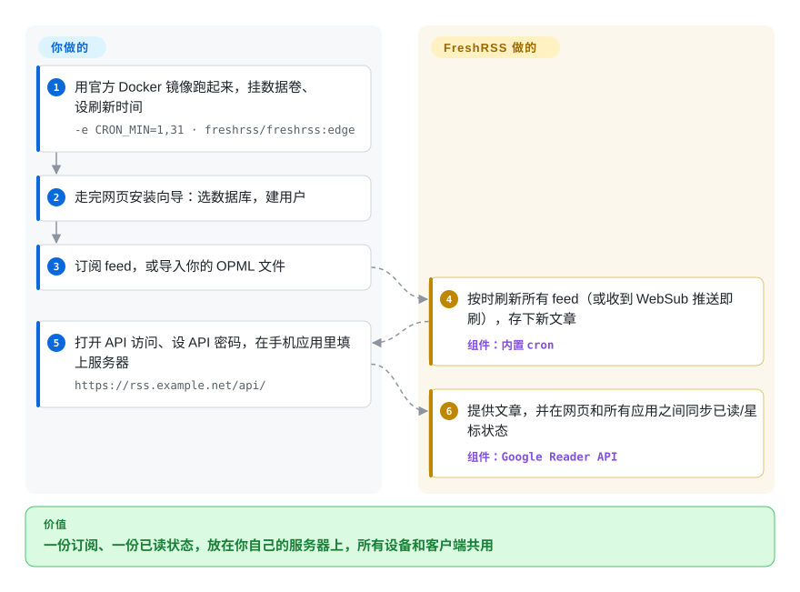

# FreshRSS

你的订阅要么放在一个托管阅读器里——它随时可能关停或涨价（Google Reader 就关过）——要么锁在某一台设备的某个应用里，结果手机和电脑对“哪些读过了”各说各的。FreshRSS 是一个自己托管的 RSS 阅读器：一个小巧的 PHP 网页应用，按时抓取你的 RSS/Atom 订阅，把文章和已读/星标状态存进你自己的数据库，再通过兼容 Google Reader 的接口让手机和桌面应用同步过来。

## 何时使用

你关注着几百个博客、版本发布 feed 和新闻站，读的地方有笔记本浏览器、安卓手机，偶尔还有一个 Linux 桌面应用。你原来用托管阅读器，直到它给免费 feed 数量设了上限；更早之前，Google Reader 关停，把你整套习惯一起带走了。你想把订阅列表、文章和已读/未读状态放在自己掌控的服务器上——一台 VPS、一台 NAS 或一块树莓派——并且让任何好用的客户端（Capy Reader、Readrops、Reeder Classic、NetNewsWire、Newsboat）都能同步它。

当你想要**一个成熟、多用户、能装插件、自带完整网页界面的 feed 服务器**，而且几乎任何能跑 PHP 的地方都能部署时，选 FreshRSS。它支持大多数第三方阅读器早已支持的 Google Reader 和 Fever 接口，能用 XPath 抓取没有 feed 的网站来订阅，能接收 WebSub 即时推送，还提供匿名公开阅读和 OpenID Connect 登录。和 Miniflux 比，选它是因为你更看重插件、多用户功能和更丰富的网页界面，而不是极简的单二进制；和托管阅读器比，选它是因为数据握在自己手里比零配置更重要。

## 怎么用起来

FreshRSS 是一个 PHP 网页应用：你把它跑在网页服务器后面（Apache、nginx，或者自带 Apache 的官方 Docker 镜像），所有东西都存在一个数据库里——一个人用 SQLite，多人用 PostgreSQL 或 MySQL/MariaDB——外加一个 `./data/` 目录。一个定时任务（Docker 镜像内置的 cron，用 `CRON_MIN` 设置；或者你自己的 crontab）定时醒来，用 SimplePie 解析器抓取每个 feed，存下新文章；支持 WebSub 的来源会主动推送更新，不用等下一轮轮询。你可以在它的网页界面里读，也可以打开“允许 API 访问”、设一个单独的 API 密码，再把客户端应用指向 `https://你的域名/api/`——这时 FreshRSS 就扮演当年 Google Reader 后端的角色，让每台设备的已读/星标状态保持一致，就像邮件服务器让所有邮件客户端看到同一个收件箱。抓取、去重、存储、过滤、搜索和同步接口都由 FreshRSS 做；**你**负责运行和升级服务器、备份数据库和 `./data/`、决定谁能登录、挑选订阅源。从 1.30.0 起，它还会拒绝抓取局域网地址，除非你把它们加进白名单。

<!-- flow-steps:begin (generated from flows/freshrss.json by tools/flow_card.py — do not edit) -->

流程文字版

1. **你**：用官方 Docker 镜像跑起来，挂数据卷、设刷新时间 — `-e CRON_MIN=1,31 · freshrss/freshrss:edge`
2. **你**：走完网页安装向导：选数据库，建用户
3. **你**：订阅 feed，或导入你的 OPML 文件
4. **FreshRSS**：按时刷新所有 feed（或收到 WebSub 推送即刷），存下新文章 — 组件：`内置 cron`
5. **你**：打开 API 访问、设 API 密码，在手机应用里填上服务器 — `https://rss.example.net/api/`
6. **FreshRSS**：提供文章，并在网页和所有应用之间同步已读/星标状态 — 组件：`Google Reader API`

**价值**：一份订阅、一份已读状态，放在你自己的服务器上，所有设备和客户端共用

<!-- flow-steps:end -->

## 何时不用

- **你根本不想运行服务器。** 改用 [NetNewsWire](netnewswire.zh.md)（在苹果设备上只存本地或走 iCloud 同步）或托管阅读器，不要选 FreshRSS，因为自托管网页应用意味着升级、备份和 TLS 证书永远是你的事。
- **你想要最小的后端，也不需要插件和丰富界面。** 改用 Miniflux（未收录）：一个 Go 二进制加 PostgreSQL，刻意极简；相比之下 FreshRSS 是 PHP 技术栈加插件体系。
- **你想让模型替你筛掉信息洪流。** 改用 [Horizon](horizon.zh.md)，它会给条目打分、写成每日简报；FreshRSS 把所有东西都摆给你看，过滤只能靠你自己的规则和搜索。
- **你的 feed 在局域网里（家里的 Gitea、NAS、`http://127.0.0.1`）。** 要提前应对 1.30.0 的破坏性变更：为了防 SSRF 攻击（诱骗服务器去访问内网地址），默认禁止访问局域网。只把这几台主机加进白名单（在“系统配置”里，或用 `INTERNAL_HOST_ALLOWLIST`），不要用 `*` 全部放开；或者把内部监控类 feed 留给 NetNewsWire 这类客户端阅读器。
- **你要改它的代码并作为托管服务提供给别人，又不想公开修改。** FreshRSS 是 AGPL-3.0：给他人运行修改版就有义务提供源码。如果这条义务是障碍，改用 Miniflux（Apache-2.0）。
- **你想要一个仍有安全修复的稳定分支。** 这里没有长期支持线：`latest` 分支一年只更新几次，修复也不回移，项目自己现在推荐用滚动更新的 `edge` 渠道来更快拿到安全补丁。如果你跟不上 `edge`、也做不到每次发版后及时升级，托管阅读器反而更安全。

## 横向对比

| 替代品 | 是否收录 | 我们的评价 | 取舍 |
|---|---|---|---|
| Miniflux | 未收录 | 想要最精简的自托管阅读器和宽松许可证，选 Miniflux；插件、多用户、XPath 抓取和更完整的网页界面更重要时，选 FreshRSS。 | Miniflux 是一个跑在 PostgreSQL 上的 Go 二进制，界面极简、Apache-2.0 许可；FreshRSS 需要 PHP 运行环境，但支持 SQLite/Postgres/MySQL 和插件生态，许可是 AGPL-3.0。 |
| [NetNewsWire](netnewswire.zh.md) | ✅ | 只在苹果设备上读、不想要服务器，选 NetNewsWire；需要一个让安卓、Linux、Windows 和网页客户端都能同步的后端时，选 FreshRSS——然后在它上面用 NetNewsWire。 | NetNewsWire 是原生客户端，没有任何东西要运维；FreshRSS 是要你维护的服务器，两者是搭配关系，不是竞争关系。 |
| [Horizon](horizon.zh.md) | ✅ | 想要一份按你自己的标准排序、由 AI 写好的每日简报，选 Horizon；想自己逐条浏览、不花模型费用，选 FreshRSS。 | Horizon 花 token 去筛选和摘要；FreshRSS 结果确定、运行免费，筛选的人是你。 |
| Nextcloud News | 未收录 | 已经在跑 Nextcloud、想把订阅放进去，选 Nextcloud News；想要一个不用拖上整套 Nextcloud 的独立阅读器，选 FreshRSS。 | Nextcloud News 复用 Nextcloud 的账号和托管；FreshRSS 独立运行，有自己的用户体系和接口，占用更轻。 |
| Folo | 未收录 | 想要带社交和 AI 功能、以托管为主的现代阅读器，选 Folo；重点是服务器和数据都归自己时，选 FreshRSS。 | Folo 的主要体验跑在运营方的服务上；FreshRSS 完全自托管，有十多年的记录。 |

## 技术栈

- **语言：** PHP ≥ 8.1，基于项目自己的小型 MVC 框架（`lib/Minz`）。
- **Feed 处理：** SimplePie（放在 `lib/simplepie`）解析 RSS/Atom；对没有 feed 的网站用 XPath 抓取；支持 JSON feed；用 WebSub 接收推送。
- **存储：** 通过 PDO 支持 SQLite、PostgreSQL 10+、MariaDB 10.6+/MySQL 8.0+。
- **接口：** 面向客户端的 Google Reader 兼容接口（推荐）和 Fever 接口；一个命令行工具（`cli/`）用于安装、用户管理和刷新 feed。
- **打包：** 官方 Docker 镜像（`freshrss/freshrss`、`ghcr.io/freshrss/freshrss`），有 Debian 和 Alpine 两种；YunoHost、Cloudron、PikaPods 支持一键安装。

## 依赖

- **运行环境：** PHP 8.1+，带 cURL、DOM、JSON、XML、session、ctype 扩展（另推荐 mbstring、intl、zip、GMP 等）；一个网页服务器（推荐 Apache 2.4+，也可用 nginx、lighttpd）——或者只要 Docker。
- **数据库：** SQLite（零配置），多用户部署用 PostgreSQL / MySQL / MariaDB。
- **调度：** 一个刷新 feed 的 cron 任务——Docker 镜像通过 `CRON_MIN` 内置，否则用你自己的 crontab。
- **可选：** 用 OpenID Connect 身份提供方或反向代理 HTTP 认证来登录；插件来自独立的 `FreshRSS/Extensions` 仓库。
- **硬件：** 很轻——README 说在树莓派 1 上、150 个 feed 和 2.2 万篇文章时响应不到一秒。

## 运维难度

**低。** 一个带数据卷的 Docker 容器，或者任意共享主机上的一个 PHP 应用，就是完整安装；用 SQLite 就不用另外跑数据库。日常工作就是普通的自托管：放在 HTTPS 后面，备份数据库和 `./data/`，并且及时升级——新版本经常带安全修复（1.30.0 修补了好几个 SSRF 和 CSRF 问题），而修复不会回移到旧版本。升级时要留意默认值的破坏性变化，比如 1.30.0 的局域网封禁。做手机同步时，有些客户端要求 Apache 开启 `AllowEncodedSlashes On`，接口自检页面能帮你排查。

## 健康度与可持续性

- **维护（2026-10-08）：** 活跃而稳定——最近 13 周每周都有提交，发版有 1.29.0（2026-05）、1.30.0（2026-09，以安全为主）和 1.30.1（2026-10-05）；“一年几个版本”，外加持续更新的 `edge` 分支。
- **响应速度：** 非常快——近期 45 个 issue 的首次响应中位数约 1.8 小时——不过未关闭的 issue/PR 累积到约 690 个。
- **治理与巴士因子：** `FreshRSS` 组织下的社区项目；一位主维护者（Alkarex）贡献了近期约 52.9% 的提交，第二梯队有一批常驻贡献者，每次发版还有几十位新贡献者。靠捐赠（Liberapay）维持，没有公司所有者。
- **年龄与 Lindy：** 2012-10 创建（约 14 年），至今还在发版——又老又活跃，是这个分类里最强的 Lindy 信号之一。
- **采用度：** 约 1.63 万 star、约 3910 万次 Docker Hub 拉取，被 YunoHost/Cloudron/PikaPods 打包，还被许多第三方阅读器（NetNewsWire、Reeder Classic、Capy Reader、Readrops）列为同步后端。
- **风险信号：** 唯一真正要考虑的许可问题是 AGPL-3.0（网络传染性）；安全修复只进 `edge` 和新版本，升级慢的人会持续暴露。

## 存疑（未验证）

- [未验证] 树莓派 1 的性能数字（150 个 feed、2.2 万篇文章）是 README 自己的说法，没有核对独立测量。
- [未验证] 第三方客户端的同步质量因应用而异；README 的兼容性表由社区维护，这里没有实测。
- [推断] 主维护者占比取自健康度雷达的提交占比信号和贡献者列表（Alkarex 约 3.8k 次提交），不是来自治理文档。
- [未验证] Miniflux 和 Folo 的当前功能是根据对这些项目的一般了解和它们的 GitHub 元数据概括的，没有重新读它们的文档。
