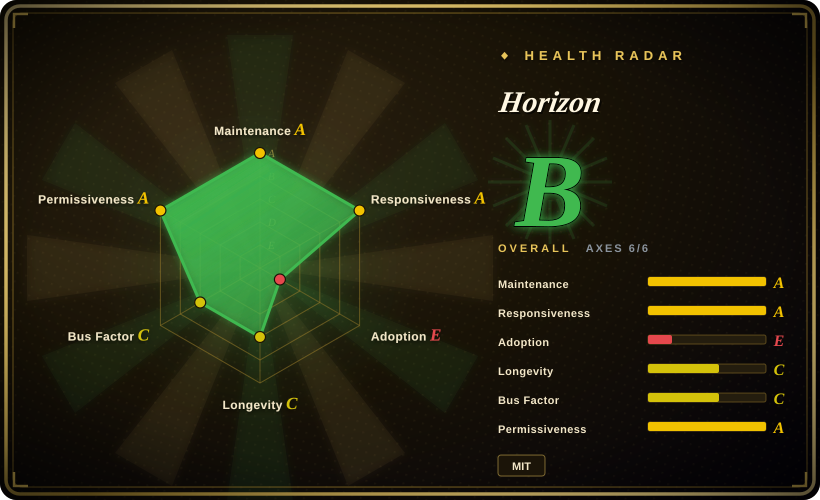
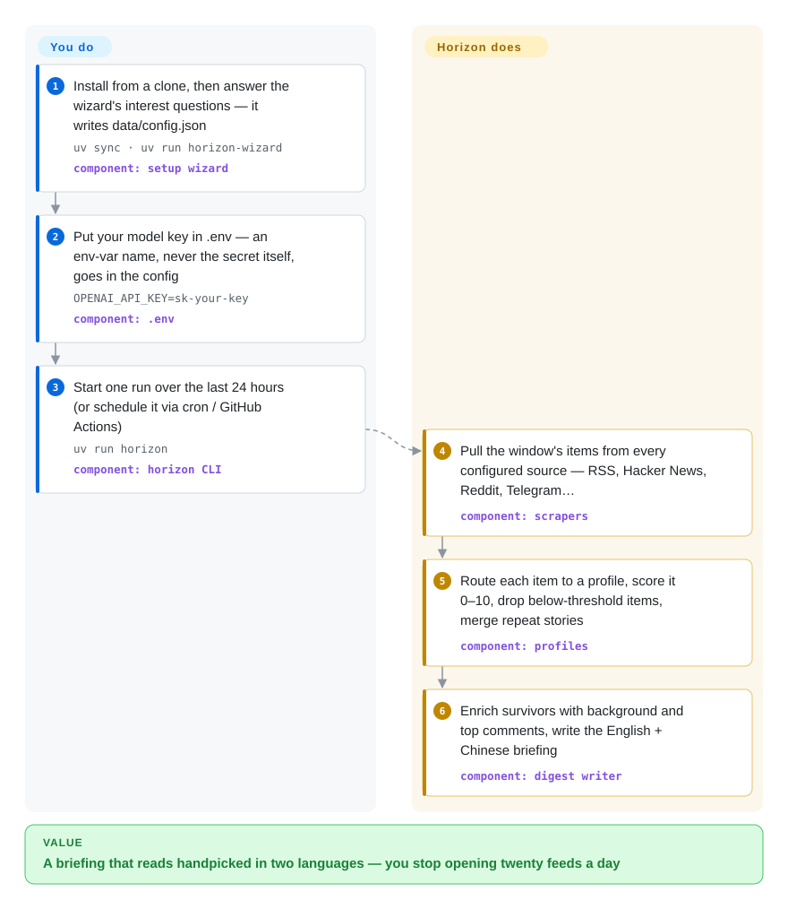

# Horizon

Your day's worth reading is scattered across RSS, Hacker News, Reddit and Telegram, and you can't open twenty feeds a day to find it. Horizon is a self-hosted pipeline that pulls all those sources, has an LLM score and deduplicate them against editorial rules you define, and leaves you one bilingual (EN+ZH) daily briefing.

## When to use

You're a developer who follows a few dozen feeds — engineering blogs, HN, a couple of subreddits, Telegram channels — and the choice you actually face each morning is doomscroll for an hour or skip the reader and miss the one story that mattered. You clone Horizon, run its wizard (it asks what you're interested in and generates the config), list your sources, and give it an LLM API key — cloud or a local Ollama. Each run collects the last 24 hours, an LLM scores every item 0–10 against a *profile* (an editorial rubric you edit as Markdown), drops what's under your threshold, merges repeat coverage of the same story, and writes an English-and-Chinese briefing you read in five minutes.

Why pick this over the substitutes: a classic aggregator such as [FreshRSS](freshrss.md) still makes *you* the filter — it displays everything and judges nothing; a hosted reader gives you someone else's algorithm with no way to encode your own rubric; and a cron script of your own means rebuilding scoring, dedup, comment summarization, bilingual generation, and delivery. The deciding tradeoff: you operate the pipeline (schedule a daily run, manage a model key, tune thresholds) in exchange for editorial control over what "worth reading" means in *your* briefing.

## How it works

Horizon is a pipeline you trigger once a day — CLI, cron, GitHub Actions, or Docker — not an always-on server. **The whole editorial machinery ships with it**: a *profile* is four files under `profiles/<id>/` — a JSON contract plus three Markdown prompts saying what belongs, how to score it (a 0–10 rubric), and what to write — so you change what's worth reading by editing Markdown, not Python. On each run, scrapers pull the last N hours from every configured source (RSS/Atom, Hacker News, Reddit, Telegram, X via Apify, GitHub, Google News, GDELT, financial feeds via OpenBB); each item routes to one profile (pinned per source, or auto-matched by the model from a candidate list), gets analyzed and scored, is dropped below your per-profile threshold, and merges with repeats; survivors are enriched with web-searched background and top-comment summaries, then land as a Markdown briefing under `data/summaries/` in both English and Chinese. Delivery — GitHub Pages publishing, email (SMTP/IMAP, with subscribe handling), Feishu/DingTalk/Slack/Discord webhooks, WeChat via iLink Bot — is configuration, not code, and an MCP server (`horizon-mcp`) exposes the pipeline stages so an AI assistant can drive them.

<!-- flow-steps:begin (generated from flows/horizon.json by tools/flow_card.py — do not edit) -->

Text version of the flow

1. **You**: Install from a clone, then answer the wizard's interest questions — it writes data/config.json — `uv sync · uv run horizon-wizard` — component: `setup wizard`
2. **You**: Put your model key in .env — an env-var name, never the secret itself, goes in the config — `OPENAI_API_KEY=sk-your-key` — component: `.env`
3. **You**: Start one run over the last 24 hours (or schedule it via cron / GitHub Actions) — `uv run horizon` — component: `horizon CLI`
4. **Horizon**: Pull the window's items from every configured source — RSS, Hacker News, Reddit, Telegram… — component: `scrapers`
5. **Horizon**: Route each item to a profile, score it 0–10, drop below-threshold items, merge repeat stories — component: `profiles`
6. **Horizon**: Enrich survivors with background and top comments, write the English + Chinese briefing — component: `digest writer`

**Value**: A briefing that reads handpicked in two languages — you stop opening twenty feeds a day

<!-- flow-steps:end -->

## When NOT to use

- **You want a reader UI to browse at your own pace.** Use [FreshRSS](freshrss.md) (web, any platform, plugins) or [NetNewsWire](netnewswire.md) (Mac/iPhone native) — zero token spend, no key management, and a decade-plus track record; Horizon produces a finished digest, not a place to browse.
- **You want zero ops.** Hosted readers (Feedly, Inoreader) need no config, scheduling, or API key — you accept their curation instead of yours (see the Comparison row marked not-a-repo).
- **You need an answer to a one-off question now.** Horizon is standing monitoring with a daily cadence; for on-demand research use a deep-research agent such as [GPT Researcher](../deep-research/gpt-researcher.md).
- **Your problem is "this site has no feed."** RSSHub (DIYgod/RSSHub, not indexed) turns feedless sites into RSS that Horizon or FreshRSS then consume — it complements a reader rather than replacing it.
- **You can't send content to a cloud LLM.** Horizon supports a local Ollama endpoint, but then you operate the model too; if that's more than you want, stay with non-LLM aggregation ([FreshRSS](freshrss.md)).
- **You need a stable install contract.** v0.1.0, no GitHub releases, not on PyPI (the `horizon` name there is OpenStack's dashboard); install is `git clone` + `uv sync`, so pin a commit — upstream has promised no semver yet.
- **Cost-sensitive, high daily volume.** Every run sends each item through the model; spend scales with sources × items, and the X source additionally requires a paid Apify account.

## Comparison

| Alternative | In index | Our verdict | Tradeoff |
|---|---|---|---|
| [FreshRSS](freshrss.md) | ✅ | Choose FreshRSS when you want to browse the full river of feeds yourself in a mature web UI at zero token cost; choose Horizon when the filtering and judging should happen before you look. | FreshRSS is 12+ years old with a plugin ecosystem and does no scoring or summarizing — you remain the filter; Horizon spends model tokens to hand you a finished briefing. |
| [NetNewsWire](netnewswire.md) | ✅ | Choose NetNewsWire on Mac/iPhone for a fast native client you own; choose Horizon when sources go beyond RSS (HN, Reddit, Telegram, X) and you want judgment, not just display. | Native, free, Apple-only; no scoring, no enrichment, no delivery pipeline. |
| RSSHub | 未收录 | Choose RSSHub when the blocker is a feedless website — it generates the RSS that Horizon or FreshRSS then consume. | Real repository (DIYgod/RSSHub), not added in this tab-intake batch; it solves source *generation*, not filtering or briefing. |
| Follow (RSSNext) | 未收录 | Choose Follow when you want a polished ready-made information browser with built-in AI features today; choose Horizon when the rubric must be yours and the pipeline self-hosted. | Real repository, not added in this tab-intake batch; Follow is an app you sit in, Horizon is a pipeline you operate. |
| Feedly / Inoreader | 非仓库 | Pick a hosted reader when you accept someone else's curation in exchange for zero setup and zero ops. | Hosted SaaS — out of scope by shape; no custom LLM rubric, no self-hosting, and the better curation features sit behind a subscription. |

## Tech stack

- **Core:** Python ≥3.11, packaged with hatchling, managed with `uv`; five CLI entry points in `pyproject.toml` — `horizon`, `horizon-wizard`, `horizon-mcp`, `horizon-webhook`, `horizon-wechat`.
- **Fetching & extraction:** httpx, feedparser (RSS/Atom), beautifulsoup4, trafilatura (full-article extraction with feed-excerpt fallback), ddgs (web search for enrichment).
- **Model access:** `openai` / `anthropic` / `google-genai` SDKs plus any OpenAI-compatible `base_url` — DeepSeek, Doubao, MiniMax, Aliyun DashScope, or a local Ollama (`http://localhost:11434/v1`).
- **Structure & output:** pydantic models, python-dotenv, tenacity retries, rich terminal output, opencc (Simplified/Traditional conversion), qrcode (WeChat login), `mcp` SDK for the tool server.
- **Optional extras:** `openbb` (financial news), `twitter` (Playwright + stealth), `dev` (pytest).

## Dependencies

- **An LLM endpoint and key** — cloud provider of your choice or a local Ollama; every analysis and enrichment call goes there. The key lives in `.env`; the config references it by env-var name only.
- **No database** — state (summaries, config, subscribers) lives under `data/`.
- **Optional per feature:** Apify account (X/Twitter search), OpenBB (financial news), an SMTP+IMAP mailbox (email subscriptions), webhook endpoints (Feishu/DingTalk/Slack/Discord), iLink Bot with QR login (WeChat).
- **Scheduling:** cron, the included GitHub Actions workflow template, or Docker Compose.

## Ops difficulty

**Low to medium.** The core loop is one CLI run: clone, `uv sync`, wizard, key into `.env`, schedule `uv run horizon`. The ongoing burden is editorial and financial rather than infrastructural — tuning thresholds and profiles, maintaining the source list, and watching token spend (which scales with sources × items per run). Each delivery channel adds its own setup (SMTP/IMAP, webhook secrets, WeChat QR login), and email-subscription mode turns it into something you must keep running reliably every day.

## Health & viability

- **Maintenance (as of 2026-09-28):** pushed the same day as verification, with feature PRs merged through September (WeChat delivery, X keyword search). Active development, not coasting.
- **Governance / bus factor:** a personal, spare-time project (per its own README); the single maintainer wrote 207 of the top-ten contributors' commits (next: 8). Three commercial sponsors (Compshare, APIMart, OfoxAI) support it, but there is no org or foundation behind the roadmap — bus factor is effectively one.
- **Age / Lindy:** created 2026-02-20, about 7 months old — young; the Lindy prior is weak no matter the momentum.
- **Adoption:** ~9.5k stars and ~1.4k forks in that window [推断] — growth is promotion-assisted (HelloGitHub feature, Trendshift badges, LINUX.do / XiaoHongShu acknowledgements in the README), so read it as reach, not production-proven adoption; no releases or PyPI download numbers exist to cross-check.
- **Risk flags:** MIT, permissive, no relicense history; no releases or semver contract yet (v0.1.0, releases and PyPI publish are on the roadmap); the README carries sponsor advertising; the community and issue tracker are largely Chinese-language, which matters if your team needs English-language support channels.

## Caveats (unverified)

- [推断] ~9.5k stars in ~7 months is partly promotion-driven (HelloGitHub / Trendshift / LINUX.do acknowledgements appear in the README); star history was not audited, so treat adoption as unproven.
- [未验证] Token cost per run: no figures exist in the README or docs, and actual spend depends on sources × items × model — not measurable here (no reproduction environment).
- [推断] WeChat delivery via iLink Bot is subject to WeChat reply-size limits (the README's own caveat); real-world reliability was not tested.
- [未验证] Per-provider feature differences (which model capabilities each provider path exercises) were not audited per version; the provider list reflects docs/configuration.md as read 2026-09-28.
