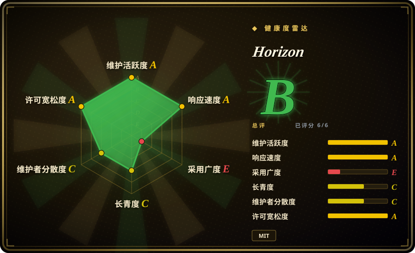
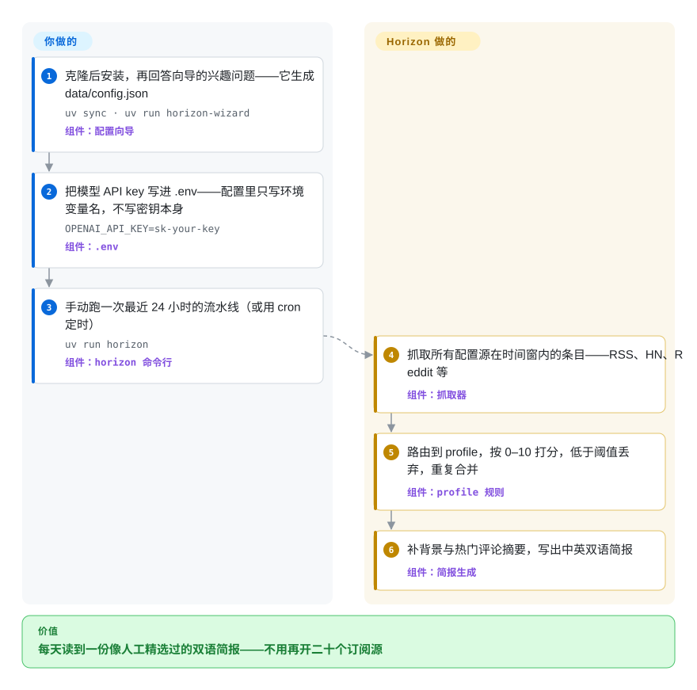

# Horizon

一天里值得一读的东西散落在 RSS、Hacker News、Reddit 和 Telegram 里，你不可能每天开二十个订阅源去翻。Horizon 是一条自托管流水线：替你把这些源抓下来，让大模型按你自己定的编辑规则打分、去重，最后交给你一份中英双语的每日简报。

## 何时使用

你是个订阅了几十个源的开发者——工程博客、HN、几个 subreddit、几个 Telegram 频道——每天早上真正的选择只有两个：刷一个小时信息流，或者干脆不打开阅读器、错过那条真正重要的新闻。你克隆 Horizon，跑一遍它的向导（它会问你关心什么、生成配置文件），填上订阅源，再给它一个 LLM API key——云端或本地 Ollama 都行。之后每次运行会抓取最近 24 小时的内容，由大模型按 profile（一套你可以用 Markdown 改写的编辑规则）给每条内容打 0–10 分，低于阈值的丢弃，同一事件的重复报道合并，最后生成一份五分钟能读完的中英双语简报。

为什么选它而不是替代品：传统聚合器如 [FreshRSS](freshrss.zh.md) 里做筛选的仍然是你自己——它把所有东西摆出来，不做任何判断；托管阅读器给你的是别人家的算法，你没法把自己的规则写进去；自己写 cron 脚本则意味着重新造一遍打分、去重、评论摘要、双语生成和推送分发。决定性的取舍：你换来的是对「什么值得读」的完全编辑权，代价是你自己运维这条流水线（定时跑、管 key、调阈值）。

## 怎么用起来

Horizon 是一条每天触发一次的流水线——命令行、cron、GitHub Actions 或 Docker 都行——不是一个常驻服务。整套编辑机制是现成的：一个 profile 就是 `profiles/<id>/` 下的四个文件——一个 JSON 契约加三个 Markdown 提示词，分别说明什么内容归它管、怎么打分（0–10 的评分标准）、写什么板块——所以你想改变「什么值得读」，改的是 Markdown，不是 Python。每次运行时，抓取器从所有配置的源（RSS/Atom、Hacker News、Reddit、Telegram、经 Apify 的 X、GitHub、Google News、GDELT、经 OpenBB 的财经新闻）拉取最近 N 小时的条目；每条内容被路由到一个 profile（源上写死，或由模型在候选列表里自动挑），分析打分后低于阈值的被丢弃，重复报道被合并；幸存者补充网络检索的背景和热门评论摘要，最终以 Markdown 简报落盘到 `data/summaries/`，中英文各一份。分发——发布到 GitHub Pages、邮件（SMTP/IMAP，带订阅退订处理）、飞书/钉钉/Slack/Discord webhook、经 iLink Bot 的微信——都是配置不是代码；另有 MCP 服务（`horizon-mcp`）把流水线各阶段暴露成工具，让 AI 助手直接调用。

<!-- flow-steps:begin (generated from flows/horizon.json by tools/flow_card.py — do not edit) -->

流程文字版

1. **你**：克隆后安装，再回答向导的兴趣问题——它生成 data/config.json — `uv sync · uv run horizon-wizard` — 组件：`配置向导`
2. **你**：把模型 API key 写进 .env——配置里只写环境变量名，不写密钥本身 — `OPENAI_API_KEY=sk-your-key` — 组件：`.env`
3. **你**：手动跑一次最近 24 小时的流水线（或用 cron 定时） — `uv run horizon` — 组件：`horizon 命令行`
4. **Horizon**：抓取所有配置源在时间窗内的条目——RSS、HN、Reddit 等 — 组件：`抓取器`
5. **Horizon**：路由到 profile，按 0–10 打分，低于阈值丢弃，重复合并 — 组件：`profile 规则`
6. **Horizon**：补背景与热门评论摘要，写出中英双语简报 — 组件：`简报生成`

**价值**：每天读到一份像人工精选过的双语简报——不用再开二十个订阅源

<!-- flow-steps:end -->

## 何时不用

- **你想要一个自己慢慢刷的阅读器界面。** 用 [FreshRSS](freshrss.zh.md)（网页端、全平台、插件生态）或 [NetNewsWire](netnewswire.zh.md)（Mac/iPhone 原生）——零 token 开销、不用管 API key、十几年 track record；Horizon 产出的是一份成品简报，不是刷信息流的地方。
- **你想要零运维。** 托管阅读器（Feedly、Inoreader）不需要配置、定时和 key——代价是接受它们的内容筛选，而不是你自己的（见对比表里的非仓库一行）。
- **你只是现在要查一个具体问题的答案。** Horizon 是固定节奏的日常监控；按需研究用深度研究 agent，比如 [GPT Researcher](../deep-research/gpt-researcher.zh.md)。
- **你的问题是「这个网站没有 RSS」。** RSSHub（DIYgod/RSSHub，未收录）把无源网站变成 RSS，供 Horizon 或 FreshRSS 消费——它是阅读器的补充，不是替代。
- **内容不能发给云端大模型。** Horizon 支持本地 Ollama 端点，但那意味着连模型也归你运维；如果嫌重，就留在无 LLM 的传统聚合（[FreshRSS](freshrss.zh.md)）。
- **你需要稳定的安装契约。** 版本 v0.1.0，没有 GitHub release，也没上 PyPI（PyPI 上的 `horizon` 是 OpenStack 的 dashboard）；安装方式是 `git clone` 加 `uv sync`，请锁定 commit——上游还没有任何 semver 承诺。
- **对成本敏感、每日量又大。** 每次运行都会把每条内容送进模型，开销随源数×条目数增长；X 源还额外要求付费的 Apify 账号。

## 横向对比

| 替代品 | 是否收录 | 我们的评价 | 取舍 |
|---|---|---|---|
| [FreshRSS](freshrss.zh.md) | ✅ | 当你想自己在成熟的网页 UI 里刷完整的信息流、一分钱 token 不花时，选 FreshRSS；当筛选和判断应该发生在你打开之前时，选 Horizon。 | FreshRSS 十二年以上历史、有插件生态，但不打分不摘要——过滤器还是你自己；Horizon 花 token 换来一份成品简报。 |
| [NetNewsWire](netnewswire.zh.md) | ✅ | 在 Mac/iPhone 上想要一个快速、数据自己掌控的原生客户端，选 NetNewsWire；当源超出 RSS 范围（HN、Reddit、Telegram、X）且要的是判断而非展示时，选 Horizon。 | 原生、免费、仅限 Apple 平台；无打分、无背景补充、无分发流水线。 |
| RSSHub | 未收录 | 当卡点是「网站没有 feed」时选 RSSHub——它生成 RSS，供 Horizon 或 FreshRSS 消费。 | 真实仓库（DIYgod/RSSHub），本次 tab-intake 批次未收录；它解决的是源的生成，不是筛选和简报。 |
| Follow（RSSNext） | 未收录 | 想要今天就能用的、自带 AI 功能的成品信息浏览器，选 Follow；当规则必须是你的、流水线必须自托管时，选 Horizon。 | 真实仓库，本次 tab-intake 批次未收录；Follow 是你坐进去用的应用，Horizon 是你运维的流水线。 |
| Feedly / Inoreader | 非仓库 | 愿意用别人的内容筛选换零配置零运维时，选托管阅读器。 | 托管 SaaS，形状上就不在收录范围；没有自定义 LLM 规则、不能自托管，更好的筛选功能锁在付费订阅后面。 |

## 技术栈

- **核心：** Python ≥3.11，hatchling 打包，`uv` 管理依赖；`pyproject.toml` 里五个命令行入口——`horizon`、`horizon-wizard`、`horizon-mcp`、`horizon-webhook`、`horizon-wechat`。
- **抓取与正文抽取：** httpx、feedparser（RSS/Atom）、beautifulsoup4、trafilatura（全文抽取，失败回退 feed 摘要）、ddgs（补充背景的网络搜索）。
- **模型接入：** `openai`／`anthropic`／`google-genai` SDK，外加任意 OpenAI-compatible 的 `base_url`——DeepSeek、Doubao、MiniMax、阿里 DashScope，或本地 Ollama（`http://localhost:11434/v1`）。
- **结构与输出：** pydantic 模型、python-dotenv、tenacity 重试、rich 终端输出、opencc 简繁转换、qrcode（微信登录）、`mcp` SDK（工具服务）。
- **可选 extras：** `openbb`（财经新闻）、`twitter`（Playwright + stealth）、`dev`（pytest）。

## 依赖

- **一个 LLM 端点和 key**——云服务商任选，或本地 Ollama；所有分析和补充调用都走它。key 放 `.env`，配置里只引用环境变量名。
- **无数据库**——状态（简报、配置、订阅者）都在 `data/` 目录下。
- **按功能可选：** Apify 账号（X/Twitter 搜索）、OpenBB（财经新闻）、SMTP+IMAP 邮箱（邮件订阅）、webhook 端点（飞书/钉钉/Slack/Discord）、iLink Bot 扫码登录（微信）。
- **定时：** cron、仓库自带的 GitHub Actions workflow 模板，或 Docker Compose。

## 运维难度

**低到中。** 核心循环就是一次命令行运行：克隆、`uv sync`、向导、key 进 `.env`、给 `uv run horizon` 定时。持续的负担不在基础设施而在编辑和开销——调阈值和 profile、维护源列表、盯 token 花销（随源数×每次条目数增长）。每个分发渠道各加一套配置（SMTP/IMAP、webhook secret、微信扫码登录）；开了邮件订阅之后，它就变成一个你必须每天稳定跑着的东西了。

## 健康度与可持续性

- **维护（截至 2026-09-28）：** 验证当天仍有 push，九月里持续合入功能 PR（微信分发、X 关键词搜索）。活跃开发中，不是靠惯性滑行。
- **治理与巴士系数：** README 自述为业余时间维护的个人项目；单一维护者贡献了前十名中的 207 次 commit（第二名 8 次）。有三家商业赞助（Compshare、APIMart、OfoxAI），但路线图背后没有组织或基金会——巴士系数实际为一。
- **年龄与 Lindy：** 2026-02-20 创建，约 7 个月大——很年轻；无论势头多好，Lindy 先验都偏弱。
- **采用度：** 该窗口内约 9.5k star、约 1.4k fork [推断]——增长带有推广成分（README 里的 HelloGitHub 推荐、Trendshift 徽章、LINUX.do／小红书致谢），应读作传播力而非生产级采用证据；没有 release 和 PyPI 下载数可交叉验证。
- **风险旗标：** MIT 宽松许可，无改许可证历史；尚无 release、无 semver 契约（v0.1.0，release 和 PyPI 发布在路线图上）；README 带赞助商广告；社区和 issue 区以中文为主——团队需要英文支持渠道时要考虑这点。

## 存疑（未验证）

- [推断] 约 7 个月 9.5k star 有相当推广成分（README 出现 HelloGitHub／Trendshift／LINUX.do 致谢）；未审计 star 历史，采用度应视为未证实。
- [未验证] 每次运行的 token 成本：README 和文档都没有数字，实际开销取决于源数×条目数×模型——此处无复现环境，测不了。
- [推断] 经 iLink Bot 的微信分发受微信回复长度限制（README 自己的说明）；实际可靠性未测试。
- [未验证] 各 provider 路径的能力差异（哪条路径实际用到哪些模型能力）未逐版本审计；provider 列表以 2026-09-28 读到的 docs/configuration.md 为准。
