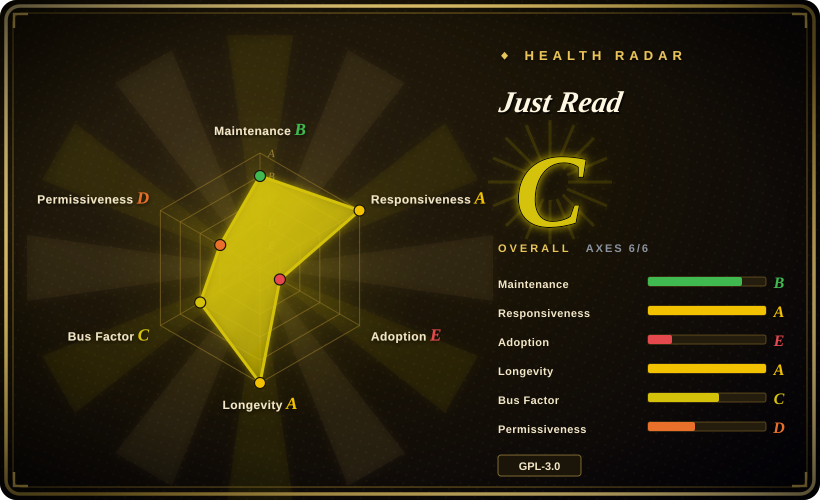
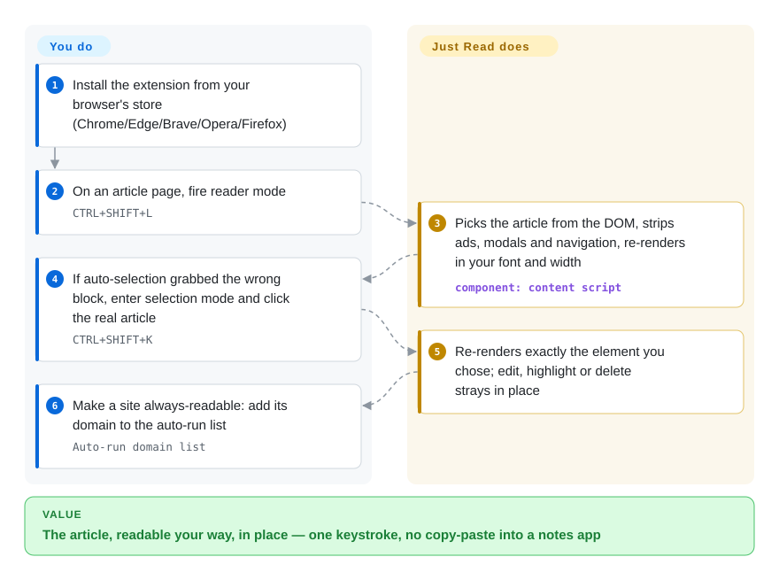

# Just Read

The article you came for is buried under cookie banners, stacked modals, and autoplay ads. Just Read strips the page furniture and re-renders just the content in your configured font and width — an in-place reader mode with editing, highlighting, and AI summaries (cross-device save is paid Premium).

## When to use

You're someone who reads a lot of web articles and is sick of news sites that bury a 600-word story under cookie banners, autoplay video, three modals, and a sticky nav. You don't want to copy text into a notes app; you just want the article, readable, in place. You install Just Read in Chrome/Edge/Brave/Opera or Firefox, click the toolbar button (or hit a keyboard shortcut), and the page collapses to just the content in a font and width you've configured. You can tweak the theme, edit out a stray pull-quote, highlight passages, and even add comments — it's a reader mode that lets you *shape* the result rather than take a fixed template.

You also reach for it when you want per-site control: on the site Just Read consistently mis-parses, you can pin exact CSS selectors for title/author/date/content so it never guesses wrong again — as of 2026-09 this domain-specific selector feature is **Premium**. Connecting an AI-provider API key (the README says "AI provider", not OpenAI-only) gets you an article summary, and the paid tier adds cross-device saving of cleaned pages. For the common case — "make this specific article readable right now, my way" — the free path is a lightweight, in-browser tool with no backend to run.

## How it works

Just Read is a content script plus an options page — the extension code that rewrites the page you're on, and the settings screen where you decide how it should look. On trigger (toolbar button, keyboard shortcut, or right-click menu), it picks the article element out of the DOM — automatically, or from the block *you* point at in visual selection mode — strips the surrounding ads, modals, and navigation, and re-renders the content into its own template with your font, width, and theme. The result stays editable in place: deletion mode removes stray elements, a selection toolbar highlights or restyles passages, Ctrl/Cmd-click adds inline comments. What stays yours: browser and store install, the options configuration, and any AI-provider key you plug in for summaries; per-site selector overrides and cross-device save are handled by the maintainer's hosted Premium service (justread.link). Free use needs no account and, per the README's privacy statement, collects no data by default.

<!-- flow-steps:begin (generated from flows/just-read.json by tools/flow_card.py — do not edit) -->

Text version of the flow

1. **You**: Install the extension from your browser's store (Chrome/Edge/Brave/Opera/Firefox)
2. **You**: On an article page, fire reader mode — `CTRL+SHIFT+L`
3. **Just Read**: Picks the article from the DOM, strips ads, modals and navigation, re-renders in your font and width — component: `content script`
4. **You**: If auto-selection grabbed the wrong block, enter selection mode and click the real article — `CTRL+SHIFT+K`
5. **Just Read**: Re-renders exactly the element you chose; edit, highlight or delete strays in place
6. **You**: Make a site always-readable: add its domain to the auto-run list — `Auto-run domain list`

**Value**: The article, readable your way, in place — one keystroke, no copy-paste into a notes app

<!-- flow-steps:end -->

## When NOT to use

- **You need a permissively-licensed extension codebase.** The repo now carries a **GPL-3.0-only** LICENSE (added 2026-08-29, commit "Add GNU General Public License v3") — the old "no license file" gap is closed, but strong copyleft means fork-and-ship-differently carries obligations, and the README still binds *usage* to a EULA (`docs/EULA.md`). If you need MIT/Apache reuse terms or want to bake the parser into a closed product, build on Mozilla Readability (MPL) instead.
- **You want a read-it-later library / archive.** Free Just Read is a per-page reformatter; durable cross-device saving is a **Premium** (paid, hosted) feature with a stated 300-article cap, and per-domain custom selectors are also Premium-gated as of 2026-09. For a full archive workflow, Pocket/Instapaper/Wallabag/Readwise fit better.
- **You're outside extension-capable browsers.** It's a browser extension (Chromium browsers + Firefox); on mobile it only works in browsers that support extensions (Kiwi, Yandex, etc.) and some features may not work there.
- **You need it to reformat non-article pages.** The README explicitly scopes it to *article-type pages*; dashboards, apps, and complex layouts are out of scope and "liable to not perform as one might expect."
- **You want a vendor-independent, multi-maintainer project.** It's effectively a single-developer project tied to one person and a hosted Premium service (justread.link); that's both the governance risk and the lock-in surface for the paid features.

## Comparison

| Alternative | In index | Our verdict | Tradeoff |
|---|---|---|---|
| Built-in browser Reader Mode (Firefox/Safari/Edge) | 未收录 | Choose the built-in reader mode when zero install and browser-native trust matter more than customization; choose Just Read when per-site selectors, editing, highlighting, or summaries justify an extension. | Zero install, baked into the browser; far less customizable, no per-site selectors, no editing/highlighting/summaries. |
| Mozilla Readability (library) | 未收录 | Choose Mozilla Readability when you are building your own parser or reader mode; choose Just Read when you need a ready-to-use browser extension — its code is now GPL-3.0-only, but redistribution carries copyleft obligations. | The open-source MPL parsing engine behind many reader modes; a library to build on, not a ready-to-use extension. |
| Postlight Reader (ex-Mercury) | 未收录 | Postlight Reader was the "clean licensing" fallback if Just Read's GPL-plus-EULA stack bothered you — but as of 2026-09 its GitHub repo (postlight/reader) returns 404; confirm it still exists anywhere before choosing it. | Formerly the open-source Mercury readability parser/extension; upstream now appears deleted, so maintenance and availability are both worse than Just Read's. |
| Pocket / Instapaper / Wallabag | 未收录 | Choose Pocket, Instapaper, or Wallabag when the job is a durable read-it-later library; choose Just Read for immediate in-place article cleanup without building an archive workflow. | Read-it-later services with durable cross-device libraries; heavier (account + backend) and aimed at saving, not in-place reformatting (Wallabag is self-hostable). |
| Reader View extensions (various) | 未收录 | Choose another reader extension only after checking parsing quality, license, and trust surface; choose Just Read when customization and saved selectors are the decisive feature. | Many small clones exist; vary widely in parsing quality, licensing, and trustworthiness — Just Read's edge is its customization and selector memory. |

## Tech stack

- **Language:** JavaScript — a WebExtension (content script + options page) running in the browser; no server component for the core free features. [推断]
- **Parsing:** client-side DOM heuristics to pick the article element, with user-defined CSS selectors stored per domain for sites it gets wrong.
- **Optional integrations:** AI-provider API key (user-supplied) for summaries; a hosted backend (justread.link) for Premium cross-device save and account/email storage.
- **Distribution:** Chrome Web Store, Firefox Add-ons, and Microsoft Edge Add-ons.

## Dependencies

- **Runtime:** an extension-capable browser (Chrome/Edge/Brave/Opera/Firefox, or mobile browsers that support extensions). No server to run for free features.
- **Optional:** an AI-provider API key (yours) for summarization; a Just Read account + Premium purchase for hosted cross-device saving and per-domain selectors.
- **Build:** a Node/JS toolchain to build the extension from source if not installing from a store.

## Ops difficulty

**Low — it's a client-side browser extension.** Install from a store, configure the options page, done; there's nothing to deploy or operate for the free path. The only "ops" appear if you depend on the hosted Premium features (account, cross-device saving), which are run by the maintainer's service — not something you operate, but a dependency on a third party and its article limits. Building from source is a standard JS-extension build.

## Health & viability

- **Responsiveness**: Grade A — median first-response time 1.9 hours across 6 qualifying issues/PRs (scorer, re-run 2026-09-28).
- **Maintenance (2026-09).** Last pushed 2026-09-27, not archived; near-steady one-person cadence. Notably, the repo added a **GPL-3.0 LICENSE on 2026-08-29** and renamed its default branch `master → main` between verification passes — both signs of ongoing care, not drift.
- **Governance / bus factor.** Single-maintainer (`ZachSaucier` is effectively the only contributor) and a **User**-owned repo with a hosted commercial side (justread.link) — a clear single-point-of-failure both for the code and for the Premium service. **Flagged.**
- **Age & Lindy verdict.** Created 2015-10 (~11 years) and still active ⇒ a genuine Lindy signal for a personal project; it has survived more than a decade of free-time maintenance, which is itself a positive durability indicator.
- **Adoption (2026-09).** ~1.3k stars, ~144 forks (GitHub API, 2026-09-28) and listings on three extension stores indicate real user adoption for a niche utility; no large contributor community behind it, and the radar's adoption axis is E (no package-registry signal).
- **Risk flags — mostly improved since 2026-06.** The "no license at all" risk became **GPL-3.0-only copyleft** (good for auditability, bad for embedding in proprietary products) with the usage **EULA still in force** — a layered terms surface. Freemium remains: domain-specific selectors, cross-device save, and sharing are Premium-gated on the maintainer's hosted service; if he steps away, that service and future updates are both at risk.

## Caveats (unverified)

- [未验证] "Reused rights" beyond the GPL text (e.g. whether the EULA's terms conflict with the license grant for redistribution) were not analyzed — both documents exist (`LICENSE`, `docs/EULA.md`) and the README still binds use to the EULA.
- [未验证] ~1.3k stars, ~144 forks, 3 open issues as of 2026-09-28 (GitHub API) — volatile, date-sensitive figures.
- [未验证] The Premium 300-article shared limit is the maintainer's stated cap (README FAQ as of 2026-09) and may change.
- [推断] WebExtension architecture (content script + options page, client-side parsing) is inferred from the project description and standard reader-mode design, not a code audit.
- [未验证] The exact set of features gated behind Premium vs free shifts over time (domain-specific selectors moved to Premium at some point before 2026-09); verify against the current extension and justread.link.
