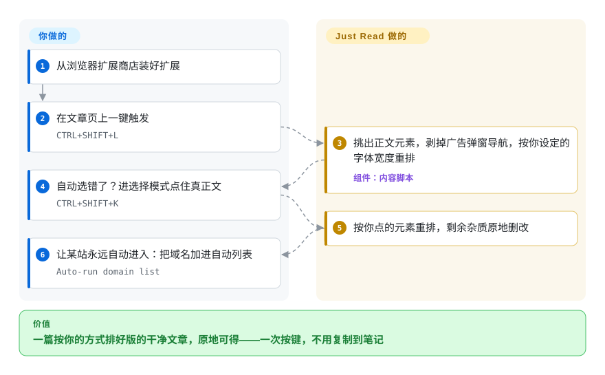

# Just Read

你来看的那篇文章，被 cookie 横幅、一层套一层的弹窗和自动播放广告埋在了底下。Just Read 把页面杂饰剥掉，只留正文按你设定的字体和宽度重排——一个原地的阅读模式，带编辑、高亮与 AI 摘要；跨设备保存在付费 Premium 档。

## 何时使用

你是个读很多网页文章的人，受够了新闻站把一篇 600 字的报道埋在 cookie 横幅、自动播放视频、三个弹窗和粘性导航底下。你不想把正文复制到笔记应用里；你就想要那篇文章，原地、可读。你在 Chrome/Edge/Brave/Opera 或 Firefox 里装上 Just Read，点工具栏按钮（或按快捷键），页面就坍缩成只剩正文，字体和宽度按你配置的来。你可以调主题、抹掉一段碍眼的引文、给段落高亮，甚至加批注——这是一个让你*塑形*结果而非套固定模板的阅读模式。

当你想要按站点精细控制时，你也会选它：对于某个它总解析错的站点，你可以钉死标题、作者、日期、正文的 CSS 选择器，让它不再瞎猜——截至 2026-09，这个按站点定制选择器是 **Premium** 功能。接上一个 AI 提供方的 API key（README 写的是 “AI provider”，不再只限 OpenAI）就能让它摘要文章；付费档再加上清理后页面的跨设备保存。对最常见的情形——“现在就把这篇文章按我的方式弄得可读”——免费路径是一个轻量、跑在浏览器里、无后端可运维的工具。

## 怎么用起来

Just Read 是内容脚本加 options 页——改写你所在页面的那段扩展代码，以及决定它该长什么样的设置界面。触发方式有三种（工具栏按钮、快捷键、右键菜单），它从 DOM 里挑出正文元素——自动挑，或者在选择模式下点住你要的那块——剥掉周围的广告、弹窗和导航，再把内容重排进它自己的模板，字体、宽度、主题按你的配置来。结果可以原地加工：删除模式点掉多余元素，选中文本浮现的工具栏做高亮和改样式，Ctrl/Cmd 点击加行间批注。仍然归你管的：浏览器里装扩展、配 options、以及摘要要用的 AI key；按站点覆盖选择器和跨设备保存，走的是维护者的托管 Premium 服务（justread.link）。免费使用不需要账号，README 的隐私声明称默认不收集任何数据。

<!-- flow-steps:begin (generated from flows/just-read.json by tools/flow_card.py — do not edit) -->

流程文字版

1. **你**：从浏览器扩展商店装好扩展
2. **你**：在文章页上一键触发 — `CTRL+SHIFT+L`
3. **Just Read**：挑出正文元素，剥掉广告弹窗导航，按你设定的字体宽度重排 — 组件：`内容脚本`
4. **你**：自动选错了？进选择模式点住真正文 — `CTRL+SHIFT+K`
5. **Just Read**：按你点的元素重排，剩余杂质原地删改
6. **你**：让某站永远自动进入：把域名加进自动列表 — `Auto-run domain list`

**价值**：一篇按你的方式排好版的干净文章，原地可得——一次按键，不用复制到笔记

<!-- flow-steps:end -->

## 何时不用

- **你要的是宽松许可的扩展代码库。** 仓库现在带着 **GPL-3.0-only** 的 LICENSE（2026-08-29 补入，提交信息逐字为 “Add GNU General Public License v3”）——旧的“连 LICENSE 都没有”已翻篇，但强 copyleft 意味着 fork 再分发负有义务，且 README 仍把*使用*绑定在 EULA（`docs/EULA.md`）上。要 MIT/Apache 式的复用权、或想把解析器嵌进闭源产品，请基于 Mozilla Readability（MPL）自己构建。
- **你想要稍后读的资料库 / 归档。** 免费版 Just Read 是按页重排器；持久的跨设备保存是 **Premium**（付费、托管）特性，README 自述共享上限 300 篇，按站点选择器到 2026-09 也已划入 Premium。要完整归档工作流，Pocket/Instapaper/Wallabag/Readwise 更合适。
- **你不在支持扩展的浏览器里。** 它是浏览器扩展（Chromium 系加 Firefox）；在移动端只在支持扩展的浏览器里能用（Kiwi、Yandex 等），且部分功能可能失效。
- **你要它重排非文章页。** README 明确把它限定在*文章型页面*；看板、应用和复杂布局不在范围内，“很可能表现不如预期”。
- **你想要一个不依赖单一厂商、多人维护的项目。** 它实际上是绑定在一个人加一个托管 Premium 服务（justread.link）上的单人项目；这既是治理风险，也是付费功能的锁定面。

## 横向对比

| 替代品 | 是否收录 | 我们的评价 | 取舍 |
|---|---|---|---|
| 浏览器内置阅读模式（Firefox/Safari/Edge） | 未收录 | 当零安装和浏览器内建信任比定制能力更重要时，选内置阅读模式；当按站点选择器、编辑、高亮或摘要值得装扩展时，选 Just Read。 | 零安装、内建于浏览器；可定制性差得多，没有按站点选择器，没有编辑/高亮/摘要。 |
| Mozilla Readability（库） | 未收录 | 当你是在构建自己的解析器或阅读模式时，选 Mozilla Readability；当你要开箱即用的浏览器扩展时，选 Just Read——代码已是 GPL-3.0-only，但再分发要担 copyleft 义务。 | 许多阅读模式背后那个开源 MPL 解析引擎；是用来构建的库，不是开箱即用的扩展。 |
| Postlight Reader（前 Mercury） | 未收录 | 当你因 Just Read 的 GPL 加 EULA 叠加而想要“干净许可”的现成扩展时，Postlight Reader 曾是备选；2026-09 经 GitHub API 查其仓库已 404，选前先确认仓库是否还活着。 | 曾经的开源可读性扩展/解析器；上游仓库疑似已消失，活跃度和可用性都不如 Just Read。 |
| Pocket / Instapaper / Wallabag | 未收录 | 当任务是持久的稍后读资料库时，选 Pocket、Instapaper 或 Wallabag；当只是立即把当前文章原地清理干净时，选 Just Read。 | 带持久跨设备库的稍后读服务；更重（账号加后端）且面向保存而非原地重排（Wallabag 可自建）。 |
| 各类 Reader View 扩展 | 未收录 | 只有核过解析质量、许可和信任面后，才选其他阅读扩展；当定制和保存选择器是决定性特性时，选 Just Read。 | 存在很多小克隆；解析质量、许可与可信度参差不齐——Just Read 的优势在于定制和选择器记忆。 |

## 技术栈

- **语言：** JavaScript——一个 WebExtension（content script 加 options 页），跑在浏览器里；核心免费功能没有服务器组件。[推断]
- **解析：** 客户端 DOM 启发式挑选正文元素，对解析错的站点用按域名保存的用户自定义 CSS 选择器。
- **可选集成：** AI 提供方 API（用户自带 key）做摘要；托管后端（justread.link）做 Premium 跨设备保存与账号/邮箱存储。
- **分发：** Chrome Web Store、Firefox Add-ons 和 Microsoft Edge Add-ons。

## 依赖

- **运行时：** 一个支持扩展的浏览器（Chrome/Edge/Brave/Opera/Firefox，或支持扩展的移动浏览器）。免费功能没有服务器要跑。
- **可选：** 用于摘要的 AI 提供方 API key（你自己的）；用于托管跨设备保存与按站点选择器的 Just Read 账号加 Premium 购买。
- **构建：** 若不从商店安装而从源码构建，需要 Node/JS 工具链。

## 运维难度

**低——它是客户端浏览器扩展。** 从商店安装、配置 options 页，完事；免费路径没有任何东西要部署或运维。只有当你依赖托管的 Premium 功能（账号、跨设备保存）时才出现“运维”，而那由维护者的服务运行——不是你来运维，但是对第三方及其文章上限的依赖。从源码构建是标准的 JS 扩展构建。

## 健康度与可持续性

- **响应速度**：Grade A——中位首次响应时间 1.9 小时，基于 6 个 qualifying issues/PRs（评分器，2026-09-28 重跑）。
- **维护（2026-09）。** 最后 push 于 2026-09-27，未归档，单人节奏稳定推进。值得注意：两轮验证之间仓库补入了 **GPL-3.0 LICENSE（2026-08-29）**，默认分支也从 `master` 改名为 `main`——都是还在用心维护的信号，而非停摆。
- **治理 / bus factor。** 单一维护者（`ZachSaucier` 实际是唯一贡献者）、**User** 所有的仓库，外加一个托管商业侧（justread.link）——无论对代码还是对 Premium 服务都是明显的单点故障。**已标记。**
- **年龄与 Lindy 判断。** 2015-10 创建（约 11 年）且仍活跃⇒对一个个人项目是货真价实的 Lindy 信号；它熬过了十余年的业余时间维护，这本身就是正面的耐久性指标。
- **采用度（2026-09）。** 约 1.3k star、约 144 fork（GitHub API，2026-09-28），并在三个扩展商店上架，对一个小众工具说明有真实用户采用；背后没有大的贡献者社区，雷达采用轴为 E（无包注册表信号）。
- **风险标志——较 2026-06 大体向好。** “完全没有许可证”变成了 **GPL-3.0-only copyleft**（可审计性变好，嵌入闭源产品变差），且使用仍受 **EULA** 约束——两套条款叠加。Freemium 依旧：按站点选择器、跨设备保存与分享都划入维护者托管服务上的 Premium；若他撤手，该服务和后续更新同时有风险。

## 存疑（未验证）

- [未验证] 除 GPL 文本本身的复用权之外（例如 EULA 条款与许可证授予在再分发上是否冲突）未做条款分析；两份文件都在（`LICENSE`、`docs/EULA.md`），README 仍把使用绑定到 EULA。
- [未验证] 截至 2026-09-28 约 1.3k star、约 144 fork、3 个 open issue（GitHub API）——易变且对时间敏感的数字。
- [未验证] Premium 文章上限在 README 里被描述为约 300 篇已保存文章；这是维护者声明的上限，可能变化。
- [推断] WebExtension 架构（content script 加 options 页、客户端解析）是从项目描述和标准阅读模式设计推断的，并非代码审计。
- [未验证] Premium 与免费之间到底门控了哪些特性随时间变化；请对照当前扩展与 justread.link 核实。
