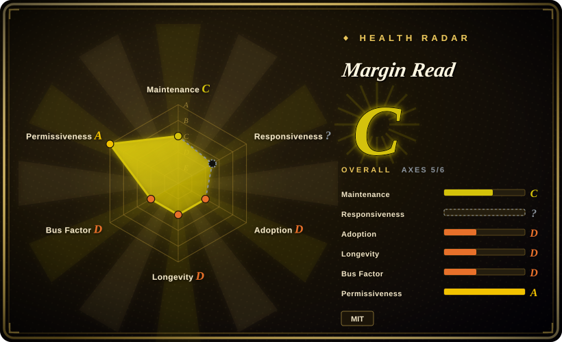
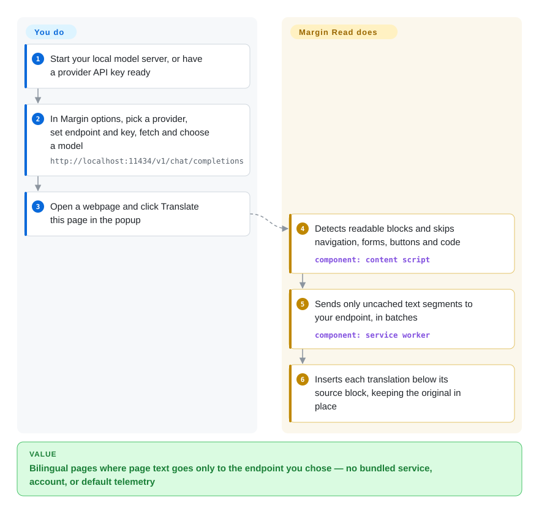

# Margin Read

You want to read foreign-language pages through your own Ollama, LM Studio, or company model gateway, but most translation extensions are large, bundle their own services, and don't say exactly what they send where. Margin Read is a small MIT-licensed Chrome extension that inserts translations under the original paragraphs, sends only the extracted text segments to the one endpoint you configure, and documents that data flow in a written threat model.

## When to use

You're a developer or security-minded user who already runs an OpenAI-compatible gateway, Ollama, LM Studio, llama.cpp, or a private model endpoint. You tried a full-featured immersive-translation extension and found it calling free public endpoints by default, asking for an account, or shipping analytics; your company policy says page text may go only to the internal gateway at `https://llm.internal/v1/chat/completions`. You don't need PDF, OCR, or subtitles — you need bilingual webpage paragraphs, your own key (or none, for a local runtime), a configurable endpoint, and a document that states what is sent, what is cached, and which risks remain.

Choose Margin Read when the deciding constraint is **control and auditability**: MIT license, no bundled API key, no login, cloud sync, or default telemetry per the project's docs, separate OpenAI-compatible and Anthropic Messages-compatible adapters for local runtimes and gateways, and a codebase small enough to read in an afternoon. Pick FluentRead or Read Frog instead when end-user completeness, Firefox/Edge store coverage, documents, subtitles, or a larger community matter more than licensing and data-flow transparency.

## How it works

Margin Read is a Manifest V3 extension with four parts: a content script that runs in the page, a service worker (the extension's background process), a popup, and an options page. When you click **Translate this page**, the content script picks out readable blocks — paragraphs, headings, list items, quotes, even old `table`/`font` layouts — while skipping navigation, forms, buttons, and code; it sends the normalized text to the service worker, which checks the cache (session-only by default), batches uncached segments to **your** configured provider, and the translations are inserted beneath each source block. It keeps watching the page so content inserted later also gets translated, and an optional X-specific mode targets tweet text instead of every visible label. You supply everything outside the extension: the provider choice, the API key (stored in extension storage, which the threat model explicitly says is not a vault), the model, and — for local translation — a running model server it can reach. Think of it as a translation pipe with one outlet that you point; it has no default service of its own to fall back on.

<!-- flow-steps:begin (generated from flows/margin-read.json by tools/flow_card.py — do not edit) -->

Text version of the flow

1. **You**: Start your local model server, or have a provider API key ready
2. **You**: In Margin options, pick a provider, set endpoint and key, fetch and choose a model — `http://localhost:11434/v1/chat/completions`
3. **You**: Open a webpage and click Translate this page in the popup
4. **Margin Read**: Detects readable blocks and skips navigation, forms, buttons and code — component: `content script`
5. **Margin Read**: Sends only uncached text segments to your endpoint, in batches — component: `service worker`
6. **Margin Read**: Inserts each translation below its source block, keeping the original in place

**Value**: Bilingual pages where page text goes only to the endpoint you chose — no bundled service, account, or default telemetry

<!-- flow-steps:end -->

## When NOT to use

- **You need a complete Immersive Translate replacement today.** Use [FluentRead](fluentread.md) or [Read Frog](read-frog.md); Margin Read is an early MVP and explicitly excludes PDF, EPUB, subtitle translation, OCR, input-box translation, cloud sync, accounts, and any paid quota.
- **You need Firefox as a primary target.** Use [FluentRead](fluentread.md), [Read Frog](read-frog.md), or [Pair Translate](pair-translate.md); Margin Read targets Chrome/Chromium Manifest V3 and lists Firefox as not primary yet.
- **You need a project likely to be maintained for years.** Use [FluentRead](fluentread.md) or [Read Frog](read-frog.md); Margin Read was created in 2026-05, one contributor wrote ~98% of the commits, there has been no release since v0.3.7 (2026-06-15), and the only change since is a toolchain upgrade on 2026-07-21 — too early to call abandoned, but nothing yet shows staying power.
- **You cannot trust browser extension storage with API keys.** Use a server-side translation proxy that holds the key, and point Margin Read at it keyless; its own threat model says extension storage is not a secure vault.
- **You translate highly interactive web apps or unusual DOMs.** Use a more mature extension such as [FluentRead](fluentread.md) with per-site rules; the README warns of rough edges on interactive apps, unusual layouts, and sites that aggressively rewrite their DOM.
- **You need subtitle translation.** Use [FluentRead](fluentread.md) or [Read Frog](read-frog.md); the README and threat model put subtitles out of scope, even though the repo carries a YouTube-captions feedback template, so treat any caption behaviour as experimental.

## Comparison

| Alternative | In index | Our verdict | Tradeoff |
|---|---|---|---|
| [Read Frog](read-frog.md) | ✅ | Choose Read Frog when learning features, cross-store distribution, and a larger community beat licensing simplicity; choose Margin Read when MIT licensing, BYOK-only egress, and a written threat model are non-negotiable. | Read Frog is richer and far more adopted but GPL/commercial dual-licensed with default-on analytics in Chrome/Edge builds; Margin Read is transparent and permissive but early. |
| [FluentRead](fluentread.md) | ✅ | Choose FluentRead when you want one extension for webpages, documents, OCR, subtitles, and free no-key engines; choose Margin Read when every request must go only to an endpoint you configured. | FluentRead has the broader feature set and store coverage but is GPL-3.0 and defaults to public free endpoints; Margin Read has a much smaller surface and clearer provider boundary. |
| [Pair Translate](pair-translate.md) | ✅ | Choose Pair Translate when you want a lightweight translator with provider templates and Firefox/Edge links; choose Margin Read when the privacy threat model and MIT license decide the choice. | Pair Translate covers more browsers but is GPL-3.0; Margin Read is more permissive and explicit, but Chrome/Chromium-first. |
| Immersive Translate | not a repo | Use the commercial product only as a UX benchmark; choose Margin Read when open source, auditable code, and self-managed endpoints are required. | Familiar product category, but its public GitHub repo does not contain the extension source. |
| A custom userscript/proxy | not indexed | Build a custom userscript only when your translation surface is tiny and policy-heavy; choose Margin Read when a maintained extension skeleton with provider adapters saves work. | Custom code gives full policy control but loses store packaging, the options UI, cache behaviour, and provider adapter maintenance. |

## Tech stack

- **Monorepo:** pnpm 10 workspace with `apps/extension` and `apps/website` (Astro).
- **Extension:** Manifest V3, TypeScript 7.0 (native compiler), Vite with `@crxjs/vite-plugin`; service worker, content scripts, popup, options page; `activeTab`/`storage` permissions and `<all_urls>` host/content-script access.
- **Provider SDKs:** `openai`, `@anthropic-ai/sdk`, `@google/genai`; adapters for OpenAI, OpenAI-compatible, Anthropic, Anthropic-compatible, and Google Gemini.
- **Local endpoints:** documented presets for LM Studio, Ollama (both `/v1/chat/completions` and `/v1/messages`), llama.cpp server, and omlx.
- **Quality/security automation:** CI (type check, oxlint, `oxfmt --check`, Vitest, build, packaging, release-readiness), CodeQL, dependency review, and a Chrome Web Store publish workflow. ESLint was replaced by oxlint in July 2026.

## Dependencies

- **Runtime:** Chrome stable or a Chromium-based browser with Manifest V3.
- **Provider credentials/endpoints:** a raw provider API key, or an empty key for compatible local endpoints.
- **Local model servers (optional):** LM Studio, Ollama, llama.cpp server, omlx, or another OpenAI/Anthropic-compatible endpoint.
- **Browser profile trust:** API keys and (optionally persistent) cached translations live in the browser profile.
- **Build:** Node with corepack, pnpm 10.15, TypeScript 7, Vite/CRXJS, Vitest.

## Ops difficulty

**Low for a technical individual, medium for policy-controlled use.** Installing from the Chrome Web Store (or a release ZIP) and pointing it at an endpoint is easy. The work sits on the provider side: run and secure the model server or gateway, keep the endpoint protocol compatible (turn off JSON mode if your runtime rejects `response_format`), pick session vs persistent cache, and accept that keys live in extension storage. For a team, the sensible shape is one controlled OpenAI-compatible gateway plus a written rule for which sites may be translated.

## Health & viability

- **Maintenance (2026-10-08):** slowing. Eight releases from v0.3.0 to v0.3.7 between 2026-05-14 and 2026-06-15, then none; the last commit (2026-07-21) upgraded TypeScript and swapped ESLint for oxlint/oxfmt. Commits in only 1 of the last 13 weeks; last commit 78 days ago.
- **Responsiveness:** unscored (`?`) on the radar, genuinely — the repo has had one issue and four PRs in total, so there is no response-time signal either way.
- **Governance / bus factor:** organization-owned (`withmargin`), but one contributor wrote ~98% of the commits (top-1 share 0.98) — effectively a single-maintainer project.
- **Age & Lindy:** created 2026-05, ~5 months old; no Lindy evidence yet, and the quiet period after the first burst is exactly the pattern to watch.
- **Adoption:** ~33 stars and 4 forks; release ZIPs downloaded ~64 times in total. Tiny next to FluentRead or Read Frog.
- **Engineering hygiene:** strong for its size — CodeQL, dependency review, release-readiness checks, a threat model, PRD, and roadmap.
- **Risk flags:** early MVP, single maintainer, Chrome-first, broad `<all_urls>` host access, keys in extension storage; MIT license is the low-risk part.

## Caveats (unverified)

- [未验证] Chrome Web Store listing details, install count, and the currently published version were not checked; a publish workflow and a store badge exist in the repo.
- [未验证] The extension was not run; provider support is based on the README and the provider adapter files.
- [未验证] Absence of default telemetry is taken from the README, principles, and threat model, not a full source audit.
- [未验证] Release ZIPs were not checked for reproducible builds from source.
- [推断] Bus-factor risk is inferred from public contributor counts (205 of 208 commits by one account); private team structure was not verified.
- [推断] "Slowing" is inferred from release and commit cadence after June 2026; no maintainer statement about the project's status was found.
