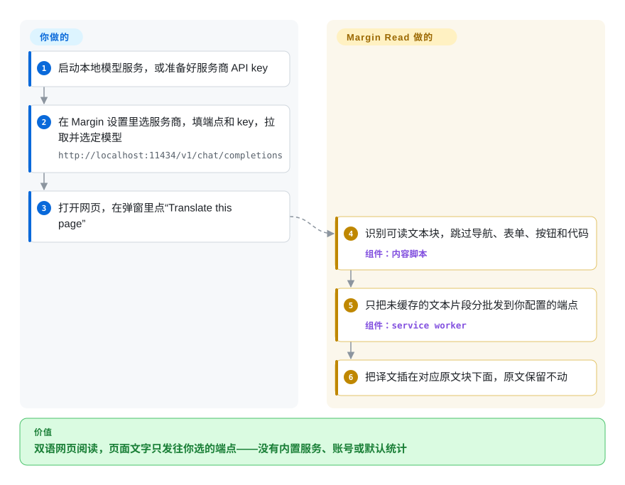

# Margin Read

你想用自己的 Ollama、LM Studio 或公司的模型网关来读外文网页，可大多数翻译扩展体量庞大、自带一堆服务，也说不清到底把什么发到了哪里。Margin Read 是一个 MIT 许可的小型 Chrome 扩展：把译文插在原文段落下面，只把提取出的文本片段发给你配置的那一个端点，并用一份成文的威胁模型把这条数据流写清楚。

## 何时使用

你是开发者，或者对安全比较敏感，手里已经有一个兼容 OpenAI 的网关、Ollama、LM Studio、llama.cpp 或私有模型端点。你试过功能齐全的沉浸式翻译扩展，发现它默认调用公开的免费端点、要你注册账号，或者内置了统计；而公司规定页面文字只能发往内部网关 `https://llm.internal/v1/chat/completions`。你不需要 PDF、OCR 或字幕——你要的是双语网页段落、自己的密钥（本地运行时可以不填）、可配置的端点，以及一份写明发送什么、缓存什么、还剩哪些风险的文档。

当决定性约束是**可控和可审计**时，选 Margin Read：MIT 许可、不内置 API 密钥，按项目文档没有登录、云同步和默认统计，为本地运行时和网关分别提供兼容 OpenAI 和兼容 Anthropic Messages 的适配器，代码量小到一个下午就能读完。如果终端用户功能完整度、Firefox/Edge 商店覆盖、文档、字幕或更大的社区比许可和数据流透明更重要，改选 FluentRead 或 Read Frog。

## 怎么用起来

Margin Read 是一个 Manifest V3 扩展，由四部分组成：跑在网页里的内容脚本、service worker（扩展的后台进程）、弹窗和设置页。你点“Translate this page”时，内容脚本挑出可读的文本块——段落、标题、列表项、引用，连老式的 `table`/`font` 排版也能处理——同时跳过导航、表单、按钮和代码；它把规范化后的文本交给 service worker，后者先查缓存（默认只在本次会话内有效），再把未缓存的片段分批发给**你**配置的服务商，译文随后插到每个原文块下面。它会持续留意页面，后来才加载出来的内容也会被翻译；另有一个可选的 X 专用模式，只翻推文正文，不去翻每个可见的小标签。扩展以外的一切都由你提供：选哪家服务商、API 密钥（存在扩展存储里，威胁模型明说那不是保险柜）、模型，以及——如果要本地翻译——一个它能访问到的模型服务。可以把它想成一根只有一个出口的翻译管道，出口指向哪里由你定；它没有自己的默认服务可以兜底。

<!-- flow-steps:begin (generated from flows/margin-read.json by tools/flow_card.py — do not edit) -->

流程文字版

1. **你**：启动本地模型服务，或准备好服务商 API key
2. **你**：在 Margin 设置里选服务商，填端点和 key，拉取并选定模型 — `http://localhost:11434/v1/chat/completions`
3. **你**：打开网页，在弹窗里点“Translate this page”
4. **Margin Read**：识别可读文本块，跳过导航、表单、按钮和代码 — 组件：`内容脚本`
5. **Margin Read**：只把未缓存的文本片段分批发到你配置的端点 — 组件：`service worker`
6. **Margin Read**：把译文插在对应原文块下面，原文保留不动

**价值**：双语网页阅读，页面文字只发往你选的端点——没有内置服务、账号或默认统计

<!-- flow-steps:end -->

## 何时不用

- **你今天就需要完整替代沉浸式翻译。** 改用 [FluentRead](fluentread.zh.md) 或 [Read Frog](read-frog.zh.md)；Margin Read 是早期 MVP，明确不含 PDF、EPUB、字幕翻译、OCR、输入框翻译、云同步、账号和任何付费额度。
- **你需要把 Firefox 当一等目标。** 改用 [FluentRead](fluentread.zh.md)、[Read Frog](read-frog.zh.md) 或 [Pair Translate](pair-translate.zh.md)；Margin Read 面向 Chrome/Chromium Manifest V3，并写明 Firefox 暂时不是主要目标。
- **你需要一个大概率能维护好几年的项目。** 改用 [FluentRead](fluentread.zh.md) 或 [Read Frog](read-frog.zh.md)；Margin Read 创建于 2026-05，约 98% 的提交出自一个人，v0.3.7（2026-06-15）之后再没发版，此后唯一的改动是 2026-07-21 的一次工具链升级——说它被放弃还太早，但也还看不出能坚持下去的迹象。
- **你不能信任浏览器扩展存储来保管 API 密钥。** 改用一个由服务端持有密钥的翻译代理，让 Margin Read 不带密钥地指向它；它自己的威胁模型就说扩展存储不是安全保险柜。
- **你翻译的是高度交互的网页应用或结构特殊的页面。** 改用更成熟、支持按站点规则的扩展，例如 [FluentRead](fluentread.zh.md)；README 提醒在交互应用、特殊布局和频繁改写 DOM 的网站上会有粗糙之处。
- **你需要字幕翻译。** 改用 [FluentRead](fluentread.zh.md) 或 [Read Frog](read-frog.zh.md)；README 和威胁模型都把字幕列为范围之外，虽然仓库里有一个 YouTube 字幕反馈模板，任何字幕行为都只能当实验性看待。

## 横向对比

| 替代品 | 是否收录 | 我们的评价 | 取舍 |
|---|---|---|---|
| [Read Frog](read-frog.zh.md) | ✅ | 学习功能、跨商店分发和更大社区比许可简单更重要时，选 Read Frog；MIT 许可、只走自带密钥的出口和成文威胁模型是硬约束时，选 Margin Read。 | Read Frog 功能更丰富、用户多得多，但是 GPL/商业双授权，Chrome/Edge 版默认开启统计；Margin Read 透明、许可宽松，但还很早期。 |
| [FluentRead](fluentread.zh.md) | ✅ | 想用一个扩展搞定网页、文档、OCR、字幕和免密钥的免费引擎时，选 FluentRead；每个请求都必须只发往你配置的端点时，选 Margin Read。 | FluentRead 功能面和商店覆盖更广，但是 GPL-3.0，默认走公开免费端点；Margin Read 攻击面小得多，服务商边界更清楚。 |
| [Pair Translate](pair-translate.zh.md) | ✅ | 想要带服务商模板、有 Firefox/Edge 链接的轻量翻译器，选 Pair Translate；隐私威胁模型和 MIT 许可决定选择时，选 Margin Read。 | Pair Translate 覆盖的浏览器更多，但是 GPL-3.0；Margin Read 许可更宽松、说明更明确，但以 Chrome/Chromium 为主。 |
| 沉浸式翻译（Immersive Translate） | 非仓库 | 只把这个商业产品当体验标杆；要求开源、代码可审计、端点自管时，选 Margin Read。 | 大家熟悉的产品形态，但它的公开 GitHub 仓库不含扩展源码。 |
| 自写 userscript/代理 | 未收录 | 只有翻译范围很小、策略约束很重时才自己写 userscript；一个带服务商适配器、有人维护的扩展骨架能省事时，选 Margin Read。 | 自己写能完全掌控策略，但失去商店打包、设置界面、缓存行为和服务商适配器的维护。 |

## 技术栈

- **Monorepo：** pnpm 10 工作区，包含 `apps/extension` 和 `apps/website`（Astro）。
- **扩展：** Manifest V3、TypeScript 7.0（原生编译器）、Vite 加 `@crxjs/vite-plugin`；service worker、内容脚本、弹窗、设置页；`activeTab`/`storage` 权限，以及 `<all_urls>` 的主机和内容脚本访问权限。
- **服务商 SDK：** `openai`、`@anthropic-ai/sdk`、`@google/genai`；适配器覆盖 OpenAI、兼容 OpenAI、Anthropic、兼容 Anthropic 和 Google Gemini。
- **本地端点：** 文档给出 LM Studio、Ollama（`/v1/chat/completions` 和 `/v1/messages` 两种）、llama.cpp server 和 omlx 的预设。
- **质量与安全自动化：** CI（类型检查、oxlint、`oxfmt --check`、Vitest、构建、打包、发版就绪检查）、CodeQL、依赖审查，以及一个发布到 Chrome 应用商店的工作流。2026 年 7 月用 oxlint 替换了 ESLint。

## 依赖

- **运行环境：** Chrome 稳定版，或支持 Manifest V3 的 Chromium 系浏览器。
- **服务商凭据与端点：** 原始的服务商 API 密钥；兼容的本地端点可以留空。
- **本地模型服务（可选）：** LM Studio、Ollama、llama.cpp server、omlx，或其他兼容 OpenAI/Anthropic 的端点。
- **浏览器配置的信任边界：** API 密钥和（可选持久化的）翻译缓存都存在浏览器配置里。
- **构建：** 带 corepack 的 Node、pnpm 10.15、TypeScript 7、Vite/CRXJS、Vitest。

## 运维难度

**技术型个人用户低，受策略约束的使用中等。** 从 Chrome 应用商店（或发布页的 ZIP）安装、指向一个端点很简单。工作量都在服务商那一侧：运行并保护好模型服务或网关，保证端点协议兼容（运行时不接受 `response_format` 就关掉 JSON 模式），在会话缓存和持久缓存之间做选择，并接受密钥存在扩展存储里。团队使用时，合理的形态是一个受控的兼容 OpenAI 的网关，再加一条写明哪些网站可以翻译的规定。

## 健康度与可持续性

- **维护（2026-10-08）：** 在放缓。2026-05-14 到 2026-06-15 之间从 v0.3.0 发到 v0.3.7 共八个版本，之后再没发版；最后一次提交（2026-07-21）是升级 TypeScript、把 ESLint 换成 oxlint/oxfmt。最近 13 周里只有 1 周有提交，距最后一次提交已 78 天。
- **响应速度：** 雷达上是 `?`，这是真的无法衡量——仓库总共只有 1 个 issue 和 4 个 PR，响应时间好坏都没有信号。
- **治理与巴士因子：** 挂在组织（`withmargin`）名下，但约 98% 的提交出自一个贡献者（头号占比 0.98）——实际上是单人维护。
- **年龄与 Lindy：** 2026-05 创建，约 5 个月；还谈不上 Lindy 证据，而第一波冲刺之后进入安静期，恰恰是要盯紧的模式。
- **采用度：** 约 33 star、4 个 fork；发布 ZIP 累计下载约 64 次。和 FluentRead 或 Read Frog 相比非常小。
- **工程卫生：** 以它的体量来说很强——CodeQL、依赖审查、发版就绪检查、威胁模型、PRD 和路线图都有。
- **风险信号：** 早期 MVP、单人维护、Chrome 优先、宽泛的 `<all_urls>` 主机权限、密钥存在扩展存储；MIT 许可是风险最低的部分。

## 存疑（未验证）

- [未验证] Chrome 应用商店的详情、安装量和当前上架版本没有核对；仓库里有发布工作流和商店徽章。
- [未验证] 没有实际运行扩展；服务商支持依据 README 和服务商适配器文件。
- [未验证] 默认无统计这一点来自 README、原则文档和威胁模型的声明，不是完整源码审计的结果。
- [未验证] 没有核对发布 ZIP 能否从源码可复现地构建。
- [推断] 巴士因子风险是从公开贡献计数推出来的（208 次提交里 205 次出自同一账号）；组织内部的团队结构没有核实。
- [推断] “在放缓”是从 2026 年 6 月之后的发版和提交节奏推出来的；没有找到维护者对项目状态的说明。
