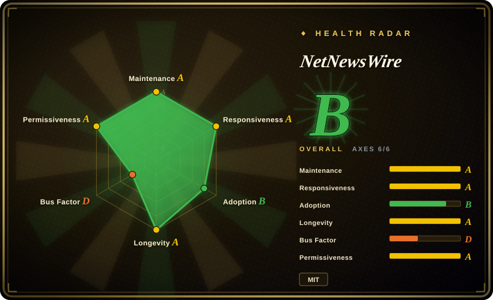
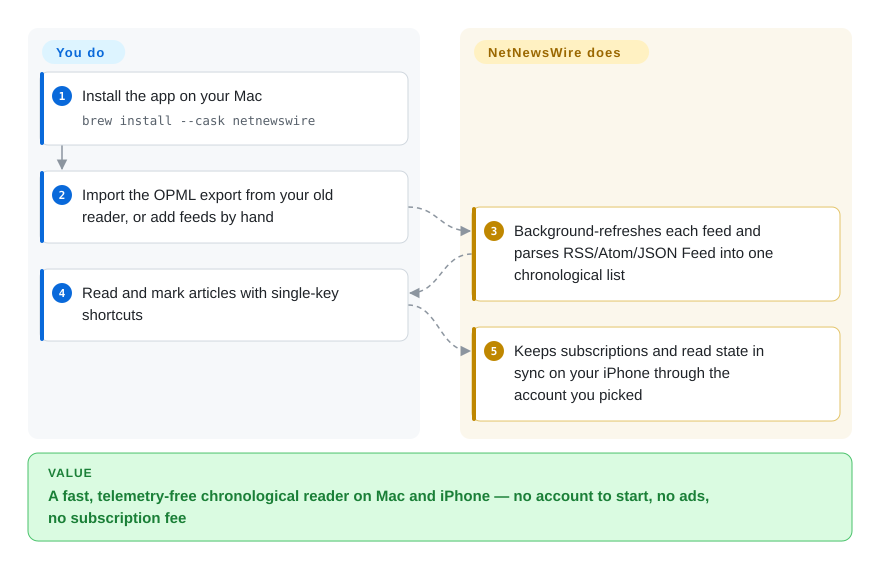

# NetNewsWire

A free, open-source, native RSS/Atom feed reader for macOS and iOS — fast, no telemetry, and built by the developer who originally created the category-defining Mac feed reader.

## When to use

You're a Mac and iPhone user who reads a lot — newsletters you'd rather not get in email, a dozen tech blogs, a few news sites, some niche feeds — and you've watched the algorithmic timelines turn into noise. You want a *chronological*, you-own-the-list reading experience: subscribe to feeds, read them in order, mark as read, move on. You don't want a web app that ships your reading habits to an ad network, and you don't want a heavy Electron app that drains battery. You install NetNewsWire from the Mac App Store (or build it from source), point it at your OPML export from whatever reader you're leaving, and you have a native, AppKit/UIKit app that syncs across your Mac and iPhone and just shows you your feeds — no account required to start, no subscription, no ads.

You also reach for it when you already keep your subscriptions in a sync service — Feedly, Feedbin, iCloud, Inoreader, NewsBlur, or a self-hosted FreshRSS/Reader API endpoint — and you want a clean native client on top rather than that service's own web UI. NetNewsWire is the *reading client*, not the sync backend: you bring your account, it gives you a fast Apple-platform front end with keyboard shortcuts, a built-in reader view, and articles cached for offline reading.

## How it works

NetNewsWire is a native Mac/iOS app that keeps the whole reading loop on your own device. It downloads your feeds directly in the background (no intermediate service of its own), parses RSS, Atom, JSON Feed, and RSS-in-JSON into one chronological list, and stores the articles locally — which is where the speed, the offline reading, and the no-signup-needed start come from. What it deliberately does *not* do is host your feeds for you: to carry the same list and read/star state between your Mac and iPhone, you pick a sync account in the app — iCloud, or a Feedbin, Feedly, BazQux, Inoreader, NewsBlur, The Old Reader, or FreshRSS login — and the app syncs through that service instead of a server it runs itself. What stays yours: curating the subscription list (OPML import/export moves it in and out of other readers) and choosing whether to sync at all. One footnote for builders: a source build ships without the project's private API keys, so iCloud and Feedly accounts and the Reader View are disabled in that build (README, Building).

<!-- flow-steps:begin (generated from flows/netnewswire.json by tools/flow_card.py — do not edit) -->

Text version of the flow

1. **You**: Install the app on your Mac — `brew install --cask netnewswire`
2. **You**: Import the OPML export from your old reader, or add feeds by hand
3. **NetNewsWire**: Background-refreshes each feed and parses RSS/Atom/JSON Feed into one chronological list
4. **You**: Read and mark articles with single-key shortcuts
5. **NetNewsWire**: Keeps subscriptions and read state in sync on your iPhone through the account you picked

**Value**: A fast, telemetry-free chronological reader on Mac and iPhone — no account to start, no ads, no subscription fee

<!-- flow-steps:end -->

## When NOT to use

- **You're not on Apple platforms.** It is macOS + iOS/iPadOS only — there is no Windows, Linux, Android, or web build. If you need cross-platform, this is a hard no.
- **You want a self-hosted sync server.** NetNewsWire is a client; it syncs *through* services (iCloud, Feedbin, Feedly, etc.) but does not host your feeds for other devices/apps. For a server you run, that's FreshRSS / Miniflux / Tiny Tiny RSS territory.
- **You want a read-it-later / annotation / web-clipper suite.** It reads feeds; it is not Instapaper/Pocket/Readwise. There's no highlighting, tagging-as-knowledge-base, or full-text article archive workflow.
- **You depend on social / "smart" discovery feeds.** This is deliberately a plain chronological reader. No algorithmic recommendations, no built-in social graph.
- **You need a polished commercial support contract.** It's a volunteer/community open-source app with no paid tier (the project explicitly asks you not to send money); support is GitHub issues and the community forum, not an SLA.

## Comparison

| Alternative | In index | Our verdict | Tradeoff |
|---|---|---|---|
| Reeder | 未收录 | Choose Reeder when a polished paid Apple-platform reader is acceptable and closed source is not a blocker; choose NetNewsWire when free MIT code, auditability, and no monetization pressure matter more. | Polished commercial Apple-platform reader with broad sync support; closed-source and paid, where NetNewsWire is free/MIT and auditable. |
| [FreshRSS](freshrss.md) | ✅ | Choose FreshRSS when you need the self-hosted feed server and web UI; choose NetNewsWire as the native Apple client that can sit on top of that backend. | Self-hosted PHP feed *server* + web UI; you run it, it syncs to many clients (including NetNewsWire) — a backend, not a native client. |
| Miniflux | 未收录 | Choose Miniflux for a minimalist self-hosted Go backend and web reader; choose NetNewsWire when the value is a native macOS/iOS front end rather than operating a server. | Minimalist self-hosted Go feed reader (server + web); single-binary backend, no native Apple app of its own. |
| Feedly / Inoreader | 未收录 | Choose Feedly or Inoreader when hosted cross-platform discovery, rules, and service features matter; choose NetNewsWire when you want an Apple-native client over a simpler chronological feed list. | Hosted SaaS readers with discovery and rules; cross-platform and feature-rich but proprietary and data-hungry — NetNewsWire can act as a native client to some of these. |
| NewsBlur | 未收录 | Choose NewsBlur when you want a hosted/open-source service stack with training or intelligence features; choose NetNewsWire when local-first native reading is the core requirement. | Open-source hosted reader with training/intelligence features; a full service stack vs NetNewsWire's local-first native client. |

## Tech stack

- **Language:** Swift, targeting Apple's native UI frameworks (AppKit on macOS, UIKit on iOS/iPadOS). [推断]
- **Sync accounts:** the official site lists syncing via iCloud, Feedbin, Feedly, BazQux, Inoreader, NewsBlur, The Old Reader, and FreshRSS (netnewswire.com, 2026-09); generic Reader-API-compatible endpoints beyond FreshRSS are unverified here.
- **Feed formats:** RSS, Atom, JSON Feed, and RSS-in-JSON (README); OPML import/export for subscriptions (official site).
- **Build:** Xcode project; distributed via the Mac App Store and the iOS App Store (and a Homebrew cask), and buildable from source — but the source build disables iCloud/Feedly accounts and Reader View for lack of private API keys (README, Building).

## Dependencies

- **Runtime:** a Mac and/or iPhone/iPad; the official download page requires macOS 15 and newer, iOS 26 and newer (netnewswire.com, 2026-09); no server required for single-device use.
- **Optional sync backend:** an account with one of the supported services if you want cross-device sync (iCloud is the zero-extra-signup path on Apple platforms).
- **Build-time:** Xcode + the Swift toolchain to build from source; code-signing is overridden locally via `./setup.sh` or a `DeveloperSettings.xcconfig` file (README). Minimum Xcode/SDK versions are set by the repo and move forward over time. [未验证]

## Ops difficulty

**Low — it's an end-user app, not a service.** For a user, "ops" is installing from the App Store and (optionally) signing into a sync account. There is nothing to deploy or operate. The only burden is on the *contributor/builder* side: cloning, opening in Xcode, and matching the required Xcode/SDK version. If you self-host the *sync* layer (e.g. FreshRSS), that server's ops are separate and not part of NetNewsWire.

## Health & viability

- **Responsiveness**: Grade A — median first-response time 5.8 hours across 31 qualifying issues/PRs (scorer, 2026-09-28).
- **Maintenance (2026-09).** NetNewsWire 7.1.4 shipped for both Mac and iOS on 2026-09-20 (GitHub releases), with beta builds in between and the last push 2026-09-23 — clearly **active**, a steady patch cadence on the 7.1 line. Not archived.
- **Governance / bus factor.** Created and led by Brent Simmons (`brentsimmons`), who authored the original NetNewsWire decades ago; there is a real contributor list (vincode-io, Wevah, kielgillard, and others) beyond the lead, but the project's direction is strongly identified with one well-known developer — a moderate bus-factor consideration. [推断]
- **Age & Lindy verdict.** This repo dates to 2017-05 (~9 years), and the NetNewsWire *name/app* is far older than the repo — the official site carries "© 2002-2026 Brent Simmons" and a NetNewsWire History page — making it one of the longest-lived Mac feed readers, still actively shipping ⇒ **strong Lindy** signal. (Repo age understates true project age.)
- **Adoption.** ~10.4k stars, ~760 forks (GitHub API, 2026-09-28), a maintained Homebrew cask (v7.1.4), and endorsements from long-standing Apple bloggers quoted on the official site; MIT-licensed and free with no monetization pressure. [未验证：生产采用广度]
- **Risk flags.** Volunteer/community model (the README's support page literally says "don't send money") means no commercial SLA and roadmap pace depends on contributor time; Apple-only scope is a portability ceiling, not a health risk. No relicense history found. [推断]

## Caveats (unverified)

- [未验证] ~10.4k stars, 760 forks, 634 open issues as of 2026-09-28 (GitHub API) — star/issue counts are volatile and date-sensitive; treat as indicative.
- [未验证] The sync-service list (iCloud/Feedbin/Feedly/BazQux/Inoreader/NewsBlur/The Old Reader/FreshRSS) is from the official site as of 2026-09; support for generic Reader-API endpoints beyond FreshRSS, and per-service feature parity, changes release to release — verify the specific account type you need against the current app.
- [推断] AppKit/UIKit native implementation and Swift-only stack is inferred from the language metadata and the app's positioning as a "native" reader, not from a code audit.
- [未验证] The true first-release date of the original NetNewsWire (site footer "© 2002", repo `created_at` 2017-05) was not checked against release archives; the ~2002 origin is taken from the project's own site.
- [未验证] Minimum Xcode/SDK versions for building from source are governed by the repo and shift over time; the macOS 15 / iOS 26 download floors are from the official site (2026-09) and move with each major OS.
