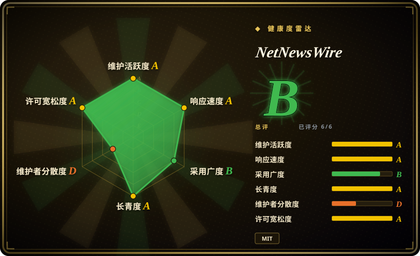
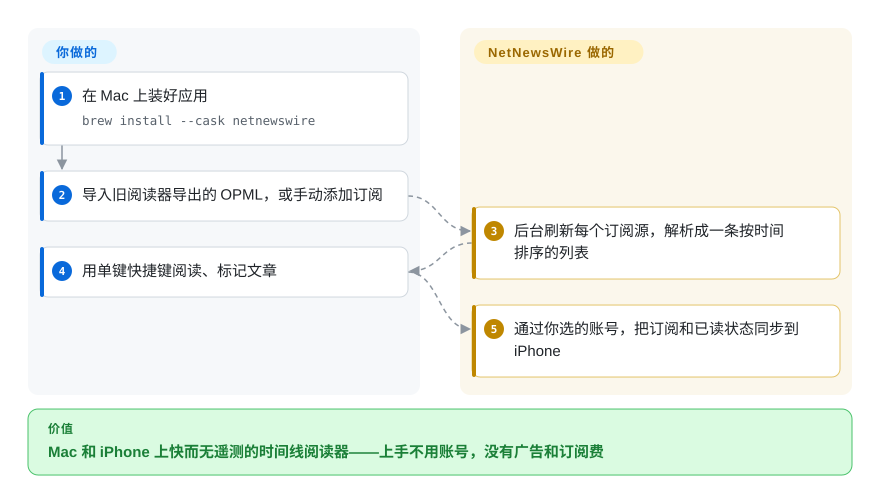

# NetNewsWire

一个免费、开源、原生的 macOS/iOS RSS/Atom 订阅阅读器——快、无遥测，作者正是当年开创 Mac 订阅阅读器品类的那位开发者。

## 何时使用

你是 Mac 加 iPhone 用户，读得很多——一堆你宁愿不收进邮箱的 newsletter、十来个技术博客、几个新闻站、一些小众订阅源——你眼看着算法时间线变成了噪音。你想要一种*按时间顺序、订阅列表归你所有*的阅读体验：订阅源、按序读、标已读、翻下一个。你不想用一个把阅读习惯卖给广告网络的 web 应用，也不想要一个耗电的 Electron 重壳。你从 Mac App Store 装上 NetNewsWire（或自己从源码构建），把你从旧阅读器导出的 OPML 喂进去，就得到一个原生的 AppKit/UIKit 应用，在 Mac 和 iPhone 之间同步，老老实实把订阅源摆给你看——开始用不需要账号，没有订阅费，没有广告。

当你已经把订阅放在某个同步服务里——Feedly、Feedbin、iCloud、Inoreader、NewsBlur，或自建的 FreshRSS / Reader API 端点——而你只想在上面套一个干净的原生客户端而非那个服务自带的 web UI 时，你也会选它。NetNewsWire 是*阅读客户端*，不是同步后端：你带来账号，它给你一个快速的 Apple 平台前端，带键盘快捷键、内置阅读视图，以及缓存好可离线读的文章。

## 怎么用起来

NetNewsWire 是个原生 Mac/iOS 应用，整个阅读闭环都留在你自己的设备上。它在后台直接从各站点下载订阅内容（不经过它自建的中间服务），把 RSS、Atom、JSON Feed、RSS-in-JSON 解析成一条按时间排序的列表，文章存到本地——快、可离线读、上手不用注册，根源都在这里。它刻意不做的事，是替你托管订阅：想让 Mac 和 iPhone 共享同一份列表和已读/加星状态，你得在应用里选一个同步账号——iCloud，或 Feedbin、Feedly、BazQux、Inoreader、NewsBlur、The Old Reader、FreshRSS 的账号——应用透过那个服务同步，而不是它自己的服务器。仍然归你管的：整理订阅列表（用 OPML 导入/导出和其他阅读器搬家），以及要不要开同步。给自编译者的一条脚注：源码构建的版本不含项目的私有 API key，所以那个构建里 iCloud、Feedly 账号和阅读视图是禁用的（README 的 Building 一节）。

<!-- flow-steps:begin (generated from flows/netnewswire.json by tools/flow_card.py — do not edit) -->

流程文字版

1. **你**：在 Mac 上装好应用 — `brew install --cask netnewswire`
2. **你**：导入旧阅读器导出的 OPML，或手动添加订阅
3. **NetNewsWire**：后台刷新每个订阅源，解析成一条按时间排序的列表
4. **你**：用单键快捷键阅读、标记文章
5. **NetNewsWire**：通过你选的账号，把订阅和已读状态同步到 iPhone

**价值**：Mac 和 iPhone 上快而无遥测的时间线阅读器——上手不用账号，没有广告和订阅费

<!-- flow-steps:end -->

## 何时不用

- **你不在 Apple 平台上。** 它只支持 macOS 加 iOS/iPadOS——没有 Windows、Linux、Android 或 web 版。需要跨平台的话，这是硬性不行。
- **你想要一个自建的同步服务器。** NetNewsWire 是客户端；它*透过*服务（iCloud、Feedbin、Feedly 等）同步，但不替其他设备/应用托管你的订阅源。要自己跑的服务器，那是 FreshRSS / Miniflux / Tiny Tiny RSS 的地盘。
- **你想要稍后读 / 标注 / 网页剪藏套件。** 它读订阅源，不是 Instapaper/Pocket/Readwise。没有高亮、知识库式打标签，也没有全文归档工作流。
- **你依赖社交 / “智能”发现流。** 这是刻意做成的朴素时间线阅读器。没有算法推荐，没有内置社交图谱。
- **你需要一份成熟的商业支持合同。** 它是志愿者/社区的开源应用，没有付费档（项目自己的支持页明说 don't send money）；支持靠 GitHub issue 和社区论坛，不是 SLA。

## 横向对比

| 替代品 | 是否收录 | 我们的评价 | 取舍 |
|---|---|---|---|
| Reeder | 未收录 | 当你接受打磨好的付费 Apple 平台阅读器且闭源不是问题时，选 Reeder；当免费 MIT 代码、可审计性和无变现压力更重要时，选 NetNewsWire。 | 打磨精良的商业 Apple 平台阅读器，同步支持广；闭源且收费，而 NetNewsWire 免费/MIT、可审计。 |
| [FreshRSS](freshrss.zh.md) | ✅ | 当你需要自建订阅服务器和 Web UI 时，选 FreshRSS；当你要的是跑在该后端之上的 Apple 原生客户端时，选 NetNewsWire。 | 自建的 PHP 订阅*服务器*加 web UI；你自己跑，它同步给很多客户端（含 NetNewsWire）——是后端，不是原生客户端。 |
| Miniflux | 未收录 | 当你要极简自建 Go 后端和 Web 阅读器时，选 Miniflux；当价值在 macOS/iOS 原生前端而不是运维服务器时，选 NetNewsWire。 | 极简的自建 Go 订阅阅读器（服务器加 web）；单二进制后端，本身没有原生 Apple 应用。 |
| Feedly / Inoreader | 未收录 | 当托管跨平台发现、规则和服务能力更重要时，选 Feedly 或 Inoreader；当你要 Apple 原生客户端和更朴素的时间线订阅列表时，选 NetNewsWire。 | 带发现和规则的托管 SaaS 阅读器；跨平台、功能多但专有且吃数据——NetNewsWire 可作为其中部分服务的原生客户端。 |
| NewsBlur | 未收录 | 当你要带训练或智能特性的托管/开源服务栈时，选 NewsBlur；当核心需求是本地优先的原生阅读体验时，选 NetNewsWire。 | 开源的托管阅读器，带训练/智能特性；是一整套服务栈，对比 NetNewsWire 的本地优先原生客户端。 |

## 技术栈

- **语言：** Swift，面向 Apple 原生 UI 框架（macOS 上 AppKit，iOS/iPadOS 上 UIKit）。[推断]
- **同步账号：** 官网列出的同步方式为 iCloud、Feedbin、Feedly、BazQux、Inoreader、NewsBlur、The Old Reader 和 FreshRSS（netnewswire.com，2026-09）；除 FreshRSS 外对通用 Reader API 端点的支持，本次未核实。
- **订阅格式：** RSS、Atom、JSON Feed、RSS-in-JSON（README）；订阅列表支持 OPML 导入/导出（官网）。
- **构建：** Xcode 工程；通过 Mac App Store、iOS App Store（以及 Homebrew cask）分发，也可从源码构建——但源码构建因缺少私有 API key 会禁用 iCloud/Feedly 账号和阅读视图（README 的 Building 一节）。

## 依赖

- **运行时：** 一台 Mac 和/或 iPhone/iPad；官方下载页要求 macOS 15 及以上、iOS 26 及以上（netnewswire.com，2026-09）；单设备使用不需要服务器。
- **可选同步后端：** 想跨设备同步的话，需要其中一个受支持服务的账号（在 Apple 平台上 iCloud 是零额外注册的路径）。
- **构建期：** 从源码构建需要 Xcode 加 Swift 工具链；代码签名可用 `./setup.sh` 或本地 `DeveloperSettings.xcconfig` 文件覆盖（README）。最低 Xcode/SDK 版本由仓库决定且随时间前移。[未验证]

## 运维难度

**低——它是终端用户应用，不是服务。** 对用户而言，“运维”就是从 App Store 安装并（可选）登录一个同步账号。没有任何东西要部署或运维。负担只在*贡献者/构建者*这一侧：clone、用 Xcode 打开、对上所需的 Xcode/SDK 版本。如果你自建*同步*层（如 FreshRSS），那个服务器的运维是另一回事，不属于 NetNewsWire。

## 健康度与可持续性

- **响应速度**：Grade A——中位首次响应时间 5.8 小时，基于 31 个 qualifying issues/PRs（评分器，2026-09-28）。
- **维护（2026-09）。** NetNewsWire 7.1.4 于 2026-09-20 同时发布 Mac 与 iOS 版（GitHub releases），期间有 beta 构建，最后一次 push 在 2026-09-23——明显的**活跃**状态，7.1 线上稳定的补丁节奏。未归档。
- **治理 / bus factor。** 由 Brent Simmons（`brentsimmons`）创建并主导，他几十年前就写过初代 NetNewsWire；除领衔者外有真实的贡献者列表（vincode-io、Wevah、kielgillard 等），但项目方向与这位知名开发者强绑定——是个中等程度的 bus-factor 考量。[推断]
- **年龄与 Lindy 判断。** 本仓库始于 2017-05（约 9 年），而 NetNewsWire 这个*名字/应用*远比仓库更老——官网页脚写着 © 2002-2026 Brent Simmons，还有专门的 NetNewsWire History 页面——它是寿命最长的 Mac 订阅阅读器之一，且仍在活跃发布⇒**强 Lindy** 信号。（仓库年龄低估了真实项目年龄。）
- **采用度。** 约 10.4k star、约 760 fork（GitHub API，2026-09-28），Homebrew cask 持续维护（v7.1.4），官网引用了多位老牌 Apple 博客作者的推荐；MIT 许可、免费、无变现压力。[未验证：生产采用广度]
- **风险标记。** 志愿者/社区模式（README 的支持页直说 don't send money）意味着没有商业 SLA，路线图节奏取决于贡献者时间；仅限 Apple 的范围是可移植性天花板，不是健康风险。未发现 relicense 历史。[推断]

## 存疑（未验证）

- [未验证] 截至 2026-09-28 约 10.4k star、760 fork、634 个 open issue（GitHub API）——star/issue 数易变且对时间敏感，仅供参考。
- [未验证] 同步服务列表（iCloud/Feedbin/Feedly/BazQux/Inoreader/NewsBlur/The Old Reader/FreshRSS）出自官网 2026-09 版本；除 FreshRSS 外对通用 Reader API 端点的支持、以及各服务的功能完整度随版本变动，依赖某个账号类型前请对照当前应用核实。
- [推断] AppKit/UIKit 原生实现与纯 Swift 栈是从语言元数据和它“原生”阅读器的定位推断的，并非代码审计结论。
- [未验证] 初代 NetNewsWire 的真实首发日期（官网页脚 © 2002、仓库 `created_at` 2017-05）未对照发布档案核实，约 2002 年的起源取自项目官网。
- [未验证] 从源码构建所需的最低 Xcode/SDK 版本由仓库决定且随时间变化；macOS 15 / iOS 26 的下载门槛出自官网（2026-09），会随大版本前移。
