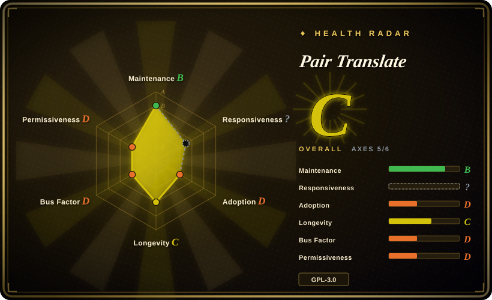
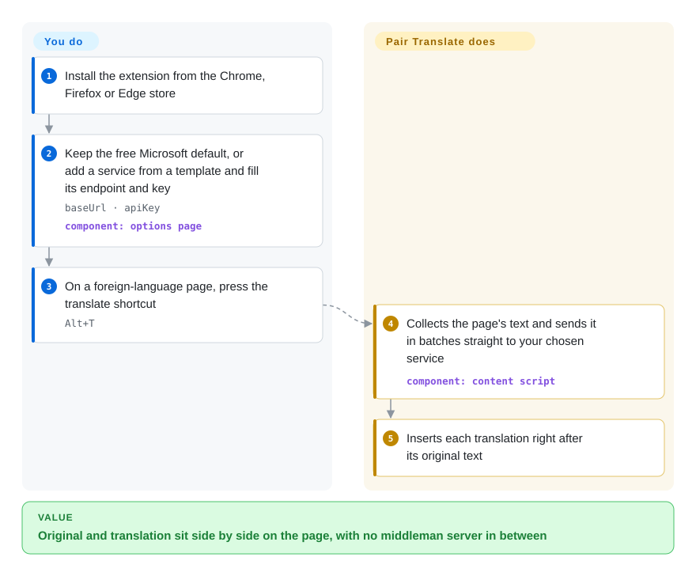

# Pair Translate

A full-page translator either swaps out the original text, so you can no longer check what the author actually wrote, or routes your reading through a vendor account. Pair Translate inserts the translation right after each original paragraph and sends the text straight from your browser to whichever service you configure — the free Microsoft default, DeepL, or your own LLM, including a local Ollama or LM Studio.

## When to use

You're reading an English RFC or a Japanese blog post, and the browser's built-in translate turns `idempotent` into a word you can't map back, with the original gone from the screen. You want a smaller bilingual extension: translate page text in place, keep original and translated text together, use selection/word translation, and configure either traditional providers (Microsoft, Google, DeepL/DeepLX, browser translation) or LLM providers (OpenAI-style, Anthropic, Gemini). You want direct browser-to-provider requests rather than a central SaaS account, and you are comfortable entering API keys or base URLs in extension settings. It can also translate what you type into an input box before you send it.

Choose Pair Translate when Read Frog and FluentRead feel too heavy, but Margin Read is too early or too Chrome-centric. It is a middle candidate: active releases, Chrome/Firefox assets, Edge store link, verified LLM templates including LM Studio and Ollama, and a smaller feature surface. The tradeoff is GPL-3.0, a young single-maintainer repo, and browser-side API-key/provider calls.

## How it works

Pair Translate is a browser extension, so all the work happens inside your browser tab: **it finds the page's text, batches it, sends it to a translation service and writes the result back into the page** — you only pick the service and press a shortcut. Out of the box it uses Microsoft's translator with no key; to use an LLM you add a "service" from a template (OpenAI, Anthropic, Gemini, Ollama, LM Studio and others) and fill in its base URL — the address of the model's API — and an API key. Requests go directly from the browser to that service; there is no Pair Translate server in between, which is also why your key lives in the extension. A built-in queue caps how many requests run at once and how many tokens (the chunks of text LLM providers bill by) go out per minute, and caches recent results so re-reading a page costs nothing. Besides whole-page translation, you can hold Ctrl/Option and drag over a paragraph to translate just that paragraph in place.

<!-- flow-steps:begin (generated from flows/pair-translate.json by tools/flow_card.py — do not edit) -->

Text version of the flow

1. **You**: Install the extension from the Chrome, Firefox or Edge store
2. **You**: Keep the free Microsoft default, or add a service from a template and fill its endpoint and key — `baseUrl · apiKey` — component: `options page`
3. **You**: On a foreign-language page, press the translate shortcut — `Alt+T`
4. **Pair Translate**: Collects the page's text and sends it in batches straight to your chosen service — component: `content script`
5. **Pair Translate**: Inserts each translation right after its original text

**Value**: Original and translation sit side by side on the page, with no middleman server in between

<!-- flow-steps:end -->

## When NOT to use

- **You need permissive-license reuse.** Use [Margin Read](margin-read.md); Pair Translate is GPL-3.0.
- **You need the most mature immersive-translation feature set.** Use [Read Frog](read-frog.md) or [FluentRead](fluentread.md); Pair Translate is lighter and does not try to match every Immersive Translate workflow.
- **You need language-learning extras such as TTS and YouTube subtitles.** Use [Read Frog](read-frog.md); Pair Translate's verified scope is page/selection/word translation plus provider templates.
- **You need a privacy threat model written as explicitly as Margin Read's.** Use [Margin Read](margin-read.md); Pair Translate claims no data collection and direct provider requests, but the claim was not independently audited end-to-end.
- **You cannot expose API keys to browser-side SDKs.** Use a server-side gateway; Pair Translate's LLM clients use browser-side OpenAI/Anthropic SDKs with `dangerouslyAllowBrowser: true`.
- **You require proven long-term viability.** Use a more established option; Pair Translate was created in 2025 and public contributions are concentrated in one maintainer.

## Comparison

| Alternative | In index | Our verdict | Tradeoff |
|---|---|---|---|
| [Read Frog](read-frog.md) | ✅ | Choose Read Frog when language learning, TTS, subtitle translation, and a larger community justify more complexity; choose Pair Translate when a lighter bilingual translator with direct provider templates is enough. | Read Frog is richer and more adopted, but since 2026-09 bundles a proprietary layout package; Pair Translate is smaller, fully open and easier to reason about, but less feature-complete. |
| [FluentRead](fluentread.md) | ✅ | Choose FluentRead when you want a more full immersive-translation UX; choose Pair Translate when provider templates and lighter page/selection translation are the deciding features. | FluentRead is closer to the commercial immersive-translation workflow; Pair Translate is leaner with explicit LLM settings UI. |
| [Margin Read](margin-read.md) | ✅ | Choose Margin Read when MIT license and documented privacy/local endpoint boundaries are hard requirements; choose Pair Translate when Firefox/Edge links and a more active release stream matter more. | Margin Read is permissive and explicitly privacy-scoped but very early; Pair Translate is GPL and younger than FluentRead but has active v2 releases. |
| Immersive Translate official repo | 未收录 | Use the official project only as a product benchmark; choose Pair Translate when you require source code and direct provider requests. | Official repo is not the extension source; Pair Translate is auditable but smaller and less mature. |
| Browser built-in translation | 未收录 | Choose built-in translation when zero extension settings and no API-key handling matter; choose Pair Translate when you need bilingual layout and custom provider/model control. | Built-in translation is simpler and safer for casual use; Pair Translate provides model/provider control at the cost of extension trust and secret handling. |

## Tech stack

- **Extension framework:** WXT with SolidJS, Solid Router, Tailwind CSS 4, DaisyUI, and WXT i18n/auto-icons.
- **Translation services:** Microsoft, Google, DeepL, DeepLX, and browser built-in Translator/LanguageDetector where available.
- **LLM layer:** OpenAI, Anthropic SDK, Google GenAI, plus schema/UI support for `apiSpec`, `baseUrl`, `apiKey`, model, temperature, max tokens, thinking budget, and `extraBody`.
- **Provider templates:** OpenAI, Azure OpenAI, LM Studio, Ollama, OpenRouter, Cohere, Hugging Face Inference, AI21 Labs, Mistral, Stability AI, Replicate, Aleph Alpha, GLM, DeepSeek, and Other.
- **Tooling:** Bun, TypeScript, Biome, WXT build/zip scripts, and GitHub Actions lint/release workflows.

## Dependencies

- **Runtime:** Chrome, Firefox, Edge, or another compatible browser extension environment.
- **Provider credentials:** API keys for Google/DeepL/LLM providers, or provider-specific auth; Microsoft can use an Edge translator token path in the default service.
- **Local models:** LM Studio and Ollama templates are verified in defaults; endpoint compatibility still depends on the local server and model.
- **Build:** Bun, WXT, TypeScript, SolidJS, Tailwind/DaisyUI, and the package's build scripts.

## Ops difficulty

**Low for ordinary browser use, medium for provider governance.** End users install the extension and configure providers. Teams must treat it like any BYOK browser extension: decide which services may receive text, store/rotate API keys, verify local endpoint CORS and availability, and understand that provider billing/rate limits/outages affect page translation directly. The smaller surface helps, but it does not remove the browser-side secret and text-egress problem.

## Health & viability

- **Maintenance (2026-10).** Latest release is v2.6.0 on 2026-08-02 (prompt refactor, Hebrew target language, dependency bumps), with Chrome/Firefox/source assets; releases have come every 1–2 months since 2026-02, but there have been no default-branch commits since 2026-08-02, so the cadence is active but bursty.
- **Governance / bus factor.** User-owned repo; `Cookee24` has ~300 commits and every other human contributor has 1, so the project is effectively one person. `.github/SECURITY.md` exists, but bus factor is low.
- **Age & Lindy.** Created 2025-10-07, so it has just one year of history; activity is positive, but the Lindy prior gives little support yet.
- **Adoption.** ~486 stars and 37 forks (2026-10) are meaningful for a niche extension, but an order of magnitude below Read Frog; GitHub release assets have under 1,000 downloads in total, and store install counts were not checked.
- **Risk flags.** GPL-3.0, broad `<all_urls>` host access, browser-side LLM SDKs/API keys, provider text egress, and reliance on provider-specific endpoints are the main risks.

## Caveats (unverified)

- [未验证] Chrome/Firefox/Edge store publication status, approval state, and current store versions were not checked.
- [未验证] The README's “No data is collected” claim was not audited across all code paths and third-party SDK behavior.
- [未验证] API-key encryption/protection at rest was not verified; only settings schema/UI/client usage was checked.
- [未验证] All provider templates were not live-tested against current provider APIs.
- [未验证] GitHub `open_issues_count` includes issues plus PRs; exact non-PR issue count was not separately established.
- [推断] Bus factor risk comes from public contributor counts and User ownership; private collaboration outside GitHub was not verified.
- [推断] How it works: that `Alt+T` toggles whole-page translation, that text is sent in batches, and that results are cached come from the default settings (`keyboardShortcut`, queue `maxBatchSize` / `cacheSize`) and their locale strings, not from running the extension; on some browsers the shortcut must be set in the browser's own shortcut page.
