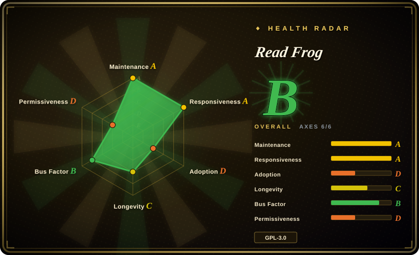
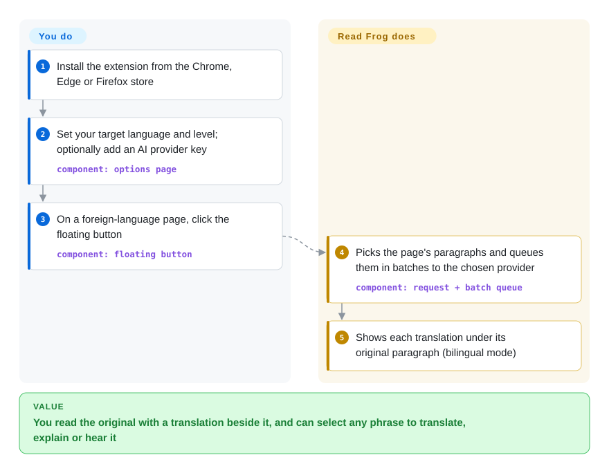

# Read Frog

You're learning a language by reading real articles and videos, but a translator either hides the original or just hands you a word with no explanation, and the words you looked up are gone by tomorrow. Read Frog puts the translation under each paragraph, lets you select any phrase to translate, explain at your level or hear it read aloud, and turns saved words into flashcards — using whichever AI provider you plug in.

## When to use

You're a bilingual reader or language learner who wants a browser extension that behaves like an open-source immersive translator, not just a popup dictionary. You read articles, documentation, and videos across languages, want the original text beside the translation when learning, and sometimes want translation-only output when speed matters. When you hit a phrase like *it's not my cup of tea*, a literal translation is useless; you want it explained at your level. You also want to bring your own provider account: OpenAI, DeepSeek, Claude, Gemini, Grok, Groq, Mistral, Ollama, or an OpenAI-compatible/custom endpoint, configured inside the extension rather than routed through a vendor quota system. It also has custom AI actions on the selection toolbar (your own prompt and output fields) and flashcards with spaced-repetition review.

Read Frog is the high-feature candidate in this set: choose it over Margin Read when you need Chrome/Edge/Firefox store distribution, bilingual page translation, selection explanation, YouTube subtitles, TTS, batching, and a larger community; choose it over [FluentRead](fluentread.md) when language-learning features (level-aware explanations, spaced-repetition flashcards) and custom AI actions matter more than FluentRead's wider reading surface (PDF/ePub, OCR, in-browser local models, no-key free endpoints) and account-free setup. The tradeoff is a younger, GPL/commercial-dual-licensed, broad-permission extension with more moving parts.

## How it works

Read Frog is a browser extension that does its work inside the page you are reading: **it finds the page's paragraphs, sends them to a translation provider and writes the translation underneath each one** — you choose the provider and click its floating button (or let it auto-translate sites you list). The default page translator is Microsoft Translate, which needs no key; for AI translation you add a provider such as OpenAI, DeepSeek, Claude, Gemini or a local Ollama and paste its API key. Paragraphs are grouped into batches (several paragraphs in one API call, so you pay less per page) and pushed through a rate-limited queue, the way a print shop collects pages into one job instead of printing each separately. Selecting text opens a toolbar that translates, explains the phrase for your chosen level, or reads it aloud with free Edge voices; custom AI actions and flashcards build on that toolbar, and the flashcard store (Notebase) is tied to a Read Frog account. With "context-aware" mode on, it also sends the page title and a Markdown summary of the page to the AI so terms are translated in context.

<!-- flow-steps:begin (generated from flows/read-frog.json by tools/flow_card.py — do not edit) -->

Text version of the flow

1. **You**: Install the extension from the Chrome, Edge or Firefox store
2. **You**: Set your target language and level; optionally add an AI provider key — component: `options page`
3. **You**: On a foreign-language page, click the floating button — component: `floating button`
4. **Read Frog**: Picks the page's paragraphs and queues them in batches to the chosen provider — component: `request + batch queue`
5. **Read Frog**: Shows each translation under its original paragraph (bilingual mode)

**Value**: You read the original with a translation beside it, and can select any phrase to translate, explain or hear it

<!-- flow-steps:end -->

## When NOT to use

- **You need permissive-license redistribution or closed-source embedding.** Use [Margin Read](margin-read.md) instead: Read Frog is GPL-3.0 with a commercial dual-license note, and contributions grant both GPLv3 and commercial-license rights to FEELIO TECHNOLOGIES LTD.
- **You need to fork and redistribute a fully free build.** Use [Pair Translate](pair-translate.md) (GPL-3.0, all dependencies public) or [Margin Read](margin-read.md) (MIT). Since 2026-09-28 Read Frog depends on `@read-frog/layout-engine`, an npm package whose LICENSE is proprietary to FEELIO ("All rights reserved"; may be distributed only as an unmodified part of Read Frog products) and whose source monorepo is not public; it renders custom-action results, so a fork must strip that feature or obtain permission.
- **You want a minimal, privacy-scoped translator that sends only selected segments by design.** Use [Margin Read](margin-read.md) instead; Read Frog's context-aware translation can provide page title and a Markdown version of page content to the configured AI provider, which is more powerful but a wider data surface.
- **You only need a lightweight bilingual overlay without language-learning extras.** Use [Pair Translate](pair-translate.md) if its simpler page/selection translation is enough. [FluentRead](fluentread.md) is not the lighter option: it has grown into a suite as large as Read Frog (documents, OCR, subtitles, TTS, in-browser local models).
- **You cannot tolerate broad extension permissions.** Use a browser's built-in translation/reader mode or a narrower selected-text tool; Read Frog's WXT manifest includes `*://*/*` host permissions plus `cookies`, `identity`, `scripting`, `tabs`, and `webNavigation`.
- **You need long Lindy history.** Use an older browser translation extension or a built-in browser translation feature; Read Frog is active and popular, but the repo was created in 2025, so long-term durability is still unproven.
- **You want no usage analytics by default.** Use [Margin Read](margin-read.md) or [Pair Translate](pair-translate.md); Read Frog ships `posthog-js`, and its source sets analytics **on by default for Chrome/Edge builds** and off by default on Firefox (where the manifest declares it as optional data collection). It also carries `better-auth` and Google sign-in for account features such as Notebase.

## Comparison

| Alternative | In index | Our verdict | Tradeoff |
|---|---|---|---|
| [FluentRead](fluentread.md) | ✅ | Choose FluentRead when you want no account system, free no-key endpoints, in-browser local models and document/OCR translation; choose Read Frog when language-learning features (level-aware explanations, spaced-repetition flashcards), custom AI actions and batched requests are decisive. | FluentRead is older (2023-12) and covers more of the reading surface, but one maintainer writes almost all of it; Read Frog (2025-04) has a broader contributor base, but ships default-on analytics in Chrome/Edge builds, an account-tied notebook and a proprietary layout dependency. |
| [Margin Read](margin-read.md) | ✅ | Choose Margin Read when BYOK, local OpenAI-compatible endpoints, privacy documentation, and MIT licensing are the hard constraints; choose Read Frog when you need a mature store-distributed feature set. | Margin Read is transparent and permissively licensed, but early Chrome/Chromium MVP; Read Frog is fuller-featured and cross-store but GPL/commercial dual licensed. |
| [Pair Translate](pair-translate.md) | ✅ | Choose Pair Translate when a lighter bilingual translator with many provider templates is enough; choose Read Frog when language-learning workflows and subtitle/TTS features matter. | Pair Translate has a smaller scope and simpler permissions; Read Frog brings more features and community but more complexity. |
| Immersive Translate official repo | 未收录 | Do not treat the official Immersive Translate repo as an open-source source-code candidate; use it only as a product benchmark because its README says the repository does not contain the extension source code. | Immersive Translate is the familiar product category, but the public repo is releases/issues rather than auditable source. |
| Browser built-in translation | 未收录 | Choose built-in browser translation when zero extension trust and no provider keys matter more than customization; choose Read Frog when you need BYOK AI providers and bilingual learning features. | Built-in translation has lower setup and trust cost, but lacks custom model endpoints, prompt/model control, and learning-oriented workflows. |

## Tech stack

- **Extension framework:** WXT Manifest V3 with React 19, React Router, Base UI/Radix-style components, Tailwind-related tooling, and Dexie for local browser data.
- **AI/provider layer:** Vercel `ai` SDK plus multiple `@ai-sdk/*` providers, `ai-sdk-ollama`, and OpenAI-compatible provider support.
- **Browser support:** Chrome Web Store, Microsoft Edge Add-ons, and Firefox Add-ons; build scripts include Chrome/Edge/Firefox targets.
- **Permissions:** storage, tabs, alarms, cookies, context menus, identity, scripting, webNavigation, and broad host permissions; non-Firefox builds also add offscreen and sidePanel.
- **Tooling:** pnpm, TypeScript, Vitest, oxlint/oxfmt, Nx, Changesets, Husky, and GitHub Actions release automation.
- **Proprietary component:** `@read-frog/layout-engine` (HTML + Liquid templates for custom-action results), distributed on npm under a FEELIO proprietary license; `@read-frog/api-contract` and `@read-frog/definitions` come from the same non-public monorepo.

## Dependencies

- **Runtime:** Chrome, Edge, Firefox, or a compatible extension-capable browser.
- **Provider credentials:** API keys or local endpoints for the configured AI/translation services; free non-key providers may be available but quality and rate limits vary.
- **Local models:** Ollama/custom endpoints are documented, but the exact setup depends on provider CORS, endpoint compatibility, and model availability.
- **Build:** Node ^26.10 per `devEngines` (pnpm downloads it if missing), pnpm 12.6 via `packageManager`, the WXT/TypeScript toolchain, and the `@read-frog/*` packages from npm.
- **Account (optional):** Notebase/flashcard features connect to a Read Frog account; page and selection translation do not need one.

## Ops difficulty

**Low for use, medium for trusted deployment.** Installing from a store and adding provider keys is straightforward. The operational burden rises when you self-build, pin versions, audit telemetry/auth paths, run local model endpoints, or govern which pages may be translated. Because configured providers can receive selected/page context, the real ops/security work is policy: which provider endpoints are allowed, how API keys are stored, and whether sensitive sites should be excluded.

## Health & viability

- **Maintenance (2026-10).** v1.38.0 (2026-07-07) to v1.50.2 (2026-10-07) is twelve minor releases in three months, with commits in every one of the last 13 weeks; maintenance signal is strong.
- **Governance / bus factor.** The repo is User-owned, but the contributor list shows several heavy human committers (`mengxi-ream` ~400, `ananaBMaster` ~300, `taiiiyang` ~120 commits); re-scored on 2026-10-08 the governance axis is B: 56 active maintainers in the last 12 months, but the top contributor holds 40.1% and the top three 84.8% of commits, so it is concentrated in a core trio. Commercial dual licensing, FEELIO contribution terms and a proprietary layout package mean roadmap and licensing control sit with one company.
- **Age & Lindy.** Created 2025-04, so the project is young despite rapid adoption; high stars are a positive adoption signal, not a long-term durability proof.
- **Adoption.** ~10.0k stars, ~750 forks (2026-10), and Chrome/Edge/Firefox distribution point to meaningful user interest; store user counts were not verified.
- **Risk flags.** GPL-3.0 plus commercial dual licensing, a proprietary closed-source dependency added in 2026-09 (a move toward open-core worth watching), broad browser permissions, provider-side text egress, and default-on analytics on Chrome/Edge are the main selection risks.

## Caveats (unverified)

- [未验证] Store listing status, store user counts, and exact store versions were not verified beyond README links and GitHub release assets.
- [未验证] Analytics default (on for non-Firefox, off for Firefox) was read from `src/utils/constants/analytics.ts`; the event payloads actually sent and where the opt-out toggle sits in the UI were not audited.
- [推断] That a fork cannot redistribute builds containing `@read-frog/layout-engine` is a reading of its LICENSE text, not legal advice; how GPL-3.0 interacts with this proprietary dependency was not assessed.
- [推断] Notebase being a hosted, account-bound store is inferred from the account-connection code and the Google OAuth client ID in `SOURCE_CODE_REVIEW.md`; the backend itself was not inspected.
- [未验证] API-key storage protections and encryption-at-rest behavior were not audited.
- [未验证] Every listed provider and custom endpoint was not runtime-tested; provider breadth is based on README, manifests, and dependency/source signals.
- [推断] The broad-permission risk is inferred from the WXT manifest and normal extension threat modeling; concrete risk depends on which pages and providers the user configures.
