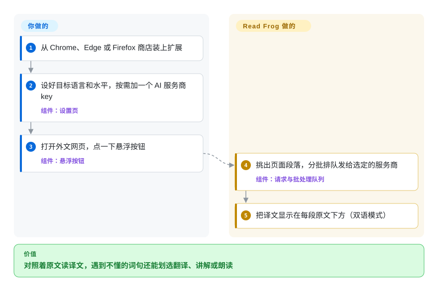

# Read Frog

你想靠读真实的文章、看真实的视频学外语，可翻译工具要么把原文藏起来，要么只丢给你一个词义不讲为什么，查过的生词第二天就忘了。Read Frog 把译文放在每段原文下面，划选任意词句就能翻译、按你的水平讲解或朗读，还能把存下的生词做成复习卡片——背后用的是你自己接入的 AI 服务商。

## 何时使用

你是双语读者或语言学习者，想要的不是弹窗词典，而是像开源沉浸式翻译一样工作的浏览器扩展。你读文章、文档和视频时，希望学习场景下原文和译文并排，赶进度时又能只看译文。碰到 *it's not my cup of tea* 这种句子，直译毫无用处，你要的是按你的水平讲清楚。你还想带自己的服务商账号：OpenAI、DeepSeek、Claude、Gemini、Grok、Groq、Mistral、Ollama，或 OpenAI-compatible／自定义端点，都在扩展内配置，而不是走某个厂商内置额度。它还有划词工具栏上的自定义 AI 动作（自己写 prompt 和输出字段），以及带间隔重复复习的生词卡片。

在这组项目里，Read Frog 是高功能候选：当你需要 Chrome／Edge／Firefox 商店分发、双语网页翻译、划词解释、YouTube 字幕、TTS、批量请求和更大的社区时，选它而不是 Margin Read；当语言学习功能和更广的 AI provider 接线比更简洁的沉浸式翻译体验更重要时，选它而不是 FluentRead。代价是它更年轻、采用 GPL／商业双授权、权限面更宽，部件也更多。

## 怎么用起来

Read Frog 是浏览器扩展，活都在你正在读的页面里干：**它找出页面段落、发给翻译服务，再把译文写在每段下面**——你只负责选服务商、点悬浮按钮（或者让它在你列出的网站上自动翻译）。默认的整页翻译用微软翻译，不需要 key；要用 AI 翻译，就加一个 OpenAI、DeepSeek、Claude、Gemini 或本机 Ollama 之类的服务商，填上 API key。段落会被打包成批（一次 API 调用带好几段，每页花得更少），再经过一个限速队列发出去，就像打印店把多页攒成一个任务，而不是一页一页单独打。划选文字会弹出工具栏，可以翻译、按你设定的水平讲解，或用免费的 Edge 语音朗读；自定义 AI 动作和生词卡片都建在这个工具栏上，卡片库（Notebase）绑定 Read Frog 账号。打开“上下文感知”模式后，它还会把页面标题和页面内容的 Markdown 摘要一起发给 AI，让术语按上下文翻译。

<!-- flow-steps:begin (generated from flows/read-frog.json by tools/flow_card.py — do not edit) -->

流程文字版

1. **你**：从 Chrome、Edge 或 Firefox 商店装上扩展
2. **你**：设好目标语言和水平，按需加一个 AI 服务商 key — 组件：`设置页`
3. **你**：打开外文网页，点一下悬浮按钮 — 组件：`悬浮按钮`
4. **Read Frog**：挑出页面段落，分批排队发给选定的服务商 — 组件：`请求与批处理队列`
5. **Read Frog**：把译文显示在每段原文下方（双语模式）

**价值**：对照着原文读译文，遇到不懂的词句还能划选翻译、讲解或朗读

<!-- flow-steps:end -->

## 何时不用

- **你需要宽松许可的再分发或闭源嵌入。** 改用 [Margin Read](margin-read.zh.md)：Read Frog 是 GPL-3.0，并带商业双授权说明，贡献条款还要求把 GPLv3 与商业许可权授予 FEELIO TECHNOLOGIES LTD。
- **你要 fork 并再分发一个完全自由的构建。** 改用 [Pair Translate](pair-translate.zh.md)（GPL-3.0，依赖全部公开）或 [Margin Read](margin-read.zh.md)（MIT）。2026-09-28 起 Read Frog 依赖 npm 包 `@read-frog/layout-engine`，它的 LICENSE 写明归 FEELIO 所有（“All rights reserved”，只允许作为 Read Frog 产品的未修改部分分发），源码所在的 monorepo 也不公开；它负责渲染自定义 AI 动作的结果，fork 要么去掉这项功能，要么拿到授权。
- **你想要默认只发送所选片段、隐私边界更窄的翻译器。** 改用 [Margin Read](margin-read.zh.md)；Read Frog 的上下文感知翻译可把页面标题和 Markdown 化页面内容提供给已配置的 AI provider，能力更强但数据面更宽。
- **你只需要轻量双语覆盖层，不需要语言学习附加功能。** 如果简单网页／划词翻译足够，选 [Pair Translate](pair-translate.zh.md)；如果想要中文生态更友好的沉浸式翻译器，选 [FluentRead](fluentread.zh.md)。
- **你不能接受宽泛扩展权限。** 改用浏览器内置翻译／阅读模式，或更窄的划词工具；Read Frog 的 WXT manifest 包含 `*://*/*` host permissions，以及 `cookies`、`identity`、`scripting`、`tabs`、`webNavigation` 等权限。
- **你需要很长的 Lindy 历史。** 改用更老的浏览器翻译扩展或浏览器内置翻译；Read Frog 活跃且受欢迎，但仓库创建于 2025 年，长期耐久性还没有被时间证明。
- **你不想默认就上报使用数据。** 改用 [Margin Read](margin-read.zh.md) 或 [Pair Translate](pair-translate.zh.md)；Read Frog 带 `posthog-js`，源码里 **Chrome／Edge 构建默认开启统计**，Firefox 默认关闭（manifest 把它声明为可选数据收集）。它还带 `better-auth` 和 Google 登录，用于 Notebase 等账号功能。

## 横向对比

| 替代品 | 是否收录 | 我们的评价 | 取舍 |
|---|---|---|---|
| [FluentRead](fluentread.zh.md) | ✅ | 当你想要更聚焦、支持许多翻译引擎的开源沉浸式翻译扩展时，选 FluentRead；当语言学习、TTS、YouTube 字幕、批量请求和 provider 广度是决定因素时，选 Read Frog。 | FluentRead 更简洁且历史更长；Read Frog 功能更丰富、更新更活跃，但更年轻，权限和 provider 面也更宽。 |
| [Margin Read](margin-read.zh.md) | ✅ | 当 BYOK、本地 OpenAI-compatible 端点、隐私文档和 MIT 许可是硬约束时，选 Margin Read；当你需要更成熟的商店分发功能集时，选 Read Frog。 | Margin Read 透明且宽松许可，但仍是早期 Chrome／Chromium MVP；Read Frog 功能更完整且跨商店，但 GPL／商业双授权。 |
| [Pair Translate](pair-translate.zh.md) | ✅ | 当较轻量的双语翻译器和许多 provider 模板已经足够时，选 Pair Translate；当语言学习流程和字幕／TTS 更重要时，选 Read Frog。 | Pair Translate 范围更小、权限更简单；Read Frog 带来更多功能和社区，也带来更多复杂度。 |
| Immersive Translate 官方仓库 | 未收录 | 不要把官方 Immersive Translate 仓库当作开源源码候选；它只适合作为产品标杆，因为 README 说明该仓库不包含扩展源码。 | Immersive Translate 是熟悉的产品类别，但公开仓库更像 releases／issues，而不是可审计源码。 |
| 浏览器内置翻译 | 未收录 | 当零扩展信任成本和无需 provider key 更重要时，选浏览器内置翻译；当你需要 BYOK AI provider 和双语学习功能时，选 Read Frog。 | 内置翻译设置和信任成本更低，但缺少自定义模型端点、prompt／model 控制和面向学习的工作流。 |

## 技术栈

- **扩展框架：** WXT Manifest V3，配 React 19、React Router、Base UI／Radix 风格组件、Tailwind 相关工具，以及用 Dexie 存本地浏览器数据。
- **AI／provider 层：** Vercel `ai` SDK，加多个 `@ai-sdk/*` provider、`ai-sdk-ollama` 和 OpenAI-compatible provider 支持。
- **浏览器支持：** Chrome Web Store、Microsoft Edge Add-ons 和 Firefox Add-ons；构建脚本包含 Chrome／Edge／Firefox 目标。
- **权限：** storage、tabs、alarms、cookies、context menus、identity、scripting、webNavigation 和宽泛 host permissions；非 Firefox 构建还添加 offscreen 与 sidePanel。
- **工具链：** pnpm、TypeScript、Vitest、oxlint／oxfmt、Nx、Changesets、Husky 和 GitHub Actions release automation。
- **专有组件：** `@read-frog/layout-engine`（用 HTML + Liquid 模板渲染自定义动作结果），以 FEELIO 专有许可发布在 npm；`@read-frog/api-contract` 和 `@read-frog/definitions` 来自同一个不公开的 monorepo。

## 依赖

- **运行时：** Chrome、Edge、Firefox，或兼容的支持扩展浏览器。
- **服务商凭据：** 给已配置 AI／翻译服务使用的 API key 或本地端点；可能有无需 key 的免费 provider，但质量和 rate limit 各异。
- **本地模型：** 文档写到 Ollama／custom endpoints，但具体配置取决于 provider CORS、端点兼容性和模型可用性。
- **构建：** `devEngines` 要求 Node ^26.10（缺的话 pnpm 会自动下载），`packageManager` 锁定 pnpm 12.6，再加 WXT／TypeScript 工具链和 npm 上的 `@read-frog/*` 包。
- **账号（可选）：** Notebase／生词卡片功能要连 Read Frog 账号；整页翻译和划词翻译不需要。

## 运维难度

**使用低，可信部署中等。** 从商店安装并填入 provider key 很直接。真正的负担出现在自构建、锁版本、审计 telemetry／auth 路径、运行本地模型端点，或管控哪些页面允许翻译时。因为已配置 provider 可能收到所选文本或页面上下文，真正的运维／安全工作是策略：允许哪些 provider endpoint，API key 如何保存，以及敏感站点是否应排除。

## 健康度与可持续性

- **维护（2026-10）。** 从 v1.38.0（2026-07-07）到 v1.50.2（2026-10-07），三个月发了 12 个小版本，最近 13 周每周都有提交；维护信号强。
- **治理与 bus factor。** 仓库由 User 拥有，但贡献者列表里有几位提交量很大的真人（`mengxi-ream` 约 400、`ananaBMaster` 约 300、`taiiiyang` 约 120 次）；2026-10-08 重新评分后治理轴为 B：过去 12 个月有 56 名活跃维护者，但第一名占提交的 40.1%、前三名合计 84.8%，实际集中在三个人身上。商业双授权、FEELIO 贡献条款和专有排版包，意味着路线图和授权控制都在一家公司手里。
- **年龄与 Lindy。** 创建于 2025-04，所以尽管采用增长快，项目仍年轻；高 star 是正向采用信号，不是长期耐久性的证明。
- **采用度。** 约 10.0k star、约 750 fork（2026-10），以及 Chrome／Edge／Firefox 分发，表明有明显用户兴趣；商店用户数未核验。
- **风险标记。** GPL-3.0 加商业双授权、2026-09 新增的闭源专有依赖（值得盯住的 open-core 苗头）、宽泛浏览器权限、provider 侧文本外发，以及 Chrome／Edge 默认开启的统计，是主要选型风险。

## 存疑（未验证）

- [未验证] 商店上架状态、商店用户数和精确商店版本没有核验，只核对了 README 链接和 GitHub release assets。
- [未验证] 统计默认值（非 Firefox 开、Firefox 关）读自 `src/utils/constants/analytics.ts`；实际上报的事件内容、关闭开关在界面哪里，没有审计。
- [推断] “fork 不能再分发含 `@read-frog/layout-engine` 的构建”是对其 LICENSE 文本的理解，不是法律意见；GPL-3.0 与这个专有依赖如何相处没有评估。
- [推断] Notebase 是托管的、绑定账号的存储，依据是账号连接代码和 `SOURCE_CODE_REVIEW.md` 里的 Google OAuth client ID；后端本身没有查看。
- [未验证] API key 的存储保护和静态加密行为没有审计。
- [未验证] 没有运行时测试每个列出的 provider 和 custom endpoint；provider 广度来自 README、manifest、依赖和源码信号。
- [推断] 宽权限风险来自 WXT manifest 和常规扩展 threat modeling；具体风险取决于用户配置了哪些页面和 provider。
