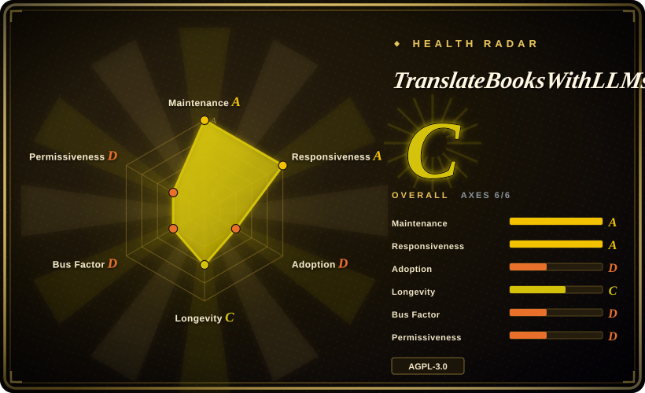
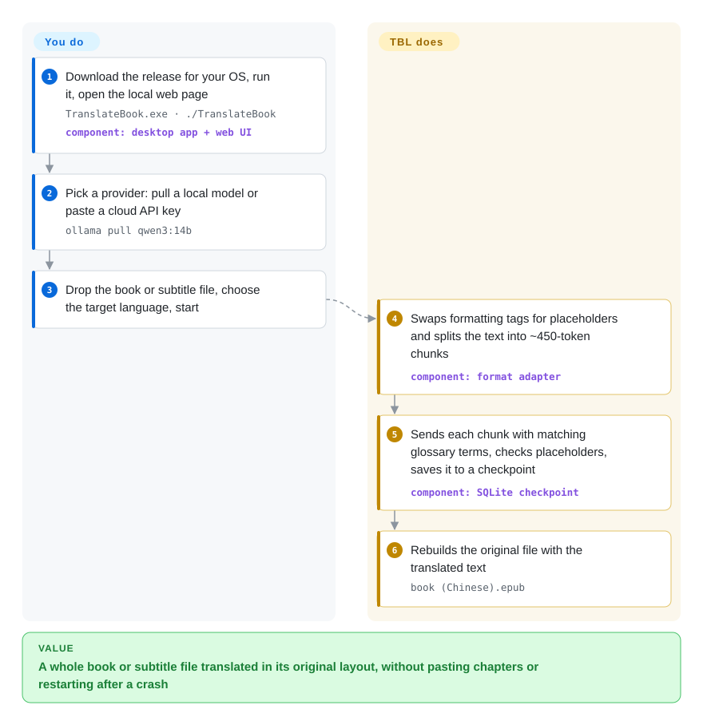

# TranslateBooksWithLLMs

You paste a novel into a chatbot chapter by chapter, and by chapter 12 the hero's name is spelled three different ways, the italics are gone, and a crash at chapter 30 means starting over. TBL takes the whole EPUB, DOCX, SRT or TXT file, cuts it into small pieces, sends each to a local or cloud model with your glossary attached, and stitches the translated pieces back into the same file layout — saving progress after every piece.

## When to use

You have a 600-page EPUB (or a season of `.srt` subtitles) in a language you don't read, a machine with Ollama and a 14B model on it, or a free-tier Gemini key, and you are not a developer. You want a double-click app, a browser tab at `localhost:5000`, a language dropdown, and an output file that opens in your e-reader with the chapters, styles and footnote links still working. What you have seen go wrong so far is concrete: a character called `Li Fanqing` in chapter 1 who becomes `Lee Fanqing` by chapter 12, and a 40-hour run that died at 80% with nothing saved.

TBL is the choice when **the file must come back structurally intact and in one target language, and the run must survive interruptions**. It swaps inline tags for placeholders before each chunk goes to the model and checks them after, keeps SRT timecodes, injects a per-book glossary only into the chunks where a term appears, and records every finished chunk in a local SQLite database so a restart resumes. Pick it over [Bilingual Book Maker](bilingual-book-maker.md) when you want a GUI, a glossary with character genders, and a single-language book rather than a side-by-side bilingual one from a scriptable CLI; pick it over [translate-book](../agent-skills/ai-writing/translation/translate-book.md) when there is no coding-agent harness involved and you want a standalone app that runs against Ollama or any API key.

## How it works

TBL is a local Flask web server with a browser front end (packaged as a Windows/macOS executable, a Docker image, or runnable from source), plus a `translate.py` CLI that drives the same engine. For each format a separate adapter pulls the text out: EPUB chapters are parsed as XHTML, and every run of tags such as `
<em>` is replaced by a short placeholder token the model is told to copy untouched — like masking tape over the window frames before you paint. The text is then cut into chunks of about 450 tokens (a token is roughly three-quarters of an English word), each chunk is sent to the provider you chose with your glossary lines and style instructions attached, and the answer is checked: placeholders that went missing or got mangled are repaired or the chunk is retried. Finished chunks go into a SQLite checkpoint, and at the end the adapter rebuilds the original container (EPUB, DOCX, SRT) around the translated text. You choose the file, languages, provider and model, and optionally prepare a glossary or style preset; TBL does the splitting, prompting, retrying, rate-limit pausing, checkpointing and reassembly.

<!-- flow-steps:begin (generated from flows/translate-books-with-llms.json by tools/flow_card.py — do not edit) -->

Text version of the flow

1. **You**: Download the release for your OS, run it, open the local web page — `TranslateBook.exe · ./TranslateBook` — component: `desktop app + web UI`
2. **You**: Pick a provider: pull a local model or paste a cloud API key — `ollama pull qwen3:14b`
3. **You**: Drop the book or subtitle file, choose the target language, start
4. **TranslateBooksWithLLMs**: Swaps formatting tags for placeholders and splits the text into ~450-token chunks — component: `format adapter`
5. **TranslateBooksWithLLMs**: Sends each chunk with matching glossary terms, checks placeholders, saves it to a checkpoint — component: `SQLite checkpoint`
6. **TranslateBooksWithLLMs**: Rebuilds the original file with the translated text — `book (Chinese).epub`

**Value**: A whole book or subtitle file translated in its original layout, without pasting chapters or restarting after a crash

<!-- flow-steps:end -->

## When NOT to use

- **Your source is a PDF.** TBL reads EPUB, DOCX, SRT and TXT only; PDF support is an open backlog item (`docs/BACKLOG.md` §5.1), and the maintainer's interim answer is to convert with pdf-craft first. For a paper whose formulas and columns must stay put, use [PDFMathTranslate](../pdf-tools/pdf-translation/pdfmathtranslate.md) instead.
- **You want to script it into a pipeline or install it as a package.** There is no PyPI package; the CLI runs from a cloned checkout with `requirements.txt`. For `pip install` + one command in cron/CI, use [Bilingual Book Maker](bilingual-book-maker.md) instead.
- **You already read ebooks in Calibre and want translation inside your library manager.** Use the Ebook Translator Calibre Plugin (not indexed) instead — it runs inside Calibre and writes back into your library, where TBL is a separate server whose output you re-import.
- **You want to put one instance on a network for several people.** One server is one shared workspace with no user accounts: everyone who reaches it sees every job, history and output file, and the API token that gates `/api/` is handed to whoever loads the page. Keep it on `localhost`; for a multi-user service put it behind your own authenticating reverse proxy, or give each user their own instance.
- **You need speed from a local model.** Ollama is forced to one chunk at a time, and on cloud providers `--parallel` above 1 drops the cross-chunk context that keeps the prose coherent. If throughput on a large backlog matters more than literary continuity, a batch pipeline such as [Bilingual Book Maker](bilingual-book-maker.md) against a cheap API is the plainer tool.
- **You would ship it inside a closed product or hosted service.** AGPL-3.0 obliges you to offer source to users of a network-accessible modified version. For a permissive base, start from [Bilingual Book Maker](bilingual-book-maker.md) (MIT).
- **Your job is subtitles only, with ASS/VTT styling.** TBL handles SRT; LLM-Subtrans (not indexed) covers SRT, SSA/ASS and VTT and is built around subtitle batching.

## Comparison

| Alternative | In index | Our verdict | Tradeoff |
|---|---|---|---|
| [Bilingual Book Maker](bilingual-book-maker.md) | ✅ | Choose Bilingual Book Maker for a pip-installable CLI that makes side-by-side bilingual EPUBs in unattended batches; choose TBL when a non-developer needs a GUI, a glossary with character genders, and a single-language book that keeps its formatting. | BBM is older (2023), MIT, packaged on PyPI, and reads PDF to txt; TBL adds placeholder-checked tag preservation, DOCX, glossary/style presets, TTS, and a desktop build, at the cost of AGPL and no package. |
| [translate-book](../agent-skills/ai-writing/translation/translate-book.md) | ✅ | Choose translate-book when you already work inside Claude Code or Codex and want the agent to orchestrate the translation; choose TBL when the translator must run on its own against Ollama or an API key. | translate-book rides your coding-agent session and needs Calibre + Pandoc; TBL is a standalone server/CLI with its own checkpoint store and ships an official skill of its own that just calls `translate.py`. |
| [PDFMathTranslate](../pdf-tools/pdf-translation/pdfmathtranslate.md) | ✅ | Choose PDFMathTranslate when the input is a PDF, especially one with formulas and multi-column layout; choose TBL when the input is an EPUB/DOCX/SRT/TXT. | PDFMathTranslate keeps PDF layout that TBL cannot read at all; TBL covers the reflowable formats and subtitle timing that a PDF tool does not. |
| Ebook Translator Calibre Plugin (`bookfere/Ebook-Translator-Calibre-Plugin`) | not indexed | Choose the plugin when your books already live in Calibre and you want translation as a library action; choose TBL when you want a standalone app with a glossary, resumable checkpoints and a local-model default. | The plugin (GPL-3.0) inherits Calibre's format conversions but ties you to Calibre; TBL needs no Calibre but is a separate server. Real repository, not added in this tab-intake batch. |
| LLM-Subtrans (`machinewrapped/llm-subtrans`) | not indexed | Choose LLM-Subtrans for subtitle-only work that needs SSA/ASS or VTT; choose TBL when subtitles are one job among books and documents. | LLM-Subtrans is built around subtitle formats and batching; TBL treats SRT as one adapter among four. Real repository, not added in this tab-intake batch. |

## Tech stack

- **Python** backend — Flask + Flask-SocketIO web server (`translation_api.py`), `translate.py` CLI, `launcher.py` for the packaged app
- **Vanilla JavaScript/HTML/CSS** front end with a 7-locale i18n layer
- **lxml** for EPUB XHTML, **mammoth** + **python-docx** for DOCX, **tiktoken** for token-based chunking
- **SQLite** for job checkpoints (`src/persistence/`)
- Provider adapters for Ollama, OpenAI-compatible endpoints, OpenRouter, Gemini, Mistral, DeepSeek, Poe, NVIDIA NIM; optional LiteLLM (CLI only)
- **edge-tts** for audio output; optional Chatterbox TTS (PyTorch, GPU)
- **PyInstaller** specs for Windows/macOS builds; Dockerfile + image on GHCR

## Dependencies

- **Packaged app:** nothing to install — download the zip, run `TranslateBook.exe` / `./TranslateBook`, open `http://localhost:5000`.
- **From source:** Python 3.8+ and `pip install -r requirements.txt`.
- **One model backend:** a local Ollama (or llama.cpp / LM Studio / vLLM behind an OpenAI-compatible endpoint), or an API key for a cloud provider. A local 14B model needs a GPU or a lot of patience.
- **Docker:** a volume for `data/` (the SQLite checkpoints) is required for resume to survive container restarts.
- Optional: CUDA GPU + PyTorch for Chatterbox TTS; network access to Microsoft's Edge TTS service for `--tts`.

## Ops difficulty

**Low** for one person on one machine: a double-clickable app, settings in a generated `TranslateBook_Data` folder or `.env`, and checkpoints that make crashes cheap. The ongoing work is choosing a model and context size: the chunk size and the Ollama context window (`OLLAMA_NUM_CTX`, `AUTO_ADJUST_CONTEXT`) have to fit together, and refinement passes have overflowed the context in practice (issue #282, fixed in v1.5.11). Rate limits on free tiers are handled by auto-pause and comma-separated key rotation. It becomes **medium** as soon as it is shared on a network, because authentication and isolation are then your job (see When NOT to use).

## Health & viability

- **Maintenance:** very active as of 2026-09-28 — 77 releases since v1.0.0 (2026-01-16), the latest v1.5.11 on 2026-09-24, several a month; bug reports get fix PRs within days (e.g. #282 → #283).
- **Governance / bus factor:** a single-maintainer project. `hydropix` has 781 of the 796 commits on `main`; the next contributor has 3. The roadmap, releases and the benchmark wiki all depend on one person; the only funding channel the README names is Ko-fi tips.
- **Backing & longevity (Lindy):** repository created 2025-05-22, so about 16 months old — young; the release cadence is strong, but there is no age-based evidence yet that it will outlast the maintainer's interest.
- **Adoption & ecosystem:** 2.4k stars and 320 forks; release-asset downloads are in the hundreds per release (v1.5.10: 732 Windows + 162 macOS), consistent with a real end-user base. A translation-quality benchmark with an LLM judge feeds a public wiki for picking models per language.
- **Risk flags:** AGPL-3.0. Security hardening is recent: until the per-session API token (issue #210) the local API had wildcard CORS and no auth, so any website you visited could drive it; API keys are now stripped from the checkpoint database (issue #213). Treat the web server as a single-user localhost tool.

## Caveats (unverified)

- [未验证] "Perfect preservation" of EPUB styling and structure is the README's claim; the placeholder-and-validator design was read in source (`tag_preservation.py`, `placeholder_validator.py`), but complex EPUBs (ruby, RTL, fixed layout) were not run here.
- [未验证] Translation quality per model/language comes from the project's own LLM-judged benchmark wiki; it is not an independent evaluation.
- [推断] The multi-user exposure described under When NOT to use follows from `src/api/auth.py` (the token is minted per process and embedded in the served page) plus the README's "no user accounts" statement; no network test was done.
- [未验证] Commit share for the maintainer (781 of 796) is from the GitHub commits and contributors APIs on 2026-09-28; squash-merged PRs from others may be attributed to the maintainer.
- [未验证] Throughput and wall-clock time per book depend on the model and hardware; the project publishes no time-per-book figures.
- [未验证] Edge TTS calls a Microsoft online service; its terms and availability for long audiobook generation were not checked.
