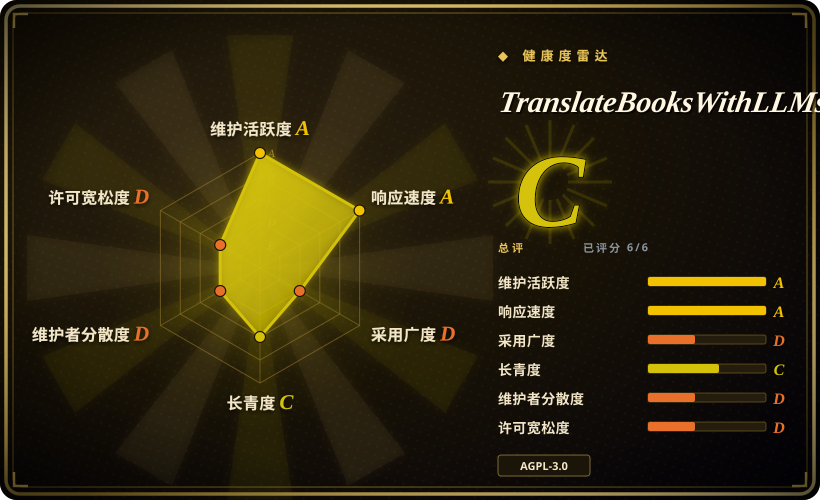
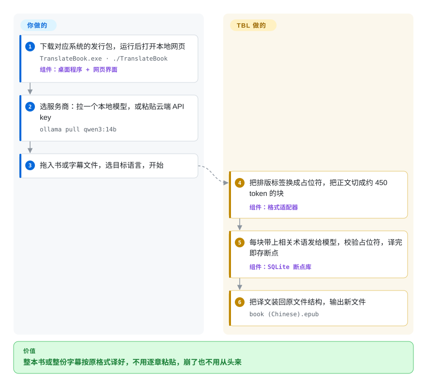

# TranslateBooksWithLLMs

你把一本小说一章一章贴进聊天框，到第 12 章主角名字已经有三种拼法，斜体全没了，第 30 章一崩又得从头来。TBL 直接吃下整个 EPUB、DOCX、SRT 或 TXT 文件，切成小块，连同你的术语表一起发给本地或云端模型，再把译好的小块按原文件结构拼回去——每译完一块就存一次进度。

## 何时使用

你手上有一本 600 页、看不懂语言的 EPUB（或一整季的 `.srt` 字幕），电脑上装了 Ollama 和一个 14B 模型，或者有一个免费档的 Gemini key，而且你不是开发者。你要的是双击就能开的程序、浏览器里一个 `localhost:5000` 页面、一个目标语言下拉框，以及一个能在阅读器里打开、章节、样式和脚注链接都还在的译本。你之前踩过的坑很具体：第 1 章叫 `Li Fanqing` 的人物，到第 12 章变成了 `Lee Fanqing`；一个跑了 40 小时的任务在 80% 处挂掉，什么都没留下。

当**文件必须结构完好地回来、只要单一目标语言、并且长任务要扛得住中断**时，选 TBL。它在每块文本发给模型前把行内标签换成占位符，回来后逐一校验；保留 SRT 时间轴；只在出现某个术语的那几块里注入整本书的术语表；每译完一块就记进本地 SQLite 数据库，重启后接着跑。和 [Bilingual Book Maker](bilingual-book-maker.zh.md) 比，你要的是图形界面、带人物性别的术语表和单语译本，而不是可脚本化命令行产出的左右对照双语书时，选 TBL；和 [translate-book](../agent-skills/ai-writing/translation/translate-book.zh.md) 比，你根本不用 coding agent、只想要一个能对着 Ollama 或任意 API key 独立运行的程序时，选 TBL。

## 怎么用起来

TBL 是一个本地 Flask 网页服务加浏览器前端（打包成 Windows／macOS 可执行文件、Docker 镜像，或从源码运行），另有一个驱动同一引擎的 `translate.py` 命令行。每种格式有独立的适配器负责抽取文本：EPUB 章节按 XHTML 解析，`
<em>` 这类连续标签被替换成一个短占位符，模型被要求原样照抄——就像刷墙前先用美纹纸把窗框贴起来。然后文本被切成约 450 个 token 的块（token 是模型计数文字的单位，一个英文词约合 1.3 个 token），每块带上你的术语表条目和文风指令发给你选的服务商；回来的结果要过校验：丢失或被改坏的占位符会被修复，修不好就重试这一块。译完的块写进 SQLite 断点，最后由适配器把译文装回原来的容器（EPUB、DOCX、SRT）。你负责选文件、语言、服务商和模型，可选地准备术语表或文风预设；切块、拼提示词、重试、遇限流暂停、存断点和重新组装都由 TBL 完成。

<!-- flow-steps:begin (generated from flows/translate-books-with-llms.json by tools/flow_card.py — do not edit) -->

流程文字版

1. **你**：下载对应系统的发行包，运行后打开本地网页 — `TranslateBook.exe · ./TranslateBook` — 组件：`桌面程序 + 网页界面`
2. **你**：选服务商：拉一个本地模型，或粘贴云端 API key — `ollama pull qwen3:14b`
3. **你**：拖入书或字幕文件，选目标语言，开始
4. **TranslateBooksWithLLMs**：把排版标签换成占位符，把正文切成约 450 token 的块 — 组件：`格式适配器`
5. **TranslateBooksWithLLMs**：每块带上相关术语发给模型，校验占位符，译完即存断点 — 组件：`SQLite 断点库`
6. **TranslateBooksWithLLMs**：把译文装回原文件结构，输出新文件 — `book (Chinese).epub`

**价值**：整本书或整份字幕按原格式译好，不用逐章粘贴，崩了也不用从头来

<!-- flow-steps:end -->

## 何时不用

- **源文件是 PDF。** TBL 只读 EPUB、DOCX、SRT、TXT；PDF 支持还在待办清单里（`docs/BACKLOG.md` 第 5.1 条），维护者给的临时方案是先用 pdf-craft 转换。要保住公式和分栏版式的论文，改用 [PDFMathTranslate](../pdf-tools/pdf-translation/pdfmathtranslate.zh.md)。
- **你想把它写进流水线或当成包安装。** 它没有 PyPI 包，命令行要从克隆下来的仓库里配 `requirements.txt` 运行。要 `pip install` 加一条命令进 cron／CI，改用 [Bilingual Book Maker](bilingual-book-maker.zh.md)。
- **你本来就在 Calibre 里管电子书，想在书库里直接翻译。** 改用 Ebook Translator Calibre Plugin（未收录）——它在 Calibre 内部运行、结果写回书库；TBL 是独立服务，产出还得再导回去。
- **你想把一个实例放到网络上给多人用。** 一个服务就是一个共享工作区，没有用户账号：能连上它的人都看得到所有任务、历史和输出文件，而保护 `/api/` 的令牌就发给每个打开页面的人。只在 `localhost` 上用；真要多人共享，自己在前面加带认证的反向代理，或者每人一个实例。
- **你要本地模型跑得快。** Ollama 被强制一次只处理一块；云端服务商把 `--parallel` 调到 1 以上时，会丢掉维持行文连贯的跨块上下文。如果大批量吞吐比文学连贯更重要，用 [Bilingual Book Maker](bilingual-book-maker.zh.md) 对着便宜 API 批跑更直接。
- **你要把它塞进闭源产品或托管服务。** AGPL-3.0 要求你向通过网络使用修改版的用户提供源码。要宽松许可的底座，从 [Bilingual Book Maker](bilingual-book-maker.zh.md)（MIT）起步。
- **你只做字幕，而且要 ASS／VTT 样式。** TBL 只处理 SRT；LLM-Subtrans（未收录）覆盖 SRT、SSA／ASS 和 VTT，并且围绕字幕分批设计。

## 横向对比

| 替代品 | 是否收录 | 我们的评价 | 取舍 |
|---|---|---|---|
| [Bilingual Book Maker](bilingual-book-maker.zh.md) | ✅ | 要一个能 pip 安装、无人值守批量产出左右对照双语 EPUB 的命令行，选 Bilingual Book Maker；要让非开发者用图形界面、带人物性别的术语表、产出保住格式的单语译本，选 TBL。 | BBM 更早（2023 年）、MIT、在 PyPI 上发包，还能把 PDF 读成 txt；TBL 多了带校验的占位符标签保留、DOCX、术语表／文风预设、TTS 和桌面打包，代价是 AGPL 且不发包。 |
| [translate-book](../agent-skills/ai-writing/translation/translate-book.zh.md) | ✅ | 你本来就在 Claude Code 或 Codex 里干活、想让 agent 编排整本书的翻译，选 translate-book；翻译器要自己对着 Ollama 或 API key 独立跑，选 TBL。 | translate-book 跑在你的 coding agent 会话里，需要 Calibre 和 Pandoc；TBL 是带自有断点库的独立服务／命令行，自带一个只负责调用 `translate.py` 的官方 skill。 |
| [PDFMathTranslate](../pdf-tools/pdf-translation/pdfmathtranslate.zh.md) | ✅ | 输入是 PDF，尤其带公式和多栏排版时，选 PDFMathTranslate；输入是 EPUB／DOCX／SRT／TXT 时，选 TBL。 | PDFMathTranslate 能保住 TBL 根本读不了的 PDF 版式；TBL 覆盖 PDF 工具不管的可重排格式和字幕时间轴。 |
| Ebook Translator Calibre Plugin（`bookfere/Ebook-Translator-Calibre-Plugin`） | 未收录 | 书已经在 Calibre 里、想把翻译当成书库里的一个操作，选这个插件；要独立程序、术语表、可续跑断点和默认本地模型，选 TBL。 | 插件（GPL-3.0）继承 Calibre 的格式转换能力，但把你绑在 Calibre 上；TBL 不需要 Calibre，但是一个单独的服务。真实仓库，本次标签页收录批次未添加。 |
| LLM-Subtrans（`machinewrapped/llm-subtrans`） | 未收录 | 只做字幕、需要 SSA／ASS 或 VTT 时，选 LLM-Subtrans；字幕只是书和文档之外的一类任务时，选 TBL。 | LLM-Subtrans 围绕字幕格式和分批设计；TBL 把 SRT 当作四个适配器之一。真实仓库，本次标签页收录批次未添加。 |

## 技术栈

- **Python** 后端——Flask + Flask-SocketIO 网页服务（`translation_api.py`）、`translate.py` 命令行、打包版入口 `launcher.py`
- **原生 JavaScript／HTML／CSS** 前端，带 7 种界面语言的 i18n 层
- **lxml** 处理 EPUB 的 XHTML，**mammoth** + **python-docx** 处理 DOCX，**tiktoken** 做按 token 切块
- **SQLite** 存任务断点（`src/persistence/`）
- 服务商适配器：Ollama、OpenAI 兼容端点、OpenRouter、Gemini、Mistral、DeepSeek、Poe、NVIDIA NIM；可选 LiteLLM（仅命令行）
- **edge-tts** 生成音频；可选 Chatterbox TTS（PyTorch，GPU）
- **PyInstaller** 打 Windows／macOS 包；Dockerfile 加 GHCR 镜像

## 依赖

- **打包版：** 什么都不用装——下载 zip，运行 `TranslateBook.exe`／`./TranslateBook`，打开 `http://localhost:5000`。
- **源码版：** Python 3.8+，`pip install -r requirements.txt`。
- **一个模型后端：** 本地 Ollama（或挂在 OpenAI 兼容端点后面的 llama.cpp／LM Studio／vLLM），或某个云服务商的 API key。本地 14B 模型需要 GPU，或者足够的耐心。
- **Docker：** 必须给 `data/`（SQLite 断点）挂卷，容器重启后才能续跑。
- 可选：CUDA GPU + PyTorch 跑 Chatterbox TTS；`--tts` 需要能访问微软 Edge TTS 在线服务。

## 运维难度

单人单机时**低**：双击即用，设置放在自动生成的 `TranslateBook_Data` 目录或 `.env` 里，断点让崩溃的代价很小。持续要操心的是选模型和上下文大小：切块大小和 Ollama 上下文窗口（`OLLAMA_NUM_CTX`、`AUTO_ADJUST_CONTEXT`）要配得上，润色轮次实际出现过上下文溢出（issue #282，已在 v1.5.11 修复）。免费档的限流由自动暂停和逗号分隔的多 key 轮换处理。一旦放到网络上共享就升为**中**，因为认证和隔离都成了你的事（见“何时不用”）。

## 健康度与可持续性

- **维护：** 截至 2026-09-28 非常活跃——自 v1.0.0（2026-01-16）起共 77 个 release，最新 v1.5.11 发布于 2026-09-24，每月好几个；bug 报告几天内就有修复 PR（如 #282 → #283）。
- **治理／巴士因子：** 单维护者项目。`main` 上 796 个提交里 `hydropix` 占 781 个，第二名只有 3 个。路线图、发版和基准测试 wiki 全靠一个人；README 里唯一提到的资金来源是 Ko-fi 打赏。
- **背书与寿命（Lindy）：** 仓库创建于 2025-05-22，约 16 个月——还年轻；发版节奏很强，但从年龄上还看不出它能否撑过维护者的兴趣期。
- **采用与生态：** 2.4k star、320 fork；每个 release 的安装包下载量在数百量级（v1.5.10：Windows 732 次、macOS 162 次），说明有真实的终端用户群。项目自带一个用 LLM 当评委的翻译质量基准，结果发布到公开 wiki，供按语言挑模型。
- **风险信号：** AGPL-3.0。安全加固是最近才做的：在引入每会话 API 令牌（issue #210）之前，本地 API 开着通配 CORS 且没有认证，你访问的任何网站都能驱动它；API key 现在也不再写进断点数据库（issue #213）。把这个网页服务当成单用户、仅本机的工具。

## 存疑（未验证）

- [未验证] EPUB 样式和结构“完美保留”是 README 的说法；占位符加校验器的设计在源码里读到了（`tag_preservation.py`、`placeholder_validator.py`），但复杂 EPUB（注音、从右到左、固定版式）没有实际跑过。
- [未验证] 各模型／语言的翻译质量来自项目自己用 LLM 评审的基准 wiki，不是独立评测。
- [推断] “何时不用”里的多人暴露问题，依据是 `src/api/auth.py`（令牌按进程生成并嵌进返回的页面）加上 README 的“没有用户账号”说明；没有做网络实测。
- [未验证] 维护者提交占比（796 中 781）来自 2026-09-28 的 GitHub commits 与 contributors API；别人的 squash 合并 PR 可能被记到维护者名下。
- [未验证] 每本书的吞吐和耗时取决于模型和硬件；项目没有公布每本书的耗时数据。
- [未验证] Edge TTS 调用的是微软在线服务；它对长篇有声书生成的条款和可用性没有核实。
