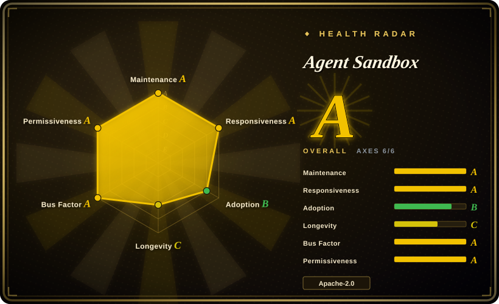
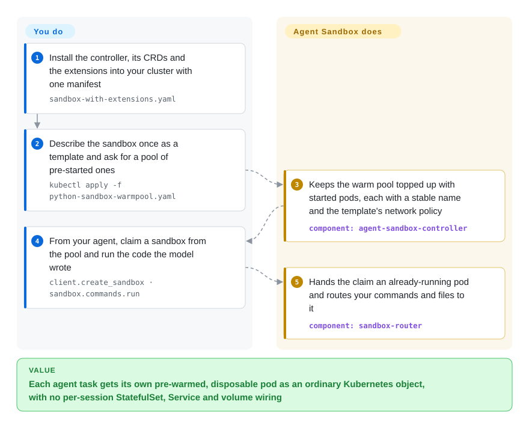

# Agent Sandbox

Every agent session needs its own throwaway machine to run model-written code, and on Kubernetes that means hand-wiring a one-replica StatefulSet, a Service and a volume per session, then waiting while a cold pod gets scheduled and pulls its image. Agent Sandbox turns that into one `Sandbox` object and, with a warm pool, hands your agent an already-started pod the moment it asks.

## When to use

You run the platform team behind an internal coding agent (or an RL/eval pipeline in the SWE-bench mould), and your company already lives on Kubernetes. Every task needs a fresh, network-isolated container that the model can `pip install` into and wreck, and your current glue — a Python script that creates a StatefulSet of size 1, a headless Service and a PVC, then polls until `kubectl get pod` says `Running` — leaks orphaned pods whenever the agent crashes and makes each task wait for scheduling plus an image pull. You install Agent Sandbox's controller, describe the sandbox once as a `SandboxTemplate` (image, resources, `runtimeClassName: gvisor`), keep a `SandboxWarmPool` of pre-started pods topped up, and from the agent call `client.create_sandbox(warmpool=...)`: the claim adopts a warm pod, you run commands and move files through the SDK, and `terminate()` hands the capacity back.

Pick it over a sandbox platform such as [OpenSandbox](opensandbox.md) or [E2B](e2b.md) when the deciding constraint is that **sandboxes must be ordinary Kubernetes objects** — governed by your RBAC, quotas, NetworkPolicies, node pools, GitOps and autoscalers, under a vendor-neutral Kubernetes SIG API — rather than a separate platform with its own server, protocol and credentials. The price is that it gives you an orchestrator, not a turnkey product: isolation strength, router authentication and most of the agent-facing conveniences are yours to configure.

## How it works

Agent Sandbox teaches your Kubernetes API a few new object types (CRDs — custom resource definitions, i.e. new `kind:`s you can `kubectl apply`) and runs a controller — a loop inside the cluster that keeps reality matching those objects. A `Sandbox` becomes exactly one pod with a stable hostname, an optional persistent volume that survives restarts, and lifecycle controls (scheduled deletion, scale to zero while keeping the volume). On top, the extensions add `SandboxTemplate` (the reusable recipe), `SandboxWarmPool` (N pods started ahead of time, like a taxi rank) and `SandboxClaim` (a request that takes the next pod off the rank instead of starting one). The isolation itself is **not** Agent Sandbox's: the pod runs under whatever RuntimeClass — the Kubernetes setting that picks the container runtime, such as gVisor or Kata Containers — you put in the template; leave it out and it is an ordinary container sharing the node's kernel. Traffic from the Python/Go SDKs goes through an optional `sandbox-router` reverse proxy that finds the right pod from an `X-Sandbox-ID` header, and a small runtime server inside the image (the example `python-runtime-sandbox`, or the newer `sandboxd`) is what actually executes commands and file operations. What you own: the cluster, the runtime class and its node setup, the images, the router's authentication and exposure, and the templates' network and resource policy.

<!-- flow-steps:begin (generated from flows/agent-sandbox.json by tools/flow_card.py — do not edit) -->

Text version of the flow

1. **You**: Install the controller, its CRDs and the extensions into your cluster with one manifest — `sandbox-with-extensions.yaml`
2. **You**: Describe the sandbox once as a template and ask for a pool of pre-started ones — `kubectl apply -f python-sandbox-warmpool.yaml`
3. **Agent Sandbox**: Keeps the warm pool topped up with started pods, each with a stable name and the template's network policy — component: `agent-sandbox-controller`
4. **You**: From your agent, claim a sandbox from the pool and run the code the model wrote — `client.create_sandbox · sandbox.commands.run`
5. **Agent Sandbox**: Hands the claim an already-running pod and routes your commands and files to it — component: `sandbox-router`

**Value**: Each agent task gets its own pre-warmed, disposable pod as an ordinary Kubernetes object, with no per-session StatefulSet, Service and volume wiring

<!-- flow-steps:end -->

## When NOT to use

- **You do not run Kubernetes and don't want to start.** Everything here is a CRD and a controller; there is no single-host or hosted mode. For sandboxes on one machine you own, use [Microsandbox](microsandbox.md); for "just give me an SDK" with nothing to operate, use [E2B](e2b.md) (hosted) or the [Modal client SDK](modal-client.md).
- **You expect the project to be the security boundary.** Its own threat model says it "does not implement isolation": a `Sandbox` without a `runtimeClassName` is a normal runc container on a shared kernel. If untrusted code is the point, install and validate [gVisor](gvisor.md) or [Kata Containers](kata-containers.md) on the nodes first and enforce it through `SandboxTemplate`. The hardened defaults (managed deny-by-default NetworkPolicy, no service-account token) apply only to template-provisioned sandboxes; a bare `Sandbox` needs your own admission policy.
- **You want a batteries-included agent sandbox API in many languages.** As of 2026-09 only the Python SDK is published; the Go SDK ships from the controller's root module with lifecycle gaps, the TypeScript SDK is unpublished, and maintainers themselves filed that the three "have diverged into three different products" (issue #1785). Per-sandbox credential injection and claim-time egress policies are still roadmap items. If you need a vault, per-sandbox egress and a code interpreter in five SDKs today, choose [OpenSandbox](opensandbox.md).
- **You need memory-state suspend/resume on any cluster.** Freezing a running process and restoring it is GKE-only (Autopilot with a gVisor node pool, via `podsnapshot.gke.io`) and Python-only; the portable path is scale-to-zero that keeps only the volume. If the real problem is packing many idle stateful agents onto fewer pods with resume, look at [Agent Substrate](substrate.md).
- **You would expose the router to untrusted callers as-is.** The router's default authorizer is `AllowAll` for Python-client compatibility, and the install guide's quick-start command disables router authentication. Turn on `--authz-mode=tokenreview` or put authentication in your Gateway before anything outside the cluster can reach it; otherwise anyone who reaches the router can reach any sandbox by name.
- **You only need one long-lived stateful pod.** A StatefulSet with one replica plus a Service is built into Kubernetes and adds no controller or CRDs to upgrade; Agent Sandbox earns its keep with many short-lived sandboxes, warm pools and claims.

## Comparison

| Alternative | In index | Our verdict | Tradeoff |
|---|---|---|---|
| [OpenSandbox](opensandbox.md) | ✅ | Choose OpenSandbox when you want a complete self-hosted agent-sandbox product (server, execd, credential vault, per-sandbox egress, code interpreter, five SDKs); choose Agent Sandbox when sandboxes must be native Kubernetes objects under a vendor-neutral SIG API. | OpenSandbox ships more agent-facing features on day one but is its own platform with its own protocol to run; Agent Sandbox is a thinner layer that reuses your cluster's RBAC, quotas and GitOps, leaving SDK polish and credential handling to you. |
| [E2B](e2b.md) | ✅ | Choose E2B when you want a working sandbox SDK in minutes and are fine with its hosted service or a Terraform self-host on AWS/GCP; choose Agent Sandbox when the sandboxes have to run in the Kubernetes cluster you already operate. | E2B trades control for time-to-first-sandbox and its own Firecracker-based stack; Agent Sandbox trades setup work for placement on your nodes, runtime classes and network policies. |
| [Agent Substrate](substrate.md) | ✅ | Choose Substrate when the cost problem is many long-lived, mostly idle stateful agents that must resume with memory intact on fewer warm pods; choose Agent Sandbox when you need a standard pod-per-sandbox API with warm pools and claims. | Substrate's increment is checkpoint-and-multiplex density (pre-1.0, no hardening yet); Agent Sandbox keeps one pod per sandbox and only snapshots memory on GKE, but it is a SIG-owned API at v1.0. |
| [Kata Containers](kata-containers.md) | ✅ | Choose Kata as the isolation layer underneath — a real guest kernel per pod through RuntimeClass; add Agent Sandbox on top when you also need sandbox lifecycle, warm pools and SDKs. | Not a substitute but the layer below: Kata makes a pod safe to hand to untrusted code, Agent Sandbox decides when that pod exists and who holds it. Using Agent Sandbox without Kata or gVisor leaves you on a shared kernel. |
| [Microsandbox](microsandbox.md) | ✅ | Choose Microsandbox when sandboxes should run on one host you own with no cluster at all; choose Agent Sandbox when they must be scheduled across a Kubernetes fleet. | Microsandbox gives microVM isolation from a single binary and needs hardware virtualization on that host; Agent Sandbox gives fleet scheduling and warm pools and needs a cluster plus a runtime class for isolation. |

## Tech stack

- **Controller:** Go 1.26 on `controller-runtime` v0.25 and Kubernetes client libraries v0.37 (`go.mod`); binary `cmd/agent-sandbox-controller`. CRDs under `agents.x-k8s.io` (`Sandbox`) and `extensions.agents.x-k8s.io` (`SandboxTemplate`, `SandboxClaim`, `SandboxWarmPool`), served only as `v1beta1` since v1.0.0.
- **Data plane:** `sandbox-router` — a Go reverse proxy (reimplementing an earlier Python router) with TLS/mTLS, TokenReview-based auth mode, path-based browser routing, Prometheus metrics and OpenTelemetry tracing. In-sandbox runtimes: the `python-runtime-sandbox` FastAPI example server and the newer `sandboxd` (REST filesystem plus a gRPC process service).
- **Clients:** Python SDK `k8s-agent-sandbox` (Python ≥ 3.11; depends on `kubernetes`, `requests`, `pydantic`; optional async/gRPC/tracing extras, and GKE Pod Snapshot helpers), Go SDK `sigs.k8s.io/agent-sandbox/clients/go/sandbox`, an unpublished TypeScript client, and framework integrations under `clients/integrations`.
- **Packaging:** release manifests (`sandbox.yaml`, `extensions.yaml`, `sandbox-with-extensions.yaml`), kustomize under `k8s/`, a Helm chart in `helm/` (not published to a chart repository yet, issue #1726) and an OLM bundle.

## Dependencies

- **A Kubernetes cluster** you can install cluster-scoped CRDs and a controller into (KinD for local, any conformant cluster for real use; the docs walk through KinD and GKE Autopilot).
- **An isolation runtime** exposed as a RuntimeClass — gVisor or Kata Containers — if the workload is untrusted. Without it you get plain containers.
- **`sandbox-router`** (optional but required for the SDKs' tunnel and gateway modes and for gVisor/Kata pods where port-forwarding is unavailable), plus a Kubernetes Gateway / load balancer if clients live outside the cluster.
- **A StorageClass** for persistent sandbox volumes, and a CNI that enforces NetworkPolicy if you rely on the managed deny-by-default policy.
- **Images with a runtime server** inside (the example Python runtime or `sandboxd`) for the SDK's `commands.run` / `files.*` calls to work; a plain image only gets you a pod.
- **Optional:** GKE Autopilot with a gVisor node pool for memory-state snapshots; Prometheus/OpenTelemetry collectors for the exported metrics and traces.

## Ops difficulty

**Medium, rising to high for multi-tenant use.** Installing the controller is one `kubectl apply` of a release manifest and the controller itself is a single Deployment. The real work sits around it: preparing nodes for gVisor or Kata and proving the isolation holds, running and securing the router (its default authorizer allows everything), writing templates that set resource limits and network policy, sizing warm pools against idle cost, and wiring a Gateway for external clients. Upgrades need care while the API is still `v1beta1`: v1.0.0 removed `v1alpha1` and the conversion webhook, direct upgrades from before v0.5 are unsupported, and the documented path is a four-step storage migration. Deleting the CRDs cascades to every sandbox in the cluster. With weekly releases, expect to track patch versions actively.

## Health & viability

- **Maintenance (2026-09-30).** Very active: v1.0.0 shipped 2026-08-28 and v1.0.1–v1.0.4 followed weekly through 2026-09-24; 161 PRs were merged in the 30 days to 2026-09-30, and the default branch was pushed the day this page was verified.
- **Responsiveness.** Median first response 3.5 hours across 22 qualifying issues (health scorer, 2026-09-30); issues are triaged with Kubernetes `kind/` and `priority/` labels.
- **Governance & backing.** A `kubernetes-sigs` project under SIG Apps, following Kubernetes OWNERS, CLA and security-disclosure processes. Approvers are janetkuo, justinsb, soltysh and barney-s; the first two list Google on GitHub, and GKE-specific features (Pod Snapshots, GKE Gateway examples) show that Google's product needs drive part of the roadmap. The SIG umbrella lowers the risk of a single-vendor pull-out; how much of the review capacity sits outside Google is not measured here.
- **Age × Lindy.** Created 2025-08-12, about 13.5 months old. Too young to earn a Lindy prior on age; its bet rests on SIG backing and high velocity, not track record. The `v1beta1` API and the SDK split mean interfaces can still move.
- **Adoption.** ~4.1k stars and 539 forks; the Python SDK shows 937,612 PyPI downloads in the last month (pypistats via the health scorer, 2026-09-30), probably inflated by CI and RL loops; around 60 example directories cover OpenClaw, Hermes, LangChain, Ray, Kata on AKS/GKE and more. Named production users were not found.
- **Risk flags.** Apache-2.0 under the CNCF/Kubernetes CLA, with no relicensing risk visible. The practical risks are API churn before `v1`, uneven SDKs, security defaults you must tighten (router `AllowAll`), and the GKE-only memory-snapshot feature quietly steering designs toward one cloud.

## Caveats (unverified)

- [未验证] Performance claims from the roadmap and release notes — up to ~300 sandboxes/second claim throughput, a ~200 ms claim latency baseline with 100 ms / 50 ms targets, and the 55% reconcile-latency reduction — are self-reported benchmarks; no reproduction environment was available.
- [推断] The ~938k monthly PyPI downloads are read as mostly automated (CI, RL rollouts) rather than a count of distinct users, based on volume relative to ~4.1k stars; no download-source breakdown exists.
- [未验证] No named production adopters were found in the README, docs or issues; GKE's use of the project for its own agent-sandbox offering is suggested by the GKE-specific extensions but was not confirmed from a Google source.
- [推断] Google's influence on the roadmap is inferred from two of four approvers listing Google on GitHub and from the GKE-only features; per-organisation contribution shares were not measured.
- [未验证] The minimum supported Kubernetes server version is not stated in the docs read; the controller builds against client libraries v0.37.
- [推断] The SDK capability gaps described (Go lifecycle gaps, TypeScript unpublished) come from the maintainers' own audit in issue #1785 dated 2026-09-29, and several gaps have fixes in flight; re-check before relying on them.
