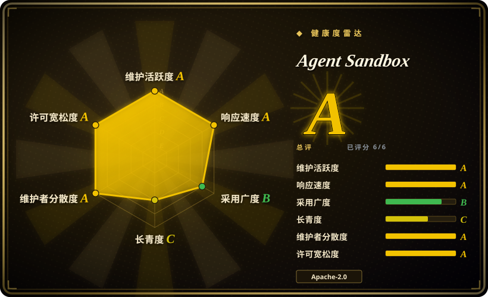
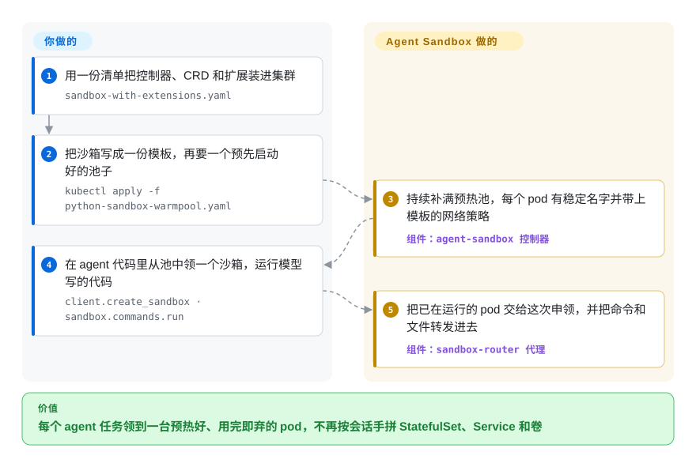

# Agent Sandbox

每个 agent 会话都要一台用完就扔的机器来跑模型写的代码；在 Kubernetes 上，这意味着每个会话都得手拼一个单副本 StatefulSet、一个 Service 和一块卷，再干等冷启动的 pod 排上调度、拉完镜像。Agent Sandbox 把这些收成一个 `Sandbox` 对象，配上预热池后，agent 一开口就从池里领走一个已经起好的 pod。

## 何时使用

你带着公司内部编码 agent（或者 SWE-bench 那一类 RL／评测流水线）背后的平台组，公司的服务本来就全跑在 Kubernetes 上。每个任务都要一个全新的、网络隔离的容器，让模型在里面随便 `pip install`、随便折腾；而你现在的胶水代码是一个 Python 脚本：建一个副本数为 1 的 StatefulSet、一个 headless Service 和一个 PVC，然后轮询到 `kubectl get pod` 显示 `Running`。agent 一崩就留下孤儿 pod，每个任务都要先等调度、再等拉镜像。你装上 Agent Sandbox 的控制器，把沙箱一次性写成 `SandboxTemplate`（镜像、资源、`runtimeClassName: gvisor`），让 `SandboxWarmPool` 始终备着几台预先启动好的 pod，然后在 agent 里调用 `client.create_sandbox(warmpool=...)`：申领直接接管一台热 pod，你通过 SDK 跑命令、传文件，`terminate()` 把容量还回去。

和 [OpenSandbox](opensandbox.zh.md)、[E2B](e2b.zh.md) 这类沙箱平台相比，选它的决定性约束是：**沙箱必须是普通的 Kubernetes 对象**——受你现有的 RBAC、配额、NetworkPolicy、节点池、GitOps 和自动扩缩容管辖，用的是 Kubernetes SIG 维护、不绑厂商的 API，而不是另起一个有自己服务器、协议和凭证的平台。代价是它给你的是编排器，不是开箱即用的产品：隔离强度、路由鉴权和大部分面向 agent 的便利功能都要你自己配。

## 怎么用起来

Agent Sandbox 给你的 Kubernetes API 加了几种新对象类型（CRD，即自定义资源定义——可以直接 `kubectl apply` 的新 `kind:`），再在集群里跑一个控制器——一个不停把现实拉回到这些对象所描述状态的循环。一个 `Sandbox` 对应且只对应一个 pod：主机名稳定，可选挂一块重启后还在的持久卷，并带生命周期控制（定时删除、缩到零但保留卷）。扩展部分再加三样：`SandboxTemplate`（可复用的配方）、`SandboxWarmPool`（提前起好的 N 台 pod，像出租车站排着的空车）和 `SandboxClaim`（一次申领，直接开走排头那辆，而不是现叫一辆）。隔离本身**不归** Agent Sandbox 管：pod 用什么 RuntimeClass（Kubernetes 里选容器运行时的那个设置，比如 gVisor 或 Kata Containers）完全取决于你在模板里写了什么；不写，它就是和节点共用内核的普通容器。Python／Go SDK 的流量经过一个可选的 `sandbox-router` 反向代理，它按 `X-Sandbox-ID` 请求头找到对应的 pod；真正执行命令、读写文件的，是镜像里的一个小运行时服务（示例里的 `python-runtime-sandbox`，或者较新的 `sandboxd`）。归你管的是：集群本身、运行时类及其节点准备、镜像、路由的鉴权与暴露方式，以及模板里的网络和资源策略。

<!-- flow-steps:begin (generated from flows/agent-sandbox.json by tools/flow_card.py — do not edit) -->

流程文字版

1. **你**：用一份清单把控制器、CRD 和扩展装进集群 — `sandbox-with-extensions.yaml`
2. **你**：把沙箱写成一份模板，再要一个预先启动好的池子 — `kubectl apply -f python-sandbox-warmpool.yaml`
3. **Agent Sandbox**：持续补满预热池，每个 pod 有稳定名字并带上模板的网络策略 — 组件：`agent-sandbox 控制器`
4. **你**：在 agent 代码里从池中领一个沙箱，运行模型写的代码 — `client.create_sandbox · sandbox.commands.run`
5. **Agent Sandbox**：把已在运行的 pod 交给这次申领，并把命令和文件转发进去 — 组件：`sandbox-router 代理`

**价值**：每个 agent 任务领到一台预热好、用完即弃的 pod，不再按会话手拼 StatefulSet、Service 和卷

<!-- flow-steps:end -->

## 何时不用

- **你没有 Kubernetes，也不打算上。** 这里的一切都是 CRD 加控制器，没有单机模式，也没有托管模式。想在自己的一台机器上跑沙箱，用 [Microsandbox](microsandbox.zh.md)；只想要一个 SDK、什么都不运维，用 [E2B](e2b.zh.md)（托管）或 [Modal client SDK](modal-client.zh.md)。
- **你指望它本身就是安全边界。** 项目自己的威胁模型写明它“不实现隔离”：没写 `runtimeClassName` 的 `Sandbox` 就是共享内核的普通 runc 容器。要跑不可信代码，先在节点上装好并验证 [gVisor](gvisor.zh.md) 或 [Kata Containers](kata-containers.zh.md)，再通过 `SandboxTemplate` 强制使用。那些加固过的默认值（托管的默认拒绝 NetworkPolicy、不挂 service account token）只对经模板创建的沙箱生效；直接建的 `Sandbox` 要靠你自己的准入策略兜底。
- **你想要多语言、开箱即用的 agent 沙箱 API。** 截至 2026-09，只有 Python SDK 正式发布；Go SDK 跟着控制器的根模块走、生命周期能力有缺口，TypeScript SDK 还没发布，维护者自己在 issue #1785 里写道三套 SDK “已经分化成三个不同的产品”。按沙箱注入凭证、申领时挂出口策略都还在路线图上。如果今天就要凭证保险库、按沙箱的出口管控、代码解释器和五种语言的 SDK，选 [OpenSandbox](opensandbox.zh.md)。
- **你需要在任意集群上做带内存状态的暂停／恢复。** 把运行中的进程冻住再原样恢复，只在 GKE 上可用（带 gVisor 节点池的 Autopilot，走 `podsnapshot.gke.io`），而且只有 Python SDK 支持；可移植的做法只是缩到零、保留卷。如果真正的问题是把大量闲置的有状态 agent 塞进更少的 pod 并按需恢复，看 [Agent Substrate](substrate.zh.md)。
- **你打算把路由原样暴露给不可信的调用方。** 为兼容 Python 客户端，路由的默认鉴权器是 `AllowAll`，安装文档里的快速上手命令还会把路由鉴权关掉。在集群外能碰到它之前，先打开 `--authz-mode=tokenreview`，或在 Gateway 层加鉴权；否则谁能连上路由，谁就能按名字连上任意沙箱。
- **你只需要一个长期运行的有状态 pod。** 单副本 StatefulSet 加一个 Service 是 Kubernetes 自带的，不多一个要升级的控制器和 CRD；Agent Sandbox 的价值在于大量短命沙箱、预热池和申领。

## 横向对比

| 替代品 | 是否收录 | 我们的评价 | 取舍 |
|---|---|---|---|
| [OpenSandbox](opensandbox.zh.md) | ✅ | 想要一套完整的自托管 agent 沙箱产品（服务器、execd、凭证保险库、按沙箱出口管控、代码解释器、五种语言 SDK），选 OpenSandbox；沙箱必须是原生 Kubernetes 对象、走不绑厂商的 SIG API，选 Agent Sandbox。 | OpenSandbox 第一天就给你更多面向 agent 的功能，但它是一个要单独运维、有自己协议的平台；Agent Sandbox 是更薄的一层，复用集群已有的 RBAC、配额和 GitOps，SDK 打磨和凭证处理留给你。 |
| [E2B](e2b.zh.md) | ✅ | 想几分钟内拿到能用的沙箱 SDK，并接受它的托管服务或在 AWS／GCP 上用 Terraform 自托管，选 E2B；沙箱必须跑在你已经在运维的 Kubernetes 集群里，选 Agent Sandbox。 | E2B 用控制权换首个沙箱的上手速度，底下是它自己基于 Firecracker 的整套栈；Agent Sandbox 用搭建工作量换沙箱落在你的节点、运行时类和网络策略之内。 |
| [Agent Substrate](substrate.zh.md) | ✅ | 成本问题在于大量长期存活、多数时间闲置、恢复时必须带着内存的有状态 agent，想把它们压进更少的预热 pod，选 Substrate；需要一个标准的“每沙箱一个 pod”API、带预热池和申领，选 Agent Sandbox。 | Substrate 的增量是存档加多路复用换来的密度（1.0 之前，尚未做安全加固）；Agent Sandbox 始终一个沙箱一个 pod，只在 GKE 上能存内存快照，但它是 SIG 所有、已到 v1.0 的 API。 |
| [Kata Containers](kata-containers.zh.md) | ✅ | 把 Kata 当作下面那层隔离——经 RuntimeClass 给每个 pod 一个真正的客户机内核；还需要沙箱生命周期、预热池和 SDK 时，再在上面加 Agent Sandbox。 | 它不是替代品而是下一层：Kata 让一个 pod 能安全地交给不可信代码，Agent Sandbox 决定这个 pod 何时存在、归谁用。只用 Agent Sandbox 不配 Kata 或 gVisor，你仍在共享内核上。 |
| [Microsandbox](microsandbox.zh.md) | ✅ | 沙箱只需跑在你自己的一台主机上、完全不要集群，选 Microsandbox；沙箱必须在一整个 Kubernetes 集群里调度，选 Agent Sandbox。 | Microsandbox 用一个二进制提供 microVM 隔离，需要那台主机有硬件虚拟化；Agent Sandbox 提供跨集群调度和预热池，需要集群加一个负责隔离的运行时类。 |

## 技术栈

- **控制器：** Go 1.26，基于 `controller-runtime` v0.25 和 Kubernetes 客户端库 v0.37（见 `go.mod`）；二进制为 `cmd/agent-sandbox-controller`。CRD 分属 `agents.x-k8s.io`（`Sandbox`）和 `extensions.agents.x-k8s.io`（`SandboxTemplate`、`SandboxClaim`、`SandboxWarmPool`），自 v1.0.0 起只提供 `v1beta1`。
- **数据面：** `sandbox-router`——一个 Go 写的反向代理（重写了早先的 Python 版路由），支持 TLS／mTLS、基于 TokenReview 的鉴权模式、面向浏览器的路径路由、Prometheus 指标和 OpenTelemetry 追踪。沙箱内运行时：示例里的 FastAPI 服务 `python-runtime-sandbox`，以及较新的 `sandboxd`（REST 文件系统接口加一个 gRPC 进程服务）。
- **客户端：** Python SDK `k8s-agent-sandbox`（Python ≥ 3.11，依赖 `kubernetes`、`requests`、`pydantic`；可选 async／gRPC／tracing 扩展，以及 GKE Pod Snapshot 辅助模块）、Go SDK `sigs.k8s.io/agent-sandbox/clients/go/sandbox`、一个未发布的 TypeScript 客户端，以及 `clients/integrations` 下的框架集成。
- **打包：** 发布清单（`sandbox.yaml`、`extensions.yaml`、`sandbox-with-extensions.yaml`）、`k8s/` 下的 kustomize、`helm/` 里的 Helm chart（尚未发布到 chart 仓库，见 issue #1726），以及一个 OLM bundle。

## 依赖

- **一个 Kubernetes 集群**，且你有权限装集群级 CRD 和控制器（本地用 KinD，正式环境用任意合规集群；文档演示了 KinD 和 GKE Autopilot）。
- **一个以 RuntimeClass 暴露的隔离运行时**——gVisor 或 Kata Containers——前提是负载不可信。没有它，你拿到的就是普通容器。
- **`sandbox-router`**（可选，但 SDK 的 tunnel／gateway 模式离不开它；在不能做端口转发的 gVisor／Kata pod 上也需要它）；客户端在集群外时，还要一个 Kubernetes Gateway 或负载均衡器。
- **一个 StorageClass** 用于持久沙箱卷；如果依赖托管的默认拒绝策略，还要一个真正执行 NetworkPolicy 的 CNI。
- **镜像里要有运行时服务**（示例的 Python 运行时或 `sandboxd`），SDK 的 `commands.run`／`files.*` 调用才能工作；普通镜像只会给你一个 pod。
- **可选：** 带 gVisor 节点池的 GKE Autopilot（用于内存状态快照）；接收指标和追踪的 Prometheus／OpenTelemetry 采集端。

## 运维难度

**中等，多租户场景升到高。** 装控制器只是对发布清单做一次 `kubectl apply`，控制器本身也只是一个 Deployment。真正的工作在它周围：给节点准备 gVisor 或 Kata 并证明隔离确实成立；运行并加固路由（默认鉴权器什么都放行）；写好设定资源上限和网络策略的模板；按闲置成本给预热池定容量；为集群外客户端接好 Gateway。在 API 仍是 `v1beta1` 期间，升级要小心：v1.0.0 删掉了 `v1alpha1` 和转换 webhook，不支持从 v0.5 之前直接升级，官方给的路径是四步存储迁移。删除 CRD 会级联删掉集群里所有沙箱。发版是每周一次，要准备好主动跟进补丁版本。

## 健康度与可持续性

- **维护（2026-09-30）。** 非常活跃：v1.0.0 于 2026-08-28 发布，v1.0.1–v1.0.4 每周一版，直到 2026-09-24；截至 2026-09-30 的 30 天内合入了 161 个 PR，本页核对当天默认分支仍有推送。
- **响应速度。** 22 个合格 issue 的首次响应中位数为 3.5 小时（健康度评分器，2026-09-30）；issue 用 Kubernetes 的 `kind/` 和 `priority/` 标签分诊。
- **治理与背书。** 属于 `kubernetes-sigs`，归 SIG Apps 管，沿用 Kubernetes 的 OWNERS、CLA 和安全披露流程。审批人是 janetkuo、justinsb、soltysh 和 barney-s；前两位在 GitHub 资料里写的是 Google，GKE 专属功能（Pod Snapshot、GKE Gateway 示例）也说明 Google 的产品需求在推动部分路线图。SIG 这层外壳降低了单一厂商撤出的风险；Google 之外的评审力量有多少，本页没有测量。
- **年龄 × Lindy。** 创建于 2025-08-12，约 13.5 个月。年龄还不足以带来 Lindy 先验；它押的是 SIG 背书和高迭代速度，而不是长期记录。`v1beta1` API 和 SDK 分化都意味着接口仍可能变。
- **采用情况。** 约 4.1k star、539 fork；Python SDK 近一个月 PyPI 下载 937,612 次（健康度评分器读取的 pypistats，2026-09-30），很可能被 CI 和 RL 循环放大；约 60 个示例目录覆盖 OpenClaw、Hermes、LangChain、Ray、AKS／GKE 上的 Kata 等。没有找到具名的生产用户。
- **风险信号。** Apache-2.0，走 CNCF／Kubernetes CLA，看不到改许可证的风险。现实的风险是正式 `v1` 之前的 API 变动、参差不齐的 SDK、需要你自己收紧的安全默认值（路由 `AllowAll`），以及只在 GKE 可用的内存快照功能会不知不觉把设计引向单一云。

## 存疑（未验证）

- [未验证] 路线图和发布说明里的性能数字——申领吞吐最高约 300 个沙箱／秒、申领延迟基线约 200 ms 并以 100 ms／50 ms 为目标、调和延迟降低 55%——都是项目自报的基准，没有可复现环境。
- [推断] 每月约 93.8 万次 PyPI 下载被理解为主要来自自动化（CI、RL rollout），而不是独立用户数，依据是它相对约 4.1k star 的量级；没有下载来源拆分数据。
- [未验证] 在 README、文档和 issue 里没找到具名的生产采用者；GKE 用本项目支撑它自己的 agent 沙箱产品，只是从 GKE 专属扩展推测出来的，没有 Google 的一手来源确认。
- [推断] Google 对路线图的影响，是从四位审批人中两位在 GitHub 写着 Google、以及只在 GKE 可用的功能推出来的；没有测量各组织的贡献占比。
- [未验证] 读过的文档里没写最低支持的 Kubernetes 服务端版本；控制器是基于 v0.37 客户端库构建的。
- [推断] 文中描述的 SDK 能力缺口（Go 生命周期缺口、TypeScript 未发布）来自维护者 2026-09-29 在 issue #1785 里的自查，其中几项已有修复在进行；依赖前请重新核对。
