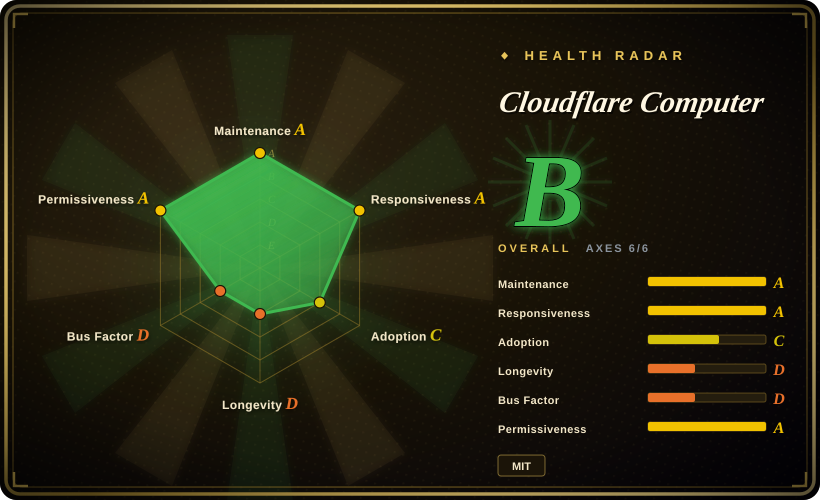
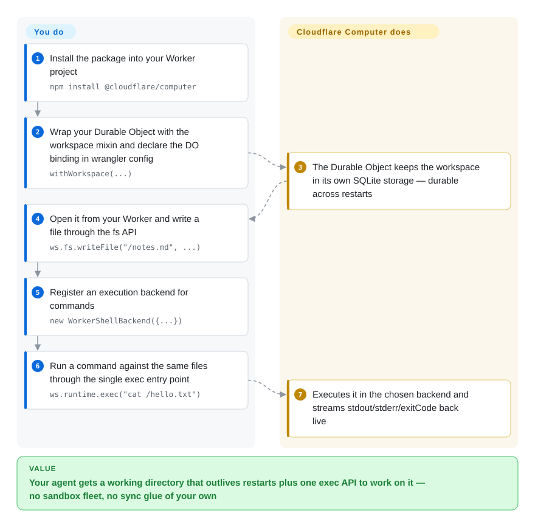

# Cloudflare Computer

Your agent runs serverless, so every restart evaporates its working directory — the notes it wrote, the repo it cloned, the half-finished edit are gone and it re-does the work each turn. Cloudflare Computer gives the agent a durable working directory instead: a filesystem that lives in your Durable Object's SQLite storage, plus one `exec` API to run shell commands or JavaScript against those files in a Linux container or a Worker isolate.

## When to use

You are building an agent that deploys on Cloudflare Workers — a chat agent with a working folder, a research worker that clones repos, a code agent that edits and tests — and the missing piece is the *working directory*: files the agent writes must survive isolate restarts, and it must be able to run commands against them. Without this you end up bolting together an object-store bucket for files, a container service for execution, and your own sync glue between them. Computer is one npm package: wrap your Durable Object with `withWorkspace` and you get `workspace.fs` (a `node:fs/promises`-lookalike backed by the DO's own SQLite), `workspace.runtime.exec()` with three swappable backends, a git client over the same files, and ready-made AI SDK tools (`read`, `write`, `grep`, `edit`, optional `exec`). The deciding tradeoff against E2B or Modal is what is durable: there, the sandbox is the product and files die with it unless you persist them yourself; here, the files are the durable thing (the Durable Object) and execution is attached to them. The price is structural: it exists only on Cloudflare, and it is an explicit preview.

## How it works

The authoritative state is a SQLite-backed virtual filesystem inside a Durable Object — Cloudflare's single-instance stateful object, the place a Worker keeps durable state. You run no database: `workspace.fs` looks like `node:fs/promises` (`readFile`, `writeFile`, `mkdir`, `grep`) and is durable across DO restarts. Execution goes through one call, `workspace.runtime.exec(source, { backend })`, and the backend decides what `source` means. The **container** backend runs a daemon (`computerd`) inside a Cloudflare Container that mounts the SQLite state as a real filesystem (a FUSE mount) and syncs changes back over an RPC channel — full Linux userland, real binaries, real network. The **worker-shell** backend runs just-bash inside a Dynamic Worker, so every file operation goes straight back to the DO with no second store to sync; the **worker-javascript** backend evaluates an ECMAScript module in a fresh Dynamic Worker. Backends connect lazily and several can be registered under stable IDs. What Cloudflare owns is the storage, the isolation, and the sync plumbing; what you own is the TypeScript that wires the workspace into your agent.

<!-- flow-steps:begin (generated from flows/cloudflare-computer.json by tools/flow_card.py — do not edit) -->

Text version of the flow

1. **You**: Install the package into your Worker project — `npm install @cloudflare/computer`
2. **You**: Wrap your Durable Object with the workspace mixin and declare the DO binding in wrangler config — `withWorkspace(...)`
3. **Cloudflare Computer**: The Durable Object keeps the workspace in its own SQLite storage — durable across restarts
4. **You**: Open it from your Worker and write a file through the fs API — `ws.fs.writeFile("/notes.md", ...)`
5. **You**: Register an execution backend for commands — `new WorkerShellBackend({...})`
6. **You**: Run a command against the same files through the single exec entry point — `ws.runtime.exec("cat /hello.txt")`
7. **Cloudflare Computer**: Executes it in the chosen backend and streams stdout/stderr/exitCode back live

**Value**: Your agent gets a working directory that outlives restarts plus one exec API to work on it — no sandbox fleet, no sync glue of your own

<!-- flow-steps:end -->

## When NOT to use

- **Your agent does not run on Cloudflare Workers.** Every load-bearing piece — Durable Object SQLite, Worker Loader bindings, Cloudflare Containers, R2 mounts — is Cloudflare runtime; there is no self-host path. For an agent anywhere else, use [E2B](e2b.md) (hosted SDK, Terraform self-host on AWS/GCP) or [OpenSandbox](opensandbox.md) (self-host-first).
- **You need this in production today.** The README banner says PREVIEW ONLY: APIs are unstable and unsuitable for production, and the churn is live — the container backend is being renamed "Legacy" to make way for a new container runtime (issues #161/#162, 2026-09-23). Treat it as a design preview; for production sandboxing now use [E2B](e2b.md) or [OpenSandbox](opensandbox.md).
- **The workload is big files or I/O-heavy builds.** By the project's own benchmarks, copying 64 MiB through the FUSE mount is ~40x slower than the container's disk, and a full `npm install` of an 854-package repo takes ~2x disk time [未验证]. For build-farm work use the [Modal client SDK](modal-client.md) (serverless containers, GPUs) or plain containers.
- **The workspace is monorepo-sized.** ~10 GB per workspace ceiling, and the container-side filesystem is held in memory — the docs say to aim for agent-scale workspaces, not full monorepos. For whole-repo agent work, use ephemeral disk-backed sandboxes ([E2B](e2b.md)) or a self-hosted VM sandbox ([Microsandbox](microsandbox.md)).
- **Vendor neutrality matters more than zero-ops.** DO, Containers, R2, and Artifacts bindings are structural lock-in; the workspace cannot leave Cloudflare. If exit is a hard constraint, choose the open, Terraform-self-hostable [E2B](e2b.md) runtime or [OpenSandbox](opensandbox.md).
- **You read `docs/` as shipped behavior.** The design spec is explicitly forward-looking — "read it for intent, not as description of the code today". Verify each API against the package README before depending on it.

## Comparison

| Alternative | In index | Our verdict | Tradeoff |
|---|---|---|---|
| [E2B](e2b.md) | ✅ | Choose Computer when the agent already runs on Cloudflare and its files must outlive requests and restarts — durability is the product; choose E2B when you need disposable execution sandboxes from any stack and any cloud. | Computer makes files durable and attaches execution to them, but only on Cloudflare and in preview; E2B gives ephemeral sandboxes plus portability and a production track record, at the cost of persisting anything that must survive the sandbox yourself. |
| [Modal client SDK](modal-client.md) | ✅ | Choose Modal when the work is compute-shaped — containers, GPUs, long jobs at scale; choose Computer when the work is state-shaped — a per-agent working directory the next request reads back. | Modal buys compute breadth (including GPUs) with no durable per-agent files; Computer buys durable files plus light execution inside one platform's preview API. |
| [OpenSandbox](opensandbox.md) | ✅ | Choose OpenSandbox when the sandbox fleet must run in your own Kubernetes with egress controls and a credential vault; choose Computer when you would rather run nothing and are already on Workers. | OpenSandbox trades operating burden for self-hosted control; Computer trades platform lock-in for a workspace with zero infrastructure of your own. |
| cloudflare/sandbox-sdk | 未收录 | Choose sandbox-sdk when you only need a code-interpreter sandbox on Cloudflare Containers today; choose Computer when the durable workspace — files that survive, git, agent tools — is the point. | Same vendor and same platform, different center of gravity: sandbox-sdk is execution-only, Computer adds the DO-backed filesystem. Not added in this tab-intake batch. |
| [Microsandbox](microsandbox.md) | ✅ | Choose Microsandbox when the sandbox must run on hardware you own with ordinary OCI images; choose Computer when the agent is serverless and its state should live on Cloudflare. | Microsandbox gives local control and no cloud dependency but no durable agent workspace; Computer gives the workspace and zero-ops, on one vendor's preview runtime. |

## Tech stack

- **TypeScript monorepo** (npm workspaces): `@cloudflare/dofs` (the DO SQLite virtual filesystem + sync protocol), `@cloudflare/computer-rpc` (capnweb wire types), `@cloudflare/computerd` (the in-container daemon: FUSE mount + HTTP/WebSocket RPC server), `@cloudflare/computer` (the consumer-facing Workspace package). The container release artifact is a Docker image with a prebuilt linux-x64 `computerd`, not an npm package.
- **Cloudflare runtime surfaces:** Durable Objects with SQLite storage, Dynamic Workers loaded through a Worker Loader binding (`experimental` flag), Cloudflare Containers, R2 (read-only mounts, asset sharing), Cloudflare Artifacts.
- **Shell backends:** just-bash (vercel-labs) compiled into the Worker isolate, with opt-in command feature groups (`curl`, `python`, `sqlite`, `jq`, …) that tree-shake away if unimported; git via isomorphic-git over the SQLite VFS.
- **Toolchain:** Biome, changesets, TypeScript; AI SDK (`ai` + `zod`) as optional peer dependencies for the agent tools.

## Dependencies

- **A Cloudflare Workers deployment** — the package is a library inside your Worker/Durable Object, with the `nodejs_compat` compatibility flag; the worker-shell and worker-javascript backends additionally need the `experimental` flag and a Worker Loader binding.
- **Container backend:** a Cloudflare Container running the `computerd` image (the repo ships the Docker context; the image is the release artifact).
- **Optional:** an R2 bucket (read-only mounts, `assets publish` sharing), a Cloudflare Artifacts binding, `ai` + `zod` for the AI SDK tools, `@platformatic/vfs` for the Node-side VFS provider.
- **A Cloudflare account/plan tier that fits your usage** — which plan gates DO SQLite, Containers, and Worker Loaders was not verified against current pricing docs; check before sizing.

## Ops difficulty

**Low for the isolate backends, medium for the container backend — plus a preview-tax.** Worker-shell and worker-javascript need nothing beyond your Worker and an experimental flag, so the workspace rides your existing deploy. The container backend adds a container image and a sync channel (FUSE + capnweb) you inherit rather than operate, at the cost of slower big-I/O and a memory-held container-side filesystem. The preview-tax is the real line item: 0.x APIs, a backend rename in flight, and docs that are explicitly forward-looking mean budgeting for breaking changes on every upgrade until it stabilizes.

## Health & viability

- **Maintenance (2026-09-28).** Very active: last push 2026-09-23, four releases between 2026-08-11 and 2026-09-18 (0.2.0 → 0.3.1) via changesets, performance work and feature issues filed through late September. Not archived.
- **Governance / bus factor (2026-09-28).** Cloudflare-org-backed but single-team shaped: the top contributor accounts for 779 of the contributions in the API's top-10 list versus 10 for the next human (2026-09-28 read). CONTRIBUTING is explicit: issues and discussions only, no unsolicited pull requests — the roadmap is entirely Cloudflare's call.
- **Backing & Lindy (2026-09-28).** Strong vendor, zero age credit: created 2026-06-05, ~4 months old at verification, and self-declared PREVIEW with unstable APIs. A long-lived still-active track record is exactly what it does not have yet; the bet is on Cloudflare's commitment, not on evidence of persistence. [推断]
- **Adoption & ecosystem (2026-09-28).** Attention is hype-fast for that age: ~9.3k stars and ~293k monthly npm downloads (292720 read by the scorer for `@cloudflare/computer`, plus ~96k in the week of 2026-09-20) within four months — real trial interest, but on an unstable API, so breakage ripples to many experimenters. A dozen runnable examples (container, shell, MCP, tutorial) and typed AI SDK tools make the on-ramp unusually complete for a preview. [推断]
- **Risk flags (2026-09-28).** Preview/instability is the headline risk (banner plus the container-backend rename in flight); structural single-vendor lock-in; MIT verified by reading LICENSE (2026-09-28); security reports route through Cloudflare's disclosure process, not public issues.

## Caveats (unverified)

- [未验证] Performance numbers (64 MiB copy ~40x slower than disk, npm install ~2x) are the project's own benchmarks in `docs/19_performance.md`; not independently reproduced.
- [推断] "~96k weekly npm downloads" as trial/hype signal is an interpretation; the registry point-read (week of 2026-09-20) was not trend-checked, and download counts include CI and retries.
- [推断] The bus-factor reading comes from the GitHub contributors API top-10 snapshot; commit attribution outside that window was not analyzed.
- [未验证] Which Cloudflare plan tiers gate the required surfaces (DO SQLite, Containers, Worker Loaders) — not checked against current pricing/docs.
- [推断] The Comparison rows are positioning judgments (durable workspace vs ephemeral sandbox, zero-ops vs self-host), not measured head-to-heads.
- [未验证] Security posture of the isolation boundary itself (Dynamic Worker egress default `globalOutbound: null`, container escape surface) was read from docs/examples, not audited.
