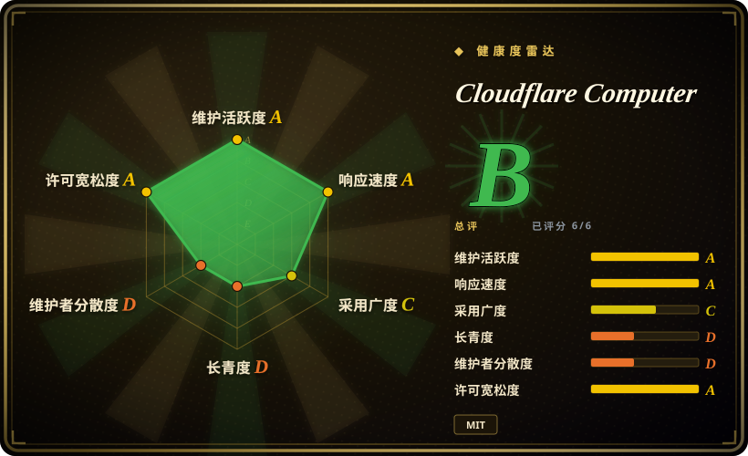
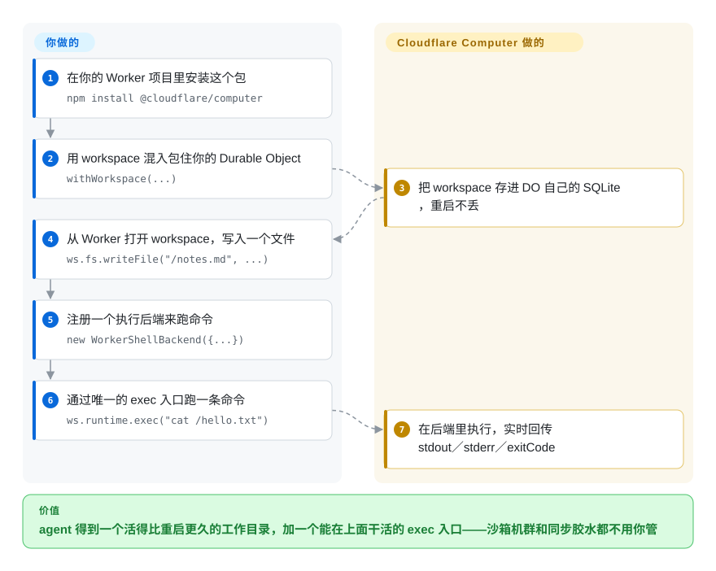

# Cloudflare Computer

你的 agent 跑在 serverless 上，工作目录随每次重启蒸发——它写的笔记、克隆的仓库、改到一半的文件全没了，下一轮只能重做。Cloudflare Computer 给 agent 一个能活下去的工作目录：文件系统放在你那个 Durable Object 的 SQLite 里，再配一个统一的 `exec` API，让命令或 JavaScript 在 Linux 容器或 Worker 隔离环境里对这些文件执行。

## 何时使用

你在 Cloudflare Workers 上做一个 agent——带工作文件夹的聊天 agent、会克隆仓库的调研 worker、要改代码并跑测试的 code agent——缺的那块正是**工作目录**：agent 写下的文件要能在隔离环境重启后还在，还要能对着文件跑命令。没有它，你就得自己拼一套对象存储放文件、一个容器服务做执行、再加自写的同步胶水。Computer 是一个 npm 包：用 `withWorkspace` 包住你的 Durable Object，就得到 `workspace.fs`（长得像 `node:fs/promises`、底层是 DO 自己的 SQLite）、一个可换后端的 `workspace.runtime.exec()`、建在同一批文件上的 git 客户端，以及现成的 AI SDK 工具（`read`、`write`、`grep`、`edit`，可选 `exec`）。与 E2B 或 Modal 的决定性取舍在于**什么是持久的**：那边沙箱是主体，文件随沙箱销毁，要留得自己另存；这边文件本身是持久主体（Durable Object），执行只是挂在文件上。代价也是结构性的：它只存在于 Cloudflare，而且明说是 preview。

## 怎么用起来

权威状态是 Durable Object（Cloudflare 的单实例有状态对象，Worker 存持久状态的地方）里一套 SQLite 虚拟文件系统。你不用运行任何数据库：`workspace.fs` 用起来像 `node:fs/promises`（`readFile`、`writeFile`、`mkdir`、`grep`），跨 DO 重启持久。执行只走一个入口——`workspace.runtime.exec(source, { backend })`——`source` 是什么由后端决定：**容器**后端在 Cloudflare Container 里跑一个守护进程（`computerd`），把 SQLite 状态以真实文件系统挂进容器（FUSE 挂载），再通过一条 RPC 信道把改动同步回去，拿到完整 Linux 用户态、真实二进制与网络；**worker-shell** 后端把 just-bash 跑在 Dynamic Worker 里，每个文件操作都直接打回 DO，没有第二份存储要同步；**worker-javascript** 后端在全新 Dynamic Worker 里求值一个 ECMAScript 模块。后端惰性连接，也可以注册多个、各挂稳定 ID。Cloudflare 负责存储、隔离与同步管线；你负责把 workspace 接进 agent 的那段 TypeScript。

<!-- flow-steps:begin (generated from flows/cloudflare-computer.json by tools/flow_card.py — do not edit) -->

流程文字版

1. **你**：在你的 Worker 项目里安装这个包 — `npm install @cloudflare/computer`
2. **你**：用 workspace 混入包住你的 Durable Object — `withWorkspace(...)`
3. **Cloudflare Computer**：把 workspace 存进 DO 自己的 SQLite，重启不丢
4. **你**：从 Worker 打开 workspace，写入一个文件 — `ws.fs.writeFile("/notes.md", ...)`
5. **你**：注册一个执行后端来跑命令 — `new WorkerShellBackend({...})`
6. **你**：通过唯一的 exec 入口跑一条命令 — `ws.runtime.exec("cat /hello.txt")`
7. **Cloudflare Computer**：在后端里执行，实时回传 stdout／stderr／exitCode

**价值**：agent 得到一个活得比重启更久的工作目录，加一个能在上面干活的 exec 入口——沙箱机群和同步胶水都不用你管

<!-- flow-steps:end -->

## 何时不用

- **你的 agent 不跑在 Cloudflare Workers 上。** 承重的每一块——DO SQLite、Worker Loader 绑定、Cloudflare Containers、R2 挂载——都是 Cloudflare 运行时，没有自托管路径。agent 在别处的，用 [E2B](e2b.zh.md)（托管 SDK，可 Terraform 自托管到 AWS／GCP）或 [OpenSandbox](opensandbox.zh.md)（自托管优先）。
- **你现在就要上生产。** README 横幅写明 PREVIEW ONLY：API 不稳定、不适合生产，而且改动正在发生——容器后端要改名 Legacy 给新容器运行时让路（issue #161／#162，2026-09-23）。把它当设计预览；生产沙箱现在就用 [E2B](e2b.zh.md) 或 [OpenSandbox](opensandbox.zh.md)。
- **负载是大文件或重 I/O 构建。** 按项目自己的基准：经 FUSE 挂载拷 64 MiB 比容器磁盘慢约 40 倍，854 个依赖的完整 `npm install` 约为磁盘时间的 2 倍 [未验证]。构建规模的活用 [Modal client SDK](modal-client.zh.md)（serverless 容器、GPU）或普通容器。
- **工作目录是 monorepo 尺寸。** 每个 workspace 约 10 GB 上限，容器侧文件系统还放在内存里——文档明说按 agent 尺寸设计，别塞完整 monorepo。整仓级 agent 工作用临时性、磁盘支撑的沙箱（[E2B](e2b.zh.md)）或自托管 VM 沙箱（[Microsandbox](microsandbox.zh.md)）。
- **厂商中立比零运维更重要。** DO、Containers、R2、Artifacts 绑定是结构性锁定，workspace 搬不出 Cloudflare。退出路是硬约束的话，选可 Terraform 自托管的 [E2B](e2b.zh.md) 开源运行时或 [OpenSandbox](opensandbox.zh.md)。
- **你把 `docs/` 当已交付行为来读。** 设计规范明确写着「面向未来」——「读意图，别当代码现状」。依赖任何 API 前先对照包 README 核实。

## 横向对比

| 替代品 | 是否收录 | 我们的评价 | 取舍 |
|---|---|---|---|
| [E2B](e2b.zh.md) | ✅ | agent 已经在 Cloudflare 上、文件必须活过请求与重启时选 Computer——持久才是它的主体；任何技术栈、任何云上要用即抛沙箱时选 E2B。 | Computer 让文件持久、把执行挂在文件上，但只在 Cloudflare 且是 preview；E2B 给可移植的临时沙箱与生产履历，代价是凡要活过沙箱生命周期的东西都得自己另存。 |
| [Modal client SDK](modal-client.zh.md) | ✅ | 活是计算形状——容器、GPU、大规模长任务——选 Modal；活是状态形状——每个 agent 一份下次请求还要读回的工作目录——选 Computer。 | Modal 买到计算广度（含 GPU），没有持久的每 agent 文件；Computer 买到持久文件加轻执行，锁在一个平台的 preview API 里。 |
| [OpenSandbox](opensandbox.zh.md) | ✅ | 沙箱机群必须跑在自己的 Kubernetes 里、带出口管控与凭证保险库时选 OpenSandbox；什么都不想运维、人已在 Workers 上时选 Computer。 | OpenSandbox 用运维负担换自托管控制权；Computer 用平台锁定换一份无需自建基础设施的工作目录。 |
| cloudflare/sandbox-sdk | 未收录 | 只要 Cloudflare Containers 上的代码解释沙箱、今天就要用，选 sandbox-sdk；重点是持久 workspace——文件能活下去、git、agent 工具——选 Computer。 | 同厂商同平台，重心不同：sandbox-sdk 只有执行，Computer 加上 DO 支撑的文件系统。本 tab-intake 批次未收录该仓库。 |
| [Microsandbox](microsandbox.zh.md) | ✅ | 沙箱必须跑在自己硬件上、用普通 OCI 镜像时选 Microsandbox；agent 是 serverless、状态该放在 Cloudflare 上时选 Computer。 | Microsandbox 给本地控制、不依赖云，但没有持久 agent 工作目录；Computer 给工作目录与零运维，押在单一厂商的 preview 运行时上。 |

## 技术栈

- **TypeScript monorepo**（npm workspaces）：`@cloudflare/dofs`（DO SQLite 虚拟文件系统与同步协议）、`@cloudflare/computer-rpc`（capnweb 线协议类型）、`@cloudflare/computerd`（容器内守护进程：FUSE 挂载加 HTTP／WebSocket RPC 服务）、`@cloudflare/computer`（面向使用方的 Workspace 包）。容器侧发布物是带预编译 linux-x64 `computerd` 的 Docker 镜像，不是 npm 包。
- **Cloudflare 运行时面：** SQLite 存储的 Durable Objects、经 Worker Loader 绑定（`experimental` 标志）加载的 Dynamic Workers、Cloudflare Containers、R2（只读挂载、资产分享）、Cloudflare Artifacts。
- **Shell 后端：** 编进 Worker 隔离环境的 just-bash（vercel-labs），命令按特性组可选（`curl`、`python`、`sqlite`、`jq` 等），不导入就被打包器摇掉；git 走 SQLite VFS 上的 isomorphic-git。
- **工具链：** Biome、changesets、TypeScript；agent 工具以 AI SDK（`ai` 加 `zod`）为可选 peer 依赖。

## 依赖

- **一个 Cloudflare Workers 部署**——本包是你 Worker／Durable Object 里的库，需开 `nodejs_compat` 兼容标志；worker-shell 与 worker-javascript 后端另需 `experimental` 标志和 Worker Loader 绑定。
- **容器后端：** 一个跑 `computerd` 镜像的 Cloudflare Container（仓库带 Docker 构建上下文；镜像即发布物）。
- **可选：** R2 桶（只读挂载、`assets publish` 分享）、Cloudflare Artifacts 绑定、AI SDK 工具所需的 `ai` 加 `zod`、Node 侧 VFS provider 用的 `@platformatic/vfs`。
- **账号／套餐档位要匹配用量**——DO SQLite、Containers、Worker Loaders 各被哪个套餐门槛拦住，未对照现行定价文档核实；定容量前先查。

## 运维难度

**isolate 后端低，容器后端中，另加一笔 preview 税。** worker-shell 与 worker-javascript 除了你已有的 Worker 加一个实验性标志外什么都不要，workspace 跟着现有部署走。容器后端多出一个容器镜像和一条你继承而非运维的同步信道（FUSE 加 capnweb），代价是大 I/O 更慢、容器侧文件系统占内存。preview 税才是真正的账单项：0.x 的 API、正在进行的后端改名、明确「面向未来」的文档，意味着稳定之前每次升级都要为破坏性改动留预算。

## 健康度与可持续性

- **维护活跃度（2026-09-28）。** 非常活跃：最后推送 2026-09-23，2026-08-11 至 2026-09-18 间发了四个版本（0.2.0 → 0.3.1，changesets 驱动），九月下旬仍有性能改动与功能 issue。未归档。
- **治理与 bus factor（2026-09-28）。** Cloudflare 组织背书，但形状是单团队：贡献者 API 前十里第一人 779 次贡献，下一个真人只有 10 次（2026-09-28 读取）。CONTRIBUTING 写明只收 issue 与讨论、不收主动 PR——路线图完全由 Cloudflare 说了算。
- **背书与 Lindy（2026-09-28）。** 厂商强、年龄零分：创建于 2026-06-05，核实时约四个月大，且自称 PREVIEW、API 不稳定。「活得久且仍活跃」的履历恰恰是它还没有的东西；押的是 Cloudflare 的投入，不是已证明的持久性。[推断]
- **采用与生态（2026-09-28）。** 以这个年龄热度蹿得极快：四个月约 9.3k stars、`@cloudflare/computer` 月下载约 29.3 万（评分器读到 292720，2026-09-20 当周约 9.6 万）——试用兴趣是真的，但踩在不稳定 API 上，破坏性改动会波及大量尝鲜者 [推断]。十来个可跑示例（container、shell、MCP、tutorial）加类型化 AI SDK 工具，对一个 preview 来说上手坡道异常完整。
- **风险旗标（2026-09-28）。** 头号风险就是 preview 不稳定（横幅加进行中的容器后端改名）；结构性单一厂商锁定；MIT 已读 LICENSE 文件核实（2026-09-28）；安全报告走 Cloudflare 披露流程，不开公开 issue。

## 存疑（未验证）

- [未验证] 性能数字（64 MiB 拷贝比磁盘慢约 40 倍、`npm install` 约 2 倍）出自项目自己的 `docs/19_performance.md` 基准；未独立复现。
- [推断] 「周下载约 9.6 万」被解读为试用／热度信号是推断；注册表时点读数（2026-09-20 当周）未做趋势核对，下载量也含 CI 与重试。
- [推断] bus factor 读数来自 GitHub 贡献者 API 前十快照；窗口之外的提交归属未分析。
- [未验证] 所需的 Cloudflare 各面（DO SQLite、Containers、Worker Loaders）被哪些套餐档位门槛拦住——未对照现行定价／文档核查。
- [推断] 横向对比表按定位判断（持久 workspace 对临时沙箱、零运维对自托管），不是实测对比。
- [未验证] 隔离边界本身的安全姿态（Dynamic Worker 出口默认 `globalOutbound: null`、容器逃逸面）读自文档与示例，未做审计。
