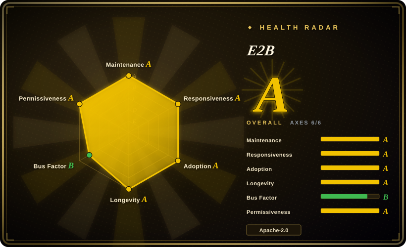
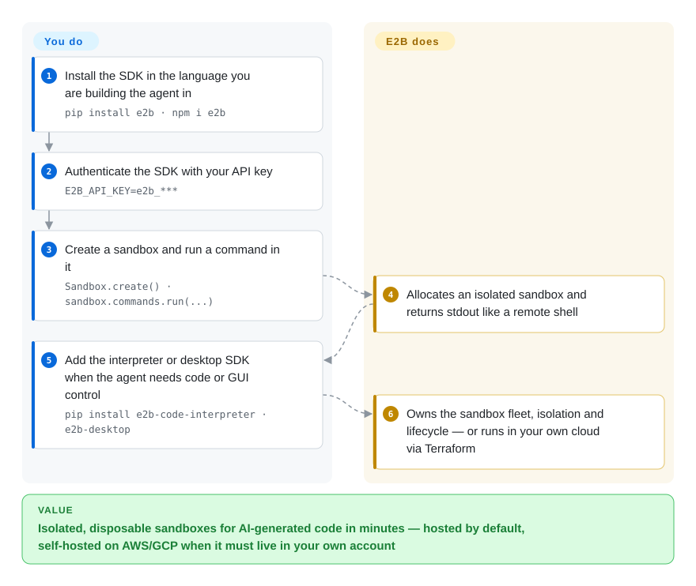

# E2B

Sandboxes for AI-generated code, delivered as SDKs — `Sandbox.create()` and a command API for Python/JS, a code-interpreter variant that runs snippets, and a desktop variant for GUI control; hosted by default, self-hostable with Terraform if the sandbox must live in your own cloud.

## When to use

You are building an agent or a code-generation feature and the model needs somewhere to run code it just produced: install packages, read and write files, execute a script, drive a browser or a desktop. Building that yourself means owning a VM/container fleet, an execution API, image management and isolation, which is weeks of platform work before your product does anything. E2B compresses that into an SDK call: install `e2b`, set an API key, create a sandbox and run commands in it (`Sandbox.create()`, `sandbox.commands.run(...)`), with sibling SDKs for code interpretation (stateful kernels, rich results) and desktop control (launch apps, screenshot, stream). It is the fastest path when you want the *sandbox* abstracted away and are happy to let the provider meter it — and it is also the honest choice when you need it in your own cloud, since the runtime is open source and self-hosted through Terraform on AWS or GCP. The deciding tradeoff against [OpenSandbox](opensandbox.md) is managed-versus-assembled: E2B leads with a polished hosted service and SDKs and treats self-hosting as a Terraform deployment you own, while OpenSandbox is a self-host-first platform with a sandbox protocol you can extend. Against [Agent Substrate](substrate.md), E2B gives you a sandbox on demand; Substrate gives you density for stateful sessions that outlive a single request.

## How it works

E2B is a control plane plus a runtime, fronted by language SDKs. You install the SDK (`pip install e2b` or `npm i e2b`) and authenticate with an API key (`E2B_API_KEY=e2b_***`); then `Sandbox.create()` allocates an isolated sandbox somewhere in E2B's infrastructure and hands you a handle with APIs for filesystem, processes and commands — `sandbox.commands.run('echo "Hello from E2B!"')` returns stdout like a remote shell. Two specializations exist as separate packages: the Code Interpreter SDK (`pip install e2b-code-interpreter`) adds `sandbox.runCode(...)` with persistent kernels and structured execution results, and the Desktop SDK (`pip install e2b-desktop`) adds mouse/keyboard/screenshot/application control for computer-use agents with desktop streaming. What E2B owns is the sandbox fleet, the isolation boundary, the image/environment plumbing and the API; what you own is the agent logic, which SDK calls to make, and — if you self-host — the Terraform deployment of the runtime into your AWS/GCP account.

<!-- flow-steps:begin (generated from flows/e2b.json by tools/flow_card.py — do not edit) -->

Text version of the flow

1. **You**: Install the SDK in the language you are building the agent in — `pip install e2b · npm i e2b`
2. **You**: Authenticate the SDK with your API key — `E2B_API_KEY=e2b_***`
3. **You**: Create a sandbox and run a command in it — `Sandbox.create() · sandbox.commands.run(...)`
4. **E2B**: Allocates an isolated sandbox and returns stdout like a remote shell
5. **You**: Add the interpreter or desktop SDK when the agent needs code or GUI control — `pip install e2b-code-interpreter · e2b-desktop`
6. **E2B**: Owns the sandbox fleet, isolation and lifecycle — or runs in your own cloud via Terraform

**Value**: Isolated, disposable sandboxes for AI-generated code in minutes — hosted by default, self-hosted on AWS/GCP when it must live in your own account

<!-- flow-steps:end -->

## When NOT to use

- **You need self-hosting on infrastructure the project does not support.** The self-host guide covers AWS and GCP via Terraform; Azure and general Linux machines are explicitly unchecked. For a self-host-first, cloud-agnostic platform, use [OpenSandbox](opensandbox.md).
- **The sandbox must survive a request and keep process memory.** E2B sandboxes are execution environments for code, not long-lived stateful agents with suspend/resume. For "hundreds of stateful sessions multiplexed onto few machines, resumed from a snapshot", use [Agent Substrate](substrate.md).
- **You want to own the isolation primitive end to end.** If your threat model requires you to build the microVM/container boundary and reason about its kernel, start from [Firecracker](firecracker.md) or [gVisor](gvisor.md) rather than a platform that hides it.
- **You only need a container, not a sandbox.** Ordinary workloads belong in ordinary containers; E2B exists for the untrusted-code case. Likewise, if your workloads are steady-state rather than bursty, a sandbox service's per-use model is not the economical shape.
- **You cannot depend on a hosted service's availability or data location.** The hosted product means the provider's control plane and region choices apply; if latency, residency or vendor independence is a hard constraint, either self-host (AWS/GCP only) or pick a self-host-first alternative.
- **You are unwilling to track a fast-moving SDK.** These are young, rapidly released SDKs; if your product cannot absorb breaking changes, pin versions deliberately and budget for upgrades. [推断]

## Comparison

| Alternative | In index | Our verdict | Tradeoff |
|---|---|---|---|
| [OpenSandbox](opensandbox.md) | ✅ | Choose OpenSandbox when you want a self-host-first sandbox platform with a documented sandbox protocol and multi-language SDKs you extend; choose E2B when you want the fastest path to a working sandbox, hosted now and Terraform-self-hosted later. | E2B optimizes time-to-first-sandbox and treats self-hosting as an AWS/GCP deployment; OpenSandbox optimizes self-hosted control and extensibility, at the cost of running the platform yourself. |
| [Modal client SDK](modal-client.md) | ✅ | Choose Modal when you also want serverless GPUs/functions and are comfortable with a fully hosted, closed platform whose client SDK is open; choose E2B when the sandbox runtime itself must be open source and self-hostable. | Both abstract the sandbox away; Modal is a broader cloud platform you cannot self-host, E2B's runtime you can — in exchange for a narrower product surface. |
| [Agent Substrate](substrate.md) | ✅ | Choose Substrate when agents are long-lived and idle-heavy and the problem is pod density with snapshot resume; choose E2B when the problem is "run this snippet/task in isolation, now". | Substrate's suspend/resume multiplexing is a different value proposition than disposable execution sandboxes; the two can compose (Substrate running sandbox workloads), not substitute. |
| [gVisor](gvisor.md) | ✅ | Choose gVisor when your platform team will own the isolation layer and the orchestration; choose E2B when you want the layer and the orchestration delivered as an API. | Running gVisor directly is cheaper per sandbox and fully under your control, but every piece of lifecycle, image handling and credential plumbing becomes your build. |

## Tech stack

- **SDKs:** Python (`e2b` on PyPI) and JavaScript/TypeScript (`e2b` on npm), plus `e2b-code-interpreter` (Python/JS) and `e2b-desktop` (Python/JS) for the interpreter and GUI-control surfaces. JavaScript is the primary language of the repo.
- **Runs on:** an open-source runtime deployed either as E2B's hosted infrastructure or self-hosted with Terraform (AWS/GCP) — the runtime repository is `e2b-dev/runtime` (renamed from `e2b-dev/infra`).
- **Feature surfaces:** sandbox lifecycle + commands/filesystem APIs; Code Interpreter with persistent kernels and structured results; Desktop (Chrome/apps, screenshots, streaming) for computer-use agents.
- **Ecosystem:** a cookbook repository with framework/LLM examples, and integrations across agent frameworks. [未验证]

## Dependencies

- **For the hosted path:** an E2B account and API key (`E2B_API_KEY`) — the sandbox fleet, isolation and images are the provider's problem.
- **For the self-hosted path:** Terraform plus an AWS or GCP account (Azure and general Linux are not supported per the README's checklist), and the operational responsibility for the runtime you deploy.
- **Client side:** Python ≥ 3.x or a Node.js toolchain, depending on the SDK; each specialization (interpreter, desktop) is an additional package.
- **Network access to the control plane** in the hosted path; self-hosting trades that for your own deployment's availability.

## Ops difficulty

**Low for the hosted path, high for self-hosting.** Using E2B hosted is an SDK install plus a key — genuinely minutes of work, with the provider owning the fleet, isolation, and scaling. Self-hosting flips that: you deploy the runtime with Terraform into your own cloud, which means you now operate sandbox infrastructure, its images and its lifecycle inside your account. That split is the reason to be explicit about which mode you are choosing: the same SDK fronts two very different operational realities.

## Health & viability

- **Maintenance (2026-09-20).** Very active: last push 2026-09-19, ~13.9k stars, created 2023-03, SDKs continuously released to PyPI/npm with monthly download badges in the README. Not archived.
- **Governance / bus factor (2026-09-20).** Company-led (E2B, a venture-backed startup) with an open-source repo; issues/PRs are handled by the company's team. [推断] There is no foundation governance, so the open-source runtime's roadmap is ultimately the company's call.
- **Backing & Lindy (2026-09-20).** Created 2023-03 — about 3.5 years old, so a modest Lindy credit: not a flash-in-the-pan, not yet a decade-proven dependency. Startup backing means the SDK/runtime is well funded *today*; the longevity risk is commercial rather than technical. [推断]
- **Adoption & ecosystem (2026-09-20).** Measured adoption is strong for its age: the scorer read 6090674 monthly downloads (≈6.09M) for the `e2b` package on npm (adoption grade A), with response times to filed issues in the low hours (median first response ~1.4h across 35 qualifying issues) and a cookbook plus broad agent-framework integration activity around it. The self-hosting path being real Terraform code (not just a promise) is a meaningful durability signal for teams that need an exit. [未验证] The cookbook and integration list was not enumerated.
- **Risk flags (2026-09-20).** Hosted-service dependency and startup longevity are the two structural ones; neither is a governance scandal, but both matter if you bet a product on it. No license or relicense concerns (Apache-2.0).

## Caveats (unverified)

- [未验证] Registry download numbers come from the scorer's point-in-time read (npm, ~6.09M/month) and were not trend-checked.
- [推断] The company-led governance and startup longevity risk are inferred from the repo's ownership and funding model, not from a published governance document.
- [未验证] The self-hosting path's completeness (which components the Terraform deploys, upgrade story, feature parity with hosted) was not verified beyond the README's checklist.
- [未验证] The cookbook and framework-integration ecosystem was not enumerated; "integrations across frameworks" is a general claim.
- [未验证] Latency, cold-start and concurrency limits of hosted sandboxes are not stated here; check current provider documentation before sizing.
- [推断] The Comparison rows are positioning judgments by layer (hosted vs self-host, execution sandbox vs stateful session runtime), not measured comparisons.

