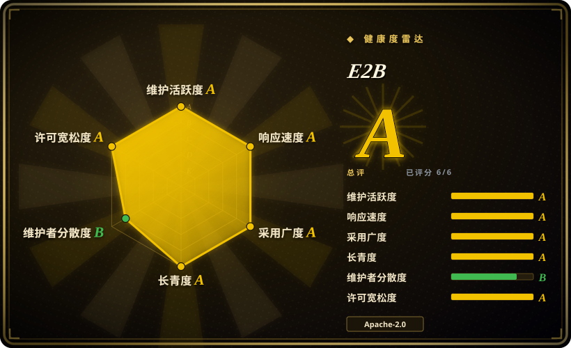
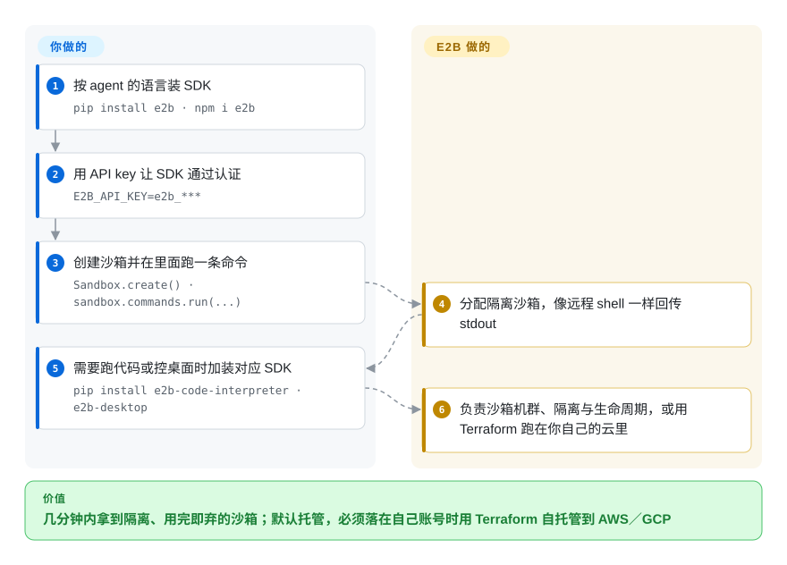

# E2B

以 SDK 形态交付的 AI 生成代码沙箱——Python／JS 里 `Sandbox.create()` 加一套命令 API，另有跑代码片段的 Code Interpreter 变体和做图形界面控制的 Desktop 变体；默认走托管，沙箱必须留在自己云里时用 Terraform 自托管。

## 何时使用

你在做 agent 或代码生成功能，模型需要有个地方跑它刚生成的代码：装依赖、读写文件、执行脚本、驱动浏览器或桌面。自己搭这套东西意味着要拥有一支虚拟机／容器机群、一套执行 API、镜像管理与隔离，产品还没开始做事就先烧掉几周平台工作。E2B 把它压缩成一次 SDK 调用：装上 `e2b`、配好 API key、创建沙箱并在里面跑命令（`Sandbox.create()`、`sandbox.commands.run(...)`），另有兄弟 SDK 分别负责代码解释（持久内核、结构化结果）和桌面控制（启动应用、截图、推流）。想把**沙箱**这层整个抽象掉、并且愿意让服务商按量计费时，它是最快的路；需要沙箱落在自己云里时它也是诚实的选择，因为运行时开源、可用 Terraform 自托管到 AWS／GCP。与 [OpenSandbox](opensandbox.zh.md) 的决定性取舍是「托管优先」还是「自建优先」：E2B 主打打磨过的托管服务与 SDK，自托管是一套你自己拥有的 Terraform 部署；OpenSandbox 则是自托管优先、且沙箱协议可扩展。与 [Agent Substrate](substrate.zh.md) 相比，E2B 给你的是一个按需沙箱，Substrate 给的是让长生命周期有状态会话在少数机器上挤出密度的能力。

## 怎么用起来

E2B 是一层控制面加一套运行时，前面架着各语言 SDK。你安装 SDK（`pip install e2b` 或 `npm i e2b`），用 API key 认证（`E2B_API_KEY=e2b_***`）；接着 `Sandbox.create()` 在 E2B 的基础设施里分配一个隔离沙箱，交给你一个句柄，带文件系统、进程与命令 API——`sandbox.commands.run('echo "Hello from E2B!"')` 像远程 shell 一样返回 stdout。两个专项能力是单独的包：Code Interpreter SDK（`pip install e2b-code-interpreter`）加上 `sandbox.runCode(...)`，带持久内核与结构化执行结果；Desktop SDK（`pip install e2b-desktop`）加上鼠标／键盘／截图／应用控制与桌面推流，供 computer-use 类 agent 使用。E2B 负责的是沙箱机群、隔离边界、镜像与环境管线以及那套 API；你负责的是 agent 逻辑、调哪些 SDK 方法，以及——如果你自托管——把运行时用 Terraform 部署进自己 AWS／GCP 账号这件事。

<!-- flow-steps:begin (generated from flows/e2b.json by tools/flow_card.py — do not edit) -->

流程文字版

1. **你**：按 agent 的语言装 SDK — `pip install e2b · npm i e2b`
2. **你**：用 API key 让 SDK 通过认证 — `E2B_API_KEY=e2b_***`
3. **你**：创建沙箱并在里面跑一条命令 — `Sandbox.create() · sandbox.commands.run(...)`
4. **E2B**：分配隔离沙箱，像远程 shell 一样回传 stdout
5. **你**：需要跑代码或控桌面时加装对应 SDK — `pip install e2b-code-interpreter · e2b-desktop`
6. **E2B**：负责沙箱机群、隔离与生命周期，或用 Terraform 跑在你自己的云里

**价值**：几分钟内拿到隔离、用完即弃的沙箱；默认托管，必须落在自己账号时用 Terraform 自托管到 AWS／GCP

<!-- flow-steps:end -->

## 何时不用

- **你要在项目不支持的基础设施上自托管。** 自托管指南覆盖的是 AWS 与 GCP 的 Terraform；Azure 与通用 Linux 机器明确标为未勾选。想要自托管优先、云厂商无关的平台，用 [OpenSandbox](opensandbox.zh.md)。
- **沙箱必须跨请求存活并保留进程内存。** E2B 沙箱是代码的执行环境，不是可暂停／恢复的长驻有状态 agent。要「几百个有状态会话挤在少数机器上、从快照恢复」，用 [Agent Substrate](substrate.zh.md)。
- **你想端到端自己掌控隔离原语。** 威胁模型要求你自己构建 microVM／容器边界并推理其内核，就从 [Firecracker](firecracker.zh.md) 或 [gVisor](gvisor.zh.md) 起步，而不是用一个把它藏起来的平台。
- **你只需要容器，不需要沙箱。** 普通负载就该待在普通容器里；E2B 面向的是不可信代码这一情形。同理，负载是稳态而非脉冲式时，按次计费的沙箱服务不是经济形态。
- **你不能依赖托管服务的可用性或数据位置。** 走托管就意味着服务商的控制面与区域选择适用；延迟、数据驻留或厂商独立性是硬约束时，要么自托管（仅 AWS／GCP），要么选自托管优先的替代品。
- **你不愿跟着快速迭代的 SDK 跑。** 这些 SDK 年轻且发版频繁；产品吸收不了破坏性变更时，请刻意锁版本并为升级留预算。[推断]

## 横向对比

| 替代品 | 是否收录 | 我们的评价 | 取舍 |
|---|---|---|---|
| [OpenSandbox](opensandbox.zh.md) | ✅ | 想要自托管优先、带文档化沙箱协议与可扩展多语言 SDK 的平台，选 OpenSandbox；想要最快拿到能用的沙箱（先托管、后 Terraform 自托管），选 E2B。 | E2B 优化的是「第一次开出沙箱」的时间，并把自托管当作一次 AWS／GCP 部署；OpenSandbox 优化的是自托管可控性与可扩展性，代价是平台得你自己跑。 |
| [Modal 客户端 SDK](modal-client.zh.md) | ✅ | 你还想顺带要 serverless GPU／函数、且能接受一个完全托管、闭源（客户端 SDK 开源）的平台，选 Modal；要求沙箱运行时本身开源可自托管，选 E2B。 | 两者都把沙箱抽象掉；Modal 是更宽、但你无法自托管的云平台，E2B 的运行时你能自托管——代价是产品面更窄。 |
| [Agent Substrate](substrate.zh.md) | ✅ | agent 长生命周期、大量时间闲置、真正的问题是 pod 密度与快照恢复，选 Substrate；问题是「现在就把这段代码／这个任务隔离跑掉」，选 E2B。 | Substrate 的暂停／恢复多路复用与一次性执行沙箱是两种价值主张；二者可以叠加（Substrate 里跑沙箱型负载），而不是互相替代。 |
| [gVisor](gvisor.zh.md) | ✅ | 平台团队愿意自己拥有隔离层与编排，选 gVisor；想要隔离层连同编排一起以 API 交付，选 E2B。 | 直接用 gVisor 每个沙箱更便宜、也完全在你控制之下，但生命周期、镜像处理与凭据管线中的每一块都变成你的开发工作。 |

## 技术栈

- **SDK：** Python（PyPI 上的 `e2b`）与 JavaScript／TypeScript（npm 上的 `e2b`），另有 `e2b-code-interpreter`（Python／JS）与 `e2b-desktop`（Python／JS）分别对应解释器与图形界面控制面。仓库主要语言是 JavaScript。
- **运行底座：** 一套开源运行时，既作为 E2B 的托管基础设施、也可用 Terraform 自托管（AWS／GCP）——运行时仓库是 `e2b-dev/runtime`（由 `e2b-dev/infra` 更名而来）。
- **能力面：** 沙箱生命周期加命令／文件系统 API；带持久内核与结构化结果的 Code Interpreter；供 computer-use agent 使用的 Desktop（Chrome／应用、截图、推流）。
- **生态：** 一个 cookbook 仓库收录各框架与模型的示例，另有跨 agent 框架的集成。[未验证]

## 依赖

- **托管路径：** 一个 E2B 账号与 API key（`E2B_API_KEY`）——沙箱机群、隔离与镜像都是服务商的事。
- **自托管路径：** Terraform 加一个 AWS 或 GCP 账号（按 README 的勾选清单，Azure 与通用 Linux 不支持），以及你自己部署那套运行时的运维责任。
- **客户端：** 视 SDK 而定，需要 Python 3.x 以上或 Node.js 工具链；解释器与桌面能力各自还要装额外的包。
- **托管路径需要能访问控制面**；自托管则用你自己部署的可用性换掉了这一依赖。

## 运维难度

**托管路径低，自托管高。** 用托管版 E2B 就是装个 SDK 加一个 key——确实几分钟，机群、隔离与扩容都归服务商。自托管把它整个反转：你要用 Terraform 把运行时部署进自己的云，也就是在自己的账号里运营沙箱基础设施、镜像与生命周期。这个落差正是要把模式说清楚的原因：同一个 SDK 前面是两种完全不同的运维现实。

## 健康度与可持续性

- **维护活跃度（2026-09-20）。** 非常活跃：最后推送 2026-09-19，约 13.9k stars，创建于 2023-03，SDK 持续发布到 PyPI／npm，README 里挂着月下载量徽章。未归档。
- **治理与 bus factor（2026-09-20）。** 公司主导（E2B，一家有融资的创业公司）加开源仓库；issue／PR 由公司团队处理。[推断] 没有基金会治理，所以开源运行时的路线图最终由公司决定。
- **背书与 Lindy（2026-09-20）。** 创建于 2023-03，约三年半，Lindy 给一点信用：不是昙花一现，也还没到十年验证级依赖。创业公司背书意味着 SDK／运行时**今天**资金充足；长期风险是商业性的而非技术性的。[推断]
- **采用与生态（2026-09-20）。** 对它的年龄来说，实测采用度很强：评分器读到 `e2b` 包在 npm 上 6090674 次月下载（约 609 万，采用广度 A），对已提 issue 的响应在小时级（35 个合格 issue 的首响中位数约 1.4 小时），周围还有 cookbook 与广泛的 agent 框架集成活动。自托管路径是真实的 Terraform 代码（不只是承诺），对需要退路的团队来说是重要的可持续性信号。[未验证] cookbook 与集成清单本页未逐项枚举。
- **风险旗标（2026-09-20）。** 结构性的是托管服务依赖与创业公司寿命；两者都不是治理丑闻，但产品押在它上面时都需要权衡。许可方面没有疑点（Apache-2.0）。

## 存疑（未验证）

- [未验证] 注册表下载量来自评分器的时点读取（npm，约每月 609 万），未做趋势核对。
- [推断] 公司主导的治理与创业公司寿命风险，是从仓库归属与融资模式推断的，不是来自公开的治理文档。
- [未验证] 自托管路径的完整度（Terraform 究竟部署哪些组件、升级方式、与托管版的功能对齐程度）除 README 的勾选清单外未核实。
- [未验证] cookbook 与框架集成生态未逐项枚举；「跨框架集成」是概括性说法。
- [未验证] 托管沙箱的延迟、冷启动与并发上限本页未给出；定容量前请查服务商当前文档。
- [推断] 横向对比表按层次（托管 vs 自托管、执行沙箱 vs 有状态会话运行时）作定位判断，不是实测比较。
