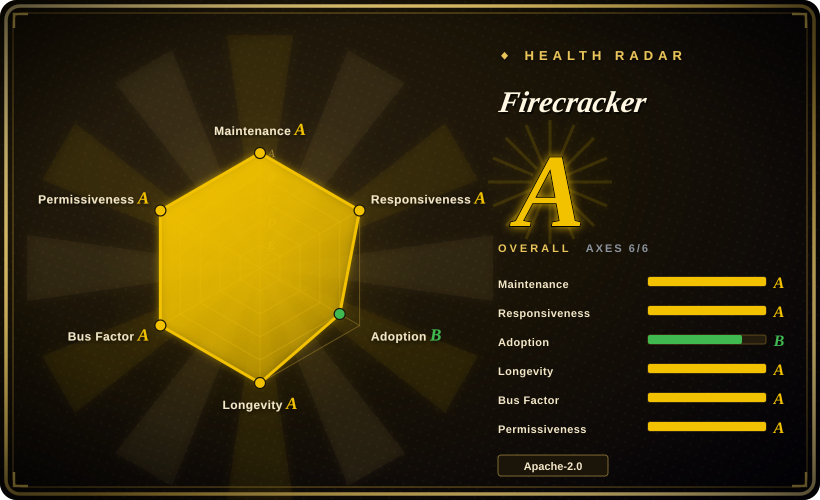
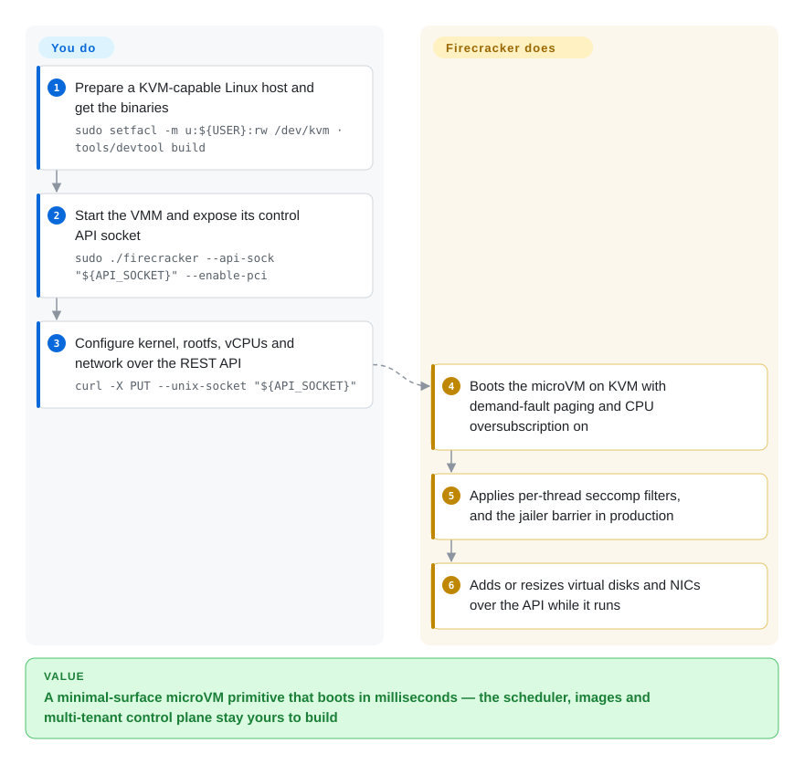

# Firecracker

A minimalist virtual machine monitor built on KVM, purpose-made for running untrusted workloads as microVMs: it is the isolation *primitive* under serverless platforms (AWS Lambda, Fargate) rather than a platform you can adopt as-is.

## When to use

You are building the sandbox layer yourself — a function platform, a CI runner fleet, an agent execution service — and you need per-tenant virtual machines that boot in milliseconds with a device surface small enough to reason about. Firecracker is the right primitive when you have decided to own the control plane: you want to configure vCPU count, memory, disks, network interfaces and rate limiters over a local API, run each VMM behind a jailer for privilege and namespace isolation, and keep the guest-facing feature set deliberately thin so that the attack surface and the memory footprint stay small. It is also the honest choice when you have outgrown container isolation but cannot run a heavyweight hypervisor per workload. What you get is a single Rust binary with an OpenAPI-specified control endpoint, demand-fault paging and CPU oversubscription on by default, and a published specification/performance bar enforced by CI. What you do **not** get — and this is the deciding tradeoff against [Kata Containers](kata-containers.md) — is anything that knows what a container is: no image handling, no CRI, no orchestrator, no snapshot lifecycle management. Choose Firecracker to build the platform; choose Kata or [Agent Substrate](substrate.md) to consume one.

## How it works

Firecracker is a VMM process: you prepare the host (KVM access, and for production the host setup the project documents), obtain the `firecracker` and `jailer` binaries, and start the VMM with a Unix socket exposed as its control API (`./firecracker --api-sock "${API_SOCKET}"`). Everything else is driven over that REST API — you configure the kernel image, the root filesystem, the number of vCPUs, memory size, network interfaces and disks by issuing `PUT` requests (`curl -X PUT --unix-socket "${API_SOCKET}" …`), and the microVM boots. From then on the VMM exposes only a small set of virtio devices, applies thread-specific seccomp filters, and (in production) runs inside the `jailer`, which sets up a cgroup/namespace barrier and drops privileges. The guest gets a real kernel, so semantics are the real thing; the host gets a minimal, auditable device model. Your responsibility starts above that line: images, VMs-forever lifecycle, scheduling, snapshots if you want them, and multi-tenancy policy are all yours to build.

<!-- flow-steps:begin (generated from flows/firecracker.json by tools/flow_card.py — do not edit) -->

Text version of the flow

1. **You**: Prepare a KVM-capable Linux host and get the binaries — `sudo setfacl -m u:${USER}:rw /dev/kvm · tools/devtool build`
2. **You**: Start the VMM and expose its control API socket — `sudo ./firecracker --api-sock "${API_SOCKET}" --enable-pci`
3. **You**: Configure kernel, rootfs, vCPUs and network over the REST API — `curl -X PUT --unix-socket "${API_SOCKET}"`
4. **Firecracker**: Boots the microVM on KVM with demand-fault paging and CPU oversubscription on
5. **Firecracker**: Applies per-thread seccomp filters, and the jailer barrier in production
6. **Firecracker**: Adds or resizes virtual disks and NICs over the API while it runs

**Value**: A minimal-surface microVM primitive that boots in milliseconds — the scheduler, images and multi-tenant control plane stay yours to build

<!-- flow-steps:end -->

## When NOT to use

- **You want a container runtime, not a VMM.** Firecracker does not know about OCI images, pods or runtimes. For "run this image with VM isolation in my cluster", use [Kata Containers](kata-containers.md); for a userspace-kernel alternative without KVM, use [gVisor](gvisor.md).
- **You want a finished sandbox service.** If you need an API, SDK, credentials and lifecycle out of the box, use [OpenSandbox](opensandbox.md), [E2B](e2b.md) or [Agent Substrate](substrate.md) — several of which run Firecracker-class microVMs underneath, so you are choosing between "build" and "buy/integrate".
- **You cannot dedicate bare-metal or nested-virtualization hosts.** The project's tested matrix is AWS metal instances; on top of ordinary cloud VMs you need nested virtualization, which many providers disable. If that is your environment, plan on [gVisor](gvisor.md) instead.
- **Your team is not prepared to operate a virtualization stack.** Host hardening, kernel/rootfs image pipelines, device plumbing, jailer configuration and per-microVM resource accounting are all on you. That is a platform team's job, not a side task.
- **You need non-Linux or architecture-agnostic portability.** Firecracker runs on Linux with KVM on x86_64/aarch64 and a tested set of instance types; there is no Windows/macOS host story.
- **You need live migration or kernel-level features the minimal device model omits.** Then a general-purpose hypervisor is the right tool, not Firecracker.

## Comparison

| Alternative | In index | Our verdict | Tradeoff |
|---|---|---|---|
| [Kata Containers](kata-containers.md) | ✅ | Choose Kata when you want VM-isolated containers in Kubernetes without writing the platform; choose Firecracker when you are the platform and want the smallest possible VMM. | Kata is a finished container-runtime integration (shim, agent, runtime classes, node deployment); Firecracker is a component that stops at the microVM boundary so you control everything above it — and must build it. |
| [gVisor](gvisor.md) | ✅ | Choose gVisor when you cannot get KVM or want process-like startup and don't need a real kernel; choose Firecracker when you need hypervisor-grade isolation and can supply KVM. | gVisor emulates syscalls in userspace (no KVM, partial semantics); Firecracker runs real kernels with minimal devices (KVM required, full semantics, VM-shaped operations). |
| [Agent Substrate](substrate.md) | ✅ | Choose Substrate when the problem is *density* — many idle stateful agents on few machines with snapshot suspend/resume; choose Firecracker when you are building the execution primitive underneath such a system. | Substrate also isolates with microVMs/`runsc` but its value is the multiplexing control plane; Firecracker gives you neither the scheduler nor snapshot lifecycle, only the VM. |
| [E2B](e2b.md) / [OpenSandbox](opensandbox.md) | ✅ | Choose these when you want sandboxes as a product (hosted or self-hosted platform); choose Firecracker when you must own the sandbox layer and its threat model. | The platforms are built on microVM/container runtimes and spare you the control plane, at the cost of adopting their abstractions, upgrade cadence and (for E2B hosted) their infrastructure. |
| QEMU / general-purpose hypervisors | 未收录 | Choose QEMU when you need a broad device model, non-KVM accelerators or full-machine emulation; choose Firecracker when the device model is attack surface and you want it minimal. | QEMU does far more (and is far larger); Firecracker deliberately excludes devices and guest-facing features. Kept as out-of-scope here: comparing general-purpose hypervisors is a different, much larger selection question than "isolation primitive for serverless-style workloads". |

## Tech stack

- **Language:** Rust; a single VMM process plus the `jailer`.
- **Isolation mechanisms:** KVM for virtualization, thread-specific seccomp filters, optional jailer (cgroup/namespace barrier plus privilege drop), a deliberately minimal virtio device set.
- **Control surface:** a REST API over a Unix socket, specified in OpenAPI (`src/firecracker/swagger/firecracker.yaml`) — configure vCPUs, memory, CPU templates, disks, NICs, rate limiters, vsock, entropy and pmem devices; [BETA] guest metadata service; [Developer Preview] PCI device hot-plug.
- **Build/CI:** a `devtool` container-based build and test harness; specifications in `SPECIFICATION.md` are enforced by CI.
- **Guest side:** you supply the guest kernel and rootfs (the project publishes a getting-started image recipe, not a distribution).

## Dependencies

- **Linux host with KVM** — `/dev/kvm` accessible to the user running Firecracker (`sudo setfacl -m u:${USER}:rw /dev/kvm` is the documented quick-start step), and the production host configuration described in `docs/prod-host-setup.md`.
- **Guest kernel and root filesystem images** you build or supply; boot arguments are yours.
- **Rust/Docker toolchain** if you build from source (`tools/devtool build`); release binaries are published on GitHub releases.
- **A control plane of your own** for anything beyond one VM: image distribution, scheduling, networking, IP allocation, rate limiting policy, metrics and cleanup.
- **A production host profile**: the project's tested platform matrix is AWS EC2 metal instances; other hosts are "works, but you validate it".

## Ops difficulty

**High.** You are operating a virtualization fleet: host kernel/KVM configuration, jailer and cgroup policy, guest image pipelines, per-microVM accounting and cleanup, plus whatever orchestration you wrote on top. The upside is that the moving parts are deliberately few and well specified; the downside is that nothing above the VMM exists until you build it, and mistakes in host setup or jailer configuration are security-relevant rather than merely inconvenient.

## Health & viability

- **Maintenance (2026-09-20).** Very active and steady: last push 2026-09-18, ~36.8k stars, created 2017-10, releases roughly every two to three months with a published release policy and changelog. Not archived.
- **Governance / bus factor (2026-09-20).** AWS-originated and AWS-maintained (maintainer contact is an Amazon mailing list), with a project charter, security policy and code of conduct. Corporate-led with a public process rather than foundation governance. [推断]
- **Backing & Lindy (2026-09-20).** Nearly nine years old and still shipping, and it is the virtualization layer under AWS Lambda and Fargate — the strongest possible "still active, actually used at scale" signal for the Lindy prior. [推断] The AWS-product claim is the project's own statement, not independently audited here.
- **Adoption & ecosystem (2026-09-20).** Widely embedded: [Kata Containers](kata-containers.md) supports it as a hypervisor backend, and other VMM-consuming platforms (Flintlock, serverless frameworks) build on it. Guest-side tooling (kernel configs, rootfs builders, snapshotting) is a third-party ecosystem rather than part of the repo.
- **Risk flags (2026-09-20).** Single-vendor control is the structural one: roadmap and maintainership are AWS's. No license or relicense concerns; no deprecation signals. Host requirements (metal/nested virt) are the practical adoption tax.

## Caveats (unverified)

- [未验证] The AWS Lambda/Fargate dependency is stated by the project's own README and was not independently audited for this page.
- [未验证] Boot-time and density figures are not reproduced here; the authoritative numbers live in the repo's `SPECIFICATION.md`, which was not read in detail.
- [未验证] The exactly-supported release cadence ("typically every two or three months") is the README's phrasing; actual tagging was not enumerated.
- [未验证] Whether current releases build and run outside the tested AWS instance matrix was not verified; treat other hosts as "validate yourself".
- [推断] The Comparison rows against QEMU/general-purpose hypervisors and against nested-microVM platform approaches are positioning statements, not measured comparisons.

