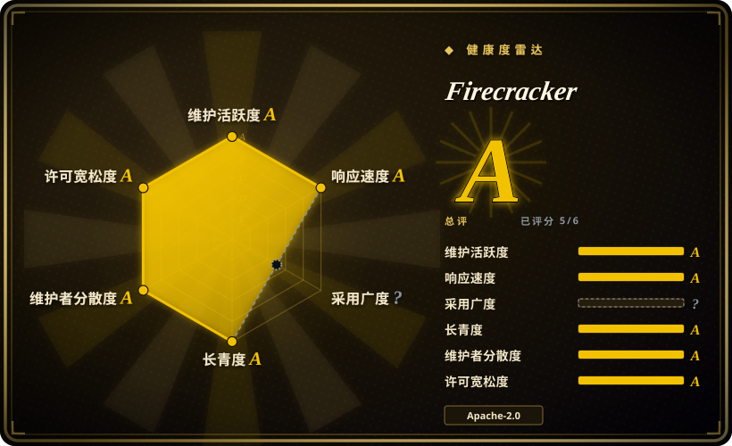
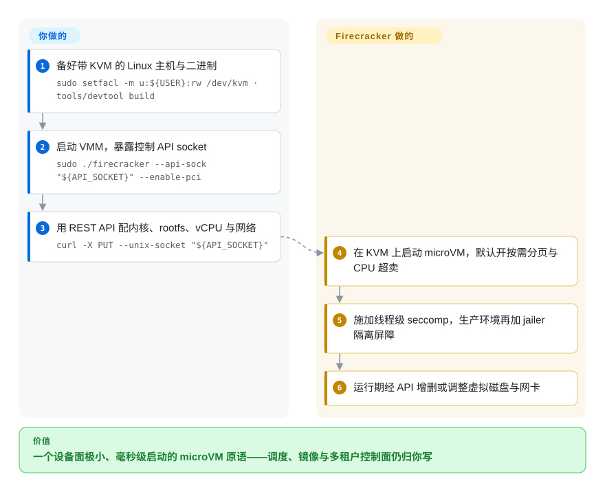

# Firecracker

基于 KVM 的极简虚拟机监控器，专为把不可信负载跑成 microVM 而生：它是 serverless 平台（AWS Lambda、Fargate）下面那层隔离**原语**，而不是一个拿来即用的平台。

## 何时使用

你在自建沙箱层——函数平台、CI runner 机群、agent 执行服务——并且需要每租户一台毫秒级启动、设备面小到可以推理的虚拟机。Firecracker 适合的场景是你已经决定自己掌控控制面：想通过本地 API 配置 vCPU 数、内存、磁盘、网卡和限速器，想让每个 VMM 跑在 jailer 后面获得权限与命名空间隔离，并且刻意让面向客户机的功能集保持稀薄，以压住攻击面和内存占用。容器隔离已经不够、又不愿意为每个负载跑一个重型 hypervisor 时，它也是诚实的答案。你拿到的是一个 Rust 单二进制、一个用 OpenAPI 描述的控制端点、默认开启的按需分页与 CPU 超卖，以及一套由 CI 强制执行的规格与性能下限。你**拿不到**的（也正是与 [Kata Containers](kata-containers.zh.md) 的决定性取舍）是任何懂「容器」的东西：没有镜像处理、没有 CRI、没有编排器、没有快照生命周期管理。要**建**平台就选 Firecracker，要**用**平台就选 Kata 或 [Agent Substrate](substrate.zh.md)。

## 怎么用起来

Firecracker 就是一个 VMM 进程：先准备宿主（KVM 权限，生产环境还要照项目文档做主机加固），拿到 `firecracker` 与 `jailer` 二进制，然后用一个 Unix socket 作为控制 API 启动 VMM（`./firecracker --api-sock "${API_SOCKET}"`）。之后一切通过那个 REST API 驱动——用 `PUT` 请求配置内核镜像、rootfs、vCPU 数、内存、网卡与磁盘（`curl -X PUT --unix-socket "${API_SOCKET}" …`），microVM 随即启动。此后 VMM 只暴露一小组 virtio 设备，施加线程级 seccomp 过滤，并在生产环境跑在 `jailer` 里——由它建立 cgroup／命名空间屏障并降权。客户机拿到真内核，语义是真的；宿主拿到一个极小、可审计的设备模型。你的责任从这条线往上开始：镜像、虚拟机生命周期、调度、快照（如果你要）、多租户策略，全都得你建。

<!-- flow-steps:begin (generated from flows/firecracker.json by tools/flow_card.py — do not edit) -->

流程文字版

1. **你**：备好带 KVM 的 Linux 主机与二进制 — `sudo setfacl -m u:${USER}:rw /dev/kvm · tools/devtool build`
2. **你**：启动 VMM，暴露控制 API socket — `sudo ./firecracker --api-sock "${API_SOCKET}" --enable-pci`
3. **你**：用 REST API 配内核、rootfs、vCPU 与网络 — `curl -X PUT --unix-socket "${API_SOCKET}"`
4. **Firecracker**：在 KVM 上启动 microVM，默认开按需分页与 CPU 超卖
5. **Firecracker**：施加线程级 seccomp，生产环境再加 jailer 隔离屏障
6. **Firecracker**：运行期经 API 增删或调整虚拟磁盘与网卡

**价值**：一个设备面极小、毫秒级启动的 microVM 原语——调度、镜像与多租户控制面仍归你写

<!-- flow-steps:end -->

## 何时不用

- **你要的是容器运行时，不是 VMM。** Firecracker 不懂 OCI 镜像、pod 或 runtime。想在集群里「用虚拟机隔离跑这个镜像」，用 [Kata Containers](kata-containers.zh.md)；想要不用 KVM 的用户态内核方案，用 [gVisor](gvisor.zh.md)。
- **你要一套现成的沙箱服务。** 需要开箱即用的 API、SDK、凭据与生命周期，就用 [OpenSandbox](opensandbox.zh.md)、[E2B](e2b.zh.md) 或 [Agent Substrate](substrate.zh.md)——其中几个底层跑的就是 Firecracker 一类 microVM，所以这里选的是「自建」还是「集成／购买」。
- **你拿不到裸金属或嵌套虚拟化的主机。** 项目实测矩阵是 AWS metal 实例；在普通云主机上你需要嵌套虚拟化，而不少厂商会关掉它。环境如此就改规划用 [gVisor](gvisor.zh.md)。
- **团队没准备好运营一套虚拟化栈。** 主机加固、内核／rootfs 镜像流水线、设备管线、jailer 配置、逐 microVM 资源核算都是你的事。这是平台团队的活，不是顺手做的小任务。
- **你需要非 Linux 或跨架构的可移植性。** Firecracker 跑在带 KVM 的 Linux 上（x86_64／aarch64 与一批实测机型），没有 Windows／macOS 宿主方案。
- **你需要热迁移，或极简设备模型刻意不提供的那些内核能力。** 那就该用通用 hypervisor，而不是 Firecracker。

## 横向对比

| 替代品 | 是否收录 | 我们的评价 | 取舍 |
|---|---|---|---|
| [Kata Containers](kata-containers.zh.md) | ✅ | 想在 Kubernetes 里用虚拟机隔离的容器、又不想自己写平台，选 Kata；你自己就是平台、想要尽可能小的 VMM，选 Firecracker。 | Kata 是做完的容器运行时集成（shim、agent、runtime class、节点部署）；Firecracker 是止步于 microVM 边界的组件，所以边界之上的一切归你控制，也归你建。 |
| [gVisor](gvisor.zh.md) | ✅ | 拿不到 KVM、想要进程级启动且不需要真内核，选 gVisor；需要 hypervisor 级隔离且能提供 KVM，选 Firecracker。 | gVisor 在用户态模拟系统调用（不用 KVM、语义有缺口）；Firecracker 跑真内核、设备面极小（必须要 KVM、语义完整、操作形态是虚拟机）。 |
| [Agent Substrate](substrate.zh.md) | ✅ | 问题是**密度**——大量空闲有状态 agent 挤在少数机器上、靠快照暂停／恢复，选 Substrate；你在建这类系统下面那个执行原语，选 Firecracker。 | Substrate 也用 microVM／`runsc` 做隔离，但它的价值是多路复用控制面；Firecracker 既不给调度器也不给快照生命周期，只给虚拟机。 |
| [E2B](e2b.zh.md)／[OpenSandbox](opensandbox.zh.md) | ✅ | 想要以产品形态拿到沙箱（托管或自托管平台），选这两个；必须自己掌握沙箱层及其威胁模型，选 Firecracker。 | 平台建在 microVM／容器运行时之上，替你省掉控制面，代价是接受它们的抽象、升级节奏，以及（E2B 托管形态下）它们的基础设施。 |
| QEMU／通用 hypervisor | 未收录 | 需要宽泛设备模型、非 KVM 加速器或全机模拟时选 QEMU；设备模型本身就是攻击面、想让它尽量小时选 Firecracker。 | QEMU 能做多得多的事（体量也大得多）；Firecracker 刻意排除设备与面向客户机的功能。这里按范围外处理：通用 hypervisor 的对比是另一个大得多的选型题，不是「serverless 型负载的隔离原语」这一层。 |

## 技术栈

- **语言：** Rust；一个 VMM 进程加上 `jailer`。
- **隔离机制：** KVM 做虚拟化、线程级 seccomp 过滤、可选 jailer（cgroup／命名空间屏障加降权）、刻意精简的 virtio 设备集。
- **控制面：** Unix socket 上的 REST API，用 OpenAPI 描述（`src/firecracker/swagger/firecracker.yaml`）——配置 vCPU、内存、CPU 模板、磁盘、网卡、限速器、vsock、熵源与 pmem 设备；[BETA] 客户机元数据服务；[开发者预览] PCI 设备热插拔。
- **构建与 CI：** 基于容器的 `devtool` 构建测试链；`SPECIFICATION.md` 里的规格由 CI 强制执行。
- **客户机一侧：** 内核与 rootfs 由你提供（项目给的是快速上手镜像配方，不是发行版）。

## 依赖

- **带 KVM 的 Linux 主机**——运行 Firecracker 的用户要有 `/dev/kvm` 权限（文档里的快速上手步骤是 `sudo setfacl -m u:${USER}:rw /dev/kvm`），并按 `docs/prod-host-setup.md` 做生产主机加固。
- **客户机内核与根文件系统镜像**，由你构建或提供；启动参数也是你的事。
- **从源码构建时的 Rust／Docker 工具链**（`tools/devtool build`）；官方也在 GitHub releases 发布二进制。
- **你自己的控制面**：只要不止一台虚拟机，镜像分发、调度、网络、IP 分配、限速策略、指标与回收都得你写。
- **生产主机画像**：项目实测平台矩阵是 AWS EC2 metal 实例；其他主机属于「能跑，但由你验证」。

## 运维难度

**高。** 你在运营一个虚拟化机群：宿主内核／KVM 配置、jailer 与 cgroup 策略、客户机镜像流水线、逐 microVM 核算与回收，再加上你自建的那层编排。好处是活动的部件刻意很少、规格写得很清楚；坏处是 VMM 之上的一切在建成之前都不存在，而主机设置或 jailer 配置上的错误属于安全问题，不只是麻烦。

## 健康度与可持续性

- **维护活跃度（2026-09-20）。** 非常活跃且稳定：最后推送 2026-09-18，约 36.8k stars，创建于 2017-10，大致每两到三个月一次发布，并有公开的发布策略与变更日志。未归档。
- **治理与 bus factor（2026-09-20）。** 源自 AWS、由 AWS 维护（维护者联系方式是 Amazon 邮件列表），有项目章程、安全策略与行为准则。属于公开流程的公司主导，而非基金会治理。[推断]
- **背书与 Lindy（2026-09-20）。** 近九年且仍在发布，而且它是 AWS Lambda 与 Fargate 下面的虚拟化层——对 Lindy 先验来说，这是「仍在活跃且确实被大规模使用」最强的信号。[推断] 「被 AWS 产品使用」是项目自述，本页未独立审计。
- **采用与生态（2026-09-20）。** 被广泛嵌入：[Kata Containers](kata-containers.zh.md) 把它作为 hypervisor 后端之一，其他消费 VMM 的平台（Flintlock、各类 serverless 框架）也建在它上面。客户机侧工具链（内核配置、rootfs 构建器、快照）属于第三方生态，不在本仓库内。
- **风险旗标（2026-09-20）。** 结构性风险是单一厂商掌控：路线图与维护归属 AWS。许可与 relicense 没有疑点，也没有弃用信号。主机要求（裸金属／嵌套虚拟化）是实际采用成本。

## 存疑（未验证）

- [未验证] 「AWS Lambda／Fargate 依赖它」来自项目 README 自述，本页未独立审计。
- [未验证] 启动时间与密度数字未在本页复现；权威数据在仓库的 `SPECIFICATION.md` 里，本次未细读。
- [未验证] 发布节奏「大致每两到三个月」是 README 的说法；实际打 tag 情况未逐条枚举。
- [未验证] 当前版本是否能在实测 AWS 机型矩阵之外构建运行未核实；其他主机请按「自行验证」对待。
- [推断] 与 QEMU／通用 hypervisor、以及与嵌套 microVM 平台路线的对比行属定位性陈述，非实测比较。
