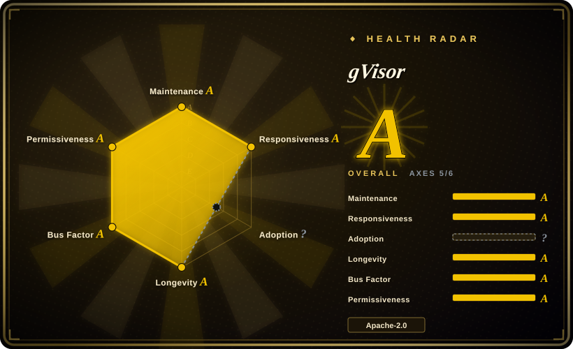
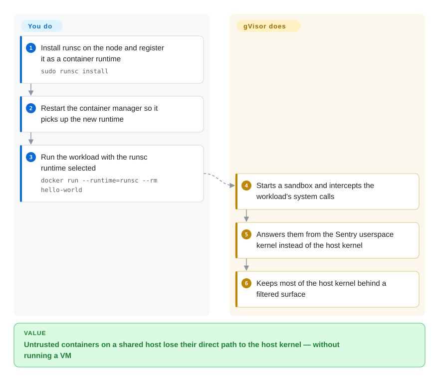

# gVisor

An application kernel written in Go that runs in userspace: it gives containers VM-grade isolation of the host kernel without running a VM — you keep your container workflow and swap the OCI runtime for `runsc`.

## When to use

You run untrusted or multi-tenant code — other people's containers, agent-generated code, a customer-provided image — on hosts you also care about, and plain container isolation is not a boundary you are willing to defend: one kernel vulnerability is a container escape. Splitting every workload into its own VM solves that but costs you a hypervisor, guest kernel, and (on most cloud nodes) nested virtualization you may not have. gVisor is the middle path: the workload's syscalls are answered by a userspace kernel instead of the host kernel, so the attacker's reachable kernel surface is gVisor's Go code rather than Linux's C. You reach for it when you want to keep Docker/Kubernetes exactly as-is and add *process-level* isolation: install `runsc` on the node, register it as a runtime, and select it per container (`docker run --runtime=runsc`) or per pod (`runtimeClassName`). The deciding tradeoff against [Kata Containers](kata-containers.md) is that gVisor needs no hardware virtualization (so it works on nested/cloud nodes where KVM is unavailable) and starts like a process, while Kata gives you a real kernel in a real VM at the cost of KVM and per-pod VM overhead.

## How it works

`runsc` is an OCI runtime that replaces `runc`. When a container starts, its processes are placed inside a *sandbox* whose Linux system calls are intercepted and implemented by the Sentry — a kernel written in Go that runs as an ordinary userspace process on the host. The workload keeps seeing a Linux ABI (`/proc`, `dmesg`, sockets, files) so most images run unmodified, while the host kernel only sees a small, filtered set of operations from the Sentry. Your side of the contract is small: build or download `runsc` and its sidecar binaries onto the node, register the runtime with your container manager (`sudo runsc install` writes a Docker runtime entry named `runsc`), then run workloads with `--runtime=runsc` or a Kubernetes `RuntimeClass`. Everything else — syscall emulation, networking via netstack, file access through the Gofer — is gVisor's, and it is where the bugs and the performance differences live.

<!-- flow-steps:begin (generated from flows/gvisor.json by tools/flow_card.py — do not edit) -->

Text version of the flow

1. **You**: Install runsc on the node and register it as a container runtime — `sudo runsc install`
2. **You**: Restart the container manager so it picks up the new runtime
3. **You**: Run the workload with the runsc runtime selected — `docker run --runtime=runsc --rm hello-world`
4. **gVisor**: Starts a sandbox and intercepts the workload's system calls
5. **gVisor**: Answers them from the Sentry userspace kernel instead of the host kernel
6. **gVisor**: Keeps most of the host kernel behind a filtered surface

**Value**: Untrusted containers on a shared host lose their direct path to the host kernel — without running a VM

<!-- flow-steps:end -->

## When NOT to use

- **Your workload is syscall-heavy and latency-critical.** Every syscall crosses into the Sentry, so compute- or IO-syscall-bound workloads pay a measurable tax. For that, use plain containers on trusted code, or [Kata Containers](kata-containers.md) if you need VM isolation and can pay the VM boot cost instead.
- **You need exact Linux semantics or privileged features.** Kernel modules, raw device access, `bpf()`/`perf` style introspection, GPU driver stacks and unusual ioctls are incomplete or unsupported by design. Where you need the real kernel, use a VM-based runtime ([Firecracker](firecracker.md), [Kata Containers](kata-containers.md)) or a plain container.
- **You want a sandbox product, not an isolation layer.** gVisor gives you a runtime, not an API, scheduler, or snapshot lifecycle; if you want "hand me a sandbox and let me run code in it", start from [OpenSandbox](opensandbox.md) or [E2B](e2b.md), which drive runtimes like this one for you.
- **You need the isolation boundary to be a hypervisor you can certify.** gVisor is a large userspace kernel with its own security history; if your threat model demands hardware virtualization, use [Firecracker](firecracker.md)-or-[Kata](kata-containers.md)-style microVMs instead of a syscall-intercepting kernel.
- **You cannot install a runtime on nodes you do not control.** Managed container services that do not expose runtime classes give you no way to select `runsc`. There, use a hosted sandbox API ([Modal](modal-client.md)) or run your own cluster.

## Comparison

| Alternative | In index | Our verdict | Tradeoff |
|---|---|---|---|
| [Kata Containers](kata-containers.md) | ✅ | Choose Kata when you want each pod to get a real kernel in a lightweight VM and your hosts expose hardware virtualization; choose gVisor when you need sandboxing without KVM and process-like startup. | Kata's isolation is hypervisor-grade but needs `/dev/kvm`/nested virt and pays VM overhead per pod; gVisor works anywhere Linux runs and starts cheaply but answers syscalls in userspace, so semantics and throughput differ. |
| [Firecracker](firecracker.md) | ✅ | Choose Firecracker when you are building the platform layer yourself and want a minimal VMM; choose gVisor when you want isolation you can attach to existing container tooling in an afternoon. | Firecracker hands you a VMM and expects you to write kernel/rootfs/device plumbing and a control plane; gVisor hands you a drop-in OCI runtime but not a platform. |
| [OpenSandbox](opensandbox.md) / [E2B](e2b.md) | ✅ | Choose these platforms when you want a sandbox API for agent code execution; choose gVisor when you only need the isolation primitive under your own orchestration. | The platforms own sandbox lifecycle, SDKs and policy and can drive gVisor/microVMs underneath; picking gVisor directly means the lifecycle, routing and credentials are your problem. |
| Plain `runc` / containerd / Docker defaults | 未收录 | Choose the default runtime when the code is trusted and the container is the boundary you already accept; choose gVisor the moment the workload is untrusted or multi-tenant. | You keep full Linux semantics and performance and add nothing to operate, but you also keep a shared-kernel escape path. (Kept as the baseline you are replacing rather than an alternative to pick; containerd/runc are large general-purpose runtime projects whose own selection question is out of this page's scope.) |
| seccomp / AppArmor / SELinux hardening | 未收录 | Choose syscall filtering and LSMs when you want to shrink a *trusted* workload's privileges; choose gVisor when the workload itself is hostile. | They filter and confine what a process may ask the real kernel; gVisor removes the real kernel from the syscall path entirely. Not a repository-shaped comparison — these ship as kernel/OS features. |

## Tech stack

- **Language:** Go; built with Bazel (a synthetic `go` branch exists for library consumers, but `runsc` builds are supported only from the Bazel build).
- **Core components:** the Sentry (userspace kernel), the Gofer (filesystem access), netstack (userspace TCP/IP), and `runsc` plus the containerd shim `containerd-shim-runsc-v1`.
- **Integration surface:** an OCI runtime registered with Docker/containerd, hence Kubernetes `RuntimeClass` selectable; `runsc install` writes the Docker runtime entry.
- **Platforms:** x86_64 and ARM64 on Linux 5.6+.

## Dependencies

- **A Linux host (5.6+)** with Docker 17.09+ or containerd — the runtime is installed per node.
- **No hardware virtualization required**: unlike VM runtimes it does not need `/dev/kvm`, which is what makes it usable on nested/cloud VMs.
- **Build dependencies** if you build from source: Bazel (wrapped in the project's build container) and Docker; release tarballs are also published per release.
- **Kernel features** used by the sandbox (namespaces, ptrace for some platform modes, seccomp) are the host prerequisites on top of the version floor.

## Ops difficulty

**Medium to high.** Installation is a per-node binary plus a runtime registration, which is genuinely simple — but the operational reality is a node-level isolation layer you must roll out through your fleet, keep version-aligned with your container manager, and debug when a workload behaves differently under emulation (unsupported syscall, changed `/proc`, different performance profile). Debugging spans two kernels (the Sentry and the host), which is a skill your team may not have. The project ships an installation guide, a debugging guide, a security policy and an architecture document, so the knowledge exists — but expect a compatibility test pass before trusting a workload on it.

## Health & viability

- **Maintenance (2026-09-20).** Very active: last push 2026-09-19, ~19.4k stars, created 2018-04, builds on Buildkite with CodeQL scanning. Not archived.
- **Governance / bus factor (2026-09-20).** Google-originated and Google-maintained, with a `GOVERNANCE.md`, `CONTRIBUTING.md`, mailing lists, and an `ADOPTERS.md` for known production users — a corporate-led but openly documented project. [推断] Foundation governance is not evident from the repo.
- **Backing & Lindy (2026-09-20).** Eight years old and still shipping, which is exactly the "old and still active" combination the Lindy prior rewards: the isolation model is proven enough that other platforms build on it, and the codebase has survived multiple Linux kernel generations. [推断]
- **Adoption & ecosystem (2026-09-20).** Used as an isolation option by container platforms and by agent-sandbox products including this index's [OpenSandbox](opensandbox.md) and [Agent Substrate](substrate.md); Google operates it in its own serverless products. [未验证] The precise production adopter list was not read.
- **Risk flags (2026-09-20).** The main one is architectural, not organizational: it is a large syscall-implementing kernel, so its own CVE history is part of your threat model, and performance/compatibility gaps are permanent features of the approach rather than bugs awaiting a fix. [推断]

## Caveats (unverified)

- [未验证] Overhead figures for syscall-heavy, IO-heavy or network-heavy workloads were not measured here; the project publishes guidance but no number on this page is a benchmark.
- [未验证] `ADOPTERS.md` exists but was not read, so the claim that specific products run on it is not a verified adopter list.
- [推断] Hardware requirements (Linux 5.6+, Docker 17.09+) come from the README's from-source build section; release-tarball installs may support a different floor, which was not checked.
- [未验证] Platform-mode specifics (ptrace vs KVM platform) and their performance/security tradeoffs are documented in the project's docs, which were not read in depth.
- [未验证] The Comparison rows against syscall filtering/LSM tools and plain `runc`/containerd are positioning statements, not measured comparisons.

