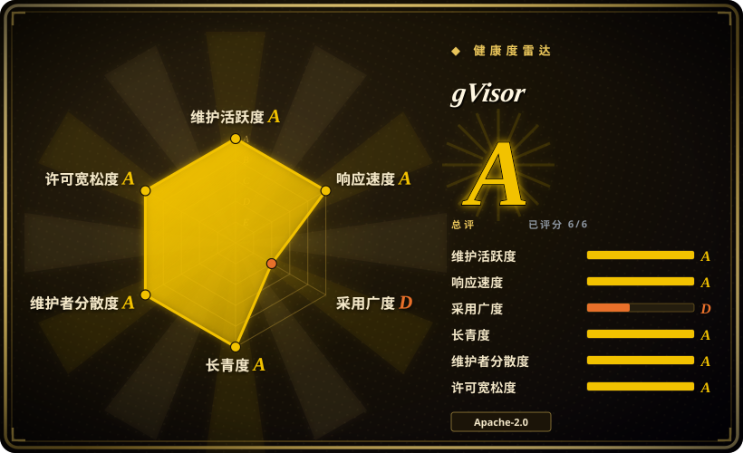
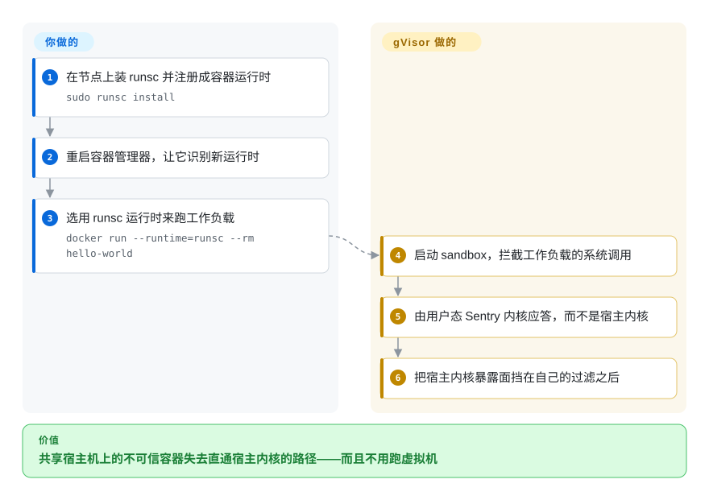

# gVisor

一个用 Go 写的用户态「应用内核」：不跑虚拟机，也能让容器拿到接近虚拟机级别的宿主内核隔离——你保留原有容器工作流，只把 OCI 运行时换成 `runsc`。

## 何时使用

你在自己很在意的机器上跑不可信或多租户代码——别人的容器、agent 生成的代码、客户提供的镜像——而你们并不认可普通容器隔离算一道边界：内核出一个漏洞就是一次容器逃逸。给每个工作负载开一台虚拟机可以解决，代价是要引入 hypervisor、客户机内核，而且多数云节点根本没有嵌套虚拟化。gVisor 是中间路线：工作负载的系统调用由用户态内核应答，而不是宿主内核，于是攻击者能碰到的内核面从 Linux 的 C 代码变成 gVisor 的 Go 代码。适合你的场景是：Docker／Kubernetes 原样不动，只加一层进程级隔离——在节点上装 `runsc`、把它注册成运行时，然后按容器（`docker run --runtime=runsc`）或按 pod（`runtimeClassName`）选用。与 [Kata Containers](kata-containers.zh.md) 的决定性取舍是：gVisor 不需要硬件虚拟化（所以在拿不到 KVM 的嵌套或云节点上照样能用）、启动像一个进程；Kata 给你真内核真虚拟机，代价是 KVM 和每 pod 一台虚拟机的开销。

## 怎么用起来

`runsc` 是一个替代 `runc` 的 OCI 运行时。容器启动后，它的进程被放进一个 sandbox，其中的 Linux 系统调用被 Sentry 拦截并实现——Sentry 就是用 Go 写、作为宿主上的普通用户态进程运行的内核。工作负载仍然看到一个 Linux ABI（`/proc`、`dmesg`、socket、文件），所以大多数镜像无需改动即可运行；而宿主内核只看到 Sentry 发出的一小部分经过滤的操作。你要做的那部分很小：把 `runsc` 及其 sidecar 二进制装到节点上，向容器管理器注册这个运行时（`sudo runsc install` 会写入一个名为 `runsc` 的 Docker 运行时条目），然后用 `--runtime=runsc` 或 Kubernetes 的 `RuntimeClass` 跑工作负载。其余全部——系统调用模拟、基于 netstack 的网络、经由 Gofer 的文件访问——都是 gVisor 的事，bug 与性能差异也都在那里。

<!-- flow-steps:begin (generated from flows/gvisor.json by tools/flow_card.py — do not edit) -->

流程文字版

1. **你**：在节点上装 runsc 并注册成容器运行时 — `sudo runsc install`
2. **你**：重启容器管理器，让它识别新运行时
3. **你**：选用 runsc 运行时来跑工作负载 — `docker run --runtime=runsc --rm hello-world`
4. **gVisor**：启动 sandbox，拦截工作负载的系统调用
5. **gVisor**：由用户态 Sentry 内核应答，而不是宿主内核
6. **gVisor**：把宿主内核暴露面挡在自己的过滤之后

**价值**：共享宿主机上的不可信容器失去直通宿主内核的路径——而且不用跑虚拟机

<!-- flow-steps:end -->

## 何时不用

- **负载是系统调用密集且对延迟敏感。** 每次系统调用都要进 Sentry，计算密集或 IO 系统调用密集的负载会付出可观的税。这种情况请用普通容器跑可信代码；确实需要虚拟机隔离又能接受虚拟机启动成本的，改用 [Kata Containers](kata-containers.zh.md)。
- **你需要精确的 Linux 语义或特权能力。** 内核模块、裸设备访问、`bpf()`／`perf` 之类的内省、GPU 驱动栈以及冷门 ioctl，要么不完整要么按设计不支持。需要真内核时，请用基于虚拟机的运行时（[Firecracker](firecracker.zh.md)、[Kata Containers](kata-containers.zh.md)）或普通容器。
- **你要的是一个沙箱产品，而不是一层隔离。** gVisor 给的是运行时，不是 API、调度器或快照生命周期。想要「给我一个沙箱、我往里跑代码」，请从 [OpenSandbox](opensandbox.zh.md) 或 [E2B](e2b.zh.md) 起步，它们会替你驱动这类运行时。
- **你需要隔离边界是能过审的虚拟机监控器。** gVisor 是一个庞大的用户态内核，有它自己的安全史；如果威胁模型要求硬件虚拟化，请用 [Firecracker](firecracker.zh.md) 或 [Kata](kata-containers.zh.md) 这类 microVM，而不是一个拦截系统调用的内核。
- **你无法在自己不掌控的节点上装运行时。** 不暴露 runtime class 的托管容器服务没有让你选 `runsc` 的入口。这种情况请用托管沙箱 API（[Modal](modal-client.zh.md)），或者自己建集群。

## 横向对比

| 替代品 | 是否收录 | 我们的评价 | 取舍 |
|---|---|---|---|
| [Kata Containers](kata-containers.zh.md) | ✅ | 想让每个 pod 拿到真内核加轻量虚拟机、且宿主机暴露硬件虚拟化，选 Kata；需要在没有 KVM 的情况下做沙箱化、又要像进程一样快速启动，选 gVisor。 | Kata 的隔离是 hypervisor 级的，但要 `/dev/kvm` 或嵌套虚拟化，并承担每 pod 一台虚拟机的开销；gVisor 能跑在任何 Linux 上、启动便宜，但系统调用在用户态应答，语义与吞吐都不同。 |
| [Firecracker](firecracker.zh.md) | ✅ | 你自己在建平台层、只想要一个极简 VMM，选 Firecracker；想要一个一下午就能接到现有容器工具链上的隔离层，选 gVisor。 | Firecracker 交给你一个 VMM，内核／rootfs／设备管线与控制面都得你自己写；gVisor 交给你一个即插即用的 OCI 运行时，但不给平台。 |
| [OpenSandbox](opensandbox.zh.md)／[E2B](e2b.zh.md) | ✅ | 想要一套给 agent 执行代码用的沙箱 API，选这两个平台；只在自建编排下面要隔离原语，选 gVisor。 | 平台负责沙箱生命周期、SDK 与策略，底层可以驱动 gVisor／microVM；直接用 gVisor 意味着生命周期、路由和凭据都得你自己扛。 |
| 普通 `runc`／containerd／Docker 默认运行时 | 未收录 | 代码可信、且你本来就接受容器作为边界时，用默认运行时；一旦负载不可信或多租户，就该上 gVisor。 | 你保住了完整的 Linux 语义与性能、不多运维任何东西，但也保住了共享内核的逃逸路径。（这里把它当作「你要替换的基线」而非待选项；containerd／runc 是体量巨大的通用运行时项目，其自身选型问题不在本页范围。） |
| seccomp／AppArmor／SELinux 加固 | 未收录 | 想缩小*可信*负载的权限，用系统调用过滤与 LSM；负载本身就是敌对的时候，用 gVisor。 | 它们过滤和限制进程能向真内核提什么要求；gVisor 把真内核整个移出系统调用路径。这不是仓库形态的对比——它们以内核／操作系统特性形式交付。 |

## 技术栈

- **语言：** Go；用 Bazel 构建（另有一个供库使用者导入的合成 `go` 分支，但 `runsc` 只支持从 Bazel 构建产出）。
- **核心组件：** Sentry（用户态内核）、Gofer（文件系统访问）、netstack（用户态 TCP/IP），以及 `runsc` 与 containerd shim `containerd-shim-runsc-v1`。
- **集成面：** 一个注册到 Docker／containerd 的 OCI 运行时，因此可被 Kubernetes `RuntimeClass` 选择；`runsc install` 负责写入 Docker 运行时条目。
- **平台：** Linux 5.6+ 上的 x86_64 与 ARM64。

## 依赖

- **一台 Linux 主机（5.6+）**，装有 Docker 17.09+ 或 containerd——运行时按节点安装。
- **不需要硬件虚拟化**：与基于虚拟机的运行时不同，它不需要 `/dev/kvm`，这正是它能在嵌套虚拟化／云主机上用的原因。
- **从源码构建时**需要 Bazel（由项目自带构建容器包裹）与 Docker；官方也按版本发布 release tarball。
- **内核特性**：sandbox 使用命名空间、部分平台模式下的 ptrace、seccomp 等，构成版本下限之外的宿主前提。

## 运维难度

**中到高。** 安装只是往每个节点放一个二进制并注册运行时，确实简单——但实际运维的是一层节点级隔离，需要推遍整个机群、与容器管理器保持版本对齐，并在负载行为因模拟而改变（系统调用不支持、`/proc` 内容不同、性能画像不同）时排查。排障跨两个内核（Sentry 与宿主），这项技能未必在团队里。项目配了安装指南、调试指南、安全策略与架构文档，知识是齐的——但在信任某个负载之前，建议先过一遍兼容性测试。

## 健康度与可持续性

- **维护活跃度（2026-09-20）。** 非常活跃：最后推送 2026-09-19，约 19.4k stars，创建于 2018-04，Buildkite 构建并挂 CodeQL 扫描。未归档。
- **治理与 bus factor（2026-09-20）。** 源自 Google、由 Google 维护，仓库里有 `GOVERNANCE.md`、`CONTRIBUTING.md`、邮件列表和记录生产用户的 `ADOPTERS.md`——公司主导但文档公开。[推断] 从仓库看不出有基金会治理。
- **背书与 Lindy（2026-09-20）。** 八年且仍在发布，正是 Lindy 先验奖励的「老且仍活跃」：隔离模型被证明足够可靠，别的平台会建在它上面，代码库也跨过了好几代 Linux 内核。[推断]
- **采用与生态（2026-09-20）。** 被容器平台以及 agent 沙箱产品当作隔离选项使用，其中包括本库的 [OpenSandbox](opensandbox.zh.md) 与 [Agent Substrate](substrate.zh.md)；Google 自家 serverless 产品也在运营它。[未验证] 具体的生产采用清单没有逐条核实。
- **风险旗标（2026-09-20）。** 主要是架构性的而非组织性的：它是一个庞大的、实现系统调用的内核，它自己的 CVE 史属于你的威胁模型的一部分；性能与兼容性缺口是这种方案的长久属性，而不是等着被修掉的 bug。[推断]

## 存疑（未验证）

- [未验证] 系统调用密集、IO 密集或网络密集负载的开销数字没有实测；项目有公开指引，但本页没有任何数字来自基准测试。
- [未验证] `ADOPTERS.md` 存在但未阅读，因此「某些产品在其上运行」不构成已核实的采用清单。
- [推断] 硬件前提（Linux 5.6+、Docker 17.09+）来自 README 的源码构建章节；release tarball 安装的支持下限可能不同，未核实。
- [未验证] 平台模式（ptrace 平台与 KVM 平台）的具体差异及其性能／安全取舍写在项目文档里，本次未深入阅读。
- [未验证] 与系统调用过滤／LSM 工具、以及普通 `runc`／containerd 的两行对比是定位性陈述，不是实测比较。
