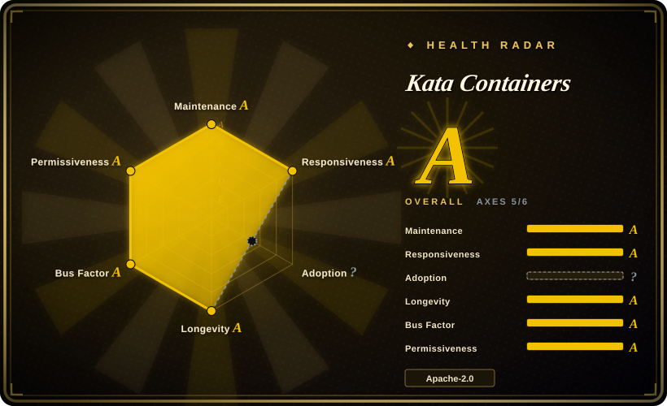
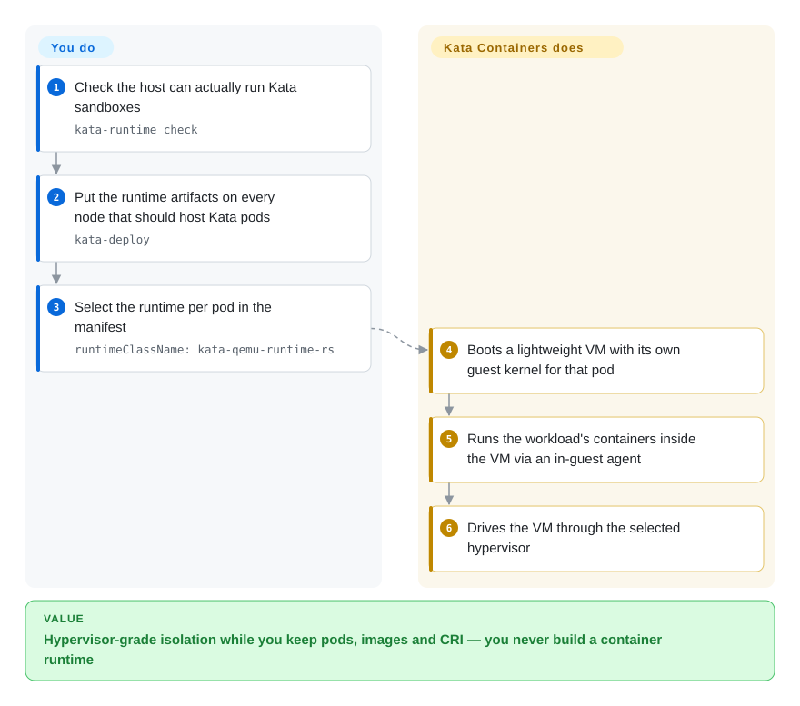

# Kata Containers

Lightweight VMs that behave like containers: each pod gets a real guest kernel inside a hardware-virtualized sandbox, while Kubernetes and containerd keep speaking their normal `RuntimeClass` interface.

## When to use

You need a **stronger-than-container** isolation boundary — hostile tenants, agent-generated code, regulated workloads sharing nodes — and you can get hardware virtualization on those nodes. Kata is the option that keeps the container UX: pod gets a VM, but from the outside it is still a pod with a `runtimeClassName`, an image, and normal CRI lifecycle. You reach for it when plain containers are not enough and a userspace-kernel runtime is not enough either: unlike [gVisor](gvisor.md), the workload talks to a **real Linux kernel inside a VM**, so system-call semantics, kernel features, and driver behavior are the real thing rather than an emulation; unlike [Firecracker](firecracker.md), you do not have to build the VMM, kernel, rootfs and control plane yourself — the project ships a runtime, an agent, and a Kubernetes deployment path. In a Kubernetes fleet you deploy the runtime artifacts to every node (`kata-deploy`, as a DaemonSet or a Helm chart) and then opt pods in per workload, e.g. `runtimeClassName: kata-qemu-runtime-rs`. The deciding tradeoff: you take on `/dev/kvm` (or nested virtualization), a boot path per sandbox, and a hypervisor in your stack — which is exactly what [gVisor](gvisor.md) avoids and what plain containers never had.

## How it works

Kata splits the container world in two halves that meet at the sandbox boundary. Outside, the container manager (containerd/CRI-O via the Kata shim, or `kata-runtime` for Docker) starts what looks like a normal container. Inside, Kata boots a lightweight VM with its own guest kernel and a small agent; the workload's containers run *inside* that VM, and the agent relays container operations across the boundary (stdin/stdout, mounts, signals, exec). The VMM is pluggable — QEMU, Cloud Hypervisor, Dragonball and Firecracker are supported hypervisors, and the runtime itself exists in a Go implementation and a newer Rust one (`runtime-rs`), which is what the current quick start selects. You write a `RuntimeClass` (or Helm values) and set `runtimeClassName` on the pod; Kata owns the VM lifecycle, the guest kernel image, the agent protocol and the node plumbing.

<!-- flow-steps:begin (generated from flows/kata-containers.json by tools/flow_card.py — do not edit) -->

Text version of the flow

1. **You**: Check the host can actually run Kata sandboxes — `kata-runtime check`
2. **You**: Put the runtime artifacts on every node that should host Kata pods — `kata-deploy`
3. **You**: Select the runtime per pod in the manifest — `runtimeClassName: kata-qemu-runtime-rs`
4. **Kata Containers**: Boots a lightweight VM with its own guest kernel for that pod
5. **Kata Containers**: Runs the workload's containers inside the VM via an in-guest agent
6. **Kata Containers**: Drives the VM through the selected hypervisor

**Value**: Hypervisor-grade isolation while you keep pods, images and CRI — you never build a container runtime

<!-- flow-steps:end -->

## When NOT to use

- **Your nodes have no usable hardware virtualization.** No `/dev/kvm` (or nested virtualization disabled by the cloud provider) means no Kata. For those nodes, use [gVisor](gvisor.md), which sandboxes in userspace without KVM.
- **You need maximum pod density or lowest sandbox start latency.** A VM per sandbox has a boot path and its own memory footprint; if density is the whole point, [Agent Substrate](substrate.md)'s snapshot-multiplexing approach or a userspace runtime serves that better.
- **You are building the microVM layer yourself, to your own specification.** Kata is opinionated about the guest, agent and runtime contract. If you want to own that stack, start from [Firecracker](firecracker.md) directly.
- **You want a sandbox product/SDK, not a runtime.** If the actual need is "give my agent an isolated place to run code, with an API and lifecycle", use [OpenSandbox](opensandbox.md) or [E2B](e2b.md) and let them pick the runtime underneath.
- **You cannot roll out a node-level runtime and a DaemonSet.** Kata is node infrastructure (kernel images, hypervisor, shim, runtime classes) wired into your cluster's CRI. On managed platforms that forbid custom runtimes, use a hosted sandbox API ([Modal](modal-client.md)) instead.
- **Your workload needs passthrough devices or GPU stacks the guest kernel can't drive.** Verify against the supported hardware/hypervisor matrix first; device passthrough in a microVM is a configuration project, not a checkbox.

## Comparison

| Alternative | In index | Our verdict | Tradeoff |
|---|---|---|---|
| [gVisor](gvisor.md) | ✅ | Choose Kata when you want the real kernel and can afford VMs; choose gVisor when you have no KVM, want process-like startup, and can live with an emulated syscall surface. | Kata gives hypervisor-grade isolation with true Linux semantics at the cost of hardware virtualization and per-sandbox VM overhead; gVisor avoids both and pays in compatibility and syscall-path latency. |
| [Firecracker](firecracker.md) | ✅ | Choose Firecracker when you are assembling the platform and want a minimal VMM to build on; choose Kata when you want a finished container-runtime integration for Kubernetes. | Firecracker is a component with a REST API and no opinion about containers; Kata is a system that already solved the container/agent/runtime-class plumbing for you. |
| [OpenSandbox](opensandbox.md) / [E2B](e2b.md) | ✅ | Choose the platforms when the deliverable is a sandbox API for agent code execution; choose Kata when the deliverable is isolation inside your own Kubernetes. | The platforms bring lifecycle, SDKs and policy but add a control plane of their own; Kata stays below your existing orchestrator and adds only a runtime. |
| Plain container runtimes (`runc` → Kubernetes default) | 未收录 | Choose plain containers for trusted, single-tenant workloads; choose Kata the moment the tenant is untrusted but you still want pods. | Plain containers keep density, speed and zero new moving parts, but share one kernel — the escape surface Kata exists to remove. Kept as the baseline rather than an alternative to index (containerd/runc selection is a separate, much larger question). |
| Nested Kubernetes clusters / VM-per-tenant infrastructure | 未收录 | Choose a cluster-per-tenant split when the isolation boundary should be organizational (separate control planes); choose Kata when one cluster must host mutually untrusted tenants. | Nested clusters give the strongest blast-radius separation but cost a control plane per tenant; Kata keeps one cluster and isolates at the sandbox, which is cheaper but not the same guarantee. Not a single-repository alternative. |

## Tech stack

- **Languages:** the original runtime (`src/runtime`) and the agent are Go; the current-generation runtime (`src/runtime-rs`) is Rust — the repo's primary language statistic is Rust.
- **Components:** runtime (containerd shim v2), an in-VM agent that sets up the container environment, an optional built-in VMM (`dragonball`), CLI utilities (`kata-runtime`, `kata-ctl`, `kata-debug`), and packaging infra that produces guest kernel/rootfs images.
- **Hypervisors:** QEMU, Cloud Hypervisor, Dragonball and Firecracker, selected through runtime classes and a single runtime configuration file.
- **Isolation model:** hardware virtualization per sandbox (Intel VT-x/AMD SVM, ARM Hyp, IBM Power/Z on the supported architectures).

## Dependencies

- **Kubernetes plus a CRI implementation** (containerd or CRI-O) — the deployment path is `kata-deploy`, shipped as a Helm chart (`helm install kata-deploy … --namespace kata-system`) that places runtime artifacts on each node and wires up a `RuntimeClass`.
- **Hardware virtualization on every node you want Kata pods on** — `/dev/kvm` or an equivalent; on cloud instances this often means nested virtualization, which some providers disable.
- **Guest kernel and rootfs images**, produced by the project's packaging tooling (or taken from releases) and pinned per deployment; the host kernel is patched separately (`tools/packaging/kernel`).
- **A hypervisor** among the supported set, installed by the node payload.
- **Preflight:** `kata-runtime check` validates the host before you trust it.

## Ops difficulty

**High.** This is node-level infrastructure: you install and version-align a hypervisor, a patched host kernel, guest kernel/rootfs artifacts, a shim and runtime classes across the whole fleet, then keep all of that consistent through upgrades. Failures are cross-layer (host kernel, hypervisor, guest kernel, agent, CRI), and the debugging surface is correspondingly wide — which is why the project publishes `kata-debug` and a detailed troubleshooting section. The project has run this at scale for years through `kata-deploy` and the OpenInfra release process, so the path is well-trodden, but the operational burden is genuinely closer to running a virtualization fleet than to running a container runtime.

## Health & viability

- **Maintenance (2026-09-20).** Active: last push 2026-09-19, ~8.8k stars, created 2017-12, nightly CI plus payload publishing workflows, OpenSSF Scorecard badge. Not archived.
- **Governance / bus factor (2026-09-20).** The strongest governance story in this category: managed by the **Open Infrastructure Foundation** under the "four opens", with technical decisions made by contributors and a representative **Architecture Committee**, documented in the community repo. That is foundation governance with multiple corporate backers, not a single vendor's project.
- **Backing & Lindy (2026-09-20).** Created 2017-12 — nearly nine years old and still shipping. It merges Intel Clear Containers and Hyper runV, and it has stayed the standard "VM-isolated container" answer through several hypervisor generations; the Lindy prior is favorable. [推断]
- **Adoption & ecosystem (2026-09-20).** Kata is a supported runtime class on all three major clouds (AKS/EKS/GKE document Kata-backed isolation) and inside OpenShift's sandboxed-containers operator. [未验证] The specific cloud/OpenShift integration details were not re-verified for this page.
- **Risk flags (2026-09-20).** No license or governance red flags. The real cost is operational (a hypervisor in your stack) and hardware-dependent (needs virtualization), which shows up in "When NOT to use" rather than as a project risk.

## Caveats (unverified)

- [未验证] The claim that AKS/EKS/GKE and OpenShift ship Kata-backed isolation paths reflects widely repeated ecosystem knowledge; it was not verified against those providers' current documentation.
- [未验证] Per-sandbox boot time and memory overhead numbers are not measured here; VM-per-sandbox costs vary with hypervisor, kernel and workload.
- [推断] "Kata is the standard VM-isolated container runtime" is a positioning judgment based on its age, governance and backers, not a measured adoption survey.
- [未验证] Whether every hypervisor backend is equally production-ready (QEMU vs Cloud Hypervisor vs Dragonball vs Firecracker) was not checked; the quick start selects the Rust runtime with QEMU.
- [未验证] The Helm chart version and node-kernel requirements for the current release were not pinned for this page; check the installation guide before deploying.

