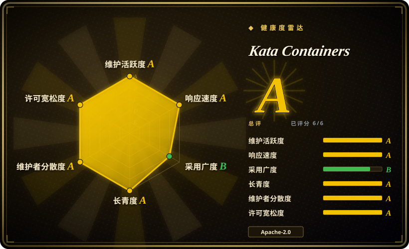
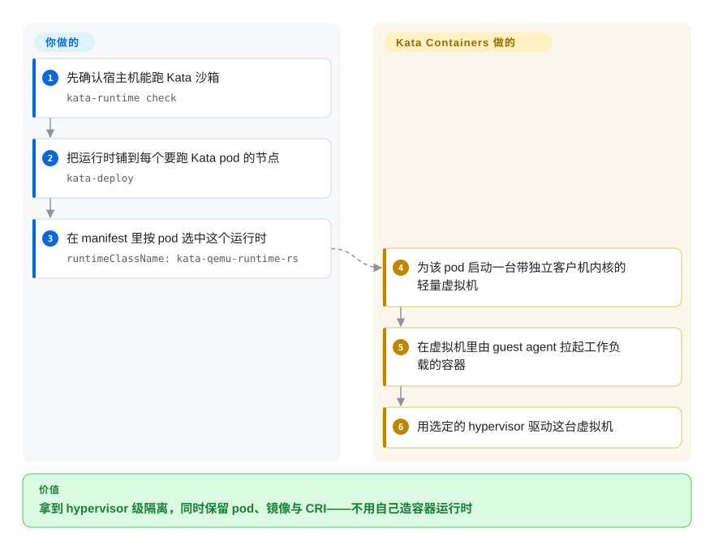

# Kata Containers

像容器一样使用的轻量虚拟机：每个 pod 在硬件虚拟化沙箱里拿到一个真正的客户机内核，而 Kubernetes 与 containerd 仍然只说它们平常的 `RuntimeClass` 语言。

## 何时使用

你需要一道**比容器更强**的隔离边界——敌对租户、agent 生成的代码、共享节点的合规负载——并且这些节点能拿到硬件虚拟化。Kata 是那个不改变容器使用习惯的选项：pod 里是一台虚拟机，但从外面看它仍然是一个带 `runtimeClassName`、带镜像、有正常 CRI 生命周期的 pod。想要普通容器不够、纯用户态内核运行时也不够时，就该想到它：与 [gVisor](gvisor.zh.md) 不同，工作负载面对的是**虚拟机里的真内核**，所以系统调用语义、内核特性和驱动行为都是真的，不是模拟；与 [Firecracker](firecracker.zh.md) 不同，VMM、内核、rootfs 和控制面不用你自己造——项目直接交付运行时、agent 和 Kubernetes 部署路径。在 Kubernetes 机群里，你把运行时产物铺到每个节点（`kata-deploy`，DaemonSet 或 Helm chart 两种形态），再按负载逐个把 pod 选进去，例如 `runtimeClassName: kata-qemu-runtime-rs`。决定性取舍是：你要接受 `/dev/kvm`（或嵌套虚拟化）、每个沙箱一条启动路径，以及技术栈里多一个 hypervisor——这恰恰是 [gVisor](gvisor.zh.md) 规避、而普通容器从来不需要的东西。

## 怎么用起来

Kata 把容器世界切成在沙箱边界上相遇的两半。外面，容器管理器（containerd／CRI-O 经 Kata shim，Docker 用 `kata-runtime`）启动的看上去就是一个普通容器。里面，Kata 启动一台带自己客户机内核和一个小 agent 的轻量虚拟机，工作负载的容器跑在**这台虚拟机内部**，agent 把容器操作（stdin／stdout、挂载、信号、exec）跨边界转发。VMM 是可插拔的——支持 QEMU、Cloud Hypervisor、Dragonball 与 Firecracker，运行时本身也有 Go 实现和更新的 Rust 实现（`runtime-rs`，正是当前快速上手选的那条）。你写一个 `RuntimeClass`（或 Helm values）并在 pod 上设置 `runtimeClassName`；虚拟机生命周期、客户机内核镜像、agent 协议和节点管线都是 Kata 的事。

<!-- flow-steps:begin (generated from flows/kata-containers.json by tools/flow_card.py — do not edit) -->

流程文字版

1. **你**：先确认宿主机能跑 Kata 沙箱 — `kata-runtime check`
2. **你**：把运行时铺到每个要跑 Kata pod 的节点 — `kata-deploy`
3. **你**：在 manifest 里按 pod 选中这个运行时 — `runtimeClassName: kata-qemu-runtime-rs`
4. **Kata Containers**：为该 pod 启动一台带独立客户机内核的轻量虚拟机
5. **Kata Containers**：在虚拟机里由 guest agent 拉起工作负载的容器
6. **Kata Containers**：用选定的 hypervisor 驱动这台虚拟机

**价值**：拿到 hypervisor 级隔离，同时保留 pod、镜像与 CRI——不用自己造容器运行时

<!-- flow-steps:end -->

## 何时不用

- **节点上没有可用的硬件虚拟化。** 没有 `/dev/kvm`（或云厂商关掉了嵌套虚拟化）就没有 Kata。这类节点请用 [gVisor](gvisor.zh.md)，它在用户态做沙箱、不需要 KVM。
- **你要极致 pod 密度或最低的沙箱启动延迟。** 每个沙箱一台虚拟机意味着一条启动路径和一份独立内存开销；如果密度就是全部目的，[Agent Substrate](substrate.zh.md) 的快照多路复用思路或用户态运行时更合适。
- **你想按自己的规格自建 microVM 层。** Kata 对客户机、agent 与运行时的契约是有主张的。想自己掌握这套栈，请直接从 [Firecracker](firecracker.zh.md) 起步。
- **你要的是沙箱产品／SDK，不是运行时。** 真实需求是「给 agent 一个隔离的跑代码的地方，还要 API 和生命周期」，请用 [OpenSandbox](opensandbox.zh.md) 或 [E2B](e2b.zh.md)，让它们去挑底层运行时。
- **你没法铺节点级运行时和 DaemonSet。** Kata 是需要接进集群 CRI 的节点基础设施（内核镜像、hypervisor、shim、runtime class）。在禁止自定义运行时的托管平台上，改用托管沙箱 API（[Modal](modal-client.zh.md)）。
- **负载需要客户机内核驱动不了的直通设备或 GPU 栈。** 先对照它支持的硬件与 hypervisor 矩阵核实；microVM 里的设备直通是一个配置项目，不是一个勾选项。

## 横向对比

| 替代品 | 是否收录 | 我们的评价 | 取舍 |
|---|---|---|---|
| [gVisor](gvisor.zh.md) | ✅ | 要真内核、也付得起虚拟机，选 Kata；没有 KVM、想要进程级启动、又能接受模拟的系统调用面，选 gVisor。 | Kata 给出 hypervisor 级隔离与真实 Linux 语义，代价是硬件虚拟化和每沙箱的虚拟机开销；gVisor 两样都省，代价落在兼容性与系统调用路径延迟上。 |
| [Firecracker](firecracker.zh.md) | ✅ | 自己拼平台、只想要一个极简 VMM 作地基，选 Firecracker；想要一套已经做完的容器运行时集成给 Kubernetes 用，选 Kata。 | Firecracker 是带 REST API、对容器不做任何主张的组件；Kata 是已经替你解决容器／agent／runtime class 管线的系统。 |
| [OpenSandbox](opensandbox.zh.md)／[E2B](e2b.zh.md) | ✅ | 交付物是「给 agent 执行代码的沙箱 API」，选这两个平台；交付物是「自己 Kubernetes 里的隔离」，选 Kata。 | 平台带来生命周期、SDK 与策略，但自己也多一层控制面；Kata 待在你现有编排器之下，只加一个运行时。 |
| 普通容器运行时（`runc` → Kubernetes 默认） | 未收录 | 可信的单租户负载用普通容器；租户一旦不可信但你仍然想要 pod，就上 Kata。 | 普通容器保住密度、速度、零新增部件，但共享同一个内核——那正是 Kata 要消掉的逃逸面。这里把它当基线而不是待收录项（containerd／runc 的选型是另一个大得多的题目）。 |
| 嵌套 Kubernetes 集群／一租户一套虚拟机基础设施 | 未收录 | 隔离边界应该是组织级（独立控制面）时用按租户拆集群；一个集群里必须承载互不信任的租户时用 Kata。 | 嵌套集群的爆炸半径隔离最强，但要为每个租户付一个控制面；Kata 保持单集群、在沙箱层隔离，更便宜但不是同一种保证。这不是单一仓库形态的替代品。 |

## 技术栈

- **语言：** 初代运行时（`src/runtime`）与 agent 是 Go；当前一代运行时（`src/runtime-rs`）是 Rust——仓库的主要语言统计为 Rust。
- **组件：** runtime（containerd shim v2）、在虚拟机内搭起容器环境的 agent、可选的内置 VMM（`dragonball`）、命令行工具（`kata-runtime`、`kata-ctl`、`kata-debug`），以及产出客户机内核／rootfs 镜像的打包设施。
- **Hypervisor：** QEMU、Cloud Hypervisor、Dragonball 与 Firecracker，通过 runtime class 与单一运行时配置文件选用。
- **隔离模型：** 每个沙箱一层硬件虚拟化（支持架构上的 Intel VT-x／AMD SVM、ARM Hyp、IBM Power／Z）。

## 依赖

- **Kubernetes 加一套 CRI 实现**（containerd 或 CRI-O）——部署路径是 `kata-deploy`，以 Helm chart 形式交付（`helm install kata-deploy … --namespace kata-system`），负责把运行时产物放到每个节点并接好 `RuntimeClass`。
- **每个要跑 Kata pod 的节点上都要有硬件虚拟化**——`/dev/kvm` 或等价能力；在云主机上这通常意味着嵌套虚拟化，而部分厂商会关掉它。
- **客户机内核与 rootfs 镜像**，由项目的打包工具产出（或取自 release），按部署固定版本；宿主内核另行打补丁（`tools/packaging/kernel`）。
- **支持列表中的一个 hypervisor**，由节点 payload 安装。
- **预检：** 信任一台机器之前先用 `kata-runtime check` 体检。

## 运维难度

**高。** 这是节点级基础设施：你要在全机群安装并统一版本的东西包括 hypervisor、打过补丁的宿主内核、客户机内核／rootfs 产物、shim 与 runtime class，并且在升级过程中让它们保持一致。故障是跨层的（宿主内核、hypervisor、客户机内核、agent、CRI），排障面相应很宽——这也是项目提供 `kata-debug` 和详细故障排查章节的原因。项目通过 `kata-deploy` 与 OpenInfra 的发布流程把这件事跑了很多年，路径很成熟，但运维负担确实更接近运营一个虚拟化机群，而不是运行一个容器运行时。

## 健康度与可持续性

- **维护活跃度（2026-09-20）。** 活跃：最后推送 2026-09-19，约 8.8k stars，创建于 2017-12，有 nightly CI 与 payload 发布工作流，挂 OpenSSF Scorecard 徽章。未归档。
- **治理与 bus factor（2026-09-20）。** 本分类里治理最硬的一个：由 **Open Infrastructure Foundation** 按「four opens」管理，技术决策由贡献者与代表性的**架构委员会**做出，文档在 community 仓库里。这是有多家厂商背书的基础会治理，而不是某一家公司的项目。
- **背书与 Lindy（2026-09-20）。** 创建于 2017-12，已近九年且仍在发布。它合并了 Intel Clear Containers 与 Hyper runV，跨过好几代 hypervisor 之后仍然是「虚拟机隔离容器」这个问题的标准答案；Lindy 先验有利。[推断]
- **采用与生态（2026-09-20）。** Kata 是三大云（AKS／EKS／GKE 都提供 Kata 隔离路径）以及 OpenShift sandboxed-containers operator 支持的运行时类型。[未验证] 这些云与 OpenShift 的集成细节本页未重新核实。
- **风险旗标（2026-09-20）。** 许可与治理没有红旗。真实成本是运维性的（技术栈里多一个 hypervisor）和硬件相关的（需要虚拟化），这两点体现在「何时不用」里，而不是项目风险。

## 存疑（未验证）

- [未验证] 「AKS／EKS／GKE 与 OpenShift 提供 Kata 隔离路径」来自生态常识性说法，未逐条对照各厂商当前文档核实。
- [未验证] 每沙箱启动时间与内存开销没有实测；一沙箱一虚拟机的成本随 hypervisor、内核与负载而变。
- [推断] 「Kata 是虚拟机隔离容器的标准方案」是基于年龄、治理与背书方的定位判断，不是实测的采用度调查。
- [未验证] 各 hypervisor 后端（QEMU、Cloud Hypervisor、Dragonball、Firecracker）的生产成熟度是否相当未核实；快速上手选的是 Rust 运行时搭配 QEMU。
- [未验证] 当前版本的 Helm chart 版本与节点内核要求本页未固定；部署前请查安装指南。
