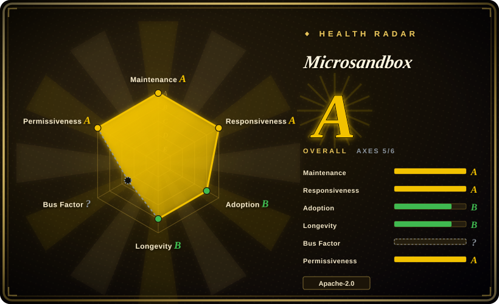
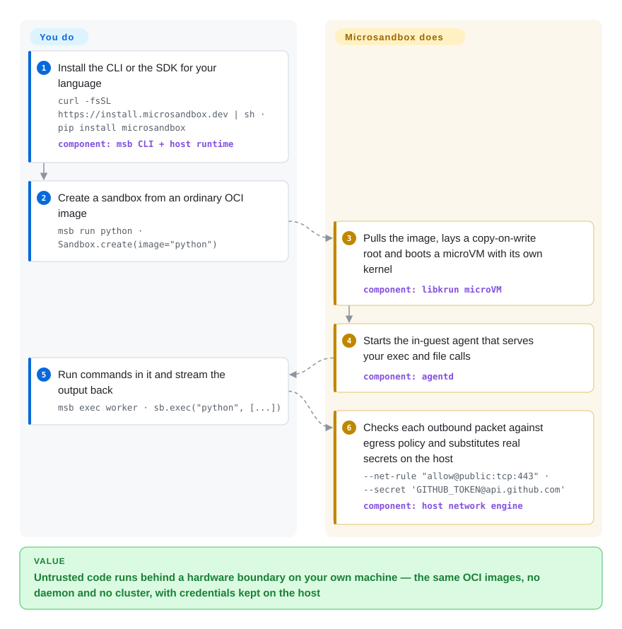

# Microsandbox

A cross-platform microVM runtime with Docker-like CLI verbs and embeddable SDKs: each sandbox boots an ordinary OCI image into a virtual machine with its own kernel, on your own machine — no daemon, no cluster, and credentials kept on the host.

## When to use

You're building an agent or a code-execution feature, and the model needs to actually run what it writes — shell commands, file writes, `pip install`. You won't put that on your laptop's kernel, you don't want to stand up and operate a Kubernetes platform, and you don't want every execution leaving for someone else's control plane. Microsandbox is the local-first answer: install one binary (`msb`) or an SDK, point it at an image you already use, and each sandbox comes up as a microVM with its own kernel. The image workflow is the one you know from Docker (`run`, `exec`, `ls`, `rm`, `-v`, `-p`, `pull`), but the isolation boundary is hardware virtualization instead of a shared kernel.

Its closest neighbour in this index is [E2B](e2b.md), and the deciding difference is where the compute and the data live — E2B leads with a hosted SDK and Terraform self-hosting, Microsandbox assumes the machine you are sitting at is the deployment target. Against assembling [Firecracker](firecracker.md) yourself, the deciding difference is that images, lifecycle, egress policy and secret injection are delivered rather than built. Against [Kata Containers](kata-containers.md) it is the deciding difference of not needing Kubernetes or a container runtime in the loop at all. Reach for it when the job is "run this untrusted code now, on this box" — a developer machine, an air-gapped server, a CI runner with KVM — not "schedule thousands of sandboxes across a fleet".

## How it works

You give it an image name; it hands you back a running machine. Concretely: it pulls the OCI image, lays it down as a copy-on-write root so sandbox writes never touch the base, boots a microVM with its own Linux kernel at the CPU and memory limits you asked for, and starts a small in-guest agent. That agent channel is how `exec`, file copies and output streaming work — a private host-to-guest pipe, not SSH and not the sandbox's network. What you do is the part you already know: choose an image, run commands, mount a directory, publish a port. What it does is the part plain containers make you share: the kernel, the egress policy, and the credentials. It also goes past a container where it can — you can snapshot a running sandbox, or `msb branch` a live one into independent children whose memory is shared copy-on-write.

<!-- flow-steps:begin (generated from flows/microsandbox.json by tools/flow_card.py — do not edit) -->

Text version of the flow

1. **You**: Install the CLI or the SDK for your language — `curl -fsSL https://install.microsandbox.dev | sh · pip install microsandbox` — component: `msb CLI + host runtime`
2. **You**: Create a sandbox from an ordinary OCI image — `msb run python · Sandbox.create(image="python")`
3. **Microsandbox**: Pulls the image, lays a copy-on-write root and boots a microVM with its own kernel — component: `libkrun microVM`
4. **Microsandbox**: Starts the in-guest agent that serves your exec and file calls — component: `agentd`
5. **You**: Run commands in it and stream the output back — `msb exec worker · sb.exec("python", [...])`
6. **Microsandbox**: Checks each outbound packet against egress policy and substitutes real secrets on the host — `--net-rule "allow@public:tcp:443" · --secret 'GITHUB_TOKEN@api.github.com'` — component: `host network engine`

**Value**: Untrusted code runs behind a hardware boundary on your own machine — the same OCI images, no daemon and no cluster, with credentials kept on the host

<!-- flow-steps:end -->

## When NOT to use

- **Your target hosts have no hardware virtualization.** Every sandbox needs KVM (Linux), Hypervisor.framework (macOS, Apple Silicon only) or WHP (Windows 11, preview). There is no software fallback, so a cloud VM without `/dev/kvm`, an Intel Mac, or Windows Server without nested virtualization cannot run it. For isolation that needs no hypervisor, use [gVisor](gvisor.md); for a hosted sandbox, use [E2B](e2b.md).
- **You need to schedule and isolate many tenants across a fleet.** There is no control plane, no scheduler and no cluster: each sandbox is a process on the machine you launched it from. For multi-tenant K8s-scale execution with a credential vault, use [OpenSandbox](opensandbox.md); for per-pod VM isolation inside Kubernetes, use [Kata Containers](kata-containers.md).
- **You want a sandbox service you don't operate.** Microsandbox Cloud exists but is in private beta and the REST API only covers management — command execution, PTY and file transfer ride the SDK/CLI, not HTTP. If zero-ops hosted sandboxes are the requirement, use [E2B](e2b.md) or the [Modal client SDK](modal-client.md).
- **You need to build images, not just run them.** There is no `build`, no Dockerfile support and no compose in the CLI; you pull OCI images and patch the rootfs before boot with `--copy` / `--copy-dir` / `--mkdir`. Keep Docker or Podman as your image builder and use this as the runtime.
- **You are building the isolation layer itself.** If your threat model requires you to own and certify the microVM boundary and its device model, start from [Firecracker](firecracker.md) rather than a runtime that vendors its own libkrun fork and hides the boundary behind a CLI.
- **You cannot absorb a beta's breaking changes.** The project labels itself beta, ships 0.x releases, and its storage/compatibility surface is still moving. If you need a years-proven dependency today, [gVisor](gvisor.md) and [Firecracker](firecracker.md) have the track record; this one does not yet. [推断]
- **You only need a container.** Trusted workloads belong in ordinary containers; the hardware boundary costs you a boot, a per-sandbox host process and a hard KVM/macOS/WHP prerequisite that plain Docker does not ask for.

## Comparison

| Alternative | In index | Our verdict | Tradeoff |
|---|---|---|---|
| [E2B](e2b.md) | ✅ | Choose E2B when the sandbox should be an API call answered by someone else's machines; choose Microsandbox when data, cost or offline use requires the sandbox to live on hardware you already own. | Hosted removes the ops burden but moves isolation and data to a vendor; local keeps both but you own the host's virtualization prerequisite and the `MSB_HOME` state directory. |
| [Firecracker](firecracker.md) | ✅ | Choose Firecracker when you are building the sandbox layer and want the minimal KVM microVM primitive; choose Microsandbox when you want the sandbox as a finished local product with images, SDKs, policy and secrets already decided. | Firecracker stops at the microVM boundary and is Linux/KVM-only; Microsandbox hands you the layer above, at the cost of depending on the vendor's pinned libkrun fork. |
| [gVisor](gvisor.md) | ✅ | Choose gVisor when untrusted containers must be isolated without hardware virtualization and you will build the lifecycle yourself; choose Microsandbox when you want a real kernel boundary plus the lifecycle and policy delivered. | gVisor needs no KVM and fits existing container workflows but intercepts syscalls in userspace; Microsandbox has an independent kernel but has no answer on hosts without KVM/HVF/WHP. |
| [Kata Containers](kata-containers.md) | ✅ | Choose Kata when Kubernetes should give each pod its own kernel; choose Microsandbox when the sandbox is driven from an application or a terminal and no orchestrator is in the picture. | Kata is a node-level RuntimeClass that inherits Kubernetes scheduling; Microsandbox is a per-process local runtime with no scheduler, no fleet view and no multi-node story. |
| [OpenSandbox](opensandbox.md) | ✅ | Choose OpenSandbox when the target is a self-hosted platform running untrusted agent code at K8s scale with a credential vault; choose Microsandbox when the target is one machine and you want no platform at all. | OpenSandbox buys platform capability and pluggable runtimes (gVisor/Kata/Firecracker) with real operational surface; Microsandbox trades that surface away and fixes you to its own microVM. |
| Docker / containerd | 未收录 | Choose plain Docker when the code is trusted or a container boundary is enough; choose Microsandbox when the shared kernel is exactly what you are trying to get away from and you need per-sandbox egress and secret control. | Docker brings universal tooling and image building; Microsandbox brings the hardware boundary and host-side secret substitution, while still consuming the images Docker builds. |

## Tech stack

- **Host runtime:** Rust — the `msb` CLI and the per-sandbox host process that owns the VMM integration.
- **VMM:** `msb_krun`, pinned to an exact version (`=0.1.39`) in the workspace, a libkrun-family crate on crates.io with `libkrunfw` firmware/kernel bundle (ABI 5, version 5.6.1 checked into a submodule). Backends are KVM (Linux), Hypervisor.framework (macOS), WHP (Windows).
- **Guest:** its own Linux kernel from the firmware bundle, plus `agentd`, a Rust PID-1 init/agent inside the VM.
- **Networking:** a host-side userspace TCP/IP stack (smoltcp) wired in as the VM's custom virtio-net backend, with a TLS-interception proxy for secret substitution and DNS-pinned hostname policy.
- **Filesystem:** virtio-fs for directory volumes, virtio-blk for disk volumes, served by a host-side passthrough broker with containment on path resolution.
- **Images:** standard OCI from Docker Hub, GHCR or any registry, materialized as EROFS layers over a writable upper (or as a flat ext4 root).
- **Local state:** a SQLite catalog plus sandbox disks, volumes, snapshots and an OCI cache under `MSB_HOME`.
- **SDKs and surfaces:** Rust, Python, TypeScript/Node, Go and Ruby SDKs published to their registries; an MCP server and an Agent Skills pack in separate repositories.

## Dependencies

- **Hardware virtualization on the host — the load-bearing dependency.** Linux: `/dev/kvm` readable and writable by your user (VMX/SVM, or nested virtualization if the host is itself a VM). macOS: Apple Silicon. Windows: 11 with the Windows Hypervisor Platform enabled (preview). No root or setuid is needed at run time, but a one-time admin action may be required to grant `/dev/kvm` access or enable WHP.
- **Nothing else at run time.** No daemon, no database server, no orchestrator, no message bus — each sandbox is a process that the CLI/SDK spawns directly.
- **`MSB_HOME` (default `~/.microsandbox/`).** A durable state root, not just an install directory: SQLite catalog (`db/msb.db`), sandbox disks, volumes, snapshots, OCI cache, secrets and TLS material. Only `run/` is documented as disposable. Backing up or migrating it means coordinating all of those, not just copying the binary.
- **Registry access** to pull images, unless you pre-load them with `msb save` / `msb load` for an air-gapped device.
- **Source builds only:** git submodules (`vendor/libkrunfw`, `mcp`, `skills`), plus Docker or WSL on macOS/Windows to build the kernel bundle.

## Ops difficulty

**Low on a development machine, medium if you standardize a team on it.** The single-machine story is genuinely small: one binary, unprivileged, no service to keep alive, and `msb doctor` diagnoses the common setup failures. Three things keep it from being "just install it": the platform prerequisites are hard gates rather than degradations (no KVM means no sandbox, not a slower sandbox), `MSB_HOME` is stateful and has documented cross-release compatibility obligations with no complete online backup/migration playbook in the repo, and the whole surface is beta. If you roll it out to a fleet of developer machines, the work moves to provisioning the runtime offline, managing upgrades across the project's compatibility floor, and supervising detached sandboxes that outlive the command that created them.

## Health & viability

- **Maintenance.** Very active: v0.7.2 released 2026-09-17, last commit within the same day as scoring, all 13 recent weeks carrying activity, not archived. Median first response on issues/PRs was 13.5 hours across 47 qualifying items. [推断]
- **Backing & governance.** Built by Super Rad Company, a Y Combinator-backed startup — the project is the company's product, which is both the reason it gets daily attention and the reason the roadmap follows its commercial cloud. No CLA or DCO; signed commits required. The isolation layer is the vendor's own pinned libkrun fork rather than a community upstream. [推断]
- **Age × Lindy.** Created 2024-10-03 — roughly two years old and still shipping, which is a better bet than a months-old hype repo and well short of the decade-long projects in this category. Age alone earns it nothing while it is 0.x. [推断]
- **Adoption.** ~8.3k stars and ~56 contributors, 522,886 npm downloads last month, five first-party SDKs, plus an MCP server and an Agent Skills pack. The scorer's registry graph, however, reports 0 dependent repositories, so third-party production dependence is not yet evidenced there. [未验证]
- **Risk flags.** Beta status and 0.x releases are the main ones, and the README oversells two claims its own documentation qualifies (startup time and secret containment — see Caveats). Governance axis is unscored because GitHub's contributor-stats endpoint was gated, so bus factor was not measured. CI is unusually thorough for the project's age (multi-platform releases, nightly fuzzing, a previous-release database-upgrade smoke test), but there is no dependency-audit/deny gate and no pinned MSRV. [未验证]

## Caveats (unverified)

- [未验证] The "average boot times under 100 milliseconds" claim: the only in-repo timing is guest kernel boot (`CLOCK_BOOTTIME` at the start of `agentd`'s `main`), the footnote scopes it to an M1 machine, and there is no reproducible benchmark in the repository — the benchmark suite lives in a separate repo. It is not end-to-end sandbox creation (image pull and materialization are outside it).
- [未验证] "Secrets That Can't Leak / Unexploitable" is the README's wording. The narrow mechanism was verified in the host-side network crate (real values never enter the guest bootstrap; the guest only holds a placeholder), but the project's own `docs/security/secrets.mdx` lists exceptions: an allowed endpoint can echo the value back, real values live in host process memory, raw values passed through an SDK persist in the host-side sandbox configuration after the sandbox stops, and bypassed TLS cannot be substituted.
- [未验证] The governance axis is unscored (`?`): GitHub's contributors statistics endpoint returned HTTP 202, so maintainer count and top-contributor share were not measured. The ~56-contributor figure came from a separate API count, not the scorer.
- [推断] `msb_krun` is treated here as a vendor fork/rebrand of libkrun based on its name, version pinning and crate contents; the upstream relationship, patch divergence and long-term maintenance of that fork were not verified, and `vendor/libkrunfw` is a submodule whose contents were not read.
- [推断] Star and download counts are date-sensitive and move release to release; ~8.3k stars is a 2026-09-22 snapshot.
- [未验证] No isolation, escape, cross-sandbox or egress-bypass testing was performed for this page. The isolation and secret-handling descriptions reflect static reading of the source and the project's own `docs/security/*`; `SECURITY.md` is a disclosure policy, not a threat model.
- [未验证] Windows support is marked preview by the project; its production suitability was not verified.
- [推断] Comparison rows against E2B, Firecracker, gVisor, Kata Containers and OpenSandbox reflect documented positioning and the mechanisms read in this repository, not a measured feature-by-feature benchmark.
