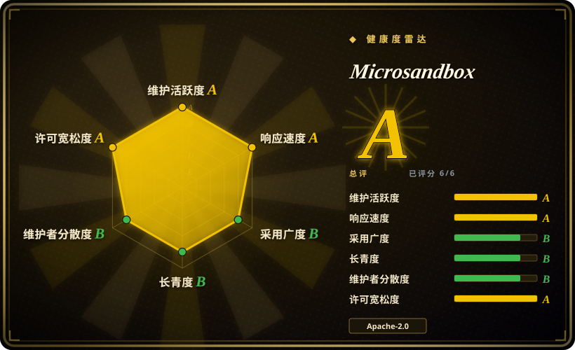
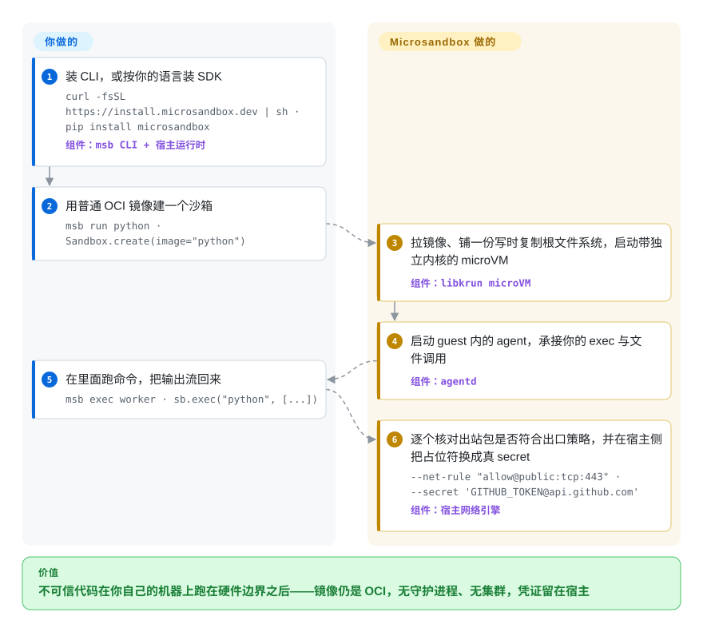

# Microsandbox

跨平台的 microVM 运行时：CLI 动词跟 Docker 同构，同时提供可嵌入的 SDK。每个沙箱把一张普通 OCI 镜像拉起来，变成一台带独立内核的虚拟机，跑在你自己的机器上——没有守护进程、不用集群，凭证留在宿主。

## 何时使用

你在做 agent 或者代码执行功能，模型需要真的把它写出来的东西跑起来——shell 命令、写文件、`pip install`。你不想把这些放在自己笔记本的内核上跑，也不想为此拉起并运维一套 Kubernetes 平台，更不想每次执行都送到别人的控制面去。Microsandbox 是那个「本地优先」的答案：装一个二进制（`msb`）或一个 SDK，指向你本来就在用的镜像，每个沙箱就以一台带独立内核的 microVM 起来。镜像工作流就是你从 Docker 熟悉的那套（`run`、`exec`、`ls`、`rm`、`-v`、`-p`、`pull`），但隔离边界换成了硬件虚拟化，而不是共享内核。

本索引里离它最近的是 [E2B](e2b.zh.md)，决定性的差别在算力和数据落在哪里——E2B 主打托管 SDK 加 Terraform 自托管，Microsandbox 则假定你正坐着的这台机器就是部署目标。跟「自己拼 [Firecracker](firecracker.zh.md)」相比，决定性差别是镜像、生命周期、出口策略和 secret 注入是现成交付而不是自己造。跟 [Kata Containers](kata-containers.zh.md) 相比，决定性差别是链路里根本不需要 Kubernetes 或容器运行时。适合它的场景是「现在、就在这台机器上跑这段不可信代码」——开发机、气隙服务器、带 KVM 的 CI runner——而不是「把成千上万个沙箱调度到一个机群上」。

## 怎么用起来

你给它一个镜像名，它还你一台在跑的设备。具体来说：它拉取 OCI 镜像，铺一层写时复制根文件系统（沙箱内的写入永远不碰基础镜像），按你给的 CPU 和内存上限启动一台带独立 Linux 内核的 microVM，再在 guest 里起一个很小的 agent。`exec`、文件拷贝和输出流式回传都走这个 agent 通道——它是宿主与 guest 之间的私有管道，既不是 SSH，也不走沙箱的网络。你负责的部分是你本来就熟的：选镜像、跑命令、挂目录、发布端口。它负责的是纯容器要你共享掉的那部分：内核、出口策略和凭证。它还能多做一点容器做不到的事——给运行中的沙箱拍快照，或者用 `msb branch` 把一个活着的沙箱 fork 成多个互不干扰的子沙箱，内存以写时复制共享。

<!-- flow-steps:begin (generated from flows/microsandbox.json by tools/flow_card.py — do not edit) -->

流程文字版

1. **你**：装 CLI，或按你的语言装 SDK — `curl -fsSL https://install.microsandbox.dev | sh · pip install microsandbox` — 组件：`msb CLI + 宿主运行时`
2. **你**：用普通 OCI 镜像建一个沙箱 — `msb run python · Sandbox.create(image="python")`
3. **Microsandbox**：拉镜像、铺一份写时复制根文件系统，启动带独立内核的 microVM — 组件：`libkrun microVM`
4. **Microsandbox**：启动 guest 内的 agent，承接你的 exec 与文件调用 — 组件：`agentd`
5. **你**：在里面跑命令，把输出流回来 — `msb exec worker · sb.exec("python", [...])`
6. **Microsandbox**：逐个核对出站包是否符合出口策略，并在宿主侧把占位符换成真 secret — `--net-rule "allow@public:tcp:443" · --secret 'GITHUB_TOKEN@api.github.com'` — 组件：`宿主网络引擎`

**价值**：不可信代码在你自己的机器上跑在硬件边界之后——镜像仍是 OCI，无守护进程、无集群，凭证留在宿主

<!-- flow-steps:end -->

## 何时不用

- **目标机器没有硬件虚拟化。** 每个沙箱都需要 KVM（Linux）、Hypervisor.framework（macOS，且仅 Apple Silicon）或 WHP（Windows 11，预览）。没有软件回退路径，所以没有 `/dev/kvm` 的云 VM、Intel Mac、未开嵌套虚拟化的 Windows Server 都跑不了。需要不依赖 hypervisor 的隔离就用 [gVisor](gvisor.zh.md)；需要托管沙箱就用 [E2B](e2b.zh.md)。
- **你需要在机群上调度并隔离大量租户。** 它没有控制面、没有调度器、没有集群：每个沙箱就是你启动它的那台机器上的一个进程。要 K8s 规模的多租户执行加凭证保险库，用 [OpenSandbox](opensandbox.zh.md)；要在 Kubernetes 里给每个 pod 一份虚拟机隔离，用 [Kata Containers](kata-containers.zh.md)。
- **你想要一个不用自己运维的沙箱服务。** Microsandbox Cloud 存在但处于私有 beta，而且 REST API 只覆盖管理面——命令执行、PTY、文件传输走 SDK／CLI，不走 HTTP。零运维托管沙箱是硬需求的话，用 [E2B](e2b.zh.md) 或 [Modal client SDK](modal-client.zh.md)。
- **你需要构建镜像，而不只是运行镜像。** CLI 里没有 `build`、不支持 Dockerfile、也没有 compose；它的路径是拉 OCI 镜像，再用 `--copy`／`--copy-dir`／`--mkdir` 在启动前给 rootfs 打补丁。把 Docker 或 Podman 留作镜像构建器，把它当运行时。
- **你要自建隔离层本身。** 如果你的威胁模型要求你拥有并自行认证 microVM 边界及其设备模型，就从 [Firecracker](firecracker.zh.md) 开始，而不是选一个自带 libkrun fork、把边界藏在 CLI 后面的运行时。
- **你吸收不了 beta 的破坏性变更。** 项目自称 beta、发 0.x 版本，存储与兼容面仍在变。今天就需要一个经年验证的依赖，[gVisor](gvisor.zh.md) 和 [Firecracker](firecracker.zh.md) 有那份记录，这个还没有。[推断]
- **你只需要一个容器。** 可信负载放进普通容器就好；硬件边界要付出一次启动、一个每沙箱宿主进程，以及 Docker 不会向你索取的 KVM／macOS／WHP 硬前提。

## 横向对比

| 替代品 | 是否收录 | 我们的评价 | 取舍 |
|---|---|---|---|
| [E2B](e2b.zh.md) | ✅ | 想让沙箱成为一次 API 调用、由别人的机器来应答，选 E2B；因数据、成本或离线要求必须让沙箱落在自己已有的硬件上，选 Microsandbox。 | 托管省掉运维负担，但把隔离与数据交给厂商；本地两样都留住，代价是宿主虚拟化前提和 `MSB_HOME` 这份有状态目录由你负责。 |
| [Firecracker](firecracker.zh.md) | ✅ | 你在自建沙箱层、想要极简的 KVM microVM 原语，选 Firecracker；你想要一个已定型的本地沙箱成品——镜像、SDK、策略、secret 都已决定——选 Microsandbox。 | Firecracker 止步于 microVM 边界且只支持 Linux／KVM；Microsandbox 把上面那一层交给你，代价是依赖厂商定版维护的 libkrun fork。 |
| [gVisor](gvisor.zh.md) | ✅ | 不可信容器要在没有硬件虚拟化的前提下隔离、且你愿意自建生命周期，选 gVisor；你想要真内核边界外加现成的生命周期与策略，选 Microsandbox。 | gVisor 不需要 KVM、能贴合既有容器工作流，但它在用户态拦截系统调用；Microsandbox 有独立内核，却对没有 KVM／HVF／WHP 的宿主毫无办法。 |
| [Kata Containers](kata-containers.zh.md) | ✅ | 希望 Kubernetes 给每个 pod 一份真内核，选 Kata；沙箱由应用或终端驱动、链路里没有编排器，选 Microsandbox。 | Kata 是节点级 RuntimeClass，继承 Kubernetes 的调度能力；Microsandbox 是每进程的本地运行时，没有调度器、没有机群视图、没有多节点方案。 |
| [OpenSandbox](opensandbox.zh.md) | ✅ | 目标是自托管平台、要在 K8s 规模上跑不可信 agent 代码并带凭证保险库，选 OpenSandbox；目标是一台机器、且完全不想要平台层，选 Microsandbox。 | OpenSandbox 用真实的运维面换来平台能力与可插拔运行时（gVisor／Kata／Firecracker）；Microsandbox 把这层运维面换掉，同时把自己锁在它自家的 microVM 上。 |
| Docker／containerd | 未收录 | 代码可信、或者容器边界就够用时，用普通 Docker；共享内核正是你想摆脱的东西、且需要每沙箱的出口与 secret 管控，选 Microsandbox。 | Docker 带来通用工具链与镜像构建能力；Microsandbox 带来硬件边界和宿主侧 secret 替换，同时仍然消费 Docker 构建出来的镜像。 |

## 技术栈

- **宿主运行时：** Rust——`msb` CLI，以及拥有 VMM 集成的那份每沙箱宿主进程。
- **VMM：** `msb_krun`，工作区里按精确版本锁定（`=0.1.39`），是 crates.io 上 libkrun 系的 crate，配套 `libkrunfw` 固件／内核包（ABI 5、版本 5.6.1，放在 submodule 里）。后端分别是 KVM（Linux）、Hypervisor.framework（macOS）、WHP（Windows）。
- **Guest：** 来自固件包的独立 Linux 内核，外加 `agentd`——虚拟机内以 Rust 写的 PID-1 init／agent。
- **网络：** 宿主侧的用户态 TCP/IP 协议栈（smoltcp），作为 VM 的自定义 virtio-net 后端接入；配有用于 secret 替换的 TLS 中间人代理和按 DNS 钉住的域名策略。
- **文件系统：** 目录型卷走 virtio-fs，磁盘型卷走 virtio-blk，由宿主侧 passthrough broker 提供，路径解析带约束。
- **镜像：** Docker Hub、GHCR 或任意 registry 的标准 OCI 镜像，物化成 EROFS 层加可写 upper（或完整 ext4 的 flat 根）。
- **本地状态：** `MSB_HOME` 下的 SQLite 目录库，加上沙箱磁盘、卷、快照与 OCI 缓存。
- **SDK 与入口：** Rust、Python、TypeScript／Node、Go、Ruby 五个 SDK 各发到对应 registry；MCP server 与 Agent Skills 包在独立仓库。

## 依赖

- **宿主硬件虚拟化——这是承重依赖。** Linux：你的用户需可读写 `/dev/kvm`（需要 VMX／SVM，宿主本身是虚拟机时还要开嵌套虚拟化）。macOS：Apple Silicon。Windows：11 且启用 Windows Hypervisor Platform（预览）。运行时不需要 root 或 setuid，但授予 `/dev/kvm` 权限或启用 WHP 可能需要一次性管理员操作。
- **运行时其余什么都不需要。** 没有守护进程、没有数据库服务、没有编排器、没有消息总线——每个沙箱都是 CLI／SDK 直接派生出来的进程。
- **`MSB_HOME`（默认 `~/.microsandbox/`）。** 这是有状态根，不只是安装目录：SQLite 目录库（`db/msb.db`）、沙箱磁盘、卷、快照、OCI 缓存、secrets 与 TLS 材料都在里面。文档只把 `run/` 标为可丢弃。备份或迁移它意味着协调上述全部，而不是拷一个二进制。
- **registry 访问**用于拉镜像，除非你用 `msb save`／`msb load` 预载好镜像以应付气隙设备。
- **仅源码构建才需要：** git submodule（`vendor/libkrunfw`、`mcp`、`skills`），以及 macOS／Windows 上用来构建内核包的 Docker 或 WSL。

## 运维难度

**在开发机上是低，若要在团队里统一推广则是中。** 单机故事确实很小：一个二进制、非特权、没有要保活的服务，`msb doctor` 能诊断常见配置失败。有三件事让它不能算「装上就完」：平台前提是硬门槛而非降级（没有 KVM 就是不能跑沙箱，不是跑得慢一点），`MSB_HOME` 是有状态的、且带有跨版本兼容义务，而仓库里没有完整的在线备份／迁移手册；再加上整个产品面处于 beta。如果你要把它铺到一批开发机上，工作重心会转到离线发放运行时、在项目的兼容基线上管理升级，以及照看那些比创建它们的命令活得更久的 detached 沙箱。

## 健康度与可持续性

- **维护。** 非常活跃：v0.7.2 发布于 2026-09-17，最后一次提交就在打分当天，近 13 周全部有活动，未归档。issue／PR 的首次响应中位数为 13.5 小时（47 条合格样本）。[推断]
- **背书与治理。** 由 Super Rad Company 打造，一家 Y Combinator 背景的创业公司——项目就是这家公司的产品，这既是它每天有人投入的原因，也是路线图跟随其商业云的原因。没有 CLA、没有 DCO；要求签名提交。隔离层是厂商自己定版维护的 libkrun fork，而不是社区上游。[推断]
- **年龄 × Lindy。** 创建于 2024-10-03，约两年且仍在持续发版——比数月龄的热度仓库更值得押，但离本类目里那些十年期项目还很远。在它还是 0.x 期间，年龄本身不带来任何加分。[推断]
- **采用度。** 约 8.3k stars、约 56 位贡献者、上月 npm 下载量 522,886 次、五个一方 SDK，外加 MCP server 与 Agent Skills 包。但打分器的 registry 依赖图报告的依赖仓库数为 0，所以第三方生产依赖目前在那里没有证据。[未验证]
- **风险标记。** 主要是 beta 状态与 0.x 发版；另外 README 有两处说法是它自己的文档在打折的（启动时间与 secret 收敛，见「存疑」）。治理轴未打分，因为 GitHub 的贡献者统计接口被限流，所以 bus factor 没被测量。对项目年龄而言 CI 异常扎实（多平台发布、每夜 fuzz、上一版本数据库升级 smoke），但没有依赖审计／deny 门禁，也没有锁定的 MSRV。[未验证]

## 存疑（未验证）

- [未验证]「平均启动时间低于 100 毫秒」这一说法：仓库内唯一的计时是 guest 内核启动（`agentd` 的 `main` 起点读 `CLOCK_BOOTTIME`），脚注把它限定在 M1 机器上，且仓库里没有可复现的 benchmark——benchmark 套件在另一个仓库。它不是端到端的沙箱创建耗时（镜像拉取与物化不在其内）。
- [未验证]「Secrets That Can't Leak／Unexploitable」是 README 的措辞。窄口径的机制在宿主侧网络 crate 里得到验证（真值不进入 guest bootstrap，guest 只持有占位符），但项目自己的 `docs/security/secrets.mdx` 列了例外：被允许的 endpoint 可以把值回显回来、真值存在于宿主进程内存、经 SDK 传入的原始值在沙箱停止后仍持久化在宿主侧沙箱配置里、被 bypass 的 TLS 无法替换。
- [未验证] 治理轴未打分（`?`）：GitHub 的贡献者统计接口返回 HTTP 202，因此维护者数量与首位贡献者占比未被测量。约 56 位贡献者这个数字来自另一次 API 计数，不是打分器。
- [推断] 这里把 `msb_krun` 视为 libkrun 的厂商 fork／改名版，依据是名称、版本锁定与 crate 内容；它与上游的关系、补丁分叉程度以及该 fork 的长期维护情况均未核实，`vendor/libkrunfw` 是 submodule，其内容未被读取。
- [推断] star 与下载量对日期敏感，逐版变动；约 8.3k stars 是 2026-09-22 的快照。
- [未验证] 本页未做任何隔离、逃逸、跨沙箱或出口绕过的实测。隔离与 secret 处理的描述来自源码静态阅读与项目自己的 `docs/security/*`；`SECURITY.md` 是漏洞披露政策，不是威胁模型。
- [未验证] Windows 支持被项目标注为预览，其生产适用性未核实。
- [推断] 与 E2B、Firecracker、gVisor、Kata Containers、OpenSandbox 的对比行反映的是文档定位与本仓库读到的机制，不是逐项实测的 benchmark。
