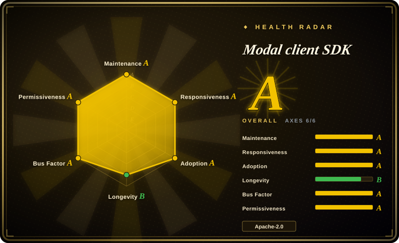
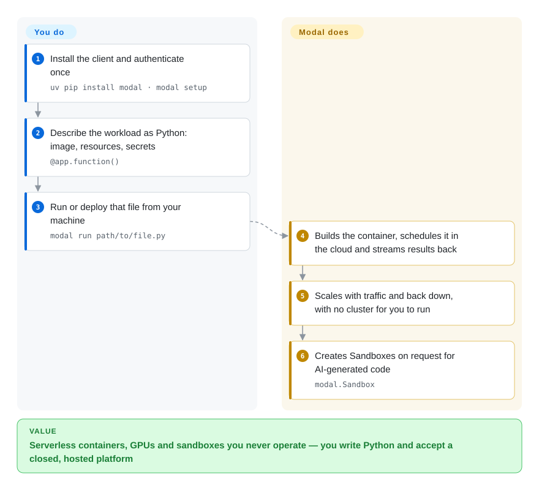

# Modal client SDK

The open-source client libraries for Modal: a Python package that deploys functions and drives sandboxes on Modal's hosted platform, plus JS/Go SDKs for invoking functions and running sandboxes — the platform behind them is closed source and cannot be self-hosted.

## When to use

You want serverless containers — CPU or GPU — plus isolated sandboxes for AI-generated code, and you have decided **not** to run any of the infrastructure: no Kubernetes, no node pools, no image registry, no autoscaling policy. Modal's pitch is that everything is code in a Python file: you decorate a function, and the platform builds the container, schedules it, scales it and bills per second. You reach for this SDK when that trade is acceptable: `uv pip install modal`, `modal setup` to authenticate, write your app, and `modal run path/to/file.py` executes it in Modal's cloud; for agent workloads the same SDK creates Sandboxes, which is why this repo shows up in the sandboxing comparison at all. The deciding tradeoff against [E2B](e2b.md) is openness of the runtime: E2B's runtime can be self-hosted (AWS/GCP via Terraform) while Modal's cannot — in exchange, Modal is a broader platform (GPUs, functions, volumes, schedules, notebooks). The deciding tradeoff against [Agent Substrate](substrate.md) or [OpenSandbox](opensandbox.md) is who owns the sandbox: with Modal you own neither the machine nor the boundary, only the API calls.

**Scope caveat for this page:** the repository is the client SDK. Its stars, issue tracker and release cadence describe the SDK, not the reliability, longevity or governance of the hosted platform — read the health section below with that in mind.

## How it works

The SDK is a client: it ships a `modal` Python package (with the `modal` CLI included), JS/Go libraries for the subset of operations they cover, and it talks to Modal's control plane over the network. You install it (`uv pip install modal`), authenticate once (`modal setup`), and describe your workload in Python — a Modal app with functions (`@app.function()`) that declares its own image, resources and secrets in code rather than YAML. `modal run path/to/file.py` builds that description into a container, runs it in Modal's cloud, and streams results back; the same description can be deployed for serving. For agent use cases the SDK also exposes Sandboxes, short-lived isolated environments you create and run commands in programmatically. Everything above the SDK — image building, scheduling across clouds, GPU allocation, scale-to-zero, snapshots — happens inside the closed platform; the repo's own contribution is the protocol client, the local tooling (`modal` CLI, dev server behaviour) and the packaged skills/docs references the CLI can install.

<!-- flow-steps:begin (generated from flows/modal-client.json by tools/flow_card.py — do not edit) -->

Text version of the flow

1. **You**: Install the client and authenticate once — `uv pip install modal · modal setup`
2. **You**: Describe the workload as Python: image, resources, secrets — `@app.function()`
3. **You**: Run or deploy that file from your machine — `modal run path/to/file.py`
4. **Modal client SDK**: Builds the container, schedules it in the cloud and streams results back
5. **Modal client SDK**: Scales with traffic and back down, with no cluster for you to run
6. **Modal client SDK**: Creates Sandboxes on request for AI-generated code — `modal.Sandbox`

**Value**: Serverless containers, GPUs and sandboxes you never operate — you write Python and accept a closed, hosted platform

<!-- flow-steps:end -->

## When NOT to use

- **You must self-host the sandbox or the platform.** The server is not open source; this SDK cannot be pointed at your own deployment. For a self-hostable sandbox runtime use [OpenSandbox](opensandbox.md) (platform) or [Firecracker](firecracker.md) / [gVisor](gvisor.md) (primitive), and for a self-hostable hosted-like experience see [E2B](e2b.md)'s Terraform path.
- **Data residency, air-gapping or vendor independence is a hard constraint.** With a closed hosted platform you cannot inspect or move the control plane, and region choices are the vendor's catalogue. Choose a self-hosted sandbox platform instead.
- **Your workload is steady-state or cost-sensitive at scale.** Per-second serverless pricing is attractive for bursty work and can be expensive for constant load; a self-managed cluster with [Agent Substrate](substrate.md)-style density or plain Kubernetes may be cheaper and predictable.
- **You need the sandbox to preserve process memory across long idle periods.** Modal's model is fresh container/sandbox execution with platform-side snapshots, not "one stateful agent per session, suspended to object storage and resumed" — for that, use [Agent Substrate](substrate.md).
- **You want an OSS project whose roadmap you can influence.** You cannot meaningfully govern the platform through this repo; pick an open-core or foundation-governed alternative.
- **You need the client SDK to be stable across versions.** The JS/Go SDKs cover a subset of the platform and the Python SDK tracks a fast-moving product; pin versions and expect churn. [推断]

## Comparison

| Alternative | In index | Our verdict | Tradeoff |
|---|---|---|---|
| [E2B](e2b.md) | ✅ | Choose E2B when the sandbox runtime must be open source and self-hostable; choose Modal when you want a broader hosted platform (GPUs, functions, volumes, schedules) and will not self-host anything. | Both abstract sandbox infrastructure behind an SDK; E2B offers an exit path (Terraform into your AWS/GCP) that Modal does not, while Modal offers more platform surface than sandboxes alone. |
| [OpenSandbox](opensandbox.md) | ✅ | Choose OpenSandbox when you are self-hosting a sandbox platform inside your own Kubernetes; choose Modal when you want none of that infrastructure. | OpenSandbox keeps the control plane, protocol and runtime in your hands at the cost of operating them; Modal removes the ops entirely and with it your ability to inspect or relocate the boundary. |
| [Agent Substrate](substrate.md) | ✅ | Choose Substrate when the expensive problem is keeping many idle stateful agents alive cheaply with snapshot resume; choose Modal when the workload is disposable execution and you never want to see a machine. | Different cost curves: Substrate optimizes your own hardware utilization; Modal optimizes your time and offloads utilization risk to the vendor (at per-second prices). |
| [Firecracker](firecracker.md) | ✅ | Choose Firecracker when you want to own the isolation primitive and its threat model; choose Modal when you want the isolation as an API you never configure. | Firecracker is the bottom layer Modal-class platforms build on; owning it means owning host setup, images, scheduling and cleanup — the work Modal is selling you. |
| AWS Lambda / Fargate, Google Cloud Run | 未收录 | Choose a hyperscaler serverless product when you are already standardized on that cloud and want its whole ecosystem; choose Modal when you want GPU-capable serverless plus sandboxes with a Python-first, no-YAML developer loop. | Hyperscaler serverless is the incumbent with deeper integration and enterprise controls; Modal's differentiation is developer experience and GPU/sandbox ergonomics. All are hosted, closed platforms, so none can be indexed as a repository. |

## Tech stack

- **Languages:** Python is the primary SDK (`modal` package + `modal` CLI); JavaScript/TypeScript and Go SDKs cover function invocation, sandbox use and some platform resources.
- **Model:** everything-is-code — container image, GPU/resource requests and secrets are declared in Python, no YAML; the platform builds and runs it.
- **Tooling in the repo:** the `modal` CLI (including `modal skills install`, which installs Modal's own agent skill and version-aligned doc references), plus the packaged skill and reference material.
- **Platform side (not in this repo):** container image building, multi-cloud capacity pooling, scheduling, scale-to-zero, GPUs, volumes, queues, and Sandboxes.

## Dependencies

- **A Modal account and network access to its control plane** — this is the unavoidable dependency; there is no offline or self-hosted mode.
- **Python ≥ 3.9-ish toolchain (or Node/Go for the other SDKs)**; the README's install line is `uv pip install modal`, with `pip install modal` documented by the platform docs.
- **A payment method** for GPU usage per the platform docs. [未验证]
- **Nothing to operate** — that is the product: no cluster, registry, scheduler or autoscaler on your side.

## Ops difficulty

**Low — because you are not operating anything.** Installation is a package, authentication is `modal setup`, and the entire runtime is the vendor's. The flip side is that this "low ops" is not a property you control: you cannot tune the scheduler, inspect the host, choose the isolation implementation, or keep the platform alive if the vendor changes terms. Treat the page as "low ops, high vendor dependence" rather than "low risk".

## Health & viability

- **Maintenance (2026-09-20).** Active: last push 2026-09-19, created 2022-10. Not archived.
- **Governance / bus factor (2026-09-20).** Company-controlled (Modal Labs); the repo is the client for a commercial product, so governance of the *platform* is not observable here at all. [推断]
- **Backing & Lindy (2026-09-20).** Modal is a venture-backed company and the SDK has existed since 2022 — roughly four years of client continuity, which is a modest Lindy credit for the *client*, and says nothing about whether the platform's pricing or existence persists. [推断]
- **Adoption & ecosystem (2026-09-20).** The platform is visibly used for GPU inference, batch jobs and agent sandboxes (case-study-style material and examples), and this SDK is the only supported client. Star count here (~514) is a poor proxy for platform adoption: most Modal users never open the client repo. [推断]
- **Risk flags (2026-09-20).** Structural and severe by design: closed server, hosted-only, per-second pricing, single vendor. If your selection criteria include exit ability, this page's honest verdict is "no exit" — which is exactly why the self-hostable alternatives above are named per anti-pattern.

## Caveats (unverified)

- [未验证] The claim that the platform is closed source and not self-hostable is inferred from the repo's scope (client SDKs only) and the platform's own "we host everything" positioning; no attempt was made to find a self-hosting path in this session.
- [推断] Funding/longevity statements about Modal Labs are general market context, not from a source read for this page.
- [未验证] The exact Python version floor, the payment-method requirement for GPUs, and current pricing are from platform docs fetched at a point in time and were not pinned.
- [推断] "JS/Go SDKs cover a subset" is inferred from the SDK README's phrasing ("allow you to use Modal Sandboxes, invoke deployed Functions, and interact with some platform resources"), not from an API-by-API comparison.
- [未验证] Whether Sandbox snapshots/memory features exist at parity with what [Agent Substrate](substrate.md) provides was not verified; the comparison row is by product model, not feature list.

