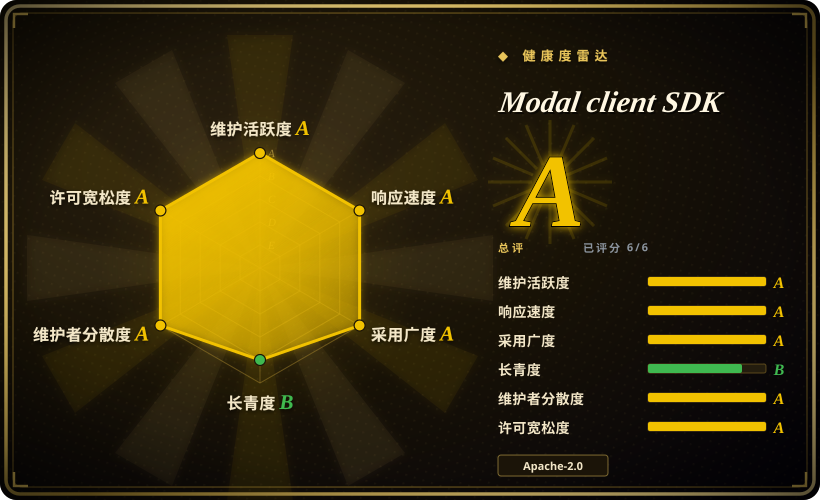
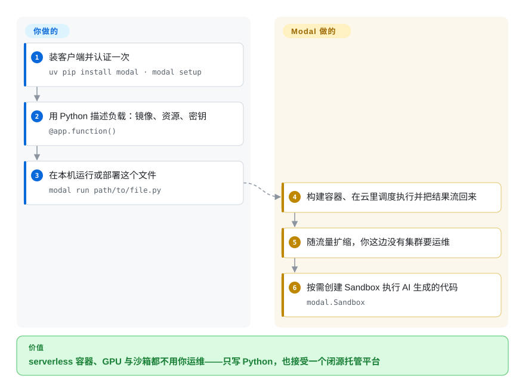

# Modal client SDK

Modal 的开源客户端库：一个 Python 包，用来在 Modal 托管平台上部署函数、驱动沙箱，另有 JS／Go SDK 用于调用函数与运行沙箱——它们背后那个平台是闭源的，无法自托管。

## 何时使用

你想要 serverless 容器（CPU 或 GPU）外加给 AI 生成代码用的隔离沙箱，同时已经决定**什么都自己不管**：不要 Kubernetes、不要节点池、不要镜像仓库、不要自动扩缩策略。Modal 的主张是一切都是 Python 文件里的代码：给函数加个装饰器，平台负责构建容器、调度、扩容并按秒计费。这个取舍可以接受时，就该用这套 SDK：`uv pip install modal`、`modal setup` 认证、写好应用、`modal run path/to/file.py` 就在 Modal 云上执行；面向 agent 负载时同一个 SDK 能创建 Sandbox，这也是它出现在沙箱对比里的原因。与 [E2B](e2b.zh.md) 的决定性取舍是运行时的开放性：E2B 的运行时能自托管（Terraform 部署到 AWS／GCP），Modal 的不能——换来的是 Modal 作为平台更宽（GPU、函数、卷、定时任务、notebook）。与 [Agent Substrate](substrate.zh.md) 或 [OpenSandbox](opensandbox.zh.md) 的决定性取舍是谁拥有沙箱：用 Modal，机器和边界都不归你，你只拥有 API 调用。

**本页范围提醒：** 这个仓库是客户端 SDK。它的 star 数、issue 追踪与发布节奏描述的是 SDK，而不是托管平台的可靠性、寿命或治理——读下面的健康度时请带着这一点。

## 怎么用起来

SDK 是客户端：它交付一个 `modal` Python 包（内含 `modal` CLI）以及覆盖部分操作的 JS／Go 库，通过网络与 Modal 控制面通信。你安装它（`uv pip install modal`）、认证一次（`modal setup`），然后用 Python 描述负载——一个 Modal app 加若干函数（`@app.function()`），镜像、资源与密钥都在代码里声明而不是写在 YAML 里。`modal run path/to/file.py` 把这份描述构建成容器、在 Modal 云上运行并把结果流回来；同一份描述也可以部署成常驻服务。面向 agent 时，SDK 还暴露 Sandbox：短生命周期、隔离、可由程序创建并执行命令的环境。SDK 之上的一切——镜像构建、跨云调度、GPU 分配、缩容到零、快照——都发生在闭源平台内部；本仓库自己的贡献是协议客户端、本地工具（`modal` CLI、开发服务行为）以及 CLI 可安装的技能与文档引用。

<!-- flow-steps:begin (generated from flows/modal-client.json by tools/flow_card.py — do not edit) -->

流程文字版

1. **你**：装客户端并认证一次 — `uv pip install modal · modal setup`
2. **你**：用 Python 描述负载：镜像、资源、密钥 — `@app.function()`
3. **你**：在本机运行或部署这个文件 — `modal run path/to/file.py`
4. **Modal client SDK**：构建容器、在云里调度执行并把结果流回来
5. **Modal client SDK**：随流量扩缩，你这边没有集群要运维
6. **Modal client SDK**：按需创建 Sandbox 执行 AI 生成的代码 — `modal.Sandbox`

**价值**：serverless 容器、GPU 与沙箱都不用你运维——只写 Python，也接受一个闭源托管平台

<!-- flow-steps:end -->

## 何时不用

- **你必须自托管沙箱或平台。** 服务端不开源，这套 SDK 无法指向你自己的部署。想要可自托管的沙箱运行时，用 [OpenSandbox](opensandbox.zh.md)（平台）或 [Firecracker](firecracker.zh.md)／[gVisor](gvisor.zh.md)（原语）；想要接近「托管体验但能自托管」的，看 [E2B](e2b.zh.md) 的 Terraform 路径。
- **数据驻留、隔离网或厂商独立性是硬约束。** 闭源托管平台让你既无法审视也无法搬走控制面，区域选择也只有厂商目录里那些。请改用自托管沙箱平台。
- **负载是稳态的、或在规模上对成本敏感。** 按秒计费的 serverless 对脉冲式负载有吸引力，对恒定负载可能很贵；自管集群（[Agent Substrate](substrate.zh.md) 式密度）或普通 Kubernetes 可能更便宜也更可预测。
- **你需要沙箱在长时间空闲后保留进程内存。** Modal 的模型是全新容器／沙箱执行配合平台侧快照，而不是「一个会话一个有状态 agent，暂停到对象存储再恢复」——后者用 [Agent Substrate](substrate.zh.md)。
- **你想要一个能影响路线图的开源项目。** 通过这个仓库无法实质治理平台；请选开源核心或基金会治理的替代品。
- **你需要客户端 SDK 跨版本稳定。** JS／Go SDK 只覆盖平台的一部分，Python SDK 跟着快速迭代的产品走；请锁版本并预期变动。[推断]

## 横向对比

| 替代品 | 是否收录 | 我们的评价 | 取舍 |
|---|---|---|---|
| [E2B](e2b.zh.md) | ✅ | 沙箱运行时必须开源可自托管，选 E2B；想要更宽的托管平台（GPU、函数、卷、定时任务）且什么都不打算自托管，选 Modal。 | 两者都把沙箱基础设施抽象在 SDK 后面；E2B 留了退路（Terraform 进自己的 AWS／GCP），Modal 没有，而 Modal 的平台面比「只有沙箱」宽。 |
| [OpenSandbox](opensandbox.zh.md) | ✅ | 要在自己的 Kubernetes 里自托管沙箱平台，选 OpenSandbox；一点基础设施都不想碰，选 Modal。 | OpenSandbox 把控制面、协议与运行时留在你手里，代价是你要运维它们；Modal 把运维整个拿走，也把「审视或迁移这道边界」的能力一并拿走。 |
| [Agent Substrate](substrate.zh.md) | ✅ | 真正昂贵的问题是让大量空闲有状态 agent 便宜地活着、并能从快照恢复，选 Substrate；负载是一次性执行、且不想看见任何机器，选 Modal。 | 两条成本曲线不同：Substrate 优化你自己硬件的利用率；Modal 优化你的时间，并把利用率风险（连同按秒价格）转给厂商。 |
| [Firecracker](firecracker.zh.md) | ✅ | 想自己拥有隔离原语及其威胁模型，选 Firecracker；想把隔离当作永远不用配置的 API，选 Modal。 | Firecracker 是 Modal 这类平台的底层；拥有它意味着拥有主机设置、镜像、调度与回收——正是 Modal 卖给省略的那些工作。 |
| AWS Lambda／Fargate、Google Cloud Run | 未收录 | 已经标准在该云上、想要它整个生态，选超大规模云的 serverless；想要能上 GPU 的 serverless 加沙箱、以及 Python 优先无 YAML 的开发循环，选 Modal。 | 超大规模云的 serverless 是既有势力，集成与企业管控更深；Modal 的差异在开发体验与 GPU／沙箱的人机工程。它们全是托管闭源平台，因此都无法作为仓库收录。 |

## 技术栈

- **语言：** 主 SDK 是 Python（`modal` 包加 `modal` CLI）；JavaScript／TypeScript 与 Go SDK 覆盖函数调用、沙箱使用与部分平台资源。
- **模型：** 一切皆代码——容器镜像、GPU／资源请求与密钥都在 Python 里声明，没有 YAML；平台负责构建与运行。
- **仓库内的工具：** `modal` CLI（含 `modal skills install`，用于安装 Modal 自己的 agent 技能与版本对齐的文档引用），以及打包进来的技能与参考资料。
- **平台侧（不在本仓库）：** 容器镜像构建、跨云容量池、调度、缩容到零、GPU、卷、队列与 Sandbox。

## 依赖

- **一个 Modal 账号与到其控制面的网络访问**——这是无法回避的依赖；没有离线或自托管模式。
- **Python 3.9 一类的工具链（或其他 SDK 对应的 Node／Go）**；README 的安装行是 `uv pip install modal`，平台文档里是 `pip install modal`。
- **按平台文档，使用 GPU 需要绑定支付方式。** [未验证]
- **没有任何需要你运维的东西**——这正是产品本身：你这边没有集群、仓库、调度器或扩缩器。

## 运维难度

**低——因为你什么都不用运维。** 安装是一个包，认证是 `modal setup`，整个运行时都是厂商的。反面是这份「低运维」不是你掌控的属性：你无法调调度器、看不到宿主机、选不了隔离实现，也不能在厂商改条款时让平台继续存在。请把这页读成「低运维、高厂商依赖」，而不是「低风险」。

## 健康度与可持续性

- **维护活跃度（2026-09-20）。** 活跃：最后推送 2026-09-19，创建于 2022-10。未归档。
- **治理与 bus factor（2026-09-20）。** 公司掌控（Modal Labs）；本仓库是商业产品的客户端，因此**平台**的治理在这里完全不可观测。[推断]
- **背书与 Lindy（2026-09-20）。** Modal 是有融资的公司，SDK 自 2022 年存在——约四年的客户端延续性，对**客户端**来说是有限的 Lindy 信用，且完全不能说明平台的价格或存续。[推断]
- **采用与生态（2026-09-20）。** 平台在 GPU 推理、批处理与 agent 沙箱上有明显使用（案例式材料与示例），而本 SDK 是唯一受支持的客户端。这里的 star 数（约 514）是平台采用度的糟糕代理：多数 Modal 用户从不会打开客户端仓库。[推断]
- **风险旗标（2026-09-20）。** 结构性的、且是按设计如此的：闭源服务端、只能托管、按秒计费、单一厂商。选型标准里一旦包含「能否退出」，本页诚实的结论就是「没有退路」——这也是上文每条「何时不用」都点名了可自托管替代品的原因。

## 存疑（未验证）

- [未验证] 「平台闭源且不可自托管」是从仓库范围（只有客户端 SDK）与平台自身的「我们托管一切」定位推断的；本次没有尝试寻找自托管路径。
- [推断] 关于 Modal Labs 融资与寿命的陈述属于一般市场常识，不是本次为写本页阅读的来源。
- [未验证] Python 版本下限、GPU 需要支付方式、以及当前价格来自某一时点抓取的平台文档，未固定版本核实。
- [推断] 「JS／Go SDK 只覆盖一部分」是从 SDK README 的措辞（「允许你使用 Modal Sandboxes、调用已部署 Functions，并与部分平台资源交互」）推断的，未做 API 级逐一比对。
- [未验证] Modal 的沙箱快照／内存能力是否在功能上与 [Agent Substrate](substrate.zh.md) 相当未核实；对比行是按产品模型对比，不是按功能清单。
