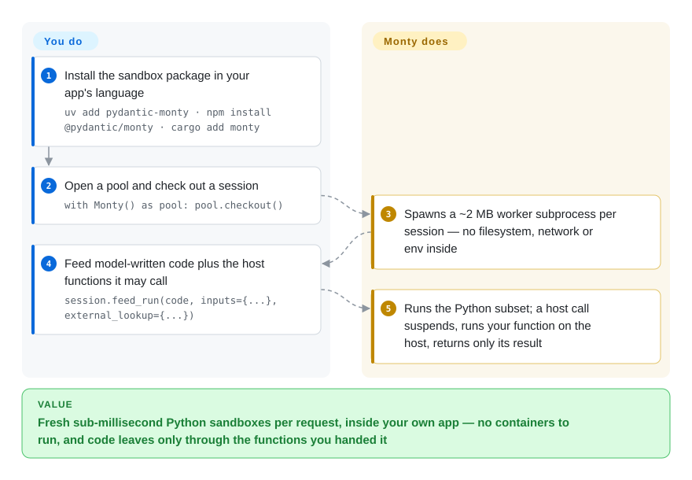

# Monty

The model hands you Python and your options are `exec()` — which hands the model your filesystem and credentials — or a container sandbox, which costs hundreds of milliseconds per fresh sandbox plus something to operate. Monty is a Python interpreter written in Rust where the sandbox has no filesystem, network or environment variables at all: the only doors are the functions and directories you pass in, and a fresh session checks out in under a millisecond.

## When to use

You are building an agent or LLM feature where the model answers by writing Python — compute a number, reshape a JSON payload, run a small calculation on inputs you supply — and that code must run per request, inside your own service. The alternatives each hurt somewhere: `exec()`/subprocess gives untrusted code full host authority; a container sandbox ([Microsandbox](microsandbox.md), plain Docker) costs ~200 ms per fresh sandbox and a runtime to operate; a hosted sandbox service ([E2B](e2b.md), [Modal client SDK](modal-client.md)) adds a network round trip, per-use pricing, and an egress path for your data. Monty collapses the problem into a library installed from pip/npm/cargo: each session is a ~2 MB worker subprocess speaking a Python subset, checkout from a warm pool measures 0.8 ms, and there is nothing ambient inside — no filesystem, no network, no environment variables — unless you explicitly hand in a host function, a wrapped host object, or a mounted directory.

Pick it when model-written code is calculation-shaped and latency or data locality is the constraint; it is the engine behind Code Mode in Pydantic AI, so the pattern is proven at the framework level, and interpreter-level snapshots (`dump()` serializes a paused session, call stack included, to a few kilobytes) let you resume or fork a session later. The deciding tradeoff against every container- or VM-based option: Monty's boundary is the language itself — the interpreter implements no operation that touches the host, so there is no syscall surface to filter — but in exchange it runs a deliberate subset of Python 3.14, not CPython with your packages (see When NOT to use).

## How it works

Monty is a bytecode interpreter for a subset of Python 3.14, written in Rust — the sandbox *is* the language surface: no opcode exists that opens a socket, reads a file or spawns a process, so isolation comes from the interpreter rather than from a kernel boundary. You install the package (`uv add pydantic-monty`; also `npm install @pydantic/monty` or `cargo add monty`), create a `Monty()` pool — it spawns worker subprocesses, about 2 MB each, so one machine runs hundreds — and check out a session: `session.feed_run(code, inputs={...}, external_lookup={...})` feeds model-written source with values and host functions. Names the sandbox does not define resolve against `external_lookup`: execution suspends, your function runs on the host with your authority, and the sandbox sees only its return value. Host objects go in as `ClassInstance`/`ClassType` wrappers with name allow-lists, and host directories as `MountDir` mounts at virtual paths — that is the entire egress surface, and all of it is opt-in per feed. What you own: the code, the policy (which functions and mounts exist, and the per-feed resource limits — memory, execution-time budget, suspensions — which are off by default and must be set for untrusted code); what Monty owns: the interpreter, the worker pool, crash isolation (a panicked worker terminates the worker, not your process).

<!-- flow-steps:begin (generated from flows/monty.json by tools/flow_card.py — do not edit) -->

Text version of the flow

1. **You**: Install the sandbox package in your app's language — `uv add pydantic-monty · npm install @pydantic/monty · cargo add monty`
2. **You**: Open a pool and check out a session — `with Monty() as pool: pool.checkout()`
3. **Monty**: Spawns a ~2 MB worker subprocess per session — no filesystem, network or env inside
4. **You**: Feed model-written code plus the host functions it may call — `session.feed_run(code, inputs={...}, external_lookup={...})`
5. **Monty**: Runs the Python subset; a host call suspends, runs your function on the host, returns only its result

**Value**: Fresh sub-millisecond Python sandboxes per request, inside your own app — no containers to run, and code leaves only through the functions you handed it

<!-- flow-steps:end -->

## When NOT to use

- **The model's code needs the real Python ecosystem.** There is no `sys.path` and no site-packages — nothing from PyPI installs or imports. The language stops at a subset: no class inheritance, no decorators on methods (so no `@classmethod`/`@property`), no `yield` generators, no `match`, and a stdlib where `enum`, `contextlib`, `io`, `hashlib` and `logging` are absent. When generated code must use real libraries, use a full-CPython sandbox: [E2B](e2b.md) hosted, or [Microsandbox](microsandbox.md) on your own hardware.
- **Your threat model needs an OS-level boundary.** Monty is a language-level sandbox — an interpreter escape lands in a worker process on your application host. If you must assume the sandbox itself is hostile and want kernel-level defense in depth, use [gVisor](gvisor.md), [Kata Containers](kata-containers.md) or [Firecracker](firecracker.md) — or the commercial Full Monty server, which adds container isolation (closed-source and paid).
- **The workload is not Python source.** Monty runs Python only — a model that shells out, serves a port, drives a browser or needs a GPU requires a real execution environment: [E2B](e2b.md) (browser/desktop variants) or [OpenSandbox](opensandbox.md).
- **Sandbox creation is rare, not per-request.** If you open one sandbox per user session rather than per request, ~200 ms of container start is irrelevant and full CPython is worth more than a millisecond checkout — keep containers or a hosted service.
- **You need enforced ceilings without writing policy.** Resource limits are per-feed and off by default, there is no session-lifetime budget, and after a limit trips the session must be discarded by you. When quotas must be the platform's job, a metered sandbox service ([E2B](e2b.md), Modal) enforces them for you.

## Comparison

| Alternative | In index | Our verdict | Tradeoff |
|---|---|---|---|
| [Pyodide](https://github.com/pyodide/pyodide) | 未收录 | Choose Pyodide when generated code needs real packages (numpy etc.) and runs client-side or in Deno; choose Monty when Python runs server-side per request and the sandbox must be strict by construction. | Pyodide gives full CPython in WASM but loads in ~2.7 s, was not designed as a server-side isolation boundary, and has no persistent REPL session; Monty gives 0.8 ms sessions and structural confinement, but only its Python subset. Not added in this tab-intake batch. |
| [E2B](e2b.md) | ✅ | Choose E2B when generated code needs the full CPython ecosystem and you accept a hosted fleet (~1.5 s per new sandbox, per-use pricing); choose Monty when the sandbox must be local, sub-millisecond and free per checkout. | E2B scales independently of your app hosts and runs any library; Monty runs inside your process boundary with no egress but speaks only its subset. |
| [Modal client SDK](modal-client.md) | ✅ | Choose Modal when you also want serverless containers and GPUs behind one platform call; choose Monty when model-written code must stay inside your own process boundary with nothing metered or hosted. | Modal removes all operations but is a closed, hosted-only platform; Monty is an MIT library you embed — the cost is that everything past the interpreter (files, network, secrets) becomes your policy code. |
| [Microsandbox](microsandbox.md) | ✅ | Choose Microsandbox when untrusted code needs a full system (any runtime, any language) in a local microVM and the host has hardware virtualization; choose Monty when the workload is Python-shaped and millisecond, in-app sandboxing matters more than completeness. | A microVM gives OS-level isolation and full CPython at ~200 ms-ish startup and one sandbox per VM; Monty gives language-level isolation and interpreter snapshots at 1/100 the startup, but only for its subset. |
| [wasmtime](https://github.com/bytecodealliance/wasmtime) (WASI CPython) | 未收录 | Choose wasmtime when you need near-full CPython inside a WASM capability sandbox and can manage modules and preopened directories yourself; choose Monty when you need interpreter-level snapshots and a Python API rather than `.cwasm` plumbing. | WASI CPython starts in ~16 ms with precompiled modules, takes pure-Python packages from a mounted directory, and has no interpreter snapshotting; Monty starts in under 1 ms and snapshots to kilobytes, but its stdlib and language surface are smaller. Not added in this tab-intake batch. |

## Tech stack

- **Rust workspace** (~20 crates): `monty` — the bytecode interpreter (heap arena, reference counting); `monty-fs` — the mount table over `cap_std::fs::Dir` descriptors; `monty-proto` — the worker wire protocol with allocation-budgeted decoding of untrusted frames; `monty-pool`; `monty-type-checking` with a bundled typeshed; `monty-wasm-runtime`/`monty-js` for the WebAssembly build.
- **Language bindings:** `pydantic-monty` on PyPI (native extension built with maturin), `@pydantic/monty` on npm (the WASM build runs off-thread in a browser Web Worker or Node `worker_threads`), `monty`/`monty-pool` on crates.io.
- **Inside the sandbox:** `re` is backed by Rust's `fancy-regex`, not CPython's engine; `asyncio` exposes exactly `run`/`gather`/`sleep`; `enumerate`/`zip`/`map`/`filter` are eager.
- **Engineering:** mkdocs-material docs (the `limitations/` pages are published verbatim from the repo), CodSpeed performance tracking, codecov, a repo-internal `review-security` skill for the security-critical modules.

## Dependencies

- **Runtime:** nothing beyond the package — about 4.5 MB download, no daemon, no container runtime, no KVM, no network. The `monty` worker binary ships inside the platform package (resolve order: explicit path → `MONTY_BIN` → bundled → `PATH`; pass the path explicitly when running untrusted code).
- **Host side:** a Python ≥ 3.10 application, a Node.js runtime, or a Rust host. Community bindings exist for Go (`gomonty`) and Dart (`dart_monty`). [未验证]
- **Policy you must supply for untrusted code:** per-feed resource limits (`max_memory`, duration limits, `max_suspensions` — off by default, and `request_timeout` defaults to no deadline), plus argument validation inside every host function you expose — a host function that takes a path and reads it is an unconstrained filesystem primitive you wrote.

## Ops difficulty

**Low — it is a library, not a service.** Install, embed, and the pool manages workers (crash isolation replaces a dead worker and raises `MontyCrashedError`; the session is lost, the pool is not). The real operational weight is policy, not plumbing: deciding which host functions, host objects and mounts to expose; setting the per-feed limits for untrusted code; discarding sessions after a limit trips rather than reusing them; and, if you use snapshots, establishing each dump's provenance before restoring it — Monty does not authenticate snapshot bytes.

## Health & viability

- **Maintenance (2026-09-28).** Very active: v1.0.0 released 2026-09-25 after a September beta series, last push 2026-09-27, ~8.4k stars, 129 open issues, not archived.
- **Governance / bus factor (2026-09-28).** Company-led by Pydantic Services Inc. (MIT, © Pydantic Services Inc.); the top three contributors — samuelcolvin (Pydantic's founder), davidhewitt, rewitt94 — account for the overwhelming majority of commits. [推断] A small core team, but with a decade-scale track record in the Python ecosystem (pydantic, pydantic-ai); no foundation governance, so the roadmap is the company's.
- **Backing & Lindy (2026-09-28).** Repo created 2023-05, first commit 2023-06 — over three years of development before 1.0, a real hardening runway, backed by a company whose entire business is Python tooling. As a released product it is days old at 1.0, so expect early-1.0 API churn. [推断]
- **Adoption & ecosystem (2026-09-28).** Ships as Code Mode in Pydantic AI; community Go and Dart bindings; 1.0.0 published on PyPI, npm and crates.io. The scorer read 4,035,032 downloads last month for `pydantic-monty` on PyPI (adoption grade A) — strong volume for a package days past 1.0, driven by the Pydantic ecosystem's reach. [推断]
- **Risk flags (2026-09-28).** Open-core: the commercial Full Monty server (OS-level isolation, WebSocket remote workers, CPython proxying) is closed-source while the MIT repo carries the interpreter and local bindings — watch where that boundary drifts. [推断] Positively: a continuous security bounty program for sandbox escapes exists, which is the right signal for a security product; the documented defaults (limits off) are a footgun only for adopters who skip the security page.

## Caveats (unverified)

- [未验证] Latency figures (0.8 ms checkout, ~195 ms Docker, ~1500 ms Daytona, ~2700 ms Pyodide) are the project's own measurements from `scripts/startup_performance.py` (one Apple M3 Max, mostly single-sample, measured 2026-09-03/24); not reproduced here.
- [推断] Bus-factor and open-core drift judgments are inferred from contributor counts and the docs' OSS/commercial split, not from a published governance document.
- [未验证] Production adoption beyond Pydantic AI's Code Mode was not enumerated; the security bounty program's scope and payouts were not checked.
- [推断] Comparison rows are layer judgments (language vs OS boundary, local vs hosted, subset vs full CPython), not measured head-to-head, except the startup numbers cited from the project's benchmark page.
- [未验证] The Python-subset coverage list (present/absent stdlib modules, rejected constructs) was read from the limitations docs on 2026-09-28 and can change with each release.
