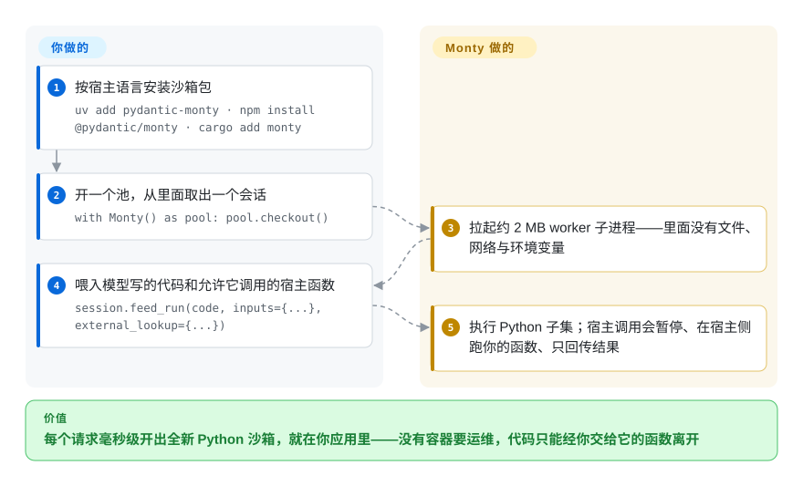

# Monty

模型递给你一段 Python，摆在面前的选项只有两个：`exec()` 直接跑，等于把文件系统和凭据交出去；上容器沙箱，每开一个新沙箱要几百毫秒，还得多养一套运行时。Monty 是用 Rust 写的 Python 解释器，沙箱里根本没有文件系统、网络和环境变量——唯一的出口是你亲手传进去的函数和目录，而从暖池里新取一个会话不到一毫秒。

## 何时使用

你在做 agent 或 LLM 功能，模型靠写 Python 来给答案——算一个数、整理一段 JSON、对输入做点小计算——而这段代码要按请求跑在你自己的服务里。现有选项各有一处疼：`exec()`／subprocess 等于把宿主机完整权限交给不可信代码；容器沙箱（[Microsandbox](microsandbox.zh.md)、普通 Docker）每开一个新沙箱约 200 毫秒，还要运维一套运行时；托管沙箱服务（[E2B](e2b.zh.md)、[Modal 客户端 SDK](modal-client.zh.md)）引入网络往返、按量计费，还给数据添了一条出境通道。Monty 把这件事压成一个从 pip／npm／cargo 装进来的库：每个会话是一个约 2 MB、只会说 Python 子集的 worker 子进程，从暖池取会话实测 0.8 毫秒，而且里面没有任何「环境授予」——没有文件系统、没有网络、没有环境变量——除非你显式传入宿主函数、包装过的宿主对象或挂载目录。

模型代码是计算形状、延迟或数据不出本机是硬约束时选它；它是 Pydantic AI 里 Code Mode 的执行引擎，这个模式在框架层已被验证，而且解释器级快照（`dump()` 把暂停中的会话连同调用栈序列化成几千字节）让你之后可以恢复或分叉一个会话。它与所有容器／虚拟机方案的决定性取舍在：Monty 的边界是语言本身——解释器根本没实现任何能碰到宿主的操作，所以没有系统调用面需要过滤——但代价是它跑的是 Python 3.14 的一个刻意子集，不是带着你那些包的 CPython（见何时不用）。

## 怎么用起来

Monty 是一个用 Rust 写的字节码解释器，解释 Python 3.14 的一个子集——沙箱就是语言面本身：不存在能开 socket、读文件或起进程的字节码，隔离来自解释器而不是内核边界。你装上包（`uv add pydantic-monty`，也可以 `npm install @pydantic/monty` 或 `cargo add monty`），建一个 `Monty()` 池——它会拉起 worker 子进程，每个约 2 MB，一台机器能跑几百个——再取一个会话：`session.feed_run(code, inputs={...}, external_lookup={...})` 把模型写的源码连同输入值和宿主函数一起喂进去。沙箱里没有定义的名字会去 `external_lookup` 里解析：执行暂停，你的函数在宿主侧以你的完整权限运行，沙箱只看得到返回值。宿主对象用带名字白名单的 `ClassInstance`／`ClassType` 包装后传入，宿主目录用 `MountDir` 挂到虚拟路径——这就是全部出口，而且每次喂入都要显式选择。你负责的：代码与策略（暴露哪些函数和挂载，以及按次生效的资源上限——内存、执行时长、挂起次数——默认关闭，跑不可信代码必须自己设）；Monty 负责的：解释器、worker 池和崩溃隔离（worker 崩溃只终结 worker，不终结你的进程）。

<!-- flow-steps:begin (generated from flows/monty.json by tools/flow_card.py — do not edit) -->

流程文字版

1. **你**：按宿主语言安装沙箱包 — `uv add pydantic-monty · npm install @pydantic/monty · cargo add monty`
2. **你**：开一个池，从里面取出一个会话 — `with Monty() as pool: pool.checkout()`
3. **Monty**：拉起约 2 MB worker 子进程——里面没有文件、网络与环境变量
4. **你**：喂入模型写的代码和允许它调用的宿主函数 — `session.feed_run(code, inputs={...}, external_lookup={...})`
5. **Monty**：执行 Python 子集；宿主调用会暂停、在宿主侧跑你的函数、只回传结果

**价值**：每个请求毫秒级开出全新 Python 沙箱，就在你应用里——没有容器要运维，代码只能经你交给它的函数离开

<!-- flow-steps:end -->

## 何时不用

- **模型写的代码要用真实的 Python 生态。** 沙箱里没有 `sys.path`、没有 site-packages——任何 PyPI 包都装不了也导不进来。语言面也止步于子集：没有类继承，方法上不能贴装饰器（所以没有 `@classmethod`／`@property`），没有 `yield` 生成器，没有 `match`，标准库里 `enum`、`contextlib`、`io`、`hashlib`、`logging` 缺席。生成的代码必须用真库时，用跑完整 CPython 的沙箱：托管的 [E2B](e2b.zh.md)，或跑在自己硬件上的 [Microsandbox](microsandbox.zh.md)。
- **威胁模型需要操作系统级边界。** Monty 是语言级沙箱——解释器一旦被逃逸，落点是你应用宿主机上的 worker 进程。必须假设沙箱本身是敌方、要内核级纵深防御时，用 [gVisor](gvisor.zh.md)、[Kata Containers](kata-containers.zh.md) 或 [Firecracker](firecracker.zh.md)——或者用闭源收费的商用 Full Monty 服务器，它在沙箱外再套一层容器隔离。
- **负载不是 Python 源码。** Monty 只跑 Python——模型要起 shell、开端口、驱动浏览器或用 GPU，需要的是真实执行环境：[E2B](e2b.zh.md)（浏览器／桌面变体）或 [OpenSandbox](opensandbox.zh.md)。
- **沙箱不是按请求开的。** 一个用户会话才开一个沙箱时，容器约 200 毫秒的启动无关痛痒，完整 CPython 比毫秒级取会话值钱——继续用容器或托管服务。
- **你需要平台替你强制配额。** 资源上限按次生效且默认关闭，没有会话级总预算，上限触发后也得由你丢弃会话。配额必须是平台的事时，按量计费的沙箱服务（[E2B](e2b.zh.md)、Modal）替你强制执行。

## 横向对比

| 替代品 | 是否收录 | 我们的评价 | 取舍 |
|---|---|---|---|
| [Pyodide](https://github.com/pyodide/pyodide) | 未收录 | 生成的代码要用真包（numpy 等）、跑在浏览器或 Deno 里，选 Pyodide；Python 要在服务端按请求跑、沙箱必须在构造上严格，选 Monty。 | Pyodide 给了 WASM 里的完整 CPython，但加载约 2.7 秒、设计目标不是服务端隔离、也没有可复用的持久 REPL 会话；Monty 给 0.8 毫秒会话和结构性禁闭，但只有它的 Python 子集。本批次未收录。 |
| [E2B](e2b.zh.md) | ✅ | 生成的代码要用完整 CPython 生态、可以接受托管机群（新开沙箱约 1.5 秒、按量计费），选 E2B；沙箱必须本地、亚毫秒、每次取出免费，选 Monty。 | E2B 独立于应用主机扩容、什么库都能跑；Monty 跑在你的进程边界内、不出网，但只会说它的子集。 |
| [Modal 客户端 SDK](modal-client.zh.md) | ✅ | 还想顺手要 serverless 容器和 GPU、一个平台调用全搞定，选 Modal；模型代码必须留在自己进程边界内、不被计量不被托管，选 Monty。 | Modal 免运维但是闭源、只能托管的平台；Monty 是嵌进应用的 MIT 库——代价是解释器之外的一切（文件、网络、凭据）都变成你的策略代码。 |
| [Microsandbox](microsandbox.zh.md) | ✅ | 不可信代码要完整系统（任意运行时、任意语言）跑在本地 microVM、宿主机有硬件虚拟化，选 Microsandbox；负载是 Python 形状、毫秒级的应用内沙箱比完整性重要，选 Monty。 | microVM 给操作系统级隔离和完整 CPython，代价是百毫秒级启动、每沙箱一个虚拟机；Monty 启动快约百倍、还能做解释器级快照，但只有它的子集。 |
| [wasmtime](https://github.com/bytecodealliance/wasmtime)（WASI CPython） | 未收录 | 要在 WASM 能力沙箱里跑接近完整的 CPython、且愿意自己管理模块与预开目录，选 wasmtime；要解释器级快照和一套 Python API 而不是 `.cwasm` 管线，选 Monty。 | WASI CPython 用预编译模块约 16 毫秒启动、能从挂载目录跑纯 Python 包，但解释器不能快照；Monty 亚毫秒启动、快照只有几千字节，但标准库和语言面更小。本批次未收录。 |

## 技术栈

- **Rust workspace**（约 20 个 crate）：`monty`——字节码解释器本体（堆 arena、引用计数）；`monty-fs`——基于 `cap_std::fs::Dir` 描述符的挂载表；`monty-proto`——worker 线协议，对不可信帧做带分配预算的解码；`monty-pool`；带内置 typeshed 的 `monty-type-checking`；以及 WASM 构建用的 `monty-wasm-runtime`／`monty-js`。
- **语言绑定：** PyPI 上的 `pydantic-monty`（用 maturin 构建的原生扩展）、npm 上的 `@pydantic/monty`（WASM 构建在浏览器 Web Worker 或 Node `worker_threads` 里离线程运行）、crates.io 上的 `monty`／`monty-pool`。
- **沙箱内部：** `re` 由 Rust 的 `fancy-regex` 而非 CPython 引擎支撑；`asyncio` 只暴露 `run`／`gather`／`sleep` 三个函数；`enumerate`／`zip`／`map`／`filter` 是急切求值而非惰性。
- **工程配套：** mkdocs-material 文档站（`limitations/` 各页直接从仓库原文发布）、CodSpeed 性能追踪、codecov、以及一个供安全审查关键模块用的仓库内 `review-security` skill。

## 依赖

- **运行时：** 只有包本身——约 4.5 MB 下载，无守护进程、无容器运行时、无 KVM、无网络。`monty` worker 二进制随平台包内置（解析顺序：显式路径 → `MONTY_BIN` → 内置 → `PATH`；跑不可信代码时请显式传路径）。
- **宿主侧：** Python ≥ 3.10 应用、Node.js 运行时或 Rust 宿主，三选一。社区绑定有 Go（`gomonty`）和 Dart（`dart_monty`）。[未验证]
- **跑不可信代码要自己补的策略：** 按次生效的资源上限（`max_memory`、时长上限、`max_suspensions`——默认关闭，且 `request_timeout` 默认无期限），以及你暴露的每个宿主函数内部的参数校验——一个接收路径就读文件的宿主函数，等于你亲手写的无约束文件系统原语。

## 运维难度

**低——它是库，不是服务。** 装上、嵌进应用，池自己管理 worker（崩溃隔离会替换死掉的 worker 并抛 `MontyCrashedError`；会话丢了，池还在）。真正的运维重量在策略而不是管线：决定暴露哪些宿主函数、宿主对象和挂载；给不可信代码设按次上限；上限触发后丢弃会话而不是复用；以及——如果用快照——恢复每份 dump 之前先确认来源可信，Monty 不对快照字节做认证。

## 健康度与可持续性

- **维护（2026-09-28）。** 非常活跃：v1.0.0 于 2026-09-25 发布，之前是九月的一串 beta；最后推送 2026-09-27，约 8.4k stars，129 个开放 issue，未归档。
- **治理／bus factor（2026-09-28）。** 由 Pydantic Services Inc. 公司主导（MIT，版权归 Pydantic Services Inc.）；前三位贡献者——samuelcolvin（Pydantic 创始人）、davidhewitt、rewitt94——占掉了提交的绝大多数。[推断] 核心团队很小，但在 Python 生态有十年量级的往绩（pydantic、pydantic-ai）；没有基金会治理，路线图最终是公司说了算。
- **背书与 Lindy（2026-09-28）。** 仓库 2023-05 创建、2023-06 首次提交——1.0 之前打磨了三年多，是一条实打实的加固跑道；背靠一家整个生意都建立在 Python 工具上的公司。作为发布的产品它刚到 1.0 几天，早期 1.0 的 API 打磨 churn 可以预期。[推断]
- **采用与生态（2026-09-28）。** 作为 Pydantic AI 里 Code Mode 的引擎交付；有社区 Go、Dart 绑定；PyPI／npm／crates.io 都发布了 1.0.0。评分器从 PyPI 读到 `pydantic-monty` 上月下载 4,035,032 次（采用等级 A）——对一个 1.0 刚发布几天的包来说体量很强，背后是 Pydantic 生态的辐射。[推断]
- **风险旗标（2026-09-28）。** Open-core：商用 Full Monty 服务器（操作系统级隔离、WebSocket 远程 worker、CPython 代理）闭源，MIT 仓库承载解释器与本地绑定——留意这条界线往哪边漂。[推断] 正面信号：针对沙箱逃逸有持续的安全赏金计划，对安全产品来说是正确的信号；文档写明的默认值（上限关闭）只对跳过安全页的采用者是坑。

## 存疑（未验证）

- [未验证] 延迟数字（取会话 0.8 毫秒、Docker 约 195 毫秒、Daytona 约 1500 毫秒、Pyodide 约 2700 毫秒）来自项目自己的 `scripts/startup_performance.py` 测量（一台 Apple M3 Max，多为单样本，测于 2026-09-03／24）；此处未复现。
- [推断] bus factor 与 open-core 界线漂移的判断，依据是贡献者数量和文档里开源／商用的划分，没有公开的治理文件佐证。
- [未验证] Pydantic AI Code Mode 之外的生产采用没有枚举；安全赏金计划的范围与金额没有核查。
- [推断] 横向对比各行是层次判断（语言边界还是操作系统边界、本地还是托管、子集还是完整 CPython），不是逐项实测——启动数字引用自项目自己的基准页除外。
- [未验证] Python 子集的覆盖清单（标准库模块的有无、被拒绝的语法构造）读自 2026-09-28 的 limitations 文档，可能随版本变化。
