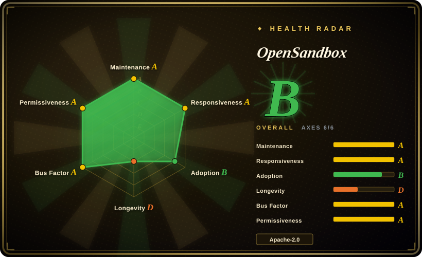
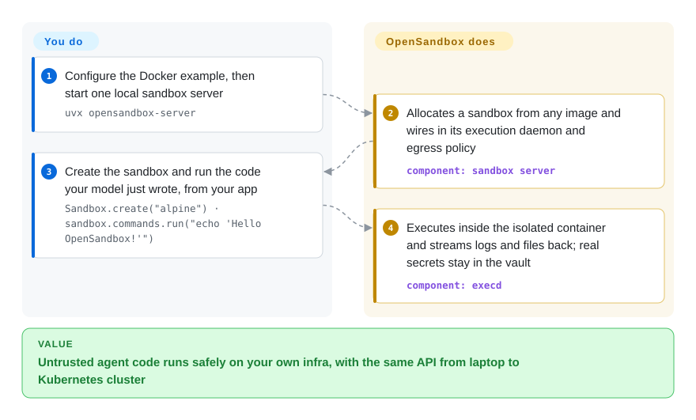

# OpenSandbox

A general-purpose, secure sandbox runtime and platform for AI agents — multi-language SDKs, a unified sandbox protocol, and Docker/Kubernetes backends for running untrusted agent-generated code, GUI/browser automation, and RL/eval workloads in isolated environments.

## When to use

You're building a coding agent (or an agent-evaluation harness) and you've hit the wall every such project hits: the model wants to run shell commands, write files, `pip install`, and execute arbitrary code it just generated — and you cannot let that touch your host or your other tenants. You've been stitching together raw Docker `exec` calls, a homegrown filesystem API, and some scary networking, and it doesn't scale past a laptop. You reach for OpenSandbox: you `pip install opensandbox`, point it at a runtime (local Docker for dev, the Kubernetes runtime for fleet scale), and get a uniform API to create a sandbox, run commands, move files in and out, and run a built-in Code Interpreter — with per-sandbox egress controls and a credential vault so the workload never sees your real secrets. The same SDK call works whether you're on one machine or scheduling thousands of sandboxes on a cluster.

You also reach for it when isolation strength is the requirement, not an afterthought: it can run sandboxes on secure container runtimes (gVisor, Kata Containers, Firecracker microVM) rather than plain containers, and — since the 2026-09 release line — it mixes long-running Kubernetes-native workloads with short-lived microVM sandboxes in one cluster: pre-warmed Firecracker-backed pools give constant-time admission with ~80 ms startup, and FastSandbox pause/resume checkpoints state to an artifact store so idle sandboxes release all compute. It exposes a unified ingress gateway plus an OpenAPI-defined sandbox protocol you can extend with custom runtimes. If you're comparing against hosted code-execution APIs but want to self-host the runtime — keeping the agent's code execution inside your own infra — this is the kind of platform that targets that gap.

## How it works

OpenSandbox sits between your agent code and the machines it would otherwise run on. You operate one lifecycle server — `uvx opensandbox-server` against local Docker for development, or its Kubernetes controller for cluster scale — and clients talk to it through HTTP APIs published as OpenAPI contracts in `specs/`. From the Python/Java/TypeScript/C#/.NET/Go SDKs, the `osb` CLI, or its MCP server, you create a sandbox from any container image: the server allocates it, attaches an in-sandbox execution daemon (`execd`), and routes access through a unified ingress gateway. Inside, you call three ready-made surfaces as methods — run commands, read/write files, and a built-in Code Interpreter — so your agent can execute arbitrary generated code while the host filesystem, your other tenants, and your real secrets stay unreachable: a Credential Vault injects scoped credentials and per-sandbox egress controls can cut the network. What stays yours: running the server and its container runtime (Docker or Kubernetes), building the images, wiring the surrounding network, and validating that the isolation you configured actually meets your threat model.

<!-- flow-steps:begin (generated from flows/opensandbox.json by tools/flow_card.py — do not edit) -->

Text version of the flow

1. **You**: Configure the Docker example, then start one local sandbox server — `uvx opensandbox-server`
2. **OpenSandbox**: Allocates a sandbox from any image and wires in its execution daemon and egress policy — component: `sandbox server`
3. **You**: Create the sandbox and run the code your model just wrote, from your app — `Sandbox.create("alpine") · sandbox.commands.run("echo 'Hello OpenSandbox!'")`
4. **OpenSandbox**: Executes inside the isolated container and streams logs and files back; real secrets stay in the vault — component: `execd`

**Value**: Untrusted agent code runs safely on your own infra, with the same API from laptop to Kubernetes cluster

<!-- flow-steps:end -->

## When NOT to use

- **You just need to run one trusted script locally.** If the code is yours and trusted, a plain Docker container or a subprocess is far less machinery than a full sandbox platform with a server, runtime, and protocol.
- **You can use a hosted code-execution API and don't want to operate infra.** Managed sandbox services (E2B, Daytona, vendor code-interpreter APIs) remove the ops burden entirely; OpenSandbox is something you run and keep running.
- **You need a battle-tested, years-proven dependency today.** The repo was created 2025-12 — under a year old (GitHub API, 2026-09). ~15.5k stars on a sub-year-old project is still a hype/attention signal, not a Lindy/track-record signal; APIs and the sandbox protocol may still churn. [推断]
- **Your isolation requirements demand a specific, audited runtime you must certify yourself.** OpenSandbox can drive gVisor/Kata/Firecracker, but you still own configuring and validating that the isolation meets your threat model — the platform integrating them is not a substitute for that review. [未验证]
- **You don't run Kubernetes or Docker and don't want to.** The runtimes are Docker and Kubernetes; there is no serverless/no-infra mode — the orchestration layer is yours to operate.

## Comparison

| Alternative | In index | Our verdict | Tradeoff |
|---|---|---|---|
| [E2B](e2b.md) | ✅ | Choose E2B when you want the sandbox as a hosted-or-self-hosted SDK with an interpreter and desktop surfaces; choose OpenSandbox when the platform itself must be self-hosted and extensible. | E2B leads with a polished hosted product and Terraform self-hosting on AWS/GCP; OpenSandbox leads with a self-host-first platform and an extendable sandbox protocol. Both hide the same problem — which sandbox technology to run — behind different bets on who operates it. |
| [Agent Substrate](substrate.md) | ✅ | Choose Substrate when the agents are long-lived and idle-heavy and the cost problem is pod density with snapshot resume; choose OpenSandbox when the job is "run this code in isolation, now". | Substrate multiplexes stateful sessions with suspend/resume; OpenSandbox exposes disposable execution sandboxes. Overlap is only the isolation layer — density versus on-demand execution. |
| [gVisor](gvisor.md) | ✅ | Choose gVisor when you want syscall-level isolation without a VM and will build the sandbox lifecycle yourself; choose OpenSandbox when you want that lifecycle, SDKs and policy delivered. | A userspace kernel used as a runtime class; it is the isolation primitive OpenSandbox-style platforms can drive, not a platform. |
| [Kata Containers](kata-containers.md) | ✅ | Choose Kata when your Kubernetes should give each pod a real kernel in a lightweight VM; choose OpenSandbox when you want a sandbox API instead of a runtime class. | Kata is node-level VM isolation with full container-manager integration; OpenSandbox is the API/lifecycle layer above runtimes like it. |
| [Firecracker](firecracker.md) | ✅ | Choose Firecracker when you are building the sandbox layer and want the minimal KVM microVM primitive; choose OpenSandbox when you want sandboxes as a product. | Firecracker stops at the microVM boundary; OpenSandbox must solve images, scheduling, lifecycle and policy on top of some such primitive. |
| Daytona | 未收录 | Choose Daytona when the need is a hosted-first dev-environment/sandbox platform for agents; choose OpenSandbox when you must self-host the platform. | Adjacent product shape (dev environments rather than an agent code-execution protocol); not indexed in this batch — tracked as backlog rather than justified out of scope by capability. |
| Plain Docker / containerd | 未收录 | Choose Docker or containerd when ubiquitous containers are enough; choose OpenSandbox when the workload is untrusted and needs a sandbox protocol, credential vault and egress policy. | The baseline you are replacing (containerd/runc selection is out of scope here): you get a container, not a sandbox platform. |
| Jupyter Kernel Gateway / nsjail | 未收录 | Choose these when you need narrow, single-purpose code-execution or isolation plumbing; choose OpenSandbox when you want the agent-facing platform around it. | Single-purpose primitives with no multi-tenant platform layer; out of scope for this node rather than addable peers. |

## Tech stack

- **Languages:** Python is the primary language; the project ships SDKs in Python, Java/Kotlin, JavaScript/TypeScript, C#/.NET, and Go.
- **Runtimes:** Docker (local) and a Kubernetes runtime/controller (with a Helm chart) for distributed scheduling; the microVM path is Firecracker-backed pools plus FastSandbox pause/resume (docs/architecture).
- **Isolation:** integrates secure container runtimes — gVisor, Kata Containers, and Firecracker microVM — for stronger host/workload separation.
- **Surface:** an `osb` CLI, a standalone MCP server (`opensandbox-mcp`), a unified ingress gateway with per-sandbox egress controls, a credential vault, a documented sandbox protocol (lifecycle + execution APIs as OpenAPI) in `specs/`, and OSEPS enhancement proposals in `oseps/`.
- **Distribution:** release images published to Docker Hub, GHCR, and Alibaba Cloud Container Registry, signed keylessly with Cosign and provenance attestations.
- **Built-ins:** Command, Filesystem, and Code Interpreter environments; examples for Claude Code, Gemini CLI, Codex CLI, OpenCode, Qwen Code, Kimi CLI, Chrome/Playwright browser automation, VNC/VS Code desktops, and Harbor agent evaluation.

## Dependencies

- **Runtime you must run:** a container runtime — Docker for local use (the quick start requires Docker plus Python 3.10+), or a Kubernetes cluster for scale (plus the OpenSandbox lifecycle server/controller). This is the load-bearing dependency.
- **Optional secure runtimes:** gVisor, Kata Containers, or Firecracker if you want stronger-than-container isolation — each adds its own host/kernel setup.
- **SDK install:** `pip install opensandbox` (Python), Maven/Gradle artifacts under `com.alibaba.opensandbox`, `@alibaba-group/opensandbox` (npm), `Alibaba.OpenSandbox` (.NET), and a Go module under `github.com/alibaba/OpenSandbox/sdks/...`. The CLI is `pip install opensandbox-cli` (or `uv tool install opensandbox-cli`); the MCP server is `pip install opensandbox-mcp`; the server can be run via `uvx opensandbox-server`.
- **Network:** the ingress gateway and egress controls assume you provide the surrounding network plumbing.

## Ops difficulty

**Medium-to-high.** The local Docker path is approachable for development (`uvx opensandbox-server` plus one SDK). Production is a real platform to operate: a lifecycle server, a Kubernetes controller (deployed via its Helm chart), an ingress gateway, egress policy, and a credential vault — plus, if you want strong isolation, the host-level setup for gVisor/Kata/Firecracker (kernel features, node configuration). The component surface is wide and versioned independently (server, execd, egress, Helm, five SDKs), so upgrades are a multi-artifact exercise; the project's release-verification guide (Cosign signatures + provenance, pin-by-digest) is the documented way to keep that supply chain honest. You are running a multi-component distributed system whose whole job is to safely execute untrusted code, so getting isolation, networking, and secret handling right is the hard part, and it's security-critical. The project carries an OpenSSF Best Practices badge and a GOVERNANCE.md, which helps, but the operational surface is inherently larger than a single binary or a hosted API.

## Health & viability

- **Responsiveness**: Grade A — median first-response time 12.7 hours across 45 qualifying issues/PRs (scorer, 2026-09-28).
- **Maintenance (2026-09).** Pushed the same day this page was re-verified (2026-09-28); a platform umbrella tag `release-1.1.0` landed 2026-09-21, and component releases keep a weekly-plus cadence (python SDK v0.1.16 → v0.1.17.dev0, java v1.0.19, server v0.2.3, execd v1.1.0, egress v1.1.7, Helm chart 0.2.2 through late August — GitHub releases). **Very active.** Not archived.
- **Backing & governance (2026-09).** Originated from Alibaba (the package coordinates still carry it: Maven `com.alibaba.opensandbox`, npm `@alibaba-group/opensandbox`, Go module under `github.com/alibaba/OpenSandbox`) and now sits under the `opensandbox-group` org with a GOVERNANCE.md, an OpenSSF Best Practices entry, a CNCF Landscape listing, and an OSEPS enhancement-proposal process — signals of an intent toward open, multi-maintainer governance backed by a large vendor. [未验证]
- **Age × Lindy (2026-09).** Created 2025-12-17 — roughly 9.5 months old. This is still a **young project**; Lindy gives it no credit yet. ~15.5k stars on a sub-year repo is a strong hype/attention signal but says nothing about longevity. Treat API/protocol stability as unproven. [推断]
- **Adoption & ecosystem.** Broad SDK coverage (5 languages), a CLI, an MCP server, an official container-image supply chain (Cosign-signed, three registries), and integrations/examples for most major coding-agent CLIs suggest real ecosystem momentum; the PyPI download volume is substantial (see radar), but production-user evidence at this age is still thin and unverified. [未验证]
- **Risk flags.** Youth is the main one — API churn and unproven track record. Single large-vendor origin (Alibaba) is a governance consideration despite the multi-maintainer framing; verify how decisions are actually made if you depend on it. [推断]

## Caveats (unverified)

- [未验证] ~15.5k stars and the component versions (python SDK v0.1.16, server v0.2.3, umbrella tag `release-1.1.0`) as of 2026-09-28 — star and version numbers are date-sensitive and shift release-to-release; what the umbrella tag covers vs. per-component semver was not derived from the release tooling.
- [未验证] The "secure container runtime" support (gVisor/Kata/Firecracker), the ~80 ms microVM admission and FastSandbox pause/resume claims are in the README/docs; the exact maturity, configuration burden, and isolation guarantees of each were not verified against the source.
- [推断] Alibaba origin is inferred from package coordinates and links still pointing at `github.com/alibaba/OpenSandbox` paths; the canonical repo is now under `opensandbox-group`. The precise ownership/transfer and governance reality were not confirmed.
- [推断] "Under a year old + very high stars" is treated as a hype/risk signal per the read-repo methodology, not a verdict on quality; the project may mature, but its Lindy track record does not exist yet.
- [未验证] Comparisons to E2B/Daytona reflect general positioning, not a measured feature-by-feature benchmark.
