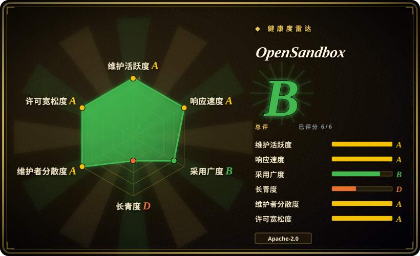
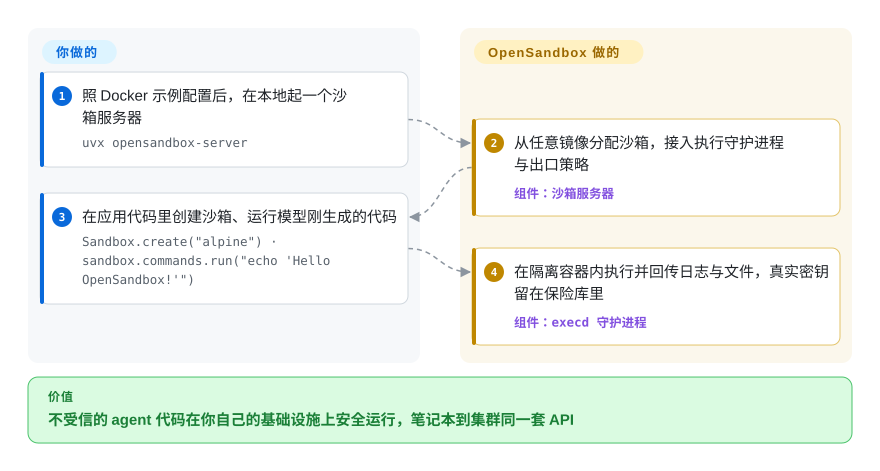

# OpenSandbox

面向 AI agent 的通用、安全沙箱运行时与平台——多语言 SDK、一套统一的沙箱协议，以及 Docker/Kubernetes 后端，用于在隔离环境里运行不可信的 agent 生成代码、GUI/浏览器自动化，以及 RL/评测负载。

## 何时使用

你在做一个 coding agent（或一个 agent 评测 harness），撞上了所有这类项目都会撞的那堵墙：模型想跑 shell 命令、写文件、`pip install`、执行它刚生成的任意代码——而你不能让这些碰到你的宿主机或其他租户。你一直在拿裸 Docker `exec`、自己手搓的文件系统 API 和一些吓人的网络配置硬拼，到了笔记本之外就撑不住。于是你转向 OpenSandbox：`pip install opensandbox`，指向一个运行时（开发用本地 Docker，机群规模用 Kubernetes 运行时），就得到一套统一 API，用来创建沙箱、跑命令、把文件搬进搬出、跑内置的 Code Interpreter——还带每沙箱出口管控和凭据保险库，让工作负载永远看不到你真正的 secret。同一段 SDK 调用，无论你在单机还是在集群上调度成千上万个沙箱，都一样能用。

当隔离强度是硬性要求而非事后补丁时，你也会选它：它能把沙箱跑在安全容器运行时（gVisor、Kata Containers、Firecracker microVM）上而非普通容器里；而且从 2026-09 的版本线起，它能在同一个集群里混跑长生命周期的 Kubernetes 原生负载和短命的 microVM 沙箱——预热的 Firecracker 池给出常数时间准入（约 80ms 启动），FastSandbox 的暂停/恢复把状态存档、闲置时释放全部算力。它还暴露一个统一 ingress 网关和一套以 OpenAPI 定义、可用自定义运行时扩展的沙箱协议。如果你在对比托管的代码执行 API、但又想自托管运行时——把 agent 的代码执行留在自己的基础设施内——这正是瞄准这个缺口的那类平台。

## 怎么用起来

OpenSandbox 坐在你的 agent 代码和它本来要落地的机器之间。你运维一个生命周期 server——开发时 `uvx opensandbox-server` 起在本地 Docker 上，集群规模则用它的 Kubernetes 控制器——客户端通过 `specs/` 里以 OpenAPI 契约发布的 HTTP API 与它对话。从 Python/Java/TypeScript/C#/.NET/Go 的 SDK、`osb` CLI 或它的 MCP server，你用任意容器镜像创建一个沙箱：server 负责分配资源、把沙箱内的执行守护进程（`execd`）接进去、并把访问统一路由过 ingress 网关。在沙箱内部，你以方法调用的形式使用三样现成能力——执行命令、读写文件、跑内置的 Code Interpreter——于是你的 agent 可以执行任意生成的代码，而宿主机文件系统、你的其他租户和你真正的 secret 都碰不到：凭据保险库注入受限凭据，每沙箱的出口管控可以断网。仍然归你的：运维 server 与其容器运行时（Docker 或 Kubernetes）、构建镜像、铺好周边网络，以及对照你自己的威胁模型验证所配置的隔离是否真的达标。

<!-- flow-steps:begin (generated from flows/opensandbox.json by tools/flow_card.py — do not edit) -->

流程文字版

1. **你**：照 Docker 示例配置后，在本地起一个沙箱服务器 — `uvx opensandbox-server`
2. **OpenSandbox**：从任意镜像分配沙箱，接入执行守护进程与出口策略 — 组件：`沙箱服务器`
3. **你**：在应用代码里创建沙箱、运行模型刚生成的代码 — `Sandbox.create("alpine") · sandbox.commands.run("echo 'Hello OpenSandbox!'")`
4. **OpenSandbox**：在隔离容器内执行并回传日志与文件，真实密钥留在保险库里 — 组件：`execd 守护进程`

**价值**：不受信的 agent 代码在你自己的基础设施上安全运行，笔记本到集群同一套 API

<!-- flow-steps:end -->

## 何时不用

- **你只是要在本地跑一个可信脚本。** 如果代码是你自己的、可信的，一个普通 Docker 容器或子进程，远比一个带 server、运行时和协议的完整沙箱平台轻得多。
- **你能用托管的代码执行 API、又不想运维基础设施。** 托管沙箱服务（E2B、Daytona、各家 code-interpreter API）把运维负担整个拿走；OpenSandbox 是你要自己跑、还得一直跑下去的东西。
- **你今天就需要一个久经沙场、多年验证的依赖。** 该仓库 2025-12 才创建——还不满一年（GitHub API，2026-09）。不满一年的项目却有约 15.5k star，仍是炒作信号，而非 Lindy/履历信号；API 和沙箱协议可能仍会变动。[推断]
- **你的隔离要求需要某个你必须自己认证的、经过审计的特定运行时。** OpenSandbox 能驱动 gVisor/Kata/Firecracker，但你仍要自己负责配置并验证隔离是否满足你的威胁模型——把它们集成进来的平台，不能替代那份审查。[未验证]
- **你不跑 Kubernetes 或 Docker、也不想跑。** 运行时就是 Docker 和 Kubernetes；没有 serverless/免基础设施模式——编排层是你要自己运维的。

## 横向对比

| 替代品 | 是否收录 | 我们的评价 | 取舍 |
|---|---|---|---|
| [E2B](e2b.zh.md) | ✅ | 想要沙箱以「可托管也可自托管」的 SDK 形态交付、还带解释器与桌面能力，选 E2B；平台本身必须自托管且可扩展，选 OpenSandbox。 | E2B 主打打磨过的托管产品与 AWS／GCP 的 Terraform 自托管；OpenSandbox 主打自托管优先的平台与可扩展的沙箱协议。两者都把「底下跑哪种沙箱技术」藏起来，只是押注谁来运维它。 |
| [Agent Substrate](substrate.zh.md) | ✅ | agent 长生命周期、大量时间闲置、成本问题在 pod 密度与快照恢复，选 Substrate；任务是「现在就把这段代码隔离跑掉」，选 OpenSandbox。 | Substrate 用暂停／恢复多路复用有状态会话；OpenSandbox 暴露一次性执行沙箱。重叠只在隔离层——密度与按需执行之别。 |
| [gVisor](gvisor.zh.md) | ✅ | 想要不依赖虚拟机的系统调用级隔离、并自己写沙箱生命周期，选 gVisor；想要那套生命周期、SDK 与策略一起交付，选 OpenSandbox。 | 作为 runtime class 使用的用户态内核；它是 OpenSandbox 这类平台可以驱动的隔离原语，不是平台。 |
| [Kata Containers](kata-containers.zh.md) | ✅ | 想让 Kubernetes 给每个 pod 一台轻量虚拟机里的真内核，选 Kata；想要沙箱 API 而不是 runtime class，选 OpenSandbox。 | Kata 是节点级虚拟机隔离加完整的容器管理器集成；OpenSandbox 是它这类运行时之上的 API／生命周期层。 |
| [Firecracker](firecracker.zh.md) | ✅ | 你在自建沙箱层、想要极简的 KVM microVM 原语，选 Firecracker；想要以产品形态拿到沙箱，选 OpenSandbox。 | Firecracker 止步于 microVM 边界；OpenSandbox 必须在某个此类原语之上解决镜像、调度、生命周期与策略。 |
| Daytona | 未收录 | 需要面向 agent 的托管优先开发环境／沙箱平台，选 Daytona；平台必须自托管，选 OpenSandbox。 | 相邻产品形态（开发环境而非 agent 代码执行协议）；本批未收录——按待办记录，而不是以能力为由判为范围外。 |
| 普通 Docker／containerd | 未收录 | 普通容器够用时选 Docker 或 containerd；负载不可信、需要沙箱协议、凭据保险库与出口策略时选 OpenSandbox。 | 你正在替换的基线（containerd／runc 的选型不在本页范围）：你拿到的是一个容器，不是沙箱平台。 |
| Jupyter Kernel Gateway／nsjail | 未收录 | 需要窄而单一用途的代码执行或隔离管线时选它们；想要它外面那层面向 agent 的平台，选 OpenSandbox。 | 单一用途原语，没有多租户平台层；对本分类属范围外，而不是可收录的同层项目。 |

## 技术栈

- **语言：** 主语言为 Python；项目提供 Python、Java/Kotlin、JavaScript/TypeScript、C#/.NET、Go 的 SDK。
- **运行时：** Docker（本地）和用于分布式调度的 Kubernetes 运行时/控制器（带 Helm chart）；microVM 路径是 Firecracker 预热池加 FastSandbox 暂停/恢复（docs/architecture）。
- **隔离：** 集成安全容器运行时——gVisor、Kata Containers、Firecracker microVM——以加强宿主/工作负载分离。
- **接口面：** `osb` CLI、独立的 MCP server（`opensandbox-mcp`）、带每沙箱出口管控的统一 ingress 网关、一个凭据保险库、`specs/` 里以 OpenAPI 契约发布的沙箱协议（生命周期 + 执行 API），以及 `oseps/` 里的增强提案流程。
- **分发：** 发布镜像同时上架 Docker Hub、GHCR 与阿里云容器镜像仓库，用 Cosign 无密钥签名并附来源证明。
- **内置：** Command、Filesystem、Code Interpreter 环境；示例覆盖 Claude Code、Gemini CLI、Codex CLI、OpenCode、Qwen Code、Kimi CLI、Chrome/Playwright 浏览器自动化、VNC/VS Code 桌面与 Harbor agent 评测。

## 依赖

- **你必须跑的运行时：** 一个容器运行时——本地用 Docker（快速上手要求 Docker 加 Python 3.10+），规模化用 Kubernetes 集群（外加 OpenSandbox 的生命周期 server/控制器）。这是承重依赖。
- **可选安全运行时：** 想要强于普通容器的隔离，则需 gVisor、Kata Containers 或 Firecracker——每个都带自己的宿主/内核配置。
- **SDK 安装：** `pip install opensandbox`（Python）、`com.alibaba.opensandbox` 下的 Maven/Gradle 制品、`@alibaba-group/opensandbox`（npm）、`Alibaba.OpenSandbox`（.NET），以及 `github.com/alibaba/OpenSandbox/sdks/...` 下的 Go module。CLI 用 `pip install opensandbox-cli`（或 `uv tool install opensandbox-cli`）；MCP server 用 `pip install opensandbox-mcp`；server 可直接 `uvx opensandbox-server` 起跑。
- **网络：** ingress 网关和出口管控假定由你提供周边网络管道。

## 运维难度

**中到高。** 本地 Docker 路径对开发友好（`uvx opensandbox-server` 加一个 SDK 即可）。生产则是一个真要运维的平台：一个生命周期 server、一个 Kubernetes 控制器（经 Helm chart 部署）、一个 ingress 网关、出口策略和一个凭据保险库——若还要强隔离，再加上 gVisor/Kata/Firecracker 的宿主级配置（内核特性、节点配置）。组件面很宽且各版本独立演进（server、execd、egress、Helm、五种 SDK），升级因此是一场多制品的工程；项目自带的发布验证指南（Cosign 签名 + 来源证明、按 digest 钉住镜像）是把这条供应链守住的正道。你跑的是一个多组件分布式系统，它的全部职责就是安全地执行不可信代码，所以把隔离、网络和 secret 处理弄对才是难点，而且是安全攸关的。项目带 OpenSSF Best Practices 徽章和一份 GOVERNANCE.md，这有帮助，但其运维面天生比单一二进制或托管 API 要大。

## 健康度与可持续性

- **响应速度**：Grade A——中位首次响应时间 12.7 小时，基于 45 个 qualifying issues/PRs（评分器，2026-09-28）。
- **维护（2026-09）。** 本次重核当天（2026-09-28）仍有 push；平台总 tag `release-1.1.0` 于 2026-09-21 落地，各组件发布保持每周以上的节奏（python SDK v0.1.16 → v0.1.17.dev0、java v1.0.19、server v0.2.3、execd v1.1.0、egress v1.1.7、Helm chart 0.2.2，直至 8 月底——GitHub releases）。**非常活跃**。未归档。
- **背书与治理（2026-09）。** 源自阿里巴巴（包坐标仍带着它：Maven `com.alibaba.opensandbox`、npm `@alibaba-group/opensandbox`、Go module 位于 `github.com/alibaba/OpenSandbox` 路径下），现位于 `opensandbox-group` 组织下，带 GOVERNANCE.md、一条 OpenSSF Best Practices 记录、一项 CNCF Landscape 收录和一个 OSEPS 增强提案流程——这些是朝向开放、多维护者治理、由一家大厂商背书的信号。[未验证]
- **年龄 × Lindy（2026-09）。** 2025-12-17 创建——约九个半月大。这仍是**年轻项目**；Lindy 还不给它加分。不满一年的仓库却有约 15.5k star，是很强的炒作/注意力信号，但说明不了寿命。把 API/协议稳定性当成未经验证。[推断]
- **采用度与生态。** 广的 SDK 覆盖（5 种语言）、CLI、MCP server、官方容器镜像供应链（Cosign 签名、三家镜像仓库），以及对主流 coding-agent CLI 的集成示例，都显示真实的生态势能；PyPI 下载量可观（见雷达），但在这个年龄上，生产用户证据仍稀薄且未经验证。[未验证]
- **风险标记。** 年轻是主要一项——API 变动和履历未证。单一大厂商起源（阿里巴巴）尽管有多维护者的说法，仍是治理上的考量；若你要依赖它，请核实决策实际是怎么做出的。[推断]

## 存疑（未验证）

- [未验证] 截至 2026-09-28 约 15.5k star 及各组件版本（python SDK v0.1.16、server v0.2.3、总 tag `release-1.1.0`）——star 与版本号对时间敏感、随版本变动；总 tag 与组件各自 semver 的覆盖关系未从发布工具链推导。
- [未验证] “安全容器运行时”支持（gVisor/Kata/Firecracker）、约 80ms 的 microVM 准入与 FastSandbox 暂停/恢复，均为 README/docs 的声称；每种的确切成熟度、配置负担和隔离保证未对源码核实。
- [推断] 阿里巴巴起源由包坐标与仍指向 `github.com/alibaba/OpenSandbox` 路径的链接推断得出；规范仓库现位于 `opensandbox-group` 下。确切的归属/转移与治理实况未确认。
- [推断] “不满一年 + 极高 star”按 read-repo 方法论被当作炒作/风险信号，而非质量定论；项目可能成熟，但其 Lindy 履历目前并不存在。
- [未验证] 与 E2B/Daytona 的对比反映总体定位，而非逐项实测基准。
