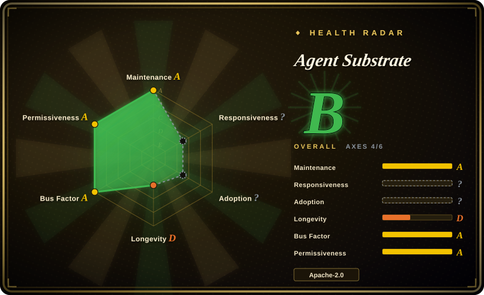
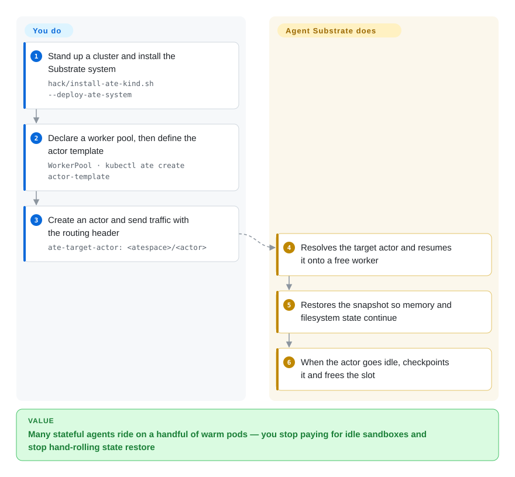

# Agent Substrate

A Kubernetes-native execution runtime that multiplexes many stateful agent "actors" onto a small pool of pre-warmed worker pods by checkpointing idle agents into object storage and resuming them on demand — its selling point is density, and it is explicitly *not* an SDK for building agents.

## When to use

You run an internal agent platform: hundreds or thousands of long-lived, stateful agent sessions — coding agents, tool-calling agents, MCP servers — each of which needs its own sandbox because it executes untrusted code and keeps working state. They are bursty by nature: they spend most of their life waiting on an LLM, a tool call, or a human, then handle an event, then go back to waiting. The naive design is one Kubernetes Pod per session, and it bleeds you twice: you pay for thousands of idle sandboxes, and every wake-up pays a cold start. You reach for Agent Substrate because it attacks exactly that: you declare a `WorkerPool` of pre-started worker pods and an `ActorTemplate` for the workload, actors get suspended into object storage while idle, and an inbound request carrying `ate-target-actor: <atespace>/<actor>` resumes the actor onto whichever worker is free — keeping in-memory and filesystem state. The deciding tradeoff against its closest substitutes is the *layer*: [OpenSandbox](opensandbox.md) is a sandbox API/SDK you call to run code, whereas Substrate is a self-hosted control plane that owns the lifecycle of many stateful sandboxes and does the density math (fewer pods than agents) for you. Against hosted sandbox APIs you accept operating Kubernetes yourself in exchange for keeping agent state in your own bucket and on your own cluster.

You want it specifically when **wake-up latency and pod count are the budget**, not feature count: the project's own north-star targets are 100 ms p95 activation, 1M+ concurrent actors on a Postgres-backed store, and 1000 wake-ups/second per cluster. Treat those as targets rather than measured results (see Caveats), and choose it as a bet on the architecture, not as a component to put in production this quarter.

## How it works

There are three moving parts. A **WorkerPool** is a fleet of pre-started pods that stay warm and idle — these are your slots. An **Actor** is one instance of your workload (a session, an agent, a server). The hard rule is that a worker hosts at most one actor at a time, so the reuse happens over *time*, not by stacking agents in one pod. What makes that rotation cheap is the snapshot: when an actor goes idle, Substrate checkpoints it — process memory plus the rootfs delta and any durable volumes — uploads the snapshot to object storage (GCS or S3), and frees the worker. When traffic for that actor arrives, `atenet`'s Envoy-based router reads the `ate-target-actor` header, asks the control plane to resume the actor, the scheduler picks an eligible free worker (matching sandbox class, labels and capacity, pinned to a node when the snapshot is node-local), and `ateom` inside that pod restores the sandbox — possibly on a different physical pod than last time. You write a `WorkerPool`, an `ActorTemplate`, and the routing header on your traffic; Substrate owns suspend/resume, worker scheduling, snapshot storage and transport, mTLS between control plane and workers, and per-actor routing. That is why every demo is shaped like "N agents on fewer pods" — 3 Claude Code agents on 2 pods, roughly 250 actors cycling across 8 pods — instead of "one container per agent".

<!-- flow-steps:begin (generated from flows/substrate.json by tools/flow_card.py — do not edit) -->

Text version of the flow

1. **You**: Stand up a cluster and install the Substrate system — `hack/install-ate-kind.sh --deploy-ate-system`
2. **You**: Declare a worker pool, then define the actor template — `WorkerPool · kubectl ate create actor-template`
3. **You**: Create an actor and send traffic with the routing header — `ate-target-actor: <atespace>/<actor>`
4. **Agent Substrate**: Resolves the target actor and resumes it onto a free worker
5. **Agent Substrate**: Restores the snapshot so memory and filesystem state continue
6. **Agent Substrate**: When the actor goes idle, checkpoints it and frees the slot

**Value**: Many stateful agents ride on a handful of warm pods — you stop paying for idle sandboxes and stop hand-rolling state restore

<!-- flow-steps:end -->

## When NOT to use

- **You need something production-ready now.** The README states it is in early development, "not ready for production use", with APIs "almost guaranteed to change" and no backward-compatibility guarantees (as of 2026-09-20). If you need a stable runtime today, use plain Kubernetes Pods/Deployments plus a sandbox runtime (gVisor, Kata Containers) and revisit later — or a hosted sandbox API (E2B, Modal) if you don't want the ops burden.
- **You just need to execute untrusted agent-generated code.** Substrate is not a code-interpreter SDK; the fit is a self-hosted sandbox API such as [OpenSandbox](opensandbox.md), or driving gVisor/Kata Containers directly, because Substrate adds a control plane you would not be using.
- **Your agents are woken by *outbound* polling rather than inbound traffic.** Resume is ingress-driven: the router wakes an actor when a request for it arrives. The project's own issue tracker recorded (2026-09-20) that a suspended actor whose work arrives by polling a queue or chat API never wakes. For queue-consumer shaped agents, keep them resident with your own consumer or drive them through the API explicitly.
- **You don't run Kubernetes.** Every path is Kubernetes-shaped: WorkerPools reconcile to Deployments, `atelet` is a DaemonSet, and node version labels gate the dataplane; the supported matrix is the latest stable Kubernetes release plus the previous one. For a single-node or non-Kubernetes setup, use a lighter sandbox runner instead.
- **You need security hardening as a shipped property, not a plan.** The project's own threat model (2026-06-25) states it "has little to no security hardening at this time", and its mitigations are written as recommended invariants for the roadmap. If you must present a threat model today, put a hardened sandbox runtime under a smaller orchestration surface and own that configuration yourself.
- **Your workloads are steady-state, not bursty.** The density win comes from reclaiming idle sandboxes. A workload that constantly burns CPU gains nothing and simply places a different orchestrator in front of the same pods.
- **You want to shape the roadmap as a contributor.** Contributions require signing the Google CLA, and CONTRIBUTING.md says PRs not aligned with near-term goals may be "closed without extensive review". If you need to own your direction, vendor/fork it or pick a multi-vendor-governed alternative.

## Comparison

| Alternative | In index | Our verdict | Tradeoff |
|---|---|---|---|
| [OpenSandbox](opensandbox.md) | ✅ | Pick OpenSandbox when the job is "give the agent a sandbox and an API to run code in it" (SDKs, code interpreter, credential vault, egress policy); pick Agent Substrate when the job is "run many *stateful* agent sessions on fewer machines and wake them on demand". | Substrate's whole increment is the suspend/resume snapshot lifecycle plus the scheduler around it; OpenSandbox's is a uniform sandbox API across languages and runtimes. They only overlap at the word "sandbox". |
| [E2B](e2b.md) | ✅ | Choose E2B when the sandbox should be a hosted-or-self-hosted SDK and the workload is "run this code now"; choose Agent Substrate when sessions are long-lived, idle-heavy and must resume with their memory intact. | E2B optimizes time-to-first-sandbox and lets you self-host the runtime on AWS/GCP; Substrate optimizes per-machine density of stateful sessions. Disposable execution vs resumable state is the dividing line. |
| [Modal client SDK](modal-client.md) | ✅ | Choose Modal when you want serverless containers, GPUs and sandboxes and will operate nothing at all; choose Agent Substrate when the state must stay in your own cluster and object store. | Modal removes the entire ops burden and the density problem with it (the provider meters it), but you cannot self-host, inspect the boundary, or keep suspend/resume state in your own bucket. |
| [gVisor](gvisor.md) | ✅ | Choose gVisor when you only need the isolation primitive under your own orchestration; choose Agent Substrate when you want lifecycle, scheduling, snapshotting and routing already built on top of it. | gVisor is a component Substrate-class systems select as their runtime class; picking it directly means the lifecycle, scheduling and snapshotting are your build, and a syscall-interception layer says nothing about multi-tenant density. |
| [Kata Containers](kata-containers.md) | ✅ | Choose Kata when you want per-pod VM isolation inside your existing Kubernetes; choose Agent Substrate when the problem is many idle *stateful* sessions rather than isolation strength. | Kata is the VM-isolation runtime Substrate can use for its micro-VM class; it solves the sandbox boundary but not the multiplexing, so it is a lower layer rather than a substitute. |
| [Knative Serving](../serverless/knative-serving.md) | ✅ | Choose Knative when the workloads are stateless HTTP services that should scale to zero; choose Agent Substrate when they are stateful agent sessions that must keep memory across idle periods. | Knative's scale-to-zero throws the process away by design; Substrate's suspend/resume keeps it. Statelessness is the dividing line. |
| [kagent](../agent-frameworks/kubernetes-agents/kagent.md) | ✅ | Choose kagent when you want agents declared and governed as Kubernetes objects; choose Agent Substrate when you already have agents and need the runtime underneath them to multiplex stateful sandboxes. | kagent is the declarative control plane for agents-as-workloads and consumes a runtime like Substrate; plain Kubernetes Pods + HPA remain the baseline in that comparison and are not indexed here, because Kubernetes is the platform Substrate runs on rather than a same-layer alternative. |

## Tech stack

- **Language:** Go (`go 1.27.0`; 941 commits as of 2026-09-20). Dependencies are vendored in-tree.
- **Runtime substrate:** Kubernetes — `WorkerPool` and `SandboxConfig` are CRDs reconciled by `atecontroller`; `atelet` runs as a DaemonSet; workers are Pods; pool autoscaling with an HPA is demonstrated.
- **Sandbox isolation:** gVisor (`runsc`) by default, with micro-VM as a second sandbox class (cloud-hypervisor; Kata Containers is named in the architecture doc as the other popular option). Checkpoint/restore is the sandbox runtime's own mechanism, not a reimplementation.
- **Control plane:** a purpose-built gRPC API server (`ateapi`) over PostgreSQL (migrations via `pressly/goose`, driver `jackc/pgx`), plus OpenFGA for authorization. Records that change too fast for etcd (Actors, Workers, Atespaces) live in that store, not in Kubernetes objects.
- **Networking:** Envoy with an `ext_proc` external processor as the actor router; per-actor point-to-point veth networks; mTLS between components with short-lived pod certificates from `podcertcontroller`; `atunnel` inside each worker pod.
- **Snapshots:** full scope (process memory + rootfs delta) and data-only scope, written to object storage through a GCS/S3 client layer.
- **Tooling:** the `kubectl-ate` plugin CLI, `ko` for images, `kind` for local clusters, Locust plus Prometheus/Grafana for the benchmark harness, OpenTelemetry for telemetry, `tools/setup-gcp` for GCP provisioning.

## Dependencies

- **A Kubernetes cluster you operate** — latest stable release or the previous minor, with nodes carrying the `ate.dev/substrate-version` label (the installer stamps existing nodes; nodes added later must be labeled or they host no workers). This is the load-bearing dependency.
- **PostgreSQL** as the control-plane store. On GCP the documented path is Cloud SQL with IAM database authentication through the Cloud SQL Auth Proxy (which adds two egress flows from the API server).
- **Object storage** for snapshots: GCS or S3 (`BUCKET_NAME` is required by the demo install path); the local kind path deploys rustfs.
- **A sandbox runtime on each node:** gVisor `runsc` binaries, or `/dev/kvm` (or nested virtualization, e.g. Lima on Apple Silicon) for the micro-VM class. A `SandboxConfig` pins which binaries a template resolves.
- **Cluster plumbing:** the Envoy-based `atenet` router, node kernel/networking features for the veth and nftables paths, and for the GKE path a provisioning helper that creates the GKE cluster, GCS bucket and IAM bindings (`tools/setup-gcp`, with `hack/teardown.sh` to unwind).
- **Client side:** `kubectl` plus the `kubectl-ate` plugin; Go and Docker (`ko`) if you build workload images locally.

## Ops difficulty

**High.** This is a multi-component distributed control plane plus a node-level dataplane, not something you install and forget: an API server with a Postgres store, a Kubernetes controller and CRDs, a DaemonSet that must exist on every node you want workers on, an Envoy router, per-node sandbox binaries, and an object-storage dependency holding the state. Two operational traps are documented rather than hidden: worker capacity is bound to the installed version (nodes added later must be labeled, which is also what makes node-by-node upgrades work), and state lives in snapshots whose locality affects resume latency, so capacity planning is about snapshot placement and store throughput as much as CPU. The project ships a rolling-upgrade runbook, an observability guide, a request-parking doc and a threat model — unusually good ops documentation for a project this young — but pre-1.0 churn means you validate each upgrade against your own workload.

## Health & viability

- **Maintenance (2026-09-20).** Very active: last push 2026-09-19; weekly commit counts over the previous eight weeks of 82, 47, 65, 72, 110, 110, 54, 48; 941 commits total; PRs merged 2026-09-18; two releases (v0.0.0 on 2026-05-19, v0.1.0 on 2026-09-10). Not archived.
- **Governance / bus factor (2026-09-20).** The strongest signal here: 18 maintainers listed (16 Google-affiliated, 2 from Solo.io), a four-tier GOVERNANCE.md (Default → Contributor → Reviewer → Maintainer with vouching requirements), and a MAINTAINERS.md that commits to staying in sync with the CNCF project-maintainers list — an orientation toward multi-org governance rather than a single owner. [推断] The CNCF tie is intent, not an announced donation.
- **Backing & Lindy (2026-09-20).** Created 2026-05-13 — **4.3 months old** — so Lindy gives it no credit: the age half of "age × still-active" is the weak half while the activity half is very strong. The maintainer roster (Kubernetes veterans such as Tim Hockin, Benjamin Elder and Michelle Au among others) is a serious backing signal, but the README also states it is "not an officially supported Google product", so do not read Google product support into it. Two external consumers are concrete: `google/ax` (Agent Executor) and the CNCF Sandbox project kagent.
- **Adoption & ecosystem (2026-09-20).** Deliberately integration-oriented: `docs/integration-repos.md` says where integrations live and how fixes flow back, and there is a broad demo set (counter, sandbox/Antigravity, Claude Code multiplex, multi-template, request parking, autoscaled pool) plus a Locust benchmark harness. ~2.0k stars, 333 forks, but only 18 watchers — a star-to-watcher ratio that reads more like attention than entrenched production use. [推断]
- **Risk flags (2026-09-20).** Pre-1.0 with explicitly unstable APIs; Google CLA required for contributions; the open backlog is large for the project's age (321 open issues, 190 open PRs). The team files its own hard design gaps in public — no failover on worker affinity, a ~6 s resume deadline that cold-cache restores cannot meet, an unbounded image cache, state directories not reclaimed on a plain actor delete — which is good transparency and simultaneously an honest list of what is not done. License is clean Apache-2.0 with no relicense history. No security hardening yet, per the project's own threat model.

## Caveats (unverified)

- [未验证] The headline performance claims — "10x higher density than standard container runtimes", sub-500 ms resume, and 500 suspend/resume activations per second — are README/architecture-doc assertions; no reproducible published benchmark result was found. The only public performance artifact is a demo video (~250 actors on 8 pods). The north-star numbers in `docs/architecture.md` (100 ms p95 activation latency, 1B actors per cluster, 1000 wake-ups/second) are explicitly targets, not measurements.
- [未验证] `docs/architecture.md` opens with "Much of this architecture is aspirational, and is not yet implemented!", so parts of the mechanism described above — especially data-locality handling, peer-to-peer state sharing, autoscaling, control-plane authn/z and actor identity/policy — may not exist in code yet. Suspend/resume plus routing is implemented and demonstrated; the surrounding ambitions are not necessarily.
- [推断] The CNCF direction is inferred from `MAINTAINERS.md` referencing the CNCF project-maintainers list and `GOVERNANCE.md` mentioning CNCF organizational-diversity assessment; no donation or acceptance announcement was found.
- [未验证] "Support for S3" appears in `docs/roadmap.md` as a future item ("Support for S3 (via plugin)") while the kind install path deploys rustfs and the code carries S3 client code — the maturity of the S3 backend was not verified against a working deployment.
- [推断] The claim that only the sandbox inside a worker pod is recreated per actor (rather than the pod being recycled) is inferred from the architecture doc's "pre-start long-running worker Pods … which are just sandboxes waiting for work"; the per-actor sandbox teardown and reuse strategy is never stated explicitly.
- [未验证] Integration depth with the named consumers (ADK, LangChain, Claude Code, MCP, kagent, `google/ax`) is claimed in the README and roadmap; it was not verified that each integration is shipped, current, and maintained in its own repository.
- [未验证] The Comparison table is positioning, not a measured feature benchmark: E2B, Modal, kagent and the sandbox runtimes are compared by layer and purpose, and their rows were not verified against their current published capabilities.
