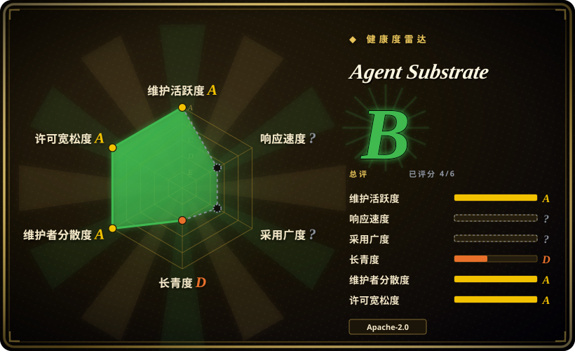
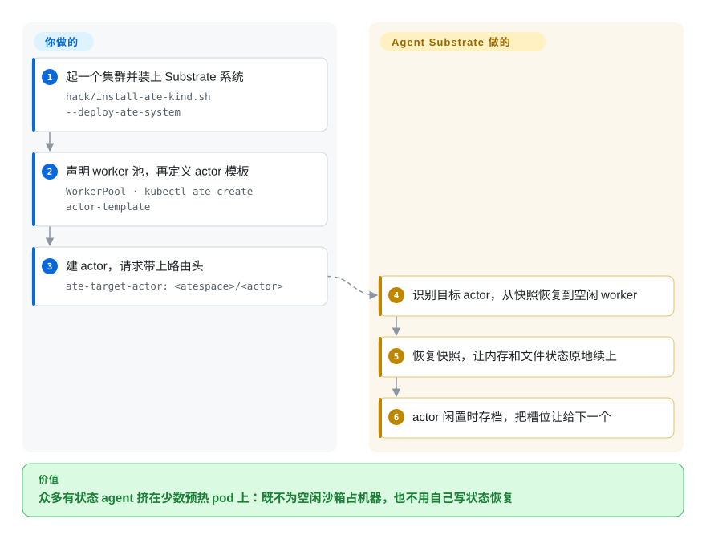

# Agent Substrate

一个跑在 Kubernetes 上的执行运行时：把大量有状态的 agent（它叫 actor）暂停时整份存进对象存储、需要时再恢复到任意空闲槽位，从而把很多 agent 多路复用到一小撮预热 pod 上——它卖的是密度，而且明确说自己不是用来写 agent 的 SDK。

## 何时使用

你在维护一个内部 agent 平台：成百上千个长期存活、有状态的 agent 会话（编码 agent、工具调用 agent、MCP server），每个都因为要执行不可信代码、还要保留工作状态而必须独占一个沙箱。这类负载天生是脉冲式的——大部分时间在等 LLM、等工具返回、等人，偶尔处理一个事件，然后继续等。最朴素的做法是一个会话一个 Kubernetes Pod，代价是双重的：几千个空闲沙箱的账单，加上每次唤醒都要冷启动。这时候该想到 Agent Substrate：你声明一个 `WorkerPool`（预热好的 worker pod 池）和一个 `ActorTemplate`，actor 闲置时被暂停进对象存储，带 `ate-target-actor: <atespace>/<actor>` 头的请求进来就把 actor 恢复到当前空闲的 worker 上，内存与文件系统状态一并续上。它与最近邻替代品的决定性差别在**层次**：[OpenSandbox](opensandbox.zh.md) 是你调用的沙箱 API／SDK，而 Substrate 是自托管控制面，负责一大群有状态沙箱的整个生命周期，并替你算好密度这笔账（pod 数少于 agent 数）。与托管式沙箱 API 相比，你接受自己运维 Kubernetes，换来 agent 状态留在自己的桶和自己的集群里。

它特别适合**把唤醒延迟和 pod 数量当作预算**、而不是把功能数量当作预算的场景：项目自己给出的北极星目标是 100 ms p95 激活延迟、Postgres 存储层支撑 100 万以上并发 actor、单集群每秒 1000 次唤醒。这些是目标不是实测结果（见「存疑」），所以应该把它当作对架构的一次下注，而不是这个季度就能塞进生产的组件。

## 怎么用起来

整套东西有三个部件。**WorkerPool** 是一批提前起好、一直空转待命的 pod，也就是你的「槽位」。**Actor** 是你负载的一个实例（一个会话、一个 agent、一个 server）。硬规则是：一个 worker 同一时刻只装一个 actor，所以复用发生在**时间**上，不是把多个 agent 叠进同一个 pod。让这种轮转变便宜的关键是快照：actor 闲置时 Substrate 对它做 checkpoint（进程内存、rootfs 增量、以及挂载的持久卷），把快照上传到对象存储（GCS 或 S3），然后**把这个 worker 释放掉**。等这个 actor 的流量来了，`atenet` 里基于 Envoy 的路由器读 `ate-target-actor` 头，让控制面去恢复这个 actor，调度器从满足约束（sandbox class、label、容量，快照只在本节点时还会钉住节点）的空闲 worker 里挑一个，再由该 pod 里的 `ateom` 把沙箱恢复起来——**很可能落在一台和上次不同的物理 pod 上**。你写的只是一个 `WorkerPool`、一个 `ActorTemplate`，以及流量上那个路由头；暂停／恢复、worker 调度、快照的存取与传输、控制面与 worker 之间的 mTLS、按 actor 的流量路由，全是 Substrate 的事。这也是为什么它所有 demo 的形态都是「N 个 agent 挤在更少的 pod 上」——3 个 Claude Code agent 跑在 2 个 pod 上、约 250 个 actor 在 8 个 pod 上轮转——而不是「一个 agent 一个容器」。

<!-- flow-steps:begin (generated from flows/substrate.json by tools/flow_card.py — do not edit) -->

流程文字版

1. **你**：起一个集群并装上 Substrate 系统 — `hack/install-ate-kind.sh --deploy-ate-system`
2. **你**：声明 worker 池，再定义 actor 模板 — `WorkerPool · kubectl ate create actor-template`
3. **你**：建 actor，请求带上路由头 — `ate-target-actor: <atespace>/<actor>`
4. **Agent Substrate**：识别目标 actor，从快照恢复到空闲 worker
5. **Agent Substrate**：恢复快照，让内存和文件状态原地续上
6. **Agent Substrate**：actor 闲置时存档，把槽位让给下一个

**价值**：众多有状态 agent 挤在少数预热 pod 上：既不为空闲沙箱占机器，也不用自己写状态恢复

<!-- flow-steps:end -->

## 何时不用

- **你现在就要一个能上生产的东西。** README 自述处于早期开发、**不适用生产**，API **几乎必然会变**，且不做向后兼容承诺（截至 2026-09-20）。今天就要稳定运行时的，用普通 Kubernetes Pod／Deployment 加一个沙箱运行时（gVisor、Kata Containers），日后再回来评估；不想背运维负担的，改用托管沙箱 API（E2B、Modal）。
- **你只是想让 agent 生成的不可信代码跑起来。** Substrate 不是 code interpreter SDK，这种需求应该用自托管沙箱 API（例如 [OpenSandbox](opensandbox.zh.md)）或直接用 gVisor／Kata Containers，因为 Substrate 会多出一整层你根本用不上的控制面。
- **你的 agent 靠出站轮询而不是入站流量被唤醒。** 恢复路径是入口驱动的：路由到它的请求进来才唤醒。项目自己的 issue（2026-09-20）记录了这种情形——靠轮询队列或聊天 API 取活的 actor 被挂起后**永远不会醒**。这类消费者形态的 agent，请用常驻消费者，或者显式通过 API 驱动它。
- **你不跑 Kubernetes。** 所有路径都是 Kubernetes 形状：WorkerPool 会被 reconcile 成 Deployment，`atelet` 是 DaemonSet，节点版本标签是数据面的准入条件，支持矩阵是 Kubernetes 最新稳定版加前一个小版本。单机或非 Kubernetes 环境请换更轻的沙箱运行器。
- **你需要的是已经把安全加固做出来了，而不是写在计划里。** 项目自己的威胁模型（2026-06-25）写着当前「几乎没有安全加固」，其中的缓解措施都是写给路线图的建议性不变量。今天就要出一份能站住脚的威胁模型，就把加固过的沙箱运行时放在更小的编排面之下，并且自己负责那份配置。
- **你的负载是稳态的、不是脉冲式的。** 密度收益来自回收空闲沙箱。持续烧 CPU 的负载拿不到任何好处，只是换了套编排系统来管同样的 pod。
- **你想以贡献者身份影响路线。** 贡献需要签 Google CLA，而且 CONTRIBUTING.md 明说与近期目标不一致的 PR 可能被「关闭且不做充分评审」。需要自己掌方向的，请 vendor／fork，或者选一个多方共同治理的替代品。

## 横向对比

| 替代品 | 是否收录 | 我们的评价 | 取舍 |
|---|---|---|---|
| [OpenSandbox](opensandbox.zh.md) | ✅ | 目标是「给 agent 一个沙箱和一套跑代码的 API」就选 OpenSandbox（多语言 SDK、Code Interpreter、凭证保险库、出口管控）；目标是「把很多**有状态** agent 会话挤在更少的机器上、按需唤醒」才选 Agent Substrate。 | Substrate 的全部增量是暂停／恢复的快照生命周期外加围绕它的调度；OpenSandbox 的增量是跨语言跨运行时的统一沙箱 API。两者只在「sandbox」这个词上重叠。 |
| [E2B](e2b.zh.md) | ✅ | 沙箱应该是可托管也可自托管的 SDK、负载是「现在就把这段代码跑掉」，选 E2B；会话长生命周期、大部分时间闲置、且必须带着内存恢复，才选 Agent Substrate。 | E2B 优化的是「第一次开出沙箱」的时间，并允许把运行时自托管到 AWS／GCP；Substrate 优化的是每台机器上装多少有状态会话。一次性执行与可恢复状态是分界线。 |
| [Modal 客户端 SDK](modal-client.zh.md) | ✅ | 想要 serverless 容器、GPU 与沙箱、且什么都不打算运维，选 Modal；状态必须留在自己集群与对象存储里，才选 Agent Substrate。 | Modal 把运维负担整体拿走，也把密度问题一并拿走（由服务商计费），代价是不能自托管、不能审视边界、也不能把暂停／恢复状态放在自己的桶里。 |
| [gVisor](gvisor.zh.md) | ✅ | 只在自建编排下要一层隔离原语，选 gVisor；想要生命周期、调度、快照与路由都已建在它之上，才用 Agent Substrate。 | gVisor 是 Substrate 这类系统会选的运行时组件；直接用它意味着生命周期、调度与快照是你的开发工作，而且一层系统调用拦截不解决多租户密度。 |
| [Kata Containers](kata-containers.zh.md) | ✅ | 想在现有 Kubernetes 里给每个 pod 一台虚拟机级隔离，选 Kata；真正的问题是大量闲置的**有状态**会话而不是隔离强度，才用 Agent Substrate。 | Kata 是 Substrate 微虚拟机类可以使用的隔离运行时；它解决沙箱边界，但不解决多路复用，所以是更下层而不是替代品。 |
| [Knative Serving](../serverless/knative-serving.zh.md) | ✅ | 负载是应该缩到零的无状态 HTTP 服务，选 Knative；负载是必须在空闲期间保住内存的有状态 agent 会话，才选 Agent Substrate。 | Knative 的缩容到零按设计就会丢掉进程；Substrate 的暂停／恢复会保住它。是否有状态就是分界线。 |
| [kagent](../agent-frameworks/kubernetes-agents/kagent.zh.md) | ✅ | 想让 agent 以 Kubernetes 对象形式被声明与治理，选 kagent；已经有 agent、只缺下面那层运行时来多路复用有状态沙箱，才选 Agent Substrate。 | kagent 是 agent 即工作负载的声明式控制面，消费的是 Substrate 这类运行时；那条对比里的「普通 Pod + HPA」基线在本库没有单独页面，因为 Kubernetes 是 Substrate 的运行平台，不是同层替代品。 |

## 技术栈

- **语言：** Go（`go 1.27.0`；截至 2026-09-20 共 941 次提交）。依赖以 vendor 形式入库。
- **运行时底座：** Kubernetes——`WorkerPool` 与 `SandboxConfig` 是 CRD，由 `atecontroller` reconcile；`atelet` 是 DaemonSet；worker 是 Pod；已提供用 HPA 做池自动扩缩的示例。
- **沙箱隔离：** 默认 gVisor（`runsc`），第二类沙箱是 microVM（cloud-hypervisor；架构文档把 Kata Containers 列为另一种常见选择）。checkpoint／restore 用沙箱运行时自己的机制，没有重造。
- **控制面：** 自研 gRPC API server（`ateapi`），存储用 PostgreSQL（迁移走 `pressly/goose`，驱动 `jackc/pgx`），授权用 OpenFGA。变化快到不适合放 etcd 的记录（Actor、Worker、Atespace）放在这个存储里，而不是 Kubernetes 对象里。
- **网络：** 用 Envoy 的 `ext_proc` 外部处理器做 actor 路由；每个 actor 一条点对点 veth 网络；组件之间 mTLS，证书由 `podcertcontroller` 签发短期 pod 证书；每个 worker pod 内有 `atunnel`。
- **快照：** full 范围（进程内存加 rootfs 增量）与 data 范围（仅持久卷），经由 GCS／S3 客户端层写入对象存储。
- **周边工具：** `kubectl-ate` 插件式 CLI、用 `ko` 构建镜像、用 `kind` 起本地集群、Locust 加 Prometheus／Grafana 的基准测试台、OpenTelemetry 遥测、`tools/setup-gcp` 做 GCP 资源provisioning。

## 依赖

- **你自己运维的 Kubernetes 集群**——最新稳定版或前一个小版本，节点带 `ate.dev/substrate-version` 标签（安装脚本会给当时存在的节点打上；之后新增的节点必须手动打标签，否则不承载 worker）。这是最吃重的依赖。
- **PostgreSQL** 作为控制面存储。GCP 上的推荐路径是 Cloud SQL，配合 IAM 数据库认证和 Cloud SQL Auth Proxy（会给 API server 增加两条出站流量）。
- **对象存储**用于存放快照：GCS 或 S3（demo 安装路径要求 `BUCKET_NAME`）；本地 kind 路径部署的是 rustfs。
- **每个节点上的沙箱运行时：** gVisor 的 `runsc` 二进制，或者 microVM 类所需的 `/dev/kvm`（Apple Silicon 上走 Lima 嵌套虚拟化）。`SandboxConfig` 决定模板解析到哪套二进制。
- **集群配套设施：** 基于 Envoy 的 `atenet` 路由器、veth 与 nftables 路径所需的节点内核与网络能力；GKE 路径还需要用 provisioning helper 创建 GKE 集群、GCS 桶和 IAM 绑定（`tools/setup-gcp`，用 `hack/teardown.sh` 反向拆除）。
- **客户端：** `kubectl` 加 `kubectl-ate` 插件；本地构建负载镜像时还需要 Go 与 Docker（`ko`）。

## 运维难度

**高。** 这是一套多组件分布式控制面加一层节点级数据面，不是装完就忘的东西：带 Postgres 存储的 API server、Kubernetes controller 与 CRD、必须存在于每个目标节点上的 DaemonSet、Envoy 路由器、逐节点的沙箱二进制，以及一个存放状态的对外对象存储依赖。两个运维陷阱是写在文档里而不是藏起来的：worker 容量与所装版本绑定（后加的节点必须打标签，而这同时也是逐节点升级能成立的原因）；状态存在快照里，快照的位置直接影响恢复延迟，所以容量规划有一半是在算快照落点与存储吞吐，而不是 CPU。项目还附了滚动升级 runbook、可观测性指南、请求停车文档和威胁模型——对这么年轻的项目来说文档异常齐备——但 1.0 之前的变动意味着每次升级都要拿自己的负载去验。

## 健康度与可持续性

- **维护活跃度（2026-09-20）。** 非常活跃：最后推送 2026-09-19；此前八周提交数为 82、47、65、72、110、110、54、48；累计 941 次提交；2026-09-18 仍在合并 PR；两个发布（v0.0.0 于 2026-05-19，v0.1.0 于 2026-09-10）。未归档。
- **治理与 bus factor（2026-09-20）。** 本页最强的信号：公开列出 18 位 maintainer（16 位 Google、2 位来自 Solo.io），GOVERNANCE.md 定了四层角色（Default → Contributor → Reviewer → Maintainer，均需他人背书），MAINTAINERS.md 明确承诺与 CNCF 的 maintainer 名单保持同步——朝向多方共治而不是单一所有者。[推断] 这里体现的是 CNCF 意向，并非已宣布的捐赠。
- **背书与 Lindy（2026-09-20）。** 创建于 2026-05-13，**约 4.3 个月**，所以 Lindy 一分不给：「年龄 × 仍在活跃」里年龄那一半最弱，而活跃那一半很强。maintainer 名单里有一批 Kubernetes 老将（如 Tim Hockin、Benjamin Elder、Michelle Au 等），是很硬的背书信号；但 README 同时写明它「不是 Google 官方支持的产品」，不要脑补成 Google 产品支持。两个外部消费者是具体存在的：`google/ax`（Agent Executor）和 CNCF Sandbox 项目 kagent。
- **采用与生态（2026-09-20）。** 刻意面向集成：`docs/integration-repos.md` 讲清集成代码放哪、修复怎么回流，并附带成套 demo（counter、sandbox／Antigravity、Claude Code 多路复用、multi-template、请求停车、自动扩缩池）以及 Locust 基准测试台。约 2.0k stars、333 fork，但只有 18 个 watcher——这个 star 与 watcher 的比例更像关注度，而不是已经沉淀的生产使用。[推断]
- **风险旗标（2026-09-20）。** 1.0 之前且 API 明确不稳定；贡献需要签 Google CLA；以项目年龄衡量，待处理积压偏大（321 个 open issue、190 个 open PR）。团队把自己最难的设计缺口公开记在 issue 里——worker affinity 没有 failover、约 6 秒的恢复 deadline 无法完成冷缓存恢复、镜像缓存无界、普通 actor 删除不回收状态目录——这既是透明度，也是一份诚实的未完成清单。许可干净（Apache-2.0，无 relicense 历史）。按项目自己的威胁模型，安全加固尚未做。

## 存疑（未验证）

- [未验证] 宣传性性能数字——「密度是标准容器运行时的 10 倍」、sub-500ms 恢复、每秒 500 次暂停／恢复——都只出现在 README／架构文档里，没有找到可复现的公开基准结果；唯一的公开性能物料是一段 demo 视频（约 250 个 actor 跑在 8 个 pod 上）。`docs/architecture.md` 里的北极星数字（100 ms p95 激活延迟、单集群 10 亿 actor、每秒 1000 次唤醒）明确写的是目标而非实测。
- [未验证] `docs/architecture.md` 开头自述「本架构的很大一部分是愿景，尚未实现」，因此上文机制里涉及的部分能力——尤其是数据本地性处理、点对点状态共享、自动扩缩、控制面认证授权、actor 身份与策略——可能还没有落到代码。暂停／恢复加路由这条路径是实现并演示过的，外围雄心则未必。
- [推断] CNCF 方向是从 `MAINTAINERS.md` 引用 CNCF maintainer 名单、`GOVERNANCE.md` 提到 CNCF 组织多样性评估推断出来的；没有找到捐赠或接纳的公告。
- [未验证] `docs/roadmap.md` 把 S3 支持列为未来项（「Support for S3 (via plugin)」），而 kind 安装路径部署的是 rustfs、代码层已带 S3 客户端；S3 后端的实际成熟度没有在真实部署上验证过。
- [推断] 「换 actor 时只重建 pod 内沙箱、pod 本身不回收」这一判断是从架构文档「预先起好长期存活的 worker Pod……它们就是等着接活的沙箱」推断的；单 actor 的沙箱销毁与复用策略文档没有明说。
- [未验证] README 与路线图声称的多种集成（ADK、LangChain、Claude Code、MCP、kagent、`google/ax`）深度未经核实：没有逐一确认每项集成都已交付、仍然有效、并在各自仓库中维护。
- [未验证] 横向对比表是定位判断而非实测功能基准：E2B、Modal、kagent 与各沙箱运行时的行按层次与用途对比，未逐一核对其当前公开能力。
