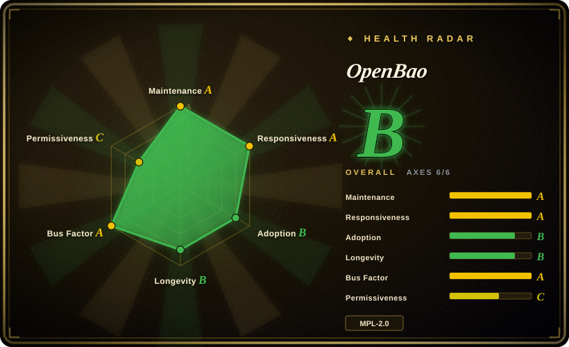
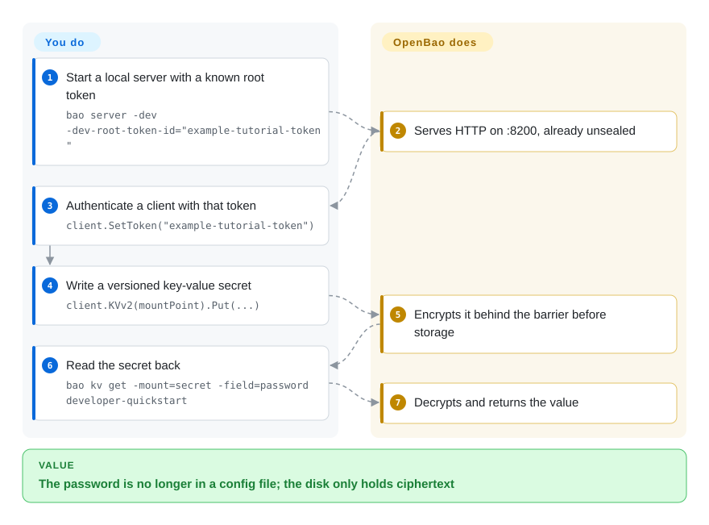

# OpenBao

Database passwords and cloud API keys end up in config files, env vars, and chat logs, and nobody can say who last used them. OpenBao keeps those credentials in one encrypted store, hands out short-lived copies after it checks who is asking, and revokes them when the lease ends.

## When to use

You run a platform where every service still has a long-lived AWS key or database password sitting in a `.env` that was pasted into Slack last quarter and still works. You need a self-hosted box that authenticates the caller, issues a short-lived secret, and takes it back. You reach for OpenBao rather than HashiCorp Vault because you want that Vault-shaped API and lease model under an OSI license (MPL-2.0) with Linux Foundation / OpenSSF governance, not HashiCorp's source-available relicensed line. You reach for it rather than SOPS because the secret has to be minted at request time for a machine identity, not encrypted into a YAML file in git. You install it, initialize and unseal, mount a secrets engine, bind a policy to an auth method, and the app stops carrying static credentials.

## Q&A

**How is it put together?**
A sealed core sitting on untrusted storage. Disk, Postgres, or Raft only ever see ciphertext. After unseal, the core checks a token against path policies, routes to a secrets engine, hangs a lease on the result, and writes the audit log before the client sees the secret. HA is one active node plus hot standbys, not a scale-out farm.

**Is this a password manager?**
No. Use [Vaultwarden](../dev-utilities/ops-infra/vaultwarden.md) for human passwords in Bitwarden clients. OpenBao issues credentials to machines.

## How it works

Think of a bank vault: the concrete is the cryptosystem, the door needs several key-holders (or a cloud KMS) to open, and each deposit box still needs the owner's key. **You** initialize, unseal, write policies, and pick an auth method. **It** encrypts every byte before storage (the *barrier* — AES-256-GCM), issues a token bound to those policies, routes the request to a secrets engine (static key/value, on-demand database/cloud credentials, PKI, transit encryption), attaches a lease, and revokes the tree when the lease expires or you lock down. Applications talk HTTP/CLI/UI, or sit behind Agent (templates, env injection) / Proxy (auto-auth, cache) so app code never holds a long-lived token.

<!-- flow-steps:begin (generated from flows/openbao.json by tools/flow_card.py — do not edit) -->

Text version of the flow

1. **You**: Start a local server with a known root token — `bao server -dev -dev-root-token-id="example-tutorial-token"`
2. **OpenBao**: Serves HTTP on :8200, already unsealed
3. **You**: Authenticate a client with that token — `client.SetToken("example-tutorial-token")`
4. **You**: Write a versioned key-value secret — `client.KVv2(mountPoint).Put(...)`
5. **OpenBao**: Encrypts it behind the barrier before storage
6. **You**: Read the secret back — `bao kv get -mount=secret -field=password developer-quickstart`
7. **OpenBao**: Decrypts and returns the value

**Value**: The password is no longer in a config file; the disk only holds ciphertext

<!-- flow-steps:end -->

## When NOT to use

- **You need a human password manager with Bitwarden clients.** Use [Vaultwarden](../dev-utilities/ops-infra/vaultwarden.md) instead of OpenBao, because OpenBao is an identity-gated secrets *server for machines*, not a personal vault UI.
- **You only need to encrypt files that live in git.** Use SOPS (`getsops/sops`) instead of OpenBao, because SOPS is a compile-time encrypt/decrypt tool with no runtime identity, leases, or audit of who fetched what.
- **You will not operate a secrets cluster and are fine with a cloud vendor.** Use AWS Secrets Manager, GCP Secret Manager, or Azure Key Vault instead of OpenBao, because those are hosted APIs; OpenBao makes unseal, HA, backups of ciphertext, and seal-key lifecycle *your* job.
- **You need HashiCorp commercial support, Vault Enterprise features, or a plugin OpenBao does not ship.** Use HashiCorp Vault instead of OpenBao, because the in-place migration guide only covers Vault Community 1.14.1 with Raft and Shamir, and OpenBao skips unknown plugins at startup (the guide's example is the AWS secrets engine logging `plugin not found in the catalog`).
- **You need many nodes serving writes in parallel.** OpenBao HA is a single active server; standbys redirect. Bound by storage I/O, not compute. A different architecture (or a hosted API) is required if you need horizontal write scale.

## Comparison

| Alternative | In index | Our verdict | Tradeoff |
|---|---|---|---|
| HashiCorp Vault | 未收录 | Choose OpenBao when you want the Vault-shaped identity, lease, and barrier model under MPL-2.0 and foundation governance; choose Vault when you need HashiCorp support, Enterprise features, or a plugin OpenBao does not ship. | Same mental model and a documented CE 1.14.1 in-place path, paid for with plugin gaps, token-format change (`s.` vs `hvs.`), and no vendor SLA. Skipped as its own page in this batch. |
| Infisical | 未收录 | Choose Infisical when the job is a developer-console secrets product; choose OpenBao when callers must authenticate, get a leased secret, and be audited like a Vault cluster. | Infisical is a real repository (`infisical/infisical`) aimed at app-team UX; OpenBao is an operator-run, policy-and-lease server. License and open-core boundary not verified here. Skipped as its own page in this batch. |
| SOPS | 未收录 | Choose SOPS when secrets are files in git that decrypt at deploy; choose OpenBao when a running app must fetch short-lived credentials by identity. | `getsops/sops` (MPL-2.0) encrypts structured files with age/KMS/PGP and has no server. OpenBao is a live cluster with unseal, HA, and revocation. Skipped as its own page in this batch. |
| AWS Secrets Manager / cloud KMS | 非仓库 | Choose the cloud API when you will not staff unseal, Raft/Postgres, and backups; choose OpenBao when the ciphertext and the policy engine must stay on your machines. | Hosted removes ops and adds a vendor bill plus region lock-in; OpenBao removes that bill and makes seal-key loss unrecoverable. |
| [Vaultwarden](../dev-utilities/ops-infra/vaultwarden.md) | ✅ | Choose Vaultwarden for self-hosted human passwords compatible with Bitwarden clients; choose OpenBao for machine secrets, dynamic credentials, and encryption-as-a-service. | Same word "vault", different job. Mixing them is a category error. |

## Tech stack

- **Language:** Go (`bao` binary). `go.mod` pins Go 1.27.0; published libraries are `github.com/openbao/openbao/api/v2` and `sdk/v2` (importing the main module is unsupported).
- **Barrier:** AES-256-GCM with 96-bit random nonces; storage is untrusted by design.
- **Seal:** Shamir shares by default (docs: 5 shares / 3 threshold); auto-unseal via KMS/HSM; recovery keys when auto-unseal is on.
- **Storage:** Integrated Storage (Raft + BoltDB FSM), PostgreSQL (docs recommend it for newcomers), PebbleDB, or in-memory (dev).
- **Plugins:** auth, secret, database, kms — built-in or external over gRPC. Built-ins include kv, pki, ssh, transit, totp, kubernetes, ldap, rabbitmq, and several database plugins.
- **Clients:** HTTP API, `bao` CLI, bundled web UI, Agent, Proxy.
- **Cluster:** one active node; standbys forward. Production table recommends 5 Raft voters (tolerate 2 failures).

## Dependencies

- **A durable store:** Raft on local disk (SSD; avoid burstable CPU/disk) *or* PostgreSQL. Dev mode is in-memory and discarded.
- **Unseal material:** Shamir shares held by people, or a KMS/HSM that must remain available for the cluster's life. Deleting an auto-unseal key makes the cluster unrecoverable even from backups (official seal warning).
- **Audit destination:** at least one audit device; logs must be collected and tamper-protected outside OpenBao.
- **TLS** for anything past `bao server -dev`.
- **Optional:** OpenBao Agent or Proxy next to apps; Helm/K8s for cluster deploy; a snapshot job (no built-in automated snapshots).

## Ops difficulty

**High.** `bao server -dev` is a playground and the docs say never to use it for real secrets. Production is initialize, distribute unseal or recovery keys, enable audit, write least-privilege policies, pick auth methods, and run 3–5 nodes so a sealed node cannot become standby. Raft quorum mistakes during join lose the cluster; PostgreSQL is the docs' easier HA store. Seal migration needs cluster downtime and both old and new seals available. Upgrades want an offline or atomic snapshot first. Plugins that exist in Vault may be missing and leave stub mounts. This is a security-critical control plane, not a sidecar you forget.

## Health & viability

- **Maintenance (as of 2026-09-27):** not archived; `pushed_at` 2026-09-24; latest stable `v2.7.0` on 2026-09-23, with 2.6.x patches the same day. Cadence is active.
- **Governance:** Linux Foundation project, OpenSSF sandbox (moved from LF Edge in 2025). TSC seats named in `CONTRIBUTING.md` for IOTech, Wallix, Adfinis (chair), GitLab, SAP, and ControlPlane. Charter is MPL-2.0 inbound/outbound.
- **Age / Lindy:** GitHub repo created 2023-11-09 (~2.9 years). The *lineage* is HashiCorp Vault (2015); the *fork* is young. Treat Lindy as the fork's age × still-active, not Vault's twelve years.
- **Adoption:** ~8.1k stars, ~595 forks. Homepage notes SAP-funded full-time work (EU NextGenerationEU). GitHub contributor totals are dominated by pre-fork HashiCorp names (`jefferai`, `mitchellh`, …); that is history in the git graph, not proof of today's bus factor.
- **Risk flags:** MPL-2.0 is weak file-level copyleft (radar `risk_license: C`); LICENSE still carries a HashiCorp copyright header from the fork. Plugin catalog is thinner than Vault. Token format changes on migration. Several security advisories exist on the Go module in 2025–2026; this is a secrets server, so patch cadence matters more than star count. The 12-month maintainer set is 50 people with top-1 share 0.279 (radar governance A).

## Caveats (unverified)

- [推断] GitHub contributor rankings still reflect Vault history, so they overstate HashiCorp-era bus factor and understate who actually merges OpenBao today (`cipherboy` / TSC).
- [未验证] Production user list beyond the SAP funding note on the homepage; no independent adoption survey.
- [未验证] Full plugin-by-plugin parity with current Vault CE/Enterprise; the migration guide only documents Vault 1.14.1 CE, Raft, Shamir, and names AWS as a missing plugin.
- [未验证] Infisical's license and which features are open-core; GitHub reports `NOASSERTION`.
- [未验证] HashiCorp Vault's current SPDX; GitHub reports `NOASSERTION`. OpenBao's reason to exist is the MPL fork, which is confirmed by OpenBao's own site and charter.
- [推断] "5-node production" is the docs' recommendation, not a measured capacity ceiling.
