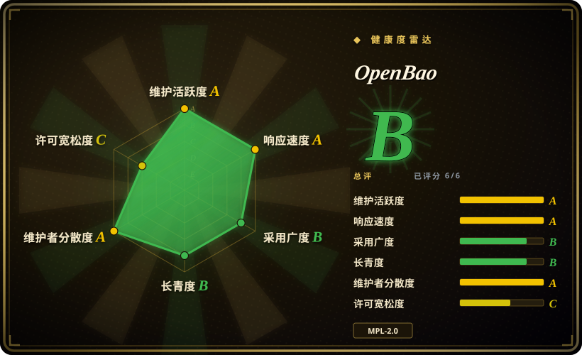
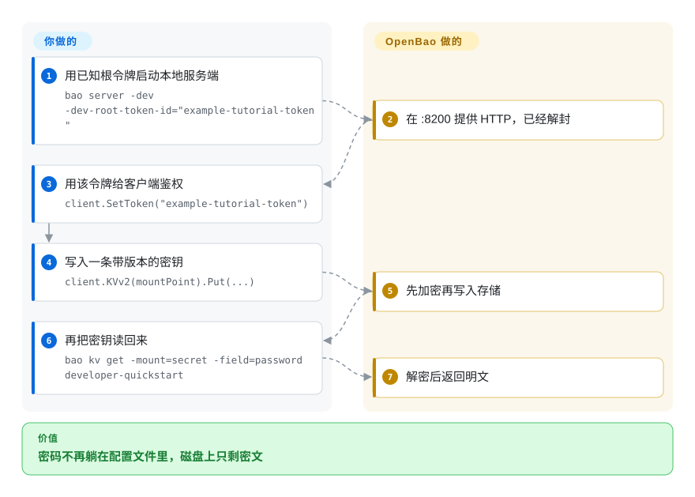

# OpenBao

数据库密码和云厂商的 API 密钥散落在配置文件、环境变量和聊天记录里，谁最后用过根本说不清。OpenBao 把这些凭据收进一个加密仓库，先确认调用方是谁再发一把短时副本，租约到期就收回。

## 何时使用

你在跑一套平台，每个服务还揣着一把长期 AWS 密钥或数据库密码，躺在上季度贴进 Slack 的 `.env` 里而且现在还能用。你需要一台自己托管的盒子：先认证调用方，再发短时密钥，用完收回。你选 OpenBao 而不是 HashiCorp Vault，是因为你要 Vault 那套 API 和租约模型，但许可证必须是 OSI 的 MPL-2.0，治理在 Linux Foundation／OpenSSF，而不是 HashiCorp 改许可之后的源码可得产品。你选它而不是 SOPS，是因为密钥必须在请求时按机器身份现发，而不是加密进 git 里的 YAML。装上、初始化并解封、挂上密钥引擎、把策略绑到认证方法，应用就不用再随身携带静态凭据。

## 快问快答

**架构怎么分层？**
密封的核心坐在不可信存储上。磁盘、Postgres、Raft 里看到的全是密文。解封之后，核心用令牌对路径策略做检查，路由到密钥引擎，给结果挂租约，审计日志落盘后客户端才能看到秘密。高可用是一台干活加热备，不是水平扩容农场。

**这是给人用的密码管理器吗？**
不是。人用的密码本看 [Vaultwarden](../dev-utilities/ops-infra/vaultwarden.zh.md)。OpenBao 发给机器。

## 怎么用起来

把它想成银行金库：混凝土是密码学，大门要好几把钥匙（或云 KMS）才能开，每个保险箱还要物主自己的钥匙。**你**负责初始化、解封、写策略、选认证方法。**它**在落盘前加密每一字节（屏障，AES-256-GCM），签发绑着这些策略的令牌，把请求路由到密钥引擎（静态键值、按需数据库／云凭据、PKI、只做加解密的 transit），挂上租约，到期或你锁仓时整树收回。应用走 HTTP／CLI／UI，或在旁边跑 Agent（渲染模板、注入环境变量）／Proxy（代认证、缓存），这样应用代码就不用长期握着令牌。

<!-- flow-steps:begin (generated from flows/openbao.json by tools/flow_card.py — do not edit) -->

流程文字版

1. **你**：用已知根令牌启动本地服务端 — `bao server -dev -dev-root-token-id="example-tutorial-token"`
2. **OpenBao**：在 :8200 提供 HTTP，已经解封
3. **你**：用该令牌给客户端鉴权 — `client.SetToken("example-tutorial-token")`
4. **你**：写入一条带版本的密钥 — `client.KVv2(mountPoint).Put(...)`
5. **OpenBao**：先加密再写入存储
6. **你**：再把密钥读回来 — `bao kv get -mount=secret -field=password developer-quickstart`
7. **OpenBao**：解密后返回明文

**价值**：密码不再躺在配置文件里，磁盘上只剩密文

<!-- flow-steps:end -->

## 何时不用

- **你要的是带 Bitwarden 客户端的人类密码管理器。** 用 [Vaultwarden](../dev-utilities/ops-infra/vaultwarden.zh.md) 而不是 OpenBao，因为 OpenBao 是按身份把关、发给机器的密钥服务端，不是个人保险库界面。
- **你只需要加密放在 git 里的文件。** 用 SOPS（`getsops/sops`）而不是 OpenBao，因为 SOPS 是部署时加解密的工具，没有运行时身份、租约，也不会审计谁取过什么。
- **你不打算运维密钥集群，也能接受云厂商。** 用 AWS Secrets Manager、GCP Secret Manager 或 Azure Key Vault 而不是 OpenBao，那些是托管 API；OpenBao 把解封、高可用、密文备份和封印密钥生命周期都变成你的工作。
- **你需要 HashiCorp 商业支持、Vault 企业版能力，或 OpenBao 没带的插件。** 用 HashiCorp Vault 而不是 OpenBao，因为原地迁移指南只覆盖 Vault 社区版 1.14.1、Raft 加 Shamir，未知插件会在启动时被跳过（指南里的例子是 AWS 密钥引擎打出 `plugin not found in the catalog`）。
- **你需要多台节点并行写。** OpenBao 的高可用是单活，热备只转发。瓶颈在存储 I/O，不在算力。要水平写扩容得换架构，或改用托管 API。

## 横向对比

| 替代品 | 是否收录 | 我们的评价 | 取舍 |
|---|---|---|---|
| HashiCorp Vault | 未收录 | 你要 MPL-2.0 加基金会治理下的 Vault 形身份、租约和屏障时，选 OpenBao；你要 HashiCorp 支持、企业版功能或 OpenBao 没带的插件时，选 Vault。 | 心智模型相同，社区版 1.14.1 有文档化的原地路径；代价是插件缺口、令牌格式从 `hvs.` 变成 `s.`，也没有厂商 SLA。本批次未单开页面。 |
| Infisical | 未收录 | 工作是给应用团队一个带控制台的密钥产品时，选 Infisical；调用方必须认证、拿到带租约的密钥、并像 Vault 集群那样被审计时，选 OpenBao。 | Infisical 是真实仓库（`infisical/infisical`），偏应用团队体验；OpenBao 是运维跑的策略与租约服务端。许可证与 open-core 边界此处未核。本批次未单开页面。 |
| SOPS | 未收录 | 密钥是 git 里的文件、部署时解密，选 SOPS；运行中的应用必须按身份领取短时凭据，选 OpenBao。 | `getsops/sops`（MPL-2.0）用 age／KMS／PGP 加密结构化文件，没有服务端。OpenBao 是带解封、高可用和吊销的活集群。本批次未单开页面。 |
| AWS Secrets Manager／云 KMS | 非仓库 | 你不会去养解封、Raft／Postgres 和备份时，选云 API；密文和策略引擎必须留在自己机器上时，选 OpenBao。 | 托管去掉运维，换来账单和区域锁定；OpenBao 去掉这笔账单，封印密钥丢了连备份也救不回来。 |
| [Vaultwarden](../dev-utilities/ops-infra/vaultwarden.zh.md) | 已收录 | 自托管、兼容 Bitwarden 客户端的人类密码，选 Vaultwarden；机器密钥、动态凭据和加密即服务，选 OpenBao。 | 都叫 vault，活不是一回事。混用是分类错误。 |

## 技术栈

- **语言：** Go（`bao` 二进制）。`go.mod` 钉在 Go 1.27.0；对外库是 `github.com/openbao/openbao/api/v2` 与 `sdk/v2`（把主模块当依赖导入不受支持）。
- **屏障：** AES-256-GCM，96 位随机 nonce；存储按设计不可信。
- **封印：** 默认 Shamir 分片（文档：5 份／阈值 3）；可用 KMS／HSM 自动解封；开了自动解封则发恢复密钥。
- **存储：** 内置存储（Raft 加 BoltDB 状态机）、PostgreSQL（文档建议新人用它）、PebbleDB，或内存（开发模式）。
- **插件：** 认证、密钥、数据库、KMS——内置或经 gRPC 的外部插件。内置含 kv、pki、ssh、transit、totp、kubernetes、ldap、rabbitmq 和若干数据库插件。
- **客户端：** HTTP API、`bao` CLI、自带 Web UI、Agent、Proxy。
- **集群：** 一台干活，热备转发。生产表建议 5 个 Raft 投票节点（能扛 2 台挂）。

## 依赖

- **持久存储：** 本地盘上的 Raft（SSD；避开可突发的 CPU／磁盘）或 PostgreSQL。开发模式是内存，关掉就没了。
- **解封材料：** 人手里的 Shamir 分片，或集群生命周期内必须一直可用的 KMS／HSM。自动解封密钥被删，集群连备份也救不回来（官方封印文档的警告）。
- **审计落点：** 至少开一个审计设备；日志要在 OpenBao 外面收集并防篡改。
- **TLS：** 除了 `bao server -dev` 以外都需要。
- **可选：** 应用旁边的 OpenBao Agent 或 Proxy；集群部署用 Helm／K8s；快照任务（没有内置自动快照）。

## 运维难度

**高。** `bao server -dev` 是练习场，文档写明不能拿去保护真密钥。生产要初始化、分发解封或恢复密钥、开审计、写最小权限策略、选认证方法，还得跑 3 到 5 个节点，密封的节点当不了热备。Raft 加入时弄丢法定人数会整簇不可用；PostgreSQL 是文档里更好上手的高可用存储。封印迁移要停整簇，新旧封印都得在。升级前要离线或原子快照。Vault 里有的插件这里可能没有，会留下空挂载。这是安全关键的控制面，不是可以忘掉的边车。

## 健康度与可持续性

- **维护（截至 2026-09-27）：** 未归档；`pushed_at` 为 2026-09-24；最新稳定版 `v2.7.0` 在 2026-09-23，同日还有 2.6.x 补丁。节奏活跃。
- **治理：** Linux Foundation 项目，OpenSSF 沙箱（2025 年从 LF Edge 迁来）。`CONTRIBUTING.md` 里的 TSC 席位包括 IOTech、Wallix、Adfinis（主席）、GitLab、SAP、ControlPlane。章程规定入站／出站都是 MPL-2.0。
- **年龄／Lindy：** GitHub 仓库创建于 2023-11-09（约 2.9 年）。*血统*是 HashiCorp Vault（2015）；*分叉*还年轻。Lindy 按分叉的年龄×仍在维护来看，不要把 Vault 的十二年算给它。
- **采用：** 约 8.1k star、约 595 fork。官网写明 SAP 资助全职开发（欧盟 NextGenerationEU）。GitHub 贡献者总数被分叉前的 HashiCorp 名字占满（`jefferai`、`mitchellh` 等）；那是 git 图里的历史，不是今天的维护者分散度证明。
- **风险信号：** MPL-2.0 是文件级弱 copyleft（雷达 `risk_license: C`）；LICENSE 仍带着分叉带来的 HashiCorp 版权头。插件目录比 Vault 薄。迁移会改令牌格式。Go 模块在 2025–2026 年有多条安全公告；这是密钥服务端，补丁节奏比 star 数更要紧。近 12 个月维护者 50 人，第一名占比 0.279（雷达治理 A）。

## 存疑（未验证）

- [推断] GitHub 贡献者排行仍反映 Vault 历史，会夸大 HashiCorp 时代的维护者分散度，低估今天真正合入的人（`cipherboy`／TSC）。
- [未验证] 除官网 SAP 资助说明以外的生产用户名单；没有独立采用调查。
- [未验证] 与当前 Vault 社区版／企业版的逐插件对照；迁移指南只记录 Vault 1.14.1 社区版、Raft、Shamir，并点名 AWS 是缺失插件。
- [未验证] Infisical 的许可证以及哪些功能走 open-core；GitHub 报 `NOASSERTION`。
- [未验证] HashiCorp Vault 当前的 SPDX；GitHub 报 `NOASSERTION`。OpenBao 存在的理由是 MPL 分叉，这一点有官网和章程确认。
- [推断] 「生产 5 节点」是文档建议，不是测出来的容量上限。
