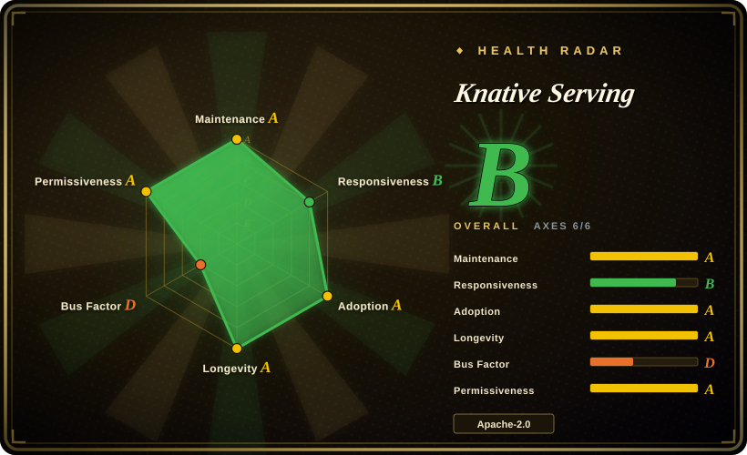
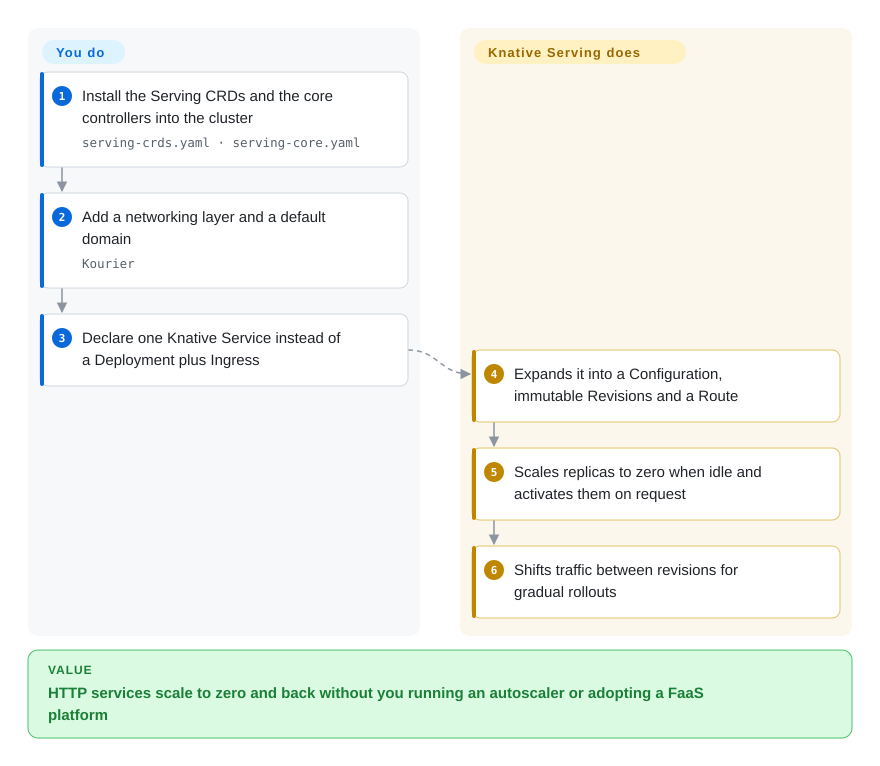

# Knative Serving

Kubernetes-native serverless serving: you declare an HTTP service and it gets routing, revisioned rollouts, request-driven autoscaling — including all the way down to zero replicas when nothing is calling it.

## When to use

You already run Kubernetes, and you have request-driven services that sit idle most of the day — internal APIs, webhooks, preview environments, batch-triggered endpoints, inference front doors — where paying for always-on pods is waste and hand-rolling an autoscaler that can reach zero is a project. Knative Serving is the middle layer: you deploy a `Service` resource instead of a Deployment+Service+Ingress, and you get scale-to-zero, per-revision immutability with traffic splitting, and a request path that activates pods on demand. It is the right answer when you want the *FaaS operational model* without adopting a FaaS product or a cloud-specific runtime: the same manifests run on any conformant Kubernetes, the autoscaler is part of your cluster, and there is a CNCF-graduated project behind it. The deciding tradeoff against [Agent Substrate](../sandboxing/substrate.md) is the workload shape: Knative is built for stateless request handlers that can cold-start cheaply, whereas Substrate is built for *stateful* agent sessions whose memory and filesystem must survive suspension — if your agent holds state between requests, Knative will scale it to zero and lose the process, and that is by design.

## How it works

Knative Serving installs two things into your cluster: custom resources (`Service`, `Route`, `Configuration`, `Revision`) and the controllers that reconcile them. You install the CRDs and core controller set with plain manifest applies (`serving-crds.yaml` then `serving-core.yaml` from a release), add a networking layer (the docs walk through Kourier; Istio and Contour are also supported) and a default domain, and then what you author is a single Knative `Service` object. That object is a template + traffic spec, not a running pod: the controller expands it into a `Configuration` (which produces immutable `Revision`s) and a `Route`. When no traffic reaches a revision, its pods scale to zero; when a request arrives, the autoscaler (and the activator in the data path) brings a pod up and holds the request until it can be served. Rollouts are traffic splits between revisions, which is why "deploy" and "shift traffic" are the same operation. What you own is the manifest, the container and the domain; what Knative owns is the revision history, the routing, the activation, and the scale-to-zero decision.

<!-- flow-steps:begin (generated from flows/knative-serving.json by tools/flow_card.py — do not edit) -->

Text version of the flow

1. **You**: Install the Serving CRDs and the core controllers into the cluster — `serving-crds.yaml · serving-core.yaml`
2. **You**: Add a networking layer and a default domain — `Kourier`
3. **You**: Declare one Knative Service instead of a Deployment plus Ingress
4. **Knative Serving**: Expands it into a Configuration, immutable Revisions and a Route
5. **Knative Serving**: Scales replicas to zero when idle and activates them on request
6. **Knative Serving**: Shifts traffic between revisions for gradual rollouts

**Value**: HTTP services scale to zero and back without you running an autoscaler or adopting a FaaS platform

<!-- flow-steps:end -->

## When NOT to use

- **Your workload must keep in-process state between requests.** Scale-to-zero means the process goes away. For long-lived stateful agent sessions with memory preserved across idle periods, use [Agent Substrate](../sandboxing/substrate.md) (snapshot suspend/resume) rather than Knative.
- **You need non-HTTP workloads.** Knative Serving is HTTP request-driven; for event-driven/async routing the sibling project Knative Eventing is the fit, and for batch pipelines a DAG engine is. Trying to bend Serving into a queue consumer fights the activator model, and Substrate's own docs note ingress-only wakeup as the reason consumer-shaped agents do not fit that design either.
- **You don't run Kubernetes, or your cluster forbids CRDs and a networking layer.** Knative is cluster infrastructure: CRDs, controllers, a networking layer, a domain. On a non-Kubernetes platform, use a hosted serverless product ([Modal client SDK](../sandboxing/modal-client.md), a hyperscaler's functions) instead.
- **Your requests are long-running, latency-critical, or GPU-bound.** Cold start and activation latency are structural; for steady high-throughput services a plain Deployment with an HPA is simpler and more predictable, and for GPU inference you generally want dedicated capacity, not scale-to-zero.
- **You want the simplest possible deployment primitive.** If your services are always busy, Knative adds CRDs, controllers, a networking layer and an autoscaler for a benefit you will not collect — a Deployment and an HPA is the smaller system.
- **You need the sandbox/isolation guarantee itself.** Serving schedules ordinary Kubernetes pods; it is not an isolation boundary for untrusted code. For that layer, use [gVisor](../sandboxing/gvisor.md) or [Kata Containers](../sandboxing/kata-containers.md) underneath, or a sandbox platform such as [OpenSandbox](../sandboxing/opensandbox.md).

## Comparison

| Alternative | In index | Our verdict | Tradeoff |
|---|---|---|---|
| [Agent Substrate](../sandboxing/substrate.md) | ✅ | Choose Knative when the workload is a stateless request handler and scale-to-zero is the value; choose Substrate when the workload is a stateful agent whose memory must survive idle periods and density is the value. | Knative optimizes utilization of stateless HTTP services; Substrate optimizes *statefulness* at scale by snapshotting actors. A workload that must remember things between requests is the dividing line. |
| [Kata Containers](../sandboxing/kata-containers.md) | ✅ | Choose Kata when the scheduling problem is isolation strength per workload; choose Knative when the scheduling problem is scale-to-zero and traffic routing. | They are orthogonal and stack: Knative decides *when* a pod exists, Kata decides *what* that pod cannot reach. Neither replaces the other. |
| [gVisor](../sandboxing/gvisor.md) | ✅ | Choose gVisor when hosting untrusted containers is the requirement; choose Knative when elastic HTTP serving is. | gVisor is a runtime class you would select *inside* the pods Knative schedules — a lower layer, not a competing platform. |
| [Modal client SDK](../sandboxing/modal-client.md) | ✅ | Choose Modal when you want serverless without operating Kubernetes, GPUs included; choose Knative when you want the same operational model inside your own cluster. | Modal removes the cluster and the control plane and charges per second; Knative keeps you in charge (and on the hook) for the cluster, the networking layer and upgrades. |
| Managed container apps platforms (Cloud Run, Azure Container Apps, AWS App Runner) | 未收录 | Choose a managed platform when zero cluster operations beats portability; choose Knative when the same manifests must run on your own or any conformant Kubernetes. | Managed platforms are turnkey but tie you to one cloud's control plane; Knative is the portable, self-operated equivalent and therefore has a bigger ops surface. Hosted platforms are not repositories, so they cannot be indexed. |

## Tech stack

- **Language:** Go (controllers, autoscaler, activator, webhook), Kubernetes CRDs and controllers.
- **Resources you author:** `Service` (template + traffic), plus the `Configuration`, `Revision` and `Route` objects the controller derives.
- **Networking:** pluggable data plane — Kourier, Istio and Contour are the documented options; a domain/DNS configuration is required for real URLs.
- **Autoscaling:** the project's own autoscaler with scale-to-zero, plus the activator in the request path and optional HPA-based behavior; the sibling `serving-hpa.yaml` release asset is the HPA-oriented install.
- **Ecosystem:** Knative Eventing (async routing) and Knative Functions (developer framework) sit alongside Serving; both are separate projects/repos.

## Dependencies

- **A Kubernetes cluster you operate** — latest stable or a supported recent version, with permission to install CRDs, controllers and a networking layer.
- **The Serving release manifests** — `serving-crds.yaml` and `serving-core.yaml` from a release (v1.23.0 at the time of writing), applied in that order.
- **A networking layer and a domain**: Kourier (documented in the install guide) or Istio/Contour, plus DNS/domain configuration for routable URLs.
- **A container registry** for your images, and a working autoscaling-friendly node setup (the activator and autoscaler need to reach the pods).
- **Optional**: `serving-hpa.yaml` if you want to install the HPA-related components, `serving-default-domain.yaml` for the default domain, and the migration assets in the release if you are upgrading.

## Ops difficulty

**Medium to high.** Installing Serving is a sequence of manifest applies, but operating it means owning a CRD-based control plane inside your cluster: an autoscaler that decides pod counts (and can surprise you at low traffic), an activator in the request path (an extra hop and a failure domain), revision accumulation that needs retention hygiene, and a networking/domain layer that must be right before anything is reachable. Upgrade discipline matters because revisions and ingress state persist across versions. The payoff is that you are not rebuilding the scale-to-zero machinery yourself, and the project documents an install path, a per-component upgrade path and a large production-user base.

## Health & viability

- **Maintenance (2026-09-20).** Active, release-driven: v1.23.0 published 2026-07-29, previous line 1.22.x; created 2018-01. Note the repository's last push (2026-08-25) is older than the other projects on this page — consistent with a mature, lower-churn controller set rather than an abandoned one. [推断]
- **Governance / bus factor (2026-09-20).** Foundation governance at the highest level in this batch: accepted to CNCF 2022-03-02, **graduated 2025-09-11**, with CNCF-reported totals of ~1,297 contributors and ~382 contributing organizations. This is the strongest "survives any one vendor" signal available.
- **Backing & Lindy (2026-09-20).** Created 2018-01 — over eight years old, still releasing, now CNCF-graduated: the textbook "old and still active" profile. It also survived the Google-to-CNCF transition, which is itself evidence of institutional durability.
- **Adoption & ecosystem (2026-09-20).** Broad: it is the serving layer under several commercial container platforms and is deployed widely enough that cloud providers and OpenShift document running it; the CNCF insight page reports a healthy project score. [未验证] Specific production deployments were not enumerated here.
- **Risk flags (2026-09-20).** No license or governance flags; the practical costs are the CRD/control-plane surface and the scale-to-zero cold-start behavior, both of which belong in workload selection rather than in project risk.

## Caveats (unverified)

- [未验证] Contributor/organization counts and the health score come from the CNCF project page (LFX Insights) and were not independently recomputed.
- [未验证] The complete supported-version matrix and the exact current install assets beyond `serving-crds.yaml`/`serving-core.yaml` were not enumerated; check the release page before installing.
- [推断] "Mature, lower-churn" is inferred from the older `pushed_at` versus its peers plus its release cadence; commit trends were not measured.
- [未验证] Cold-start and activation latency characteristics are workload-dependent and are not quantified here.
- [未验证] Which cloud/OpenShift integrations officially ship Knative Serving was not verified against each vendor's documentation.
- [推断] The Comparison rows against managed container-apps platforms are positioning statements, not benchmarks.

