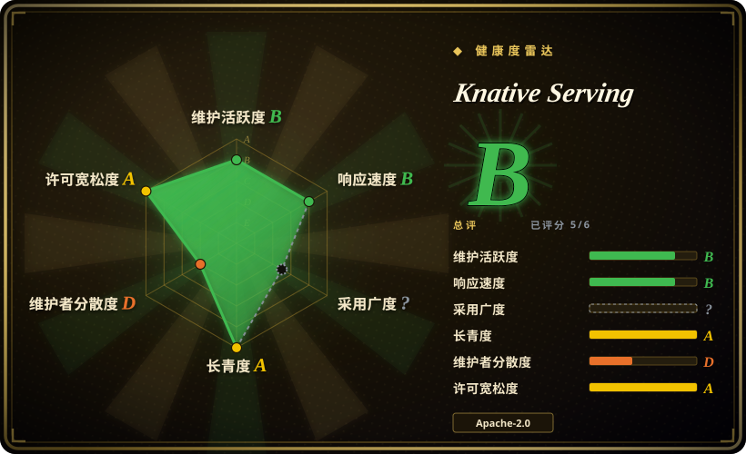
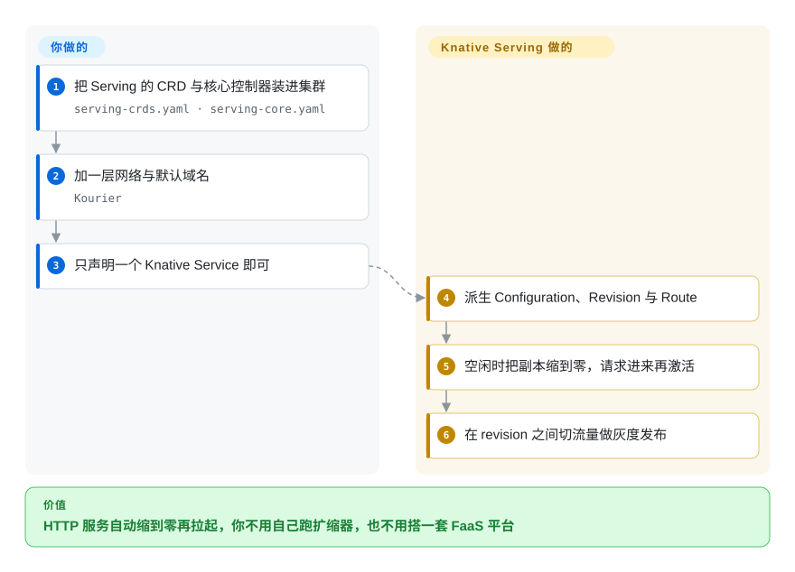

# Knative Serving

Kubernetes 原生的 serverless 服务层：你声明一个 HTTP 服务，它就自带路由、按 revision 的发布回滚、以及请求驱动的自动扩缩——包括没人调用时一路缩到零副本。

## 何时使用

你已经在跑 Kubernetes，而且有一批请求驱动的服务一天里大部分时间闲着——内部 API、webhook、预览环境、批处理触发的端点、推理服务的入口——为常驻 pod 付费是浪费，而自己写一个能缩到零的扩缩器又是一个项目。Knative Serving 就是中间那层：你部署的是一个 `Service` 资源，而不是 Deployment 加 Service 加 Ingress 的组合，于是你得到缩容到零、按 revision 不可变、支持流量切分的发布，以及按需激活 pod 的请求路径。想要**FaaS 的运维模型**、又不想采用某个 FaaS 产品或云厂商专属运行时时，它是正确答案：同一份 manifest 在任何符合规范的 Kubernetes 上都能跑，扩缩器是你集群的一部分，背后是一个 CNCF 毕业项目。与 [Agent Substrate](../sandboxing/substrate.zh.md) 的决定性取舍在负载形态：Knative 面向的是能低成本冷启动的无状态请求处理器；Substrate 面向的是**有状态**的 agent 会话，其内存与文件系统必须在暂停后幸存——agent 在请求之间要保留状态的话，Knative 会把它缩到零、进程消失，而这是设计使然。

## 怎么用起来

Knative Serving 往你的集群里装两样东西：自定义资源（`Service`、`Route`、`Configuration`、`Revision`）和 reconcile 它们的控制器。你用普通的 manifest apply 装 CRD 与核心控制器（从某个 release 取 `serving-crds.yaml`、再取 `serving-core.yaml`），加一层网络（文档里带的是 Kourier，也支持 Istio 与 Contour）并配置默认域名；之后你写的只是一个 Knative `Service` 对象。这个对象是「模板加流量规格」，不是一个正在跑的 pod：控制器把它展开成 `Configuration`（进而产出不可变的 `Revision`）与 `Route`。某个 revision 没有流量时 pod 缩到零；请求进来时扩缩器（与数据路径上的 activator）把 pod 拉起，并先兜住这个请求直到它能被服务。发布就是 revision 之间的流量切分，所以「部署」和「切流量」是同一个操作。你拥有的是 manifest、容器和域名；Knative 拥有的是 revision 历史、路由、激活与缩容到零的决策。

<!-- flow-steps:begin (generated from flows/knative-serving.json by tools/flow_card.py — do not edit) -->

流程文字版

1. **你**：把 Serving 的 CRD 与核心控制器装进集群 — `serving-crds.yaml · serving-core.yaml`
2. **你**：加一层网络与默认域名 — `Kourier`
3. **你**：只声明一个 Knative Service 即可
4. **Knative Serving**：派生 Configuration、Revision 与 Route
5. **Knative Serving**：空闲时把副本缩到零，请求进来再激活
6. **Knative Serving**：在 revision 之间切流量做灰度发布

**价值**：HTTP 服务自动缩到零再拉起，你不用自己跑扩缩器，也不用搭一套 FaaS 平台

<!-- flow-steps:end -->

## 何时不用

- **负载必须在请求之间保留进程内状态。** 缩容到零意味着进程消失。要长驻的有状态 agent 会话、空闲后内存仍在，请用 [Agent Substrate](../sandboxing/substrate.zh.md)（快照暂停／恢复），而不是 Knative。
- **你需要非 HTTP 负载。** Knative Serving 是 HTTP 请求驱动的；事件驱动／异步路由对应的是兄弟项目 Knative Eventing，批处理管线则对应 DAG 引擎。硬把 Serving 掰成队列消费者会和 activator 模型打架，Substrate 自己的文档也把「只有入口唤醒」列为消费者形态 agent 不适配的原因。
- **你不跑 Kubernetes，或集群禁止 CRD 与自定义网络层。** Knative 是集群基础设施：CRD、控制器、一层网络、一个域名。非 Kubernetes 平台请用托管 serverless 产品（[Modal 客户端 SDK](../sandboxing/modal-client.zh.md)、超大规模云的函数服务）。
- **请求是长耗时、对延迟敏感或吃 GPU 的。** 冷启动与激活延迟是结构性的；稳定高吞吐的服务用普通 Deployment 加 HPA 更简单也更可预测，GPU 推理通常要专有容量而不是缩到零。
- **你想要尽可能简单的部署原语。** 服务一直很忙的话，Knative 引入的 CRD、控制器、网络层与扩缩器换不来任何收益——Deployment 加 HPA 是更小的系统。
- **你要的是沙箱／隔离保证本身。** Serving 调度的是普通 Kubernetes pod，它不是不可信代码的隔离边界。需要那一层，就在下面用 [gVisor](../sandboxing/gvisor.zh.md) 或 [Kata Containers](../sandboxing/kata-containers.zh.md)，或者用 [OpenSandbox](../sandboxing/opensandbox.zh.md) 这类沙箱平台。

## 横向对比

| 替代品 | 是否收录 | 我们的评价 | 取舍 |
|---|---|---|---|
| [Agent Substrate](../sandboxing/substrate.zh.md) | ✅ | 负载是无状态请求处理器、缩容到零就是价值所在，选 Knative；负载是有状态 agent、空闲后内存必须还在、且密度才是价值，选 Substrate。 | Knative 优化无状态 HTTP 服务的利用率；Substrate 用快照 actor 的方式在规模上优化**有状态性**。请求之间必须记住东西，就是分界线。 |
| [Kata Containers](../sandboxing/kata-containers.zh.md) | ✅ | 调度问题在于每个负载的隔离强度，选 Kata；调度问题在于缩容到零与流量路由，选 Knative。 | 两者正交且可叠加：Knative 决定 pod **何时**存在，Kata 决定这个 pod **碰不到**什么。互不替代。 |
| [gVisor](../sandboxing/gvisor.zh.md) | ✅ | 需求是承载不可信容器，选 gVisor；需求是弹性 HTTP 服务，选 Knative。 | gVisor 是你会在 Knative 调度的 pod **内部**选择的 runtime class——更下一层，不是竞争平台。 |
| [Modal 客户端 SDK](../sandboxing/modal-client.zh.md) | ✅ | 想要不运维 Kubernetes 的 serverless（含 GPU），选 Modal；想在自己集群里拿到同样的运维模型，选 Knative。 | Modal 拿走集群与控制面并按秒计费；Knative 让你继续负责（也因此承担）集群、网络层与升级。 |
| 托管容器应用平台（Cloud Run、Azure Container Apps、AWS App Runner） | 未收录 | 零集群运维比可移植性更重要，选托管平台；同一份 manifest 必须跑在自己的或任何符合规范的 Kubernetes 上，选 Knative。 | 托管平台开箱即用，但把你绑到一家云的控制面；Knative 是可移植、自运维的等价物，因此运维面更大。托管平台不是仓库，无法收录。 |

## 技术栈

- **语言：** Go（控制器、扩缩器、activator、webhook），Kubernetes CRD 与控制器。
- **你编写的资源：** `Service`（模板加流量），以及控制器派生出的 `Configuration`、`Revision`、`Route`。
- **网络：** 数据面可插拔——文档给出 Kourier、Istio、Contour；真实 URL 还需要域名／DNS 配置。
- **扩缩：** 项目自带支持缩容到零的扩缩器，请求路径上有 activator，也支持基于 HPA 的行为；release 里的 `serving-hpa.yaml` 是偏 HPA 的安装资产。
- **生态：** Knative Eventing（异步路由）与 Knative Functions（开发者框架）与 Serving 并列；两者是各自独立的项目／仓库。

## 依赖

- **你自己运维的 Kubernetes 集群**——最新稳定版或受支持的近期版本，且你有权安装 CRD、控制器与网络层。
- **Serving 的 release manifest**——按顺序 apply 某个 release 的 `serving-crds.yaml` 与 `serving-core.yaml`（撰写时是 v1.23.0）。
- **一层网络与一个域名**：安装指南里带的是 Kourier，也支持 Istio／Contour，另需 DNS／域名配置才有可路由的 URL。
- **一个容器镜像仓库**，以及适配扩缩的节点配置（activator 与扩缩器要能访问 pod）。
- **可选：** 想装 HPA 相关组件用 `serving-hpa.yaml`，想要默认域名用 `serving-default-domain.yaml`，升级时用 release 里的迁移资产。

## 运维难度

**中到高。** 安装 Serving 是一串 manifest apply，但运维意味着你在集群里拥有一套基于 CRD 的控制面：一个决定 pod 数的扩缩器（低流量时可能给你惊喜）、请求路径上的 activator（多一跳、多一个故障域）、需要做保留治理的 revision 累积，以及必须先把域名与网络层弄对才能被访问。升级纪律很重要，因为 revision 与入口状态跨版本存在持久化。回报是你不用自己重建缩容到零的机制，而且项目有安装路径、逐组件升级路径和庞大的生产用户基础。

## 健康度与可持续性

- **维护活跃度（2026-09-20）。** 活跃且按发布节奏走：v1.23.0 发布于 2026-07-29，上一线是 1.22.x；创建于 2018-01。注意仓库最后推送（2026-08-25）比本页其他项目要早——这与一套成熟、低 churn 的控制器相符，而不是被弃用。[推断]
- **治理与 bus factor（2026-09-20）。** 本批里治理层级最高：2022-03-02 被 CNCF 接纳，**2025-09-11 毕业**，CNCF 页面给出的统计是约 1,297 名贡献者、约 382 家贡献组织。这是目前可得的「不依赖任何单一厂商」信号里最强的一档。
- **背书与 Lindy（2026-09-20）。** 创建于 2018-01，八年多且仍在发布，如今是 CNCF 毕业项目：教科书式的「老且仍活跃」。它还走过了从 Google 到 CNCF 的移交，这本身就是机构耐久性的证据。
- **采用与生态（2026-09-20）。** 广泛：它是若干商业容器平台下面的服务层，部署量足以让云厂商与 OpenShift 都写文档介绍如何运行它；CNCF 的项目洞察页报告其健康分良好。[未验证] 具体生产部署没有在此枚举。
- **风险旗标（2026-09-20）。** 许可与治理没有红旗；实际成本是 CRD／控制面的面，以及缩容到零带来的冷启动行为，这两点属于负载选型而不是项目风险。

## 存疑（未验证）

- [未验证] 贡献者／组织数与健康分来自 CNCF 项目页（LFX Insights），未独立重算。
- [未验证] 完整的支持版本矩阵，以及 `serving-crds.yaml`／`serving-core.yaml` 之外当前的全部安装资产未逐一枚举；安装前请查 release 页。
- [推断] 「成熟、低 churn」是从 `pushed_at` 比同批其他项目更早、加上发布节奏推断的；提交趋势未实测。
- [未验证] 冷启动与激活延迟特性依负载而定，本页没有量化。
- [未验证] 哪些云／OpenShift 集成官方交付 Knative Serving 未逐家对照文档核实。
- [推断] 与托管容器应用平台的对比行属定位性陈述，不是基准测试。
