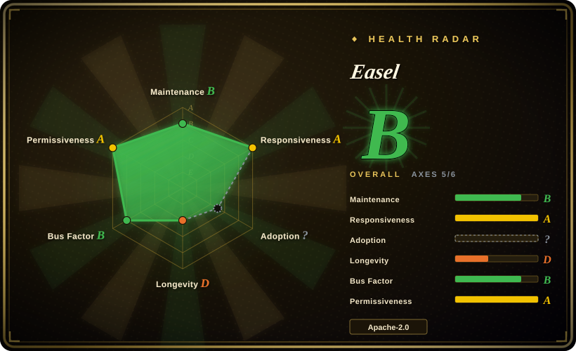
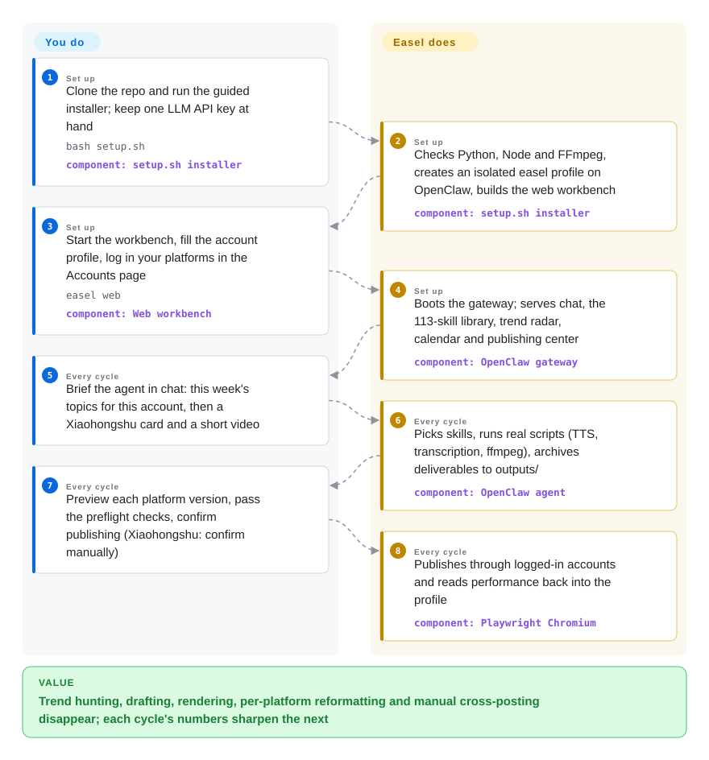

# Easel

You operate accounts on Xiaohongshu, Douyin, Zhihu or Bilibili, and your "AI content pipeline" is still a chat window that gives advice you then execute by hand — hunt trends yourself, write the draft yourself, resize the cover yourself, paste into each app yourself. Easel is a self-hosted agent workbench aimed at exactly those platforms: one agent that discovers trends, produces the actual deliverables (cards, audio, video), publishes through your logged-in accounts, and folds performance data back into a persistent account profile.

## When to use

You're a solo creator or a two-person team running real accounts on the Chinese platforms — Xiaohongshu, Douyin, Kuaishou, Zhihu, Bilibili, WeChat Channels or a WeChat Official Account — and the weekly loop of "find what's hot, decide the topic, make the card/video/article, reformat per platform, post, check the numbers" eats your weekends while each platform's app wants a different aspect ratio and tone. ChatGPT helps with one sentence of copy at a time; a scheduler like Buffer ships posts you still have to create elsewhere.

You reach for Easel when you want the whole loop in one self-hosted place and you already pay for an LLM API (Anthropic, OpenAI or any compatible endpoint). The deciding edge over its substitutes: it is vertical — 113 executable skills plus real platform adapters tuned for those seven Chinese platforms, and a per-account profile (positioning, audience, style, red lines, memory) that every step reads, so output is supposed to fit *your* account rather than a generic prompt. Against a general agent runtime like OpenClaw alone, you're choosing batteries-included content tooling over flexibility; against a pure uploader like social-auto-upload, you're choosing creation-plus-publishing over just shipping files you made elsewhere.

## How it works

Easel does not ship its own agent — it wraps OpenClaw (an open-source agent runtime, npm CLI) in an isolated `easel` profile that never touches your existing `~/.openclaw/` config. Around that runtime sits a Python CLI (`easel`) and a FastAPI + React web workbench on `localhost:7860`; the agent gateway runs on 18789. The unit of context is the **account profile** — a plain directory under `profiles/<name>/` with six Markdown dimensions (positioning, style, audience, platforms, preferences/red lines, long-term memory) — and the unit of skill is a `SKILL.md` plus runnable scripts, so when you ask for "a Xiaohongshu card on this paper", the agent actually executes TTS, transcription, ffmpeg rendering and image tools, and files every deliverable as a project under `outputs/` instead of dumping text into the chat. Publishing goes through Playwright Chromium driving your logged-in accounts, with per-platform format adaptation and preflight checks; the attribution step reads back views and engagement into the profile's memory. What you do: install once, provide one model key, describe the account once, then brief, review and confirm. What it does: everything between the brief and the posted, platform-shaped artifact.

<!-- flow-steps:begin (generated from flows/easel.json by tools/flow_card.py — do not edit) -->

Text version of the flow

1. **You** (Set up): Clone the repo and run the guided installer; keep one LLM API key at hand — `bash setup.sh` — component: `setup.sh installer`
2. **Easel** (Set up): Checks Python, Node and FFmpeg, creates an isolated easel profile on OpenClaw, builds the web workbench — component: `setup.sh installer`
3. **You** (Set up): Start the workbench, fill the account profile, log in your platforms in the Accounts page — `easel web` — component: `Web workbench`
4. **Easel** (Set up): Boots the gateway; serves chat, the 113-skill library, trend radar, calendar and publishing center — component: `OpenClaw gateway`
5. **You** (Every cycle): Brief the agent in chat: this week's topics for this account, then a Xiaohongshu card and a short video
6. **Easel** (Every cycle): Picks skills, runs real scripts (TTS, transcription, ffmpeg), archives deliverables to outputs/ — component: `OpenClaw agent`
7. **You** (Every cycle): Preview each platform version, pass the preflight checks, confirm publishing (Xiaohongshu: confirm manually)
8. **Easel** (Every cycle): Publishes through logged-in accounts and reads performance back into the profile — component: `Playwright Chromium`

**Value**: Trend hunting, drafting, rendering, per-platform reformatting and manual cross-posting disappear; each cycle's numbers sharpen the next

<!-- flow-steps:end -->

## When NOT to use

- **Your audience is on X, Instagram, YouTube or TikTok (global).** All seven supported platforms are Chinese; nothing Western is wired in. Use Postiz (`gitroomhq/postiz-app`, 未收录) — a self-hosted scheduler for the global platforms — or a commercial SaaS like Buffer/Hootsuite (not repos).
- **You only need to upload finished videos.** If the content already exists and the job is auto-posting to Douyin/XHS/Bilibili/YouTube, social-auto-upload (`dreammis/social-auto-upload`, 未收录) does browser-automation upload at a fraction of the install weight — no Node build, no gateway, no model bill.
- **You want unattended full-auto posting.** Easel's own README warns that Xiaohongshu may detect automation and answer with verification, throttling or account-risk controls, and recommends human-confirmed publishing there. For scheduled release of approved assets, a scheduler (Postiz, 未收录) is the safer shape than an agent driving a browser.
- **You have no LLM API budget.** Every creative step bills a paid chat model, and video/music/voice skills need additional provider keys. For near-zero-marginal-cost topic-to-shorts generation, use [MoneyPrinterTurbo](../video-production/moneyprinter-turbo.md) instead.
- **You need a stable surface to build on.** One month old at verification, still v0.x, with release notes rewriting transport and workspace resolution mid-month. Pin a release; don't build automation on top of unreleased `main`.
- **You're Windows-first.** A native PowerShell installer exists, but Windows end-to-end compatibility is the project's own #1 open roadmap item; treat Linux/macOS as the first-class path for now.
- **You just want social cards inside an agent you already run.** A portable skill like [guizang-social-card-skill](../agent-skills/visual-content/guizang-social-card.md) into Claude Code/OpenClaw costs one file; Easel is a whole workbench you'd be running for one feature.

## Comparison

| Alternative | In index | Our verdict | Tradeoff |
|---|---|---|---|
| [OpenClaw](../agent-frameworks/agent-runtimes/personal-assistants/openclaw.md) | ✅ | When you want one general personal assistant across many chat channels, run OpenClaw directly; pick Easel when the job is specifically Chinese social-media content ops and you want its skills, profiles and publishing loop prebuilt. | Easel adds the content workbench but locks you into its platform set; OpenClaw alone is a runtime you shape yourself, with no card/video/publishing skills out of the box. |
| [MoneyPrinterTurbo](../video-production/moneyprinter-turbo.md) | ✅ | When the deliverable is only narrated stock-footage shorts from a topic at near-zero marginal cost, pick MoneyPrinterTurbo; pick Easel when the loop must continue into real publishing and account learning. | Appliance-simple and cheap per video, but no account profiles, no platform publishing, no attribution — the video stops at the file. |
| [guizang-social-card-skill](../agent-skills/visual-content/guizang-social-card.md) | ✅ | When all you need is Xiaohongshu-format cards from your existing coding agent, install the single skill; Easel is for the full discover→publish→attribute chain. | One Markdown skill, zero infrastructure; you keep doing trends, publishing and analytics by hand. |
| social-auto-upload (dreammis) | 未收录 | When content is ready-made and the only pain is posting it to many Chinese platforms automatically, this MIT uploader is the lighter pick; Easel is the heavier choice when the content doesn't exist yet. | Real repository (MIT, ~15k stars) not added in this tab-intake batch; tradeoff is upload-only scope versus Easel's creation loop. |
| Postiz (gitroomhq/postiz-app) | 未收录 | When you manage global-platform accounts (X/Instagram/YouTube) and need scheduling with a team UI, pick Postiz; Easel covers Chinese platforms with creation included but no team roles. | Real repository (AGPL-3.0, ~36k stars) not added in this tab-intake batch; tradeoff is scheduler-without-creation and Western-platform focus versus Easel's agent-plus-Chinese-platform depth. |

## Tech stack

- **Language:** Python 3.10+ (the `easel` CLI; setuptools entry point) with a React/TypeScript web workbench built with Node.js 22.19+.
- **Web:** FastAPI + uvicorn + SSE streaming; web workbench on port 7860.
- **Agent layer:** OpenClaw npm CLI in an isolated `easel` profile, gateway on 18789; memory index with keyword-retrieval fallback when no embedding API is configured.
- **Skills:** 113 `SKILL.md` + script skills under `skills/openclaw/` (discovery, planning, text/visual, audio/video, publishing/attribution), including a vendored MIT `video-pipeline-sdk`.
- **Media & publishing:** Playwright/Chromium, ffmpeg, faster-whisper, edge-tts, rembg, biliup, librosa, opencv, matplotlib; optional paid APIs for AI video/music/voice.

## Dependencies

- **Required at runtime:** Python 3.10+ with `venv`, Node.js 22.19+, Git, FFmpeg, and **one chat-model API key** (Anthropic, OpenAI, or any OpenAI-/Anthropic-compatible endpoint); OpenClaw is installed by `setup.sh` as a global npm CLI (doctor enforces ≥ 2026.6.11).
- **For publishing:** Playwright Chromium (installed automatically) plus real, logged-in accounts on the target platforms.
- **Optional:** an embedding API for semantic memory (falls back to keyword retrieval), provider keys for AI video/music/voice generation.
- **No external database:** profiles, outputs and workspace state are plain directories; everything stays on your machine.

## Ops difficulty

**Medium.** `bash setup.sh` (or `setup.ps1`) is a genuinely guided, repeatable installer that checks every dependency and refuses half-installed states — but what you end up operating is a small local stack: a Python venv, a Node-built web server, an OpenClaw gateway process, Chromium, and ffmpeg, across ports 7860/18789. Upgrades are `git pull` + rerun setup, at v0.x churn pace (four releases in the first month). The recurring human cost is publishing health: platform logins expire, and Xiaohongshu in particular can challenge automated sessions, so expect to babysit accounts and keep OpenClaw current.

## Health & viability

- **Maintenance (as of 2026-09-28):** very active — four tagged releases in its first month (v0.1.0 on 2026-08-31 → v0.2.1 on 2026-09-24) and commits landing daily, including same-day fixes. Pace is a strength now and a churn risk for anyone pinning it.
- **Governance & bus factor:** built by ZJU REAL Lab (Zhejiang University's Reasoning/Embodied/Agentic/Lifelong-AI lab) with Peking University's OpenDCAI lab — an academic-team project, not a foundation or vendor. 9 active maintainers in the first month, but the top contributor holds ~50% of commits, so the roadmap effectively follows a research agenda and one lead, not customer SLAs.
- **Backing & Lindy verdict:** created 2026-08-28 — one month old at verification. ~2.1k stars and a Trendshift daily-trending badge are launch-wave signals, not durability evidence; there is no Lindy track record to lean on, and longevity plausibly tracks the lab's research interest in social intelligence. [推断]
- **Adoption & ecosystem:** bilingual README, GitHub Pages project site, a WeChat community group, 309 forks in month one; no package-registry distribution — install is git-clone-only, which slows embedding into other tooling.
- **Risk flags:** Apache-2.0, no relicense history. Two structural risks: (1) platform ToS — the authors themselves warn Xiaohongshu automation can trigger risk control, and browser-driven publishing breaks whenever platforms change their UIs; (2) security surface of a local web app — v0.2.1 fixed a command-injection hole in `.env` writes and added CSP/DNS-rebinding guards, which shows responsive engineering but also that the surface is young.

## Caveats (unverified)

- [未验证] Skill count (README badge says 113; the v0.2.0 changelog says 114 after adding `video-production`) is the project's own moving figure — not independently counted.
- [未验证] Star (~2.1k) and fork (309) counts are GitHub API values on 2026-09-28; on a one-month repo they measure launch attention, not adoption.
- [未验证] The seven-platform publishing loop (login, format adaptation, post, read-back) is taken from the README/changelog and was not reproduced here; Playwright-against-platform-UI flows degrade silently when platforms ship changes.
- [推断] "Output converges on the account over cycles" is the profile-memory design intent stated in the README; a one-month-old project has no long-run evidence that the loop actually compounds.
- [推断] Academic-lab longevity: continuity depends on REAL Lab's research priorities and student turnover; no governance documents (CONTRIBUTING exists, but no foundation or vendor commitment) were found beyond the org page.
- [未验证] Media-generation quality and cost for the AI video/music/voice skills (which call paid third-party APIs) were not benchmarked.
