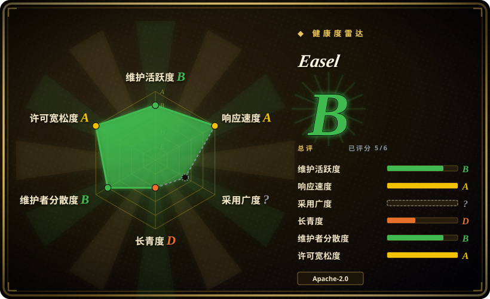
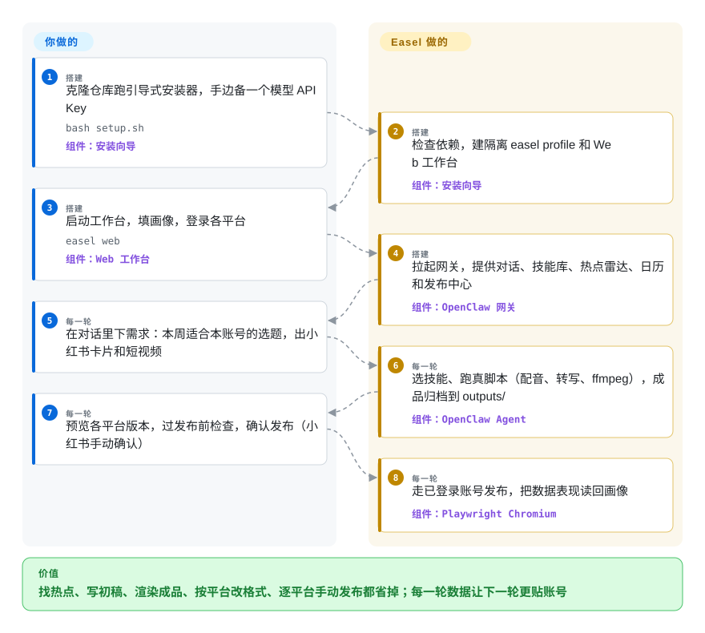

# Easel

你在小红书、抖音、知乎、B 站上运营账号，所谓“AI 做内容”至今还停留在聊天窗口给建议：热点自己刷、文案自己写、封面自己裁、每个平台再粘贴一遍，周末就这么没了。Easel 是一个自托管的开源社媒智能体工作台，专门对着这几个平台：一个 Agent 从发现热点、生成真成品（卡片、音频、视频）、走你已登录的账号发布，到把数据表现写回账号画像，把整条链路接起来。

## 何时使用

你是个人创作者或两三人的小团队，在中文平台——小红书、抖音、快手、知乎、B 站、微信视频号或微信公众号——上养着真实账号，每周都在循环“找热点、定选题、做卡片或视频、按平台改格式、发布、看数据”，而每个平台要的画幅和语气还不一样。通用聊天模型一次只给你一句文案；Postiz 一类的排期工具只负责把你做好的帖子发出去，内容还得在别处做。

当这条链路想收进一个自托管系统、且你已经在付 LLM API 账单（Anthropic、OpenAI 或任意兼容端点）时，你会拿起 Easel。它在替代品面前的决定性差异是“垂直”：113 个可执行技能加上针对这七个中文平台的真实发布适配器，还有一个账号画像（定位、受众、风格、红线、长期记忆）被每一步读取，输出目标是贴合“你这个账号”，而不是通用提示词的通用产物。对比 OpenClaw 这类通用 Agent 运行时，你选的是开箱即用的内容工具链而非灵活底座；对比 social-auto-upload 这类纯上传工具，你选的是“创作加发布”而非只搬运现成文件。

## 怎么用起来

Easel 不自带 Agent 内核——它把 OpenClaw（开源 Agent 运行时，npm CLI）包在一个隔离的 `easel` profile 里，不碰你机器上已有的 `~/.openclaw/` 配置。运行时外围是一个 Python CLI（`easel`）加 FastAPI + React 的 Web 工作台（`localhost:7860`），Agent 网关跑在 18789。上下文的单位是**账号画像**——`profiles/<名字>/` 下一个普通目录，六个 Markdown 维度（定位、风格、受众、平台、偏好与红线、长期记忆）；技能的单位是 `SKILL.md` 加可运行脚本，所以你说“给这篇论文做一组小红书卡片”时，Agent 真的去执行语音合成、转写、ffmpeg 渲染这些工具，并把成品按项目归档到 `outputs/`，而不是在聊天里吐一段文字。发布走 Playwright Chromium 驱动你已登录的账号，带各平台格式适配和发布前检查；归因这一步把阅读和互动数据读回来写进画像记忆。你做的：装一次、配一个模型 Key、把账号描述一遍，之后就是下需求、审成品、确认发布。它做的：从需求到贴着平台规格的成品之间的全部。

<!-- flow-steps:begin (generated from flows/easel.json by tools/flow_card.py — do not edit) -->

流程文字版

1. **你**（搭建）：克隆仓库跑引导式安装器，手边备一个模型 API Key — `bash setup.sh` — 组件：`安装向导`
2. **Easel**（搭建）：检查依赖，建隔离 easel profile 和 Web 工作台 — 组件：`安装向导`
3. **你**（搭建）：启动工作台，填画像，登录各平台 — `easel web` — 组件：`Web 工作台`
4. **Easel**（搭建）：拉起网关，提供对话、技能库、热点雷达、日历和发布中心 — 组件：`OpenClaw 网关`
5. **你**（每一轮）：在对话里下需求：本周适合本账号的选题，出小红书卡片和短视频
6. **Easel**（每一轮）：选技能、跑真脚本（配音、转写、ffmpeg），成品归档到 outputs/ — 组件：`OpenClaw Agent`
7. **你**（每一轮）：预览各平台版本，过发布前检查，确认发布（小红书手动确认）
8. **Easel**（每一轮）：走已登录账号发布，把数据表现读回画像 — 组件：`Playwright Chromium`

**价值**：找热点、写初稿、渲染成品、按平台改格式、逐平台手动发布都省掉；每一轮数据让下一轮更贴账号

<!-- flow-steps:end -->

## 何时不用

- **你的受众在 X、Instagram、YouTube 或海外 TikTok 上。** 支持的七个平台全是中文平台，没有任何海外平台适配；发全球平台用 Postiz（`gitroomhq/postiz-app`，未收录）这类自托管排期工具，或 Buffer／Hootsuite 一类商业服务（非仓库）。
- **你只需要把做好的视频传上去。** 内容已经存在、痛点只是多平台分发时，social-auto-upload（`dreammis/social-auto-upload`，未收录）用浏览器自动化把视频传到抖音／小红书／B 站／YouTube，安装负担只有它的一小部分——不需要 Node 构建、网关和模型账单。
- **你想要完全无人值守的全自动发布。** Easel 自己的 README 就警告小红书可能检测自动化操作，触发验证、限流或账号风控，并建议人工确认后发布。已审定内容的定时发布，用排期工具（Postiz，未收录）比让 Agent 开浏览器更稳。
- **你没有 LLM API 预算。** 每一步创作都在调付费对话模型，视频／音乐／配音技能还要额外的服务商 Key。只要“主题变口播短视频”且边际成本趋零，用 [MoneyPrinterTurbo](../video-production/moneyprinter-turbo.zh.md)。
- **你需要稳定的二次开发面。** 验证时项目只有一个月大，还在 v0.x，月内就在改写对话传输和工作区解析。锁版本用，别基于未发版的 `main` 做自动化。
- **你以 Windows 为主力系统。** 有原生 PowerShell 安装器，但 Windows 全链路兼容是它自己路线图上的第一项未完成事项；目前把 Linux／macOS 当一等公民路径更稳。
- **你只想在现有 agent 里出社媒卡片。** 把 [guizang-social-card-skill](../agent-skills/visual-content/guizang-social-card.zh.md) 这种单文件技能装进 Claude Code／OpenClaw 就够了；为一个功能跑起整个工作台不划算。

## 横向对比

| 替代品 | 是否收录 | 我们的评价 | 取舍 |
|---|---|---|---|
| [OpenClaw](../agent-frameworks/agent-runtimes/personal-assistants/openclaw.zh.md) | ✅ | 要一个跨聊天频道的通用私人助理时直接用 OpenClaw；活儿就是中文社媒内容运营、想要现成技能加画像加发布闭环时选 Easel。 | Easel 补上了内容工作台，但绑死在它支持的平台集合上；OpenClaw 是随你塑造的运行时，出厂没有卡片／视频／发布技能。 |
| [MoneyPrinterTurbo](../video-production/moneyprinter-turbo.zh.md) | ✅ | 只要“主题→口播库存素材短视频”且边际成本趋零时选 MoneyPrinterTurbo；链路必须延伸到真实发布和账号学习时选 Easel。 | 家电式部署、单条成本极低，但没有账号画像、没有平台发布、没有归因——视频到文件为止。 |
| [guizang-social-card-skill](../agent-skills/visual-content/guizang-social-card.zh.md) | ✅ | 只要小红书规格卡片、且已有 coding agent 时装这一个技能就够；发现→发布→归因的完整链条才轮到 Easel。 | 一个 Markdown 技能、零基础设施；热点、发布和数据复盘仍然全靠手动。 |
| social-auto-upload（dreammis） | 未收录 | 内容已做好、唯一痛点是自动发到多个中文平台时，这个 MIT 上传器更轻；内容还不存在、需要从选题做起时才用 Easel。 | 真实仓库（MIT，约 1.5 万星），本批次未收录；取舍是只管上传的定位对比 Easel 的创作闭环。 |
| Postiz（gitroomhq/postiz-app） | 未收录 | 运营全球平台（X／Instagram／YouTube）账号、需要带团队界面的排期时选 Postiz；Easel 覆盖中文平台、带创作但没有团队角色。 | 真实仓库（AGPL-3.0，约 3.6 万星），本批次未收录；取舍是“只排期不创作＋海外平台”对比“Agent 加中文平台深度”。 |

## 技术栈

- **语言：** Python 3.10+（`easel` CLI，setuptools 入口），Web 工作台是 React／TypeScript，用 Node.js 22.19+ 构建。
- **Web：** FastAPI + uvicorn + SSE 流式；Web 工作台跑 7860 端口。
- **Agent 层：** OpenClaw npm CLI 跑在隔离的 `easel` profile 里，网关在 18789；记忆索引在没配向量 API 时回落关键词检索。
- **技能：** `skills/openclaw/` 下 113 个 `SKILL.md` 加脚本的技能（发现、策划、图文、音视频、发布归因），内置一份 MIT 的 `video-pipeline-sdk`。
- **媒体与发布：** Playwright／Chromium、ffmpeg、faster-whisper、edge-tts、rembg、biliup、librosa、opencv、matplotlib；AI 视频／音乐／配音走可选的付费 API。

## 依赖

- **运行时必需：** Python 3.10+（含 `venv`）、Node.js 22.19+、Git、FFmpeg，以及**一个对话模型 API Key**（Anthropic、OpenAI 或任意 OpenAI／Anthropic 兼容端点）；OpenClaw 由 `setup.sh` 装成全局 npm CLI（doctor 强制 ≥ 2026.6.11）。
- **发布需要：** Playwright Chromium（自动安装）加上目标平台的真实已登录账号。
- **可选：** 向量 API 用于语义记忆（不配则回落关键词检索）、AI 视频／音乐／配音的服务商 Key。
- **没有外部数据库：** 画像、产物和工作区状态都是普通目录，全部留在本机。

## 运维难度

**中等。** `bash setup.sh`（或 `setup.ps1`）是真正引导式、可重复的安装器，逐项检查依赖、拒绝半成品安装——但你最终运维的是一小套本地栈：Python venv、Node 构建的 Web 服务、OpenClaw 网关进程、Chromium 和 ffmpeg，横跨 7860／18789 两个端口。升级是 `git pull` 加重跑安装器，节奏是 v0.x 的月度四连发。持续的人力成本在发布健康度：平台登录态会过期，小红书尤其可能挑战自动化会话，要有照看账号和跟进 OpenClaw 版本的心理准备。

## 健康度与可持续性

- **维护（截至 2026-09-28）：** 非常活跃——首月四个 tag 版本（v0.1.0 于 2026-08-31，v0.2.1 于 2026-09-24），每天有提交，含当日修复。节奏现在是优点，对锁版本的人是翻新风险。
- **治理与巴士因子：** 由浙大 REAL Lab（Reasoning／Embodied／Agentic／Lifelong AI 方向）联合北大 OpenDCAI 实验室开发——学术团队项目，不是基金会或商业公司。首月 9 位活跃维护者，但最高贡献者约占一半提交，路线图实际跟着研究议程和一位牵头人走，不跟客户 SLA。
- **背书与 Lindy 判断：** 仓库创建于 2026-08-28，验证时只有一个月大。约 2.1k 星加 Trendshift 日榜徽章是发布波信号，不是耐久性证据；没有任何 Lindy 记录可依赖，寿命大概率跟着实验室“社媒社交智能”的研究兴趣走。[推断]
- **采纳与生态：** 双语 README、GitHub Pages 项目主页、微信交流群、首月 309 fork；没有包管理器分发，只能 git clone 安装，这会拖慢被别的工具集成。
- **风险旗标：** Apache-2.0，无换证历史。两个结构性风险：其一，平台条款——作者自己警告小红书自动化可能触发风控，浏览器驱动的发布在平台改版时会静默失效；其二，本地 Web 应用的安全面——v0.2.1 修了 `.env` 写入的命令注入并加了 CSP／DNS Rebinding 防护，响应很快，但也说明这张面还年轻。

## 存疑（未验证）

- [未验证] 技能数量（README 徽章写 113，v0.2.0 变更日志加完 `video-production` 后写 114）是项目自己变动的数字——未独立清点。
- [未验证] 星标（约 2.1k）与 fork（309）为 2026-09-28 GitHub API 值；在一个月大的仓库上，它量的是发布热度，不是真实采纳。
- [未验证] 七平台发布闭环（登录、格式适配、发布、读回）来自 README 与变更日志，未在本页验证；Playwright 对着平台 UI 的流程会在平台改版时静默退化。
- [推断] “产出随轮次收敛到账号风格”是 README 里画像记忆的设计意图；一个月大的项目没有长周期证据证明这个闭环真的在复利。
- [推断] 学术实验室寿命：连续性取决于 REAL Lab 的研究优先级和学生更替；除组织页外未找到治理文件（有 CONTRIBUTING，但无基金会或厂商承诺）。
- [未验证] AI 视频／音乐／配音技能（调用付费第三方 API）的生成质量与成本未做基准测试。
