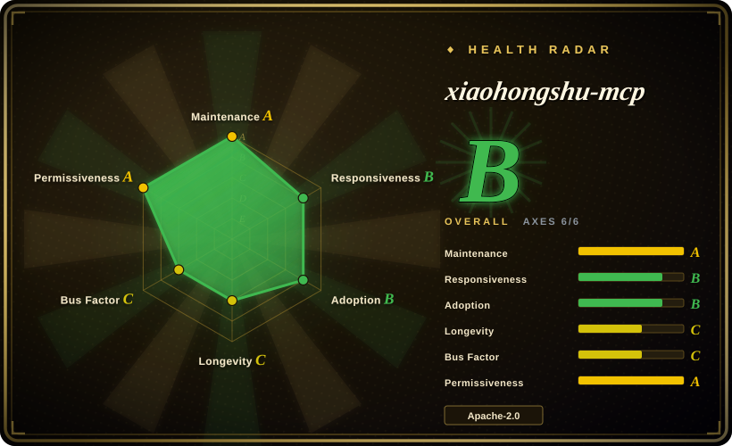
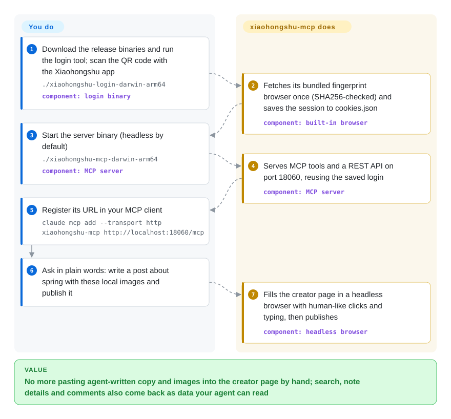

# xiaohongshu-mcp

Your agent can draft a Xiaohongshu (RedNote) post in seconds, but Xiaohongshu has no public posting or search API, so you still paste the copy and images into the creator page yourself and copy search results back by hand. xiaohongshu-mcp logs into your account once and drives a browser on your behalf, so the agent can search, read notes and comments, post, comment, like and save through ordinary tool calls.

## When to use

You run a Xiaohongshu account — a side-project brand, a personal blog's companion account, a small shop — and you already work in Claude Code, Cursor, Cline or an n8n workflow. Every day looks the same: the agent writes a 20-character title and a 900-character body, then you open the web creator page, upload four images, paste the tags, press publish; when you want to know what is working, you search the topic in the app and retype the top notes' numbers into the chat. You want one sentence — "publish this with these images" or "find the most-liked posts about cold brew this week and summarise the comments" — to do it.

Reach for xiaohongshu-mcp when you want that as a **standard MCP server you host yourself**: one Go binary (or a Docker image) that any MCP client can call, plus the same actions as a REST API for scripts and n8n. Against its closest substitutes the deciding tradeoff is shape and scope. [OpenCLI](../web-automation/agent-browser-tools/opencli.md) drives *your own* visible Chrome through an extension, which is gentler on risk control but ties automation to a desktop session; xiaohongshu-mcp runs headless on a server, with its own fingerprint browser, and covers both publishing and reading. [Easel](easel.md) is a whole content workbench that makes the cards and video too; xiaohongshu-mcp only gives your existing agent hands on one platform.

## How it works

Xiaohongshu has no open API for this, so the project acts like a person at a browser. You log in once by scanning a QR code with the phone app; the session cookies are saved to a local `cookies.json`. When the server starts it launches a **bundled fingerprint browser** — a Chromium build, downloaded once from the author's CDN, that presents a stable, believable identity (screen, fonts, hardware hints) per account rather than the tell-tale defaults of an automation browser — and drives it with go-rod (a Go library that remote-controls Chrome). Every tool call becomes a script of page actions: open the search page, click the filter, scroll, or fill the creator form and press publish, with randomised human-like pauses and mouse paths between steps, then the page data is returned as JSON. What it does for you: login persistence, the browser, the page choreography and 18 MCP tools (publish image or video notes, search, feed detail with comments, comment and reply, like, save, profile, notifications). What stays yours: the content, the posting rhythm (the maintainer's own advice is that agents do not pace themselves), and the account risk.

<!-- flow-steps:begin (generated from flows/xiaohongshu-mcp.json by tools/flow_card.py — do not edit) -->

Text version of the flow

1. **You**: Download the release binaries and run the login tool; scan the QR code with the Xiaohongshu app — `./xiaohongshu-login-darwin-arm64` — component: `login binary`
2. **xiaohongshu-mcp**: Fetches its bundled fingerprint browser once (SHA256-checked) and saves the session to cookies.json — component: `built-in browser`
3. **You**: Start the server binary (headless by default) — `./xiaohongshu-mcp-darwin-arm64` — component: `MCP server`
4. **xiaohongshu-mcp**: Serves MCP tools and a REST API on port 18060, reusing the saved login — component: `MCP server`
5. **You**: Register its URL in your MCP client — `claude mcp add --transport http xiaohongshu-mcp http://localhost:18060/mcp`
6. **You**: Ask in plain words: write a post about spring with these local images and publish it
7. **xiaohongshu-mcp**: Fills the creator page in a headless browser with human-like clicks and typing, then publishes — component: `headless browser`

**Value**: No more pasting agent-written copy and images into the creator page by hand; search, note details and comments also come back as data your agent can read

<!-- flow-steps:end -->

## When NOT to use

- **You cannot afford to lose the account.** Browser automation of a logged-in account is outside Xiaohongshu's sanctioned use; the issue tracker carries repeated ban and warning reports (#316, #668, #715, #726, #728, #777, 2025-12 → 2026-07), some after only a search and an unsave. The maintainer answered by moving to the fingerprint browser and humanised input in v2.1.1, and reports clean test accounts — that lowers, not removes, the risk. If the account is your business, keep a human in the publish loop: [Easel](easel.md) asks for manual confirmation on Xiaohongshu, or post by hand.
- **You want to automate inside your everyday browser session instead of a server.** A second web login kicks the MCP session out (the README says the same account cannot stay logged in on two web clients), so you cannot casually browse on the web while it runs. [OpenCLI](../web-automation/agent-browser-tools/opencli.md) drives your real Chrome profile instead, and the author's own X-MCP extension (closed-source, not a repo) does the same for Xiaohongshu specifically.
- **You need bulk data collection for research.** The tools return one search page or one note at a time, deliberately paced; scaling that up is exactly the pattern that triggers risk control. For multi-platform crawling of notes and comments into CSV/DB, MediaCrawler (`NanmiCoder/MediaCrawler`, 未收录) is built for it — but its license is non-commercial learning only.
- **You only need to upload finished videos to several platforms.** social-auto-upload (`dreammis/social-auto-upload`, 未收录) covers Douyin, Xiaohongshu, Channels, Bilibili, TikTok and YouTube upload in one MIT tool; xiaohongshu-mcp is one platform but much more than upload.
- **You expose it beyond localhost without setting a token.** The server listens on `:18060` on all interfaces and authentication is off unless you set `AUTH_TOKEN`; anyone who can reach the port can publish, comment and delete cookies as you. Set the token, or bind it behind a firewall or reverse proxy — or prefer a desktop-bound tool such as [OpenCLI](../web-automation/agent-browser-tools/opencli.md) if you cannot.
- **You run on macOS Intel or Linux ARM64, or you must audit every binary you run.** Release binaries and the bundled browser exist only for macOS Apple Silicon, Windows x64 and Linux x64, and the browser is an opaque prebuilt Chromium fetched from the author's CDN with a checksum file from the same CDN (no named upstream). If either is a blocker, the Python skill set `autoclaw-cc/xiaohongshu-skills` (未收录, MIT) drives your own installed Chrome instead.
- **You want read-only Xiaohongshu among many other sources.** If the agent's real job is research across Twitter/Reddit/YouTube/Bilibili too, [Agent-Reach](../deep-research/agent-reach.md) installs and routes a per-platform backend (it lists xiaohongshu-mcp as one option) so you do not wire each platform yourself.

## Comparison

| Alternative | In index | Our verdict | Tradeoff |
|---|---|---|---|
| [OpenCLI](../web-automation/agent-browser-tools/opencli.md) | ✅ | When you want an agent to act on Xiaohongshu (and 180+ other sites) from the Chrome you are already logged into on your desk, pick OpenCLI; pick xiaohongshu-mcp when it must run headless on a server or in Docker and expose a standard MCP/REST endpoint. | OpenCLI inherits your real browser's identity and needs a desktop session; xiaohongshu-mcp runs unattended with its own fingerprint browser but owns a second, detectable login. |
| [Easel](easel.md) | ✅ | When the job is the whole content loop — trends, card and video creation, multi-platform publishing, attribution — pick Easel; pick xiaohongshu-mcp when you already have an agent that writes and only need it to act on Xiaohongshu. | Easel brings content tooling and seven Chinese platforms at the cost of a local Python/Node/OpenClaw stack and v0.x churn; xiaohongshu-mcp is one binary and one platform. |
| [Agent-Reach](../deep-research/agent-reach.md) | ✅ | When the agent mainly needs to *read* Xiaohongshu alongside Twitter, Reddit, YouTube and Bilibili, install Agent-Reach and let it route a backend; run xiaohongshu-mcp directly when you need write actions (post, comment, like) or full control of the Xiaohongshu backend. | Agent-Reach adds a selector and health check across many platforms but is read-oriented; xiaohongshu-mcp is single-platform with full read/write tools. |
| MediaCrawler (NanmiCoder) | 未收录 | When you need bulk notes and comments from Xiaohongshu and other Chinese platforms into files or a database for analysis, MediaCrawler is the crawler; pick xiaohongshu-mcp for agent-paced, per-request access with publishing. | Real repository (~66k stars) not added in this tab batch; its non-commercial learning license and bulk-crawl shape trade away commercial use and account safety for volume. |
| social-auto-upload (dreammis) | 未收录 | When content is already made and you only need scheduled uploads to several Chinese and global video platforms, pick social-auto-upload; pick xiaohongshu-mcp when the agent must also search, read and interact on Xiaohongshu. | Real repository (MIT, ~15k stars) not added in this tab batch; broader platform reach for upload, but no search, comments or MCP surface. |

## Tech stack

- **Language:** Go 1.24 (single module `github.com/xpzouying/xiaohongshu-mcp`), CGO disabled for release builds.
- **Protocol surfaces:** MCP Streamable HTTP at `/mcp` via the official `modelcontextprotocol/go-sdk` (v1.4.0), and a gin REST API under `/api/v1/*`, both behind the same optional bearer-token middleware.
- **Browser automation:** go-rod v0.116 through the author's own `xpzouying/headless_browser` wrapper (MIT), driving a bundled fingerprint Chromium (version 148.0.7778.215 at verification) with per-account fingerprint seeds; `humanize/` adds log-normal delays, mouse paths and keystroke timing.
- **Extras in the repo:** a Python `skills/post-to-xhs` skill that publishes over Chrome DevTools Protocol, n8n / Cherry Studio / AnythingLLM integration examples, Docker image and a macOS launchd recipe.

## Dependencies

- **Required:** a Xiaohongshu account (real-name verification recommended by the README) and a QR-code login from the phone app; outbound network to `xiaohongshu.com` and, on first run, to `cdn.one-world.ai` for the ~150 MB browser download.
- **Runtime:** nothing else for the release binaries (macOS arm64, Windows x64, Linux x64); Go 1.24 to build from source; Docker for the container path (Ubuntu 22.04 base with Chinese fonts and the browser pre-baked).
- **Optional:** `XHS_PROXY` (HTTP/HTTPS/SOCKS5) for egress, `AUTH_TOKEN` for endpoint auth, an MCP client (Claude Code, Cursor, VS Code, Cline, Gemini CLI, OpenCode) or n8n for orchestration.
- **No database:** state is `cookies.json` (cookies plus fingerprint seed) and a local image cache.

## Ops difficulty

**Low to medium.** Installing is trivial — download two binaries or `docker compose up -d` — and there is no database. The ongoing cost is account babysitting: cookies expire and need a fresh QR login, a web login elsewhere kicks the session out, Xiaohongshu page changes break selectors until a new release lands (search filters were patched twice on 2026-09-22 alone), and risk-control warnings are something you watch for rather than something the tool reports. Exposing it on a server adds the job of setting `AUTH_TOKEN` and keeping port 18060 private. The README's troubleshooting is a long issue thread (#56) and a set of WeChat/Feishu groups rather than structured docs.

## Health & viability

- **Maintenance (as of 2026-10-09):** active and fast-moving — semver releases from v2.2.3 (2026-07-27) to v2.5.5 (2026-09-22), four of them on 2026-09-22, and selector fixes landing within days of breakage. The pace is a necessity, not a luxury: the project lives or dies on keeping up with Xiaohongshu's web UI.
- **Governance & bus factor:** a personal repo (owner type User). xpzouying has 275 commits against 32 for the next contributor (tanxxjun321) among the top 15, and owns `CODEOWNERS`, releases and the browser CDN — effectively a single-maintainer project with a sizable contributor tail (31 listed via all-contributors).
- **Backing & Lindy:** created 2025-08-03, about 14 months old. No company or foundation; donations go to charity per `DONATIONS.md`. The author also runs a closed X-MCP browser extension with a hosted token service, which the README now recommends for non-technical users — a sign the open server may not stay the author's main bet. [推断]
- **Adoption:** ~16.2k stars, ~2.4k forks and 146k Docker Hub pulls (2026-10-09); referenced as a backend by other indexed tools ([Agent-Reach](../deep-research/agent-reach.md)) and wrapped by third-party OpenClaw skill packs. Real demand, but stars on a 14-month-old repo still measure attention more than durability.
- **Risk flags:** Apache-2.0 with a matching copyright line, no relicense. The structural risks are external: platform ToS and bans (users report them; the maintainer reports clean test accounts), and supply-chain trust in a prebuilt fingerprint browser served from the author's CDN with no disclosed upstream.

## Caveats (unverified)

- [未验证] Ban and warning frequency: the issue reports (#316, #668, #715, #726, #728, #777) are individual anecdotes with unclear usage intensity; the maintainer's "test accounts are fine on v2.1.1+" is equally unreproduced. Cannot be measured without running real accounts over time.
- [未验证] The bundled browser's origin: the update workflow says it is mirrored on a self-built CDN and that the public repo deliberately does not reference the upstream; which fingerprint-Chromium build it is, and who built it, was not determined. The SHA256 check only proves the download matches the CDN's own checksum file.
- [推断] That `cdn.one-world.ai` is controlled by the author rests on the workflow comment calling it a self-built CDN; domain ownership was not checked.
- [未验证] README claims (original project ran over a year without bans; 999+ likes on day one) are the author's own reports.
- [推断] "18 MCP tools" is counted from `mcp_server.go` at the verified commit; the README's Inspector section still says 13, so docs lag code.
- [未验证] Commercial-use and ToS position: the README says the project is for learning purposes and forbids illegal use; whether automated posting violates Xiaohongshu's user agreement in your jurisdiction was not assessed.
