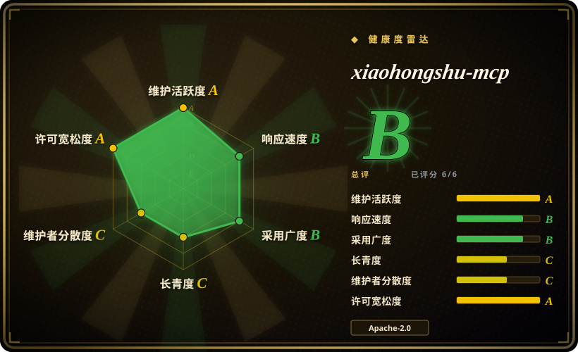
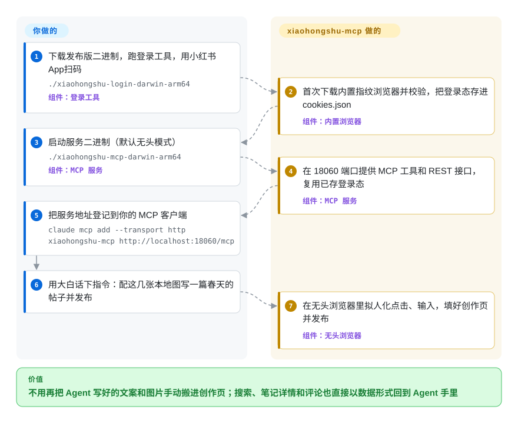

# xiaohongshu-mcp

Agent 几秒钟就能写好一篇小红书笔记，可小红书没有公开的发帖和搜索接口，最后还是你自己把文案和图片一张张搬进创作页，再把搜到的热门笔记手抄回对话框。xiaohongshu-mcp 让你扫码登录一次，之后由它替你操作浏览器，Agent 用普通的工具调用就能搜索、读笔记和评论、发帖、评论、点赞、收藏。

## 何时使用

你在运营一个小红书账号——副业品牌、个人博客的配套号、一家小店——日常已经在用 Claude Code、Cursor、Cline 或 n8n。每天的流程都一样：Agent 写好 20 字以内的标题和 900 字的正文，然后你打开网页版创作中心，传四张图，粘标签，点发布；想知道什么内容有效，就去 App 里搜这个话题，再把前几篇笔记的点赞数一条条敲回对话里。你想要的是一句话——“配这几张图发出去”或者“找出这周冷萃咖啡点赞最多的笔记，总结一下评论区”——就把事办了。

当你想要的是一个**自己部署的标准 MCP 服务**时就选它：一个 Go 二进制（或一个 Docker 镜像），任何 MCP 客户端都能调用，同样的动作还以 REST API 形式开放给脚本和 n8n。和最接近的替代品比，决定性的取舍在形态和范围上。[OpenCLI](../web-automation/agent-browser-tools/opencli.zh.md) 通过扩展驱动*你自己*那个可见的 Chrome，对风控更温和，但自动化绑在一台桌面会话上；xiaohongshu-mcp 在服务器上无头运行，自带指纹浏览器，发布和读取都覆盖。[Easel](easel.zh.md) 是一整套内容工作台，连卡片和视频都替你做；xiaohongshu-mcp 只是给你现有的 Agent 在一个平台上装一双手。

## 怎么用起来

小红书没有开放这类接口，所以这个项目的做法是像一个人坐在浏览器前那样操作。你用手机 App 扫一次二维码登录，会话 cookie 存进本地的 `cookies.json`。服务启动时会拉起一个**内置的指纹浏览器**——一份从作者 CDN 下载一次的 Chromium，它按账号呈现一套稳定、像真人的设备特征（屏幕、字体、硬件信息），而不是自动化浏览器那套一眼就能认出来的默认值——再用 go-rod（一个远程操控 Chrome 的 Go 库）去驱动它。每次工具调用都被翻译成一串页面动作：打开搜索页、点筛选、滚动，或者填好创作表单再点发布，步骤之间插入随机的、像真人的停顿和鼠标轨迹，最后把页面数据整理成 JSON 返回。它替你做的：登录态保持、浏览器、页面上的整套动作编排，以及 18 个 MCP 工具（发图文或视频笔记、搜索、带评论的笔记详情、评论与回复、点赞、收藏、个人主页、通知）。留给你的：内容本身、发帖节奏（维护者自己的提醒是 Agent 几乎不会控制频率），以及账号风险。

<!-- flow-steps:begin (generated from flows/xiaohongshu-mcp.json by tools/flow_card.py — do not edit) -->

流程文字版

1. **你**：下载发布版二进制，跑登录工具，用小红书 App 扫码 — `./xiaohongshu-login-darwin-arm64` — 组件：`登录工具`
2. **xiaohongshu-mcp**：首次下载内置指纹浏览器并校验，把登录态存进 cookies.json — 组件：`内置浏览器`
3. **你**：启动服务二进制（默认无头模式） — `./xiaohongshu-mcp-darwin-arm64` — 组件：`MCP 服务`
4. **xiaohongshu-mcp**：在 18060 端口提供 MCP 工具和 REST 接口，复用已存登录态 — 组件：`MCP 服务`
5. **你**：把服务地址登记到你的 MCP 客户端 — `claude mcp add --transport http xiaohongshu-mcp http://localhost:18060/mcp`
6. **你**：用大白话下指令：配这几张本地图写一篇春天的帖子并发布
7. **xiaohongshu-mcp**：在无头浏览器里拟人化点击、输入，填好创作页并发布 — 组件：`无头浏览器`

**价值**：不用再把 Agent 写好的文案和图片手动搬进创作页；搜索、笔记详情和评论也直接以数据形式回到 Agent 手里

<!-- flow-steps:end -->

## 何时不用

- **这个账号你输不起。** 用浏览器自动化操作已登录账号，不在小红书认可的使用方式之内；issue 区反复出现封号和警告报告（#316、#668、#715、#726、#728、#777，2025-12 到 2026-07），有的只做了一次搜索加一次取消收藏。维护者的回应是在 v2.1.1 换上指纹浏览器并把交互全面拟人化，并说测试账号正常——这降低了风险，没有消除风险。如果账号就是你的生意，发布环节要留人工：[Easel](easel.zh.md) 在小红书上要求手动确认，或者干脆手动发。
- **你想在日常用的浏览器会话里自动化，而不是跑在服务器上。** 再登一次网页版就会把 MCP 的会话踢下线（README 原话是同一账号不允许在多个网页端登录），所以它运行时你没法随手在网页上逛。[OpenCLI](../web-automation/agent-browser-tools/opencli.zh.md) 直接驱动你真实的 Chrome 配置；作者自己的 X-MCP 浏览器插件（闭源，非仓库）也是专门为小红书做这件事。
- **你要的是批量采集数据做研究。** 这些工具一次只返回一页搜索结果或一篇笔记，而且故意放慢；把它放大，正是触发风控的那种用法。要把多个平台的笔记和评论批量爬进 CSV 或数据库，MediaCrawler（`NanmiCoder/MediaCrawler`，未收录）是为此而生的——但它的许可证仅限非商业学习用途。
- **你只是要把做好的视频传到多个平台。** social-auto-upload（`dreammis/social-auto-upload`，未收录）一个 MIT 工具覆盖抖音、小红书、视频号、B 站、TikTok、YouTube 的上传；xiaohongshu-mcp 只管一个平台，但远不止上传。
- **你要把它暴露到 localhost 之外，却不设 token。** 服务默认在所有网卡的 `:18060` 上监听，不设 `AUTH_TOKEN` 就没有鉴权；任何能连上这个端口的人都能以你的身份发帖、评论、删 cookie。要么设 token，要么放到防火墙或反向代理后面——做不到的话，宁可选 [OpenCLI](../web-automation/agent-browser-tools/opencli.zh.md) 这类绑在桌面上的工具。
- **你用的是 Intel 版 macOS 或 Linux ARM64，或者你必须审计跑的每一个二进制。** 发布版二进制和内置浏览器只有 Apple Silicon 版 macOS、Windows x64、Linux x64 三种；浏览器是从作者 CDN 拉下来的不透明预编译 Chromium，校验文件也来自同一个 CDN，没有写明上游。这两点任何一个是硬约束，可以换成 Python 技能包 `autoclaw-cc/xiaohongshu-skills`（未收录，MIT），它驱动的是你自己装的 Chrome。
- **你只需要只读地看小红书，而且还要看很多别的平台。** 如果 Agent 真正的活儿是横跨 Twitter、Reddit、YouTube、B 站做调研，[Agent-Reach](../deep-research/agent-reach.zh.md) 会按平台安装并路由合适的后端（xiaohongshu-mcp 就是它列出的一种），你不必一个平台一个平台地接。

## 横向对比

| 替代品 | 是否收录 | 我们的评价 | 取舍 |
|---|---|---|---|
| [OpenCLI](../web-automation/agent-browser-tools/opencli.zh.md) | ✅ | 想让 Agent 直接在你桌面上那个已登录的 Chrome 里操作小红书（以及另外 180 多个网站），选 OpenCLI；必须在服务器或 Docker 里无头运行、并对外提供标准 MCP／REST 接口时，选 xiaohongshu-mcp。 | OpenCLI 沿用你真实浏览器的身份，但需要一台桌面会话；xiaohongshu-mcp 能无人值守地跑，自带指纹浏览器，代价是多出一个可被识别的登录。 |
| [Easel](easel.zh.md) | ✅ | 要的是完整内容闭环——热点、卡片和视频制作、多平台发布、数据归因——选 Easel；已经有一个会写的 Agent，只缺它在小红书上动手的能力，选 xiaohongshu-mcp。 | Easel 带来内容工具和七个中文平台，代价是本地一整套 Python／Node／OpenClaw 栈和 v0.x 的频繁变动；xiaohongshu-mcp 是一个二进制、一个平台。 |
| [Agent-Reach](../deep-research/agent-reach.zh.md) | ✅ | Agent 主要是*读*小红书，同时还要读 Twitter、Reddit、YouTube、B 站时，装 Agent-Reach 让它挑后端；需要写操作（发帖、评论、点赞）或要完全掌控小红书这一路时，直接跑 xiaohongshu-mcp。 | Agent-Reach 多了跨平台的后端选择和健康检查，但以读为主；xiaohongshu-mcp 只管一个平台，读写工具齐全。 |
| MediaCrawler（NanmiCoder） | 未收录 | 要把小红书和其他中文平台的笔记、评论批量抓进文件或数据库做分析，用 MediaCrawler；要按 Agent 节奏逐次访问并且能发布，选 xiaohongshu-mcp。 | 真实仓库（约 66k star），本批次未收录；非商业学习许可证加批量爬取的形态，是用商业可用性和账号安全换数据量。 |
| social-auto-upload（dreammis） | 未收录 | 内容已经做好、只要定时上传到多个国内外视频平台，选 social-auto-upload；Agent 还得在小红书上搜索、阅读、互动时，选 xiaohongshu-mcp。 | 真实仓库（MIT，约 15k star），本批次未收录；上传覆盖的平台更广，但没有搜索、评论，也没有 MCP 接口。 |

## 技术栈

- **语言：** Go 1.24（单模块 `github.com/xpzouying/xiaohongshu-mcp`），发布版关闭 CGO 编译。
- **协议接口：** 通过官方 `modelcontextprotocol/go-sdk`（v1.4.0）在 `/mcp` 提供 MCP Streamable HTTP，另有 gin 实现的 REST API 挂在 `/api/v1/*`，两者共用同一个可选的 bearer token 中间件。
- **浏览器自动化：** go-rod v0.116，经作者自己的 `xpzouying/headless_browser` 封装（MIT），驱动内置的指纹 Chromium（验证时版本 148.0.7778.215），每个账号固定一套指纹 seed；`humanize/` 负责对数正态分布的停顿、鼠标轨迹和按键节奏。
- **仓库里的其他东西：** 一个通过 Chrome DevTools Protocol 发布的 Python 技能 `skills/post-to-xhs`，n8n／Cherry Studio／AnythingLLM 的接入示例，Docker 镜像和一份 macOS launchd 配置。

## 依赖

- **必需：** 一个小红书账号（README 建议先完成实名认证），用手机 App 扫码登录；能出网访问 `xiaohongshu.com`，首次运行还要访问 `cdn.one-world.ai` 下载约 150 MB 的浏览器。
- **运行时：** 用发布版二进制（macOS arm64、Windows x64、Linux x64）不需要别的；源码编译需要 Go 1.24；容器方式需要 Docker（Ubuntu 22.04 基础镜像，中文字体和浏览器已预置）。
- **可选：** `XHS_PROXY`（HTTP／HTTPS／SOCKS5）走代理出网，`AUTH_TOKEN` 给接口加鉴权，再配一个 MCP 客户端（Claude Code、Cursor、VS Code、Cline、Gemini CLI、OpenCode）或 n8n 来编排。
- **没有数据库：** 状态就是 `cookies.json`（cookie 加指纹 seed）和本地图片缓存。

## 运维难度

**低到中。** 安装很简单——下两个二进制，或者 `docker compose up -d`——也没有数据库。持续的成本在于盯账号：cookie 会过期，需要重新扫码；在别处登录网页版会把会话踢掉；小红书页面一改，选择器就失效，要等新版本（仅 2026-09-22 一天就修了两次搜索筛选）；风控警告要你自己留意，工具不会替你报。放到服务器上还要多做一件事：设好 `AUTH_TOKEN`，别让 18060 端口暴露出去。README 的排障入口是一个很长的 issue（#56）和若干微信、飞书群，而不是成体系的文档。

## 健康度与可持续性

- **维护（截至 2026-10-09）：** 活跃且节奏快——语义化版本从 v2.2.3（2026-07-27）发到 v2.5.5（2026-09-22），其中四个在 2026-09-22 当天发布；页面失效后几天内就有选择器修复。这个节奏不是锦上添花，而是生存条件：项目的命就系在能不能跟上小红书网页的改版。
- **治理与巴士因子：** 个人仓库（owner 类型为 User）。前 15 名贡献者里 xpzouying 有 275 次提交，第二名 tanxxjun321 只有 32 次；`CODEOWNERS`、发版和浏览器 CDN 都在他手里——实际上是单人维护，外加一条不短的贡献者长尾（all-contributors 列了 31 人）。
- **背书与 Lindy：** 2025-08-03 创建，约 14 个月。没有公司或基金会；赞赏按 `DONATIONS.md` 所说全部捐给慈善。作者另做了闭源的 X-MCP 浏览器插件，配一个托管的 token 服务，README 现在向非技术用户首推它——这说明开源服务端未必会一直是作者的主力。[推断]
- **采用度：** 约 16.2k star、约 2.4k fork、Docker Hub 拉取 146k 次（2026-10-09）；被已收录的工具当作后端引用（[Agent-Reach](../deep-research/agent-reach.zh.md)），也被第三方 OpenClaw 技能包封装。需求是真的，但一个 14 个月大的仓库，star 数衡量的更多是关注度而不是耐久度。
- **风险信号：** Apache-2.0，版权行与作者一致，没有改许可证的历史。结构性风险都在外部：平台规则与封号（用户有报告，维护者称测试账号正常），以及对一个从作者 CDN 下发、未公开上游的预编译指纹浏览器的供应链信任。

## 存疑（未验证）

- [未验证] 封号与警告的频率：issue 里的报告（#316、#668、#715、#726、#728、#777）都是个案，使用强度不明；维护者所说“v2.1.1 之后测试账号正常”同样没有复现。不长期跑真实账号就无法度量。
- [未验证] 内置浏览器的来源：更新工作流说它镜像在自建 CDN 上，而且公开仓库刻意不引用上游；它是哪一个指纹 Chromium 构建、由谁构建，没有查清。SHA256 校验只能证明下载内容与该 CDN 自己的校验文件一致。
- [推断] `cdn.one-world.ai` 归作者控制，依据只是工作流注释里的“自建 CDN”；域名归属没有核查。
- [未验证] README 里的说法（原项目稳定运行一年多没有封号、第一天点赞收藏 999+）都是作者自述。
- [推断] “18 个 MCP 工具”是按验证时那次提交的 `mcp_server.go` 数出来的；README 的 Inspector 一节还写着 13 个，文档落后于代码。
- [未验证] 商业使用与平台规则的边界：README 写明项目仅供学习、禁止违法用途；自动化发帖在你所在法域是否违反小红书用户协议，没有评估。
