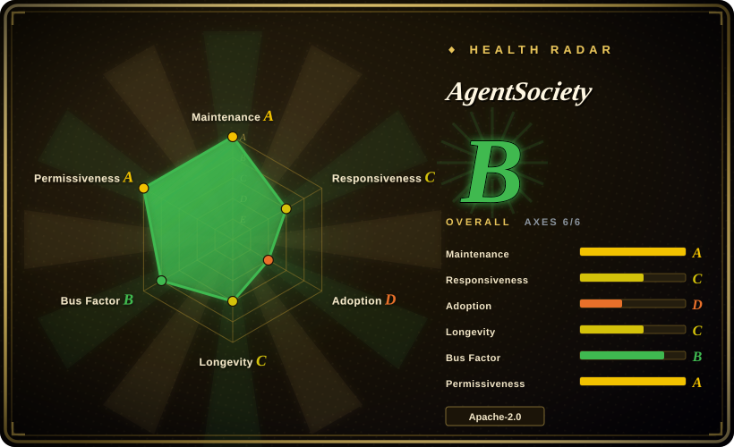

# AgentSociety

Tsinghua FIB-Lab's LLM-agent social-simulation platform: v1 was a city-scale urban simulator (mobility/economy/social on Ray); the current AgentSociety 2 is an LLM-native research environment with pluggable environments, multiple reasoning routers, experiment replay, and DuckDB tracing — built for executable social science. PyPI: `agentsociety2`.

## When to use

You're a social-science researcher or R&D engineer designing an *experiment*, not just a demo: you need reproducible runs (catalog-driven JSONL replay), distributed execution (Ray), modular environments (urban mobility/economy/social in v1; pluggable env modules in v2), and tooling for the research loop (literature search, hypothesis generation, experiment design, paper writing).

Pick AgentSociety when the deciding tradeoff is **research rigor over product polish**: MiroFish gives you a finished report UI, OASIS gives you social-media feed fidelity — AgentSociety gives you the lab notebook and the compute scaffolding, under Apache-2.0 with no external SaaS dependency.

## When NOT to use

- **You want a finished prediction product.** It's a framework; for upload→report UX use [MiroFish](mirofish.md).
- **Your target is social-media information dynamics.** Feeds and recommendation algorithms are OASIS's home turf; use [OASIS](oasis.md) for Twitter/Reddit-like spread and polarization studies.
- **You need a minimal footprint.** Ray + environment services + LLM clients are a heavier stack than a single-script simulator; to study the minimal founding architecture, read [generative_agents](generative-agents.md) instead.
- **License purity matters at the folder level.** Apache-2.0 *except* the `packages/agentsociety/agentsociety/commercial` subtree (README; the folder exists as of 2026-09) — if you plan to redistribute v1 internals, audit that folder's terms first.

## Comparison

| Alternative | In index | Our verdict | Tradeoff |
|---|---|---|---|
| [OASIS](oasis.md) | ✅ | Choose OASIS for social-media-platform simulation with recommendation systems; choose AgentSociety for urban-scale or experiment-managed social science with replay and Ray distribution. | OASIS is media-narrow but feed-faithful; AgentSociety is broader and research-tooled. |
| [MiroFish](mirofish.md) | ✅ | Choose MiroFish for a packaged upload→report product; choose AgentSociety when you must design, run, and defend the experiment yourself. | AgentSociety costs you engineering time and returns reproducibility and Apache-2.0 freedom. |
| [generative_agents](generative-agents.md) | ✅ | Choose generative_agents only to study the 2023 original; choose AgentSociety for anything you intend to run, extend, or publish from. | generative_agents is frozen history; AgentSociety is a maintained platform with papers behind it. |

## Tech stack

- **v2 (recommended):** Python ≥3.11; workspace-bound stateless agents driven by Ray Tasks; pluggable env modules (e.g. `SimpleSocialSpace`); reasoning routers (CodeGen default, ReAct, Plan-Execute, Two-Tier, Search); MCP tool support; JSONL experiment replay with DuckDB reads; distributed tracing.
- **v1 (legacy):** city-scale simulator with gRPC environment integration and urban modules (mobility, economy, social) on Ray.
- **LLM access:** OpenAI, Anthropic, or any litellm-supported provider via env vars.
- **Extras:** React web frontend, VSCode extension, benchmark package; papers arXiv:2502.08691 (v1) and arXiv:2607.11895 (v2).

## Dependencies

- Python ≥3.11; Ray (distributed execution); DuckDB (replay reads).
- An LLM API key (OpenAI, Anthropic, or litellm-supported providers).
- No mandatory external SaaS; runs self-hosted.

## Ops difficulty

**Medium to high.** `pip install agentsociety2` plus an API key runs the quickstart, but real experiments mean operating Ray, designing environments, and managing replay catalogs and traces — this is research infrastructure. The v1/v2 split (two PyPI packages, two doc sites) adds orientation cost.

## Health & viability

- **Maintenance — very active (as of 2026-09).** Last push 2026-09-18; agentsociety2 v2.9.0 released 2026-09-17, with multiple releases per month.
- **Governance / backing — university lab.** Org-owned by Tsinghua FIB Lab; the top five contributors hold 67–273 commits each (2026-09) — a healthier bus factor than solo projects; two arXiv papers anchor the research agenda.
- **Age & Lindy — young.** Created 2025-02 (~19 months), 1.3k stars (2026-09): modest adoption so far; the lab's long-running city-simulation research line is the main longevity signal [推断].
- **Risk flags.** v1 is already labeled "legacy" — a full API generation break within ~1.5 years, so expect the v2 line to keep moving; Apache-2.0 with a `commercial` subtree carve-out (see When NOT to use).

## Caveats (unverified)

- [未验证] Exact terms of the `packages/agentsociety/agentsociety/commercial` license carve-out (README statement; folder confirmed present 2026-09, contents not audited).
- [未验证] v2 scale/performance claims (paper-reported; not reproduced).
- [未验证] Maintenance commitment beyond the lab's publication cycle.
